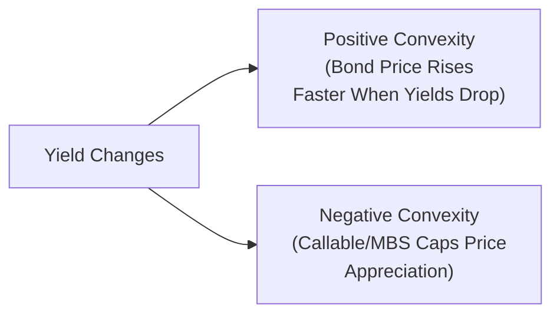

## Introduction

Convexity is that next-level concept that steps in where duration leaves off. You know how duration is often described as the “first derivative” of a bond’s price with respect to yield? Well, convexity is the “second derivative,” capturing the curvature—or non-linear—behavior of bond prices when interest rates move. While duration gives us a decent approximation of price changes for small yield moves, convexity refines that approximation, especially for larger yield changes. If you’ve ever watched a bond’s price move more (or less) than your duration-based calculation suggested, you’ve seen convexity at play.

This section focuses on how convexity influences your bond portfolio, how to quantify it, and what to do when yield shifts alter your convexity profile. We’ll also explore negative convexity, which often crops up when bonds have embedded call or prepayment provisions. It’s a big deal for mortgage-backed securities (MBS) or callable bonds and can catch portfolio managers off guard if they rely on duration alone.

## Why Convexity Matters

Most plain-vanilla, non-callable bonds tend to have positive convexity. That means:
• When rates go down (and prices go up), they gain a bit extra because of the curvature.  
• When rates go up (and prices drop), they lose a bit less than what duration alone would predict.  

But some bonds, like callable bonds, MBS, or certain asset-backed securities, can have regions of negative convexity. Negative convexity means you don’t get the usual “extra pop” in price when rates fall—because, for example, the issuer can call the bond early or homeowners can refinance mortgages. This effectively caps your upside. On the flip side, when rates rise, those same callable or prepayable bonds can demonstrate a different relationship to duration and might show extension risk or a shift back toward positive convexity depending on market levels.

In a nutshell, convexity is your measure of how a bond’s duration changes as yield changes. It’s vital because:
• It refines price risk calculations, especially for large yield movements.  
• It affects portfolio rebalancing decisions—keeping your portfolio’s risk-return profile in check.  
• It helps highlight the difference between bonds with optionality and their plain-vanilla counterparts.  

## Positive vs. Negative Convexity

Imagine you have two bonds:

• Bond A: A standard, non-callable corporate bond with a fixed coupon.  
• Bond B: A callable corporate bond with the same coupon and maturity but includes an embedded call option.

If the yield drops for both:
• Bond A’s price should jump more than a straight-line estimate predicts, thanks to positive convexity.  
• Bond B’s price, however, will be hindered by the call feature if rates drop enough to make an early call attractive to the issuer. This is negative convexity at work: the embedded option effectively bites into the potential price appreciation.

### The price-yield curve

Below is a simple Mermaid diagram that captures the idea of positive convexity versus negative convexity. It’s not a literal price–yield curve but more like a conceptual sketch:

• Positive convexity line curves “outward” from a simple linear approximation, so price changes exceed a first-order estimate on the upside and do better on the downside.  
• Negative convexity line sometimes curves “inward,” so potential gains are limited if yields fall below the call strike or if mortgage prepayments accelerate.

## Measuring Convexity

You’ll often see the formula for Approximate Convexity expressed like:


\text{Approx. Convexity} = 
   \frac{ P_{-} + P_{+} - 2 P_{0} }{ P_{0} \times (\Delta y)^2 },


where  
• \\( P_{-} \\) is the bond’s price if yields decline by some small amount \\( \Delta y \\).  
• \\( P_{+} \\) is the bond’s price if yields increase by \\( \Delta y \\).  
• \\( P_{0} \\) is the current price.  

Once you have convexity, you can do a second-order approximation of a bond’s price change for a given yield shift:


\Delta P \approx - D \times \Delta y \times P_{0} \;+\; \frac{1}{2} \times \text{Convexity} \times (\Delta y)^2 \times P_{0},


where \\( D \\) is the bond’s duration (often using Modified Duration for a small shift in yield).

### The importance of large yield changes

Duration-based approaches assume a linear relationship, which works reasonably well for tiny changes in yields. But when yields shift significantly, ignoring convexity can produce inaccurate estimates. For example, if you expect yields to drop by 200 bps (which is a pretty large move in many market environments), a standard duration calculation might underestimate the price increase by several percentage points for a highly convex bond. This difference can be material in your total return.

My colleague once joked about a time he heavily bet on a bond rally but only measured the durations of his Mortgage-Backed Securities (MBS). He was so pleased when rates fell but was scratching his head when the MBS weren’t rallying as much as he hoped. Turns out negative convexity bit off a big chunk of those gains. That’s the real-world sting of ignoring convexity.

## Negative Convexity in Practice

### Callable and Mortgage-Backed Bonds

Callable bonds typically exhibit negative convexity once yields fall below the coupon rate. Investors effectively short a call option to the issuer. With mortgages, homeowners have an implicit call option on their mortgages (they can refinance), which is why MBS get prepaid when rates drop. This prepayment means the bond (or portion thereof) is “called” away from you sooner, limiting your price appreciation. 

When yields rise, these same assets can revert to more positive convexity—or at least lose some negative convexity—because the call or prepayment risk is no longer near-the-money. For MBS, extension risk (loans survive longer than expected) can emerge, altering the interest rate sensitivity. So negative convexity with MBS is almost a dynamic phenomenon, flipping around as interest rates shift.

### Impact on Total Return

If you hold a heavily negatively convex portfolio, your upside potential gets capped in a falling-rate scenario. Meanwhile, in a rising-rate scenario, you don’t get much cushion. That can squeeze total returns. Sometimes, these instruments pay higher yields upfront, so there’s a trade-off. You might recall that a bond buyer can “receive” premium (in the form of higher yield) for taking on negative convexity risk, but it can backfire if rates move unfavorably.

## Portfolio Rebalancing and Convexity Management

Now that we’ve established how convexity can spoil neat duration-based estimates, the question is: what do we do about it in a portfolio context?

1. Identify Your Target Duration and Convexity  
   • Most portfolio managers start with an ideal combination of duration and convexity they want. For instance, you might aim for a duration of 5.0 years at the portfolio level and some positive convexity so that you don’t get hammered if rates move significantly.  
   • They might also have a “convexity budget,” which is basically how much they’re willing to pay, or how much yield they’re willing to give up, to get more positive convexity.  

2. Monitor Market Conditions and Volatility  
   • If the yield environment shifts a lot or implied volatility changes, the cost/benefit of positive convexity instruments can move quickly.  
   • For example, in a rising volatility environment, call options become more valuable to the issuer, meaning the negative convexity embedded in a callable bond can become more potent for the bondholder.  

3. Evaluate Shifts in Portfolio Structure  
   • Let’s say you hold a bunch of MBS that were previously priced at par, with stable prepayment assumptions. But after a 50 bps drop in rates, your MBS are now more likely to be refinanced. Duration falls, the effective convexity becomes more negative, and your portfolio no longer matches the risk profile you intended. You’d consider rebalancing—perhaps by adding some long-duration Treasuries or other non-callable instruments that restore overall convexity.  

4. Implementing the “Buy Convexity” or “Sell Convexity” Strategy  
   • If you want to increase your portfolio’s convexity, you can tilt toward long-duration, high-quality bonds with fewer embedded options (or even purchase interest rate options, such as receivers swaptions, to gain positive convexity).  
   • If you’re comfortable sacrificing convexity for yield, you might add more callable or prepayable securities. This is sometimes called “selling convexity” because you effectively sell the option to the issuer or borrower.  
   • A practical approach: A manager might buy a bullet Treasury or a non-callable bond (to gain positive convexity) and short a callable bond (or lighten up on an MBS position) to neutralize part of the negative convexity exposure.  

## Making Sense of Convexity in Large Portfolios

Large portfolios—especially those with diverse instruments like MBS, callable corporates, bullet Treasuries, and interest rate derivatives—can exhibit multiple “pockets” of convexity behavior. Some instruments might only be negatively convex if yields sink below a certain threshold. Others might be straightforwardly positive convexity. Combining them requires a methodical approach:

1. Break down each position’s duration and convexity.  
2. Aggregate these measures to see how total portfolio price might change for small, medium, or large yield moves.  
3. Conduct scenario analyses, using either historical or hypothetical yield shifts, to see if the portfolio’s overall exposure is in line with objectives.  

## A Quick Trade Example

Suppose you’re a portfolio manager who notices that 30% of your portfolio is in MBS, and interest rates recently fell by 75 bps. Your duration is still roughly on target, but your negative convexity exposure has surged because homeowners are refinancing faster than you expected. You don’t love that your portfolio’s price gains might be capped if rates keep falling.

You decide to raise convexity by:
• Selling some of the MBS (scaling it down from 30% to 20%).  
• Purchasing high-grade, long-duration bonds (like a 20-year Treasury) to inject more positive convexity.  
• Offsetting this with a small short in 5-year interest rate futures to maintain your duration target but keep the beneficial convexity of the 20-year bond.  

This sort of “rebalance” helps manage the new risk posture introduced by changing market conditions.

## Common Pitfalls and Best Practices

• Relying solely on duration for large moves. A big shift in yields can lead to big miscalculations if you don’t incorporate convexity.  
• Ignoring negative convexity instruments’ performance in a falling-rate environment. Don’t be surprised when your price appreciation is clipped.  
• Overpaying for convexity when implied vol is sky-high. Buying high-convexity instruments can be expensive if the market environment already prices in a lot of volatility.  
• Overlooking extension risk in rising rate scenarios for MBS. Negative convexity can flip around in different yield environments.  

The best practice is to measure and monitor both duration and convexity regularly—particularly in fixed-income markets as dynamic as today’s.  

## Example Calculation of Price Change Using Duration and Convexity

Let’s put some quick numbers to illustrate. Imagine a bond currently trading at 100 with a duration (D) of 5.0 and a convexity (C) of 60. Suppose yields rise by 50 bps (0.50%). A first-order approximation using duration might say:


\Delta P \approx - D \times \Delta y \times P_0 
= - 5.0 \times 0.0050 \times 100 = -2.50\%.


But with convexity included:


\Delta P \approx - D \times \Delta y \times P_0 
+ \frac12 \times C \times (\Delta y)^2 \times P_0.


Plug in the numeric values:

1) Duration effect:  

- 5.0 \times 0.0050 \times 100 = -2.50.


2) Convexity effect:  

\frac12 \times 60 \times (0.0050)^2 \times 100 
= 0.5 \times 60 \times 0.000025 \times 100.



= 0.5 \times 60 \times 0.000025 \times 100 = 0.5 \times 60 \times 0.0025 
= 0.5 \times 0.15 = 0.075\%.


So total approximate price change is -2.50% + 0.075% = -2.425%.

This is a small difference, but it can matter—especially over large portfolios or big yield swings.

## Rebalancing for Target Convexity in Practice

Recognizing that your portfolio’s convexity could pivot as rates move, you’ll regularly revisit your asset mix. Typical rebalancing steps might be:

• Measure your portfolio’s current duration and convexity.  
• Compare those metrics to policy targets and see if you have any big deviance—like a big jump in negative convexity from a wave of prepayments.  
• Determine if you should buy or sell convexity. You could adjust by:  
  – Changing allocations in your bullet, barbell, or laddered bond strategies.  
  – Adding or removing positions in callable vs. non-callable or floating-rate notes.  
  – Using swaps or swaptions to fine-tune convexity.  

Sometimes, if you anticipate a large rate cut or hike, you might proactively position your portfolio to have more positive convexity—like adding longer-dated Treasuries or interest rate call options—so you can benefit more from yield changes (or have less downside if yields spike).

## Exam Tips and Study Pointers

• Expect item sets that show you partial calculations with duration and ask for an accurate sign or magnitude of the final price move once you factor in convexity.  
• Watch out for negative convexity. If the question references a mortgage-backed security or callable issue, check whether it’s in-the-money for the call or near par for an MBS. That affects how you interpret the data.  
• Don’t forget about partial durations and key rate durations from Section 25.2 if the exam question splits out different yield-curve shifts. While that’s more granular, it can still combine with a convexity discussion.  
• If you see a scenario with a big yield shock, the exam might highlight how ignoring convexity leads the manager astray. That’s a classic exam theme.  
• Remember that in real life, heightened implied volatility often correlates with the cost of “buying” convexity. If a question references volatility changes, think about how that influences negative or positive convexity instruments.

## References and Further Reading

• Fabozzi, F. J. (ed.). “Bond Markets, Analysis, and Strategies.”  
• Tuckman, B., and Serrat, A. “Fixed Income Securities: Tools for Today’s Markets.”  
• Sundaresan, S. “Fixed Income Markets and Their Derivatives.”

-----

## Test Your Knowledge: Convexity and Rebalancing Quiz



### A hypothetical bond has a duration of 6.0 and a convexity of 50. If yields rise by 1.0%, what is the second-order approximation of the bond’s percentage price change (assume current price is 100)?

- [ ] -6.00%
- [ ] -5.50%
- [x] -5.75%
- [ ] -4.50%

> **Explanation:**  
> Duration impact = -6.0 × 1% = -6%.  
> Convexity adjustment = 0.5 × 50 × (1%)² = 0.5 × 50 × 0.0001 = 0.0025 or 0.25%.  
> Total = -6.0% + 0.25% = -5.75%.

### Which of the following statements about negative convexity is most accurate?

- [ ] Negative convexity boosts the bond’s price rise when yields drop.  
- [x] Negative convexity limits the bond’s price upside in a falling-rate environment.  
- [ ] Negative convexity often appears in zero-coupon bonds.  
- [ ] Negative convexity is only relevant when rates rise significantly.  

> **Explanation:**  
> Negative convexity typically shows up in callable or prepayable bonds and caps the upside when yields fall, because the call or prepayment option can be exercised.

### What is the primary reason portfolio managers rebalance convexity in a fixed-income portfolio?

- [ ] To maximize yield on every bond.  
- [x] To maintain a target risk-return profile after market or structural changes.  
- [ ] To ensure they only hold non-callable bonds.  
- [ ] To avoid paying taxes on accrued interest.  

> **Explanation:**  
> Rebalancing convexity is about keeping the portfolio’s risk characteristics, including duration and convexity, aligned with the investment policy, especially after yield moves change the embedded optionality of instruments.

### A highly negatively convex bond in a declining-rate environment typically experiences:

- [x] Less price appreciation than a similar-duration positively convex bond.  
- [ ] Greater price appreciation than a non-callable bond.  
- [ ] No significant price change.  
- [ ] Zero duration when rates fall.  

> **Explanation:**  
> Negative convexity caps the upside because the issuer or borrower can “call” or prepay the bond in a lower-rate environment.

### In expanding your portfolio’s convexity, which transaction is a classic approach?

- [ ] Buying a callable bond and selling US Treasury futures.  
- [ ] Purchasing short-duration floating-rate notes in large quantities.  
- [x] Buying non-callable, longer-dated bonds and reducing callable bond positions.  
- [ ] Selling your highest-rated bonds and buying low-rated credits.  

> **Explanation:**  
> Buying longer-dated, non-callable bonds usually increases positive convexity, especially relative to holding negatively convex instruments such as callable bonds.

### If a long-duration MBS experiences rapid prepayments due to falling rates, its duration and convexity profile typically:

- [x] Moves to a shorter duration and more negative convexity.  
- [ ] Moves to a longer duration and more negative convexity.  
- [ ] Moves to a shorter duration and more positive convexity.  
- [ ] Remains unchanged.  

> **Explanation:**  
> When mortgage prepayments accelerate, the bond effectively shortens its duration and its negative convexity can increase because the potential for further price gains is restricted.

### Which of the following best describes the concept of a “convexity budget”?

- [x] The amount of yield an investor is willing to forgo or the premium they will pay for higher convexity.  
- [ ] The total planned spending on coupon payments each year.  
- [ ] The difference between bond yields and reference swap rates.  
- [ ] A measure of credit risk tolerance in a portfolio.  

> **Explanation:**  
> Convexity budget is about how much yield you’re willing to give up or pay for the benefit of higher convexity.

### When yields rise significantly, investors in callable bonds might see:

- [ ] Significantly higher negative convexity.  
- [ ] Improved call features that enhance bond price.  
- [ ] No change in bond cash flows.  
- [x] Less negative convexity because the bond is unlikely to be called.  

> **Explanation:**  
> As yields rise, the callable bond is unlikely to be called. Thus, the embedded option has less immediate impact, reducing negative convexity.

### In calculating the second-order price approximation, the convexity term is multiplied by:

- [ ] The interest rate difference only.  
- [ ] Twice the yield shift.  
- [ ] The coupon rate minus the yield.  
- [x] Half of the squared yield shift.  

> **Explanation:**  
> By formula, price change from convexity is 0.5 × Convexity × (Δy)² × Price.

### True or False:  
“Rebalancing to maintain a specific convexity level becomes more important when large interest rate hikes or cuts occur.”

- [x] True  
- [ ] False  

> **Explanation:**  
> Large rate changes expose the limitations of a purely duration-based approach. Convexity rebalancing ensures the portfolio behaves as intended when rates move significantly.


