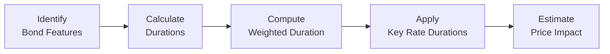

## Introduction and Overview

So, I remember the first time I had to deal with measuring a portfolio’s interest rate risk: I was juggling multiple bonds (all with random maturities and coupons) and feeling a tad overwhelmed. You know that moment when you’ve got a high-level concept—like duration—swirling around in your head, but then, bam, there’s a question referencing partial durations for each key rate? It’s a bit nerve-racking at first.

Anyway, welcome to this section on Duration-Based Risk Calculations within item sets (vignettes). Our goal is to help you tackle typical CFA Level II–style item set questions that revolve around understanding how interest rate changes affect bond prices. Because yields may shift differently at various points on the curve, synergy between your fundamental knowledge of duration (discussed in Section 25.1) and more specialized concepts—like key rate durations—becomes crucial. 

Below, we’ll walk through practical steps, provide short examples, and show how these concepts might appear in an exam scenario. We’ll also sprinkle in some informal commentary so this discussion feels a bit more natural (and maybe a little less intimidating). 

## Relation to Previous Sections

If you recall from:
- Section 25.1: We introduced Macaulay Duration vs. Modified Duration and how they measure a bond’s sensitivity to interest rates.
- Section 25.2: Key Rate Durations and Shaping Risk expanded on the concept that not all parts of the yield curve move in tandem.
- Section 25.3: Convexity Effects and Portfolio Rebalancing emphasized that if yield movements are large or if we have embedded options, we need to account for convexity adjustments.

Now, we focus on how these pieces come together in actual item sets. Because the exam typically gives you a scenario with multiple bonds or a portfolio and asks: “If the yield curve shifts x basis points at the short end and y at the long end, how does that affect your portfolio’s value?” Or maybe, “What rebalancing trade should you execute to maintain your target duration?” Let’s break it down.

## Understanding the Vignette Context

In the CFA exam, item sets (vignettes) typically supply:
• A table of bonds (maturities, coupons, face values, market prices, embedded options).  
• A strategy or scenario (e.g., “The central bank is expected to hike short-term rates by 25 bps, while long-term rates remain stable.”).  
• Additional data on portfolio weights or the portion of capital invested in each bond.  
• 4–6 follow-up questions that test your ability to interpret and compute key metrics (e.g., weighted average duration, partial durations, or the portfolio’s price change under the forecast scenario).

Your job? Distill the important info, run the correct calculations, and interpret the results.

## Step-by-Step Approach to Duration-Based Item Sets

### Step 1: Identify Bond Features and Extract Data

In your item set, carefully note each bond’s:  
• Current price or yield  
• Coupon rate and payment frequency  
• Maturity and face value  
• Any embedded option (call, put, convertible features)  

Then see if the question states each bond’s duration directly or if you must calculate it from yield/cash flow data (some item sets do the latter). Jot down each bond’s market weight in the portfolio—this is key for computing a weighted average duration later on.

### Step 2: Calculate Each Bond’s Modified Duration

Sometimes you’ll see Macaulay Duration—particularly if they reference a formula involving present value of cash flows and weighting by time. In the exam, though, you often use Modified Duration (ModDur). Modified Duration is typically:


\text{Modified Duration} \approx \frac{\text{Macaulay Duration}}{1 + y}


Where “y” is the bond’s yield per period. But if the exam provides you with a direct “annual” modified duration, that’s even easier. It might say something like, “Bond A has a modified duration of 6.2,” or “Bond B’s effective duration is 4.0,” especially for complex issues with embedded options.

### Step 3: Aggregate Durations to Find Portfolio Duration

Once you have each bond’s modified duration (Dᵢ) and weight (wᵢ) in the portfolio, you can compute the weighted average portfolio duration, Dport, as:


D_{\text{port}} = \sum_{i=1}^n \left( w_i \times D_i \right)


So if you’ve got 40% in a bond with duration 3.0 and 60% in a bond with duration 5.0, your portfolio’s overall duration is:
(0.40 × 3.0) + (0.60 × 5.0) = 1.2 + 3.0 = 4.2.

### Step 4: Apply Key Rate Durations (If Needed)

Non-parallel yield shifts require something more granular than a simple aggregated duration. In Section 25.2, we introduced key rate durations (KRD), where you break down a bond’s exposure to specific maturity segments (for example, 1-year, 2-year, 5-year, 10-year). A bond with a high KRD at the 10-year point is more sensitive to changes in the 10-year yield than the 2-year yield, and so on.

So if the exam says that the short end of the curve is rising 20 bps and the intermediate segment is dropping 10 bps, you can apply:


\Delta P \approx -\left(\sum_{j=1}^m \left(KRD_j \times w \times \Delta y_j \right)\right)\times P_0


where KRDⱼ is the key rate duration for maturity segment j, \\( \Delta y_j \\) is the yield change for that segment, and \\( P_0 \\) is the current bond price. You do this for each bond, then aggregate across the portfolio.

### Step 5: Adjust for Convexity (Especially If Yield Moves Are Large)

Sometimes the exam question might say something like, “The yield shift is likely to be +200 bps.” A 200-bp move is big enough that ignoring convexity could produce a poor approximation. Or, if you’ve got embedded options, negative convexity might come into play (like with a callable bond). In that case, you’d incorporate an extra term:


\Delta P \approx - (D \times \Delta y) \times P_0 + \frac{1}{2}(\text{Convexity})\times (\Delta y)^2 \times P_0


Just keep an eye on whether the item set specifically provides you with a convexity measure or an effective duration measure that’s already adjusted for optionality. 

### Step 6: Handle Embedded Options

Let’s say you’ve got a callable bond. As interest rates drop, the issuer benefits from calling and reissuing debt at lower rates. That reduces potential price appreciation for you, the investor. In practice, a callable bond’s effective duration shortens significantly when yields move below the strike, often producing negative convexity. 

The exam might provide either (1) an “effective duration” that’s already adjusted for the option effect or (2) details about the bond’s call structure, forcing you to reason about how the bond’s price might be capped at par. Keep your eyes open for clues. They love testing this concept in vignettes.

## Example Scenario: Calculating Portfolio Duration and Price Impact

Let’s illustrate with a short example loosely referencing typical item-set data:

• Bond A (no embedded option):  
  – Weight in Portfolio: 40%  
  – Modified Duration (Dᴀ): 3.5  
  – Convexity: 38  

• Bond B (callable):  
  – Weight in Portfolio: 60%  
  – Effective Duration (Dᴮ): 2.5  (includes option effect)  
  – Convexity: 22  

• Scenario: The short end of the curve is expected to rise 25 bps, intermediate yields remain unchanged, and the 10-year yield rises 15 bps.

Say the exam question wants you to estimate the portfolio’s approximate price change. If we assume a single average yield shift of, say, +15 bps across the entire yield curve, the quick estimate is:

Weighted average duration = (0.40 × 3.5) + (0.60 × 2.5) = 1.4 + 1.5 = 2.9.  
Hence, approximate percentage change in portfolio value:


\Delta P \approx - D_{\text{port}} \times \Delta y = - 2.9 \times 0.15\% = -0.435\%


In actual item sets, you might be asked to add in half the convexity term if the shift is big or if partial durations show that the short end is actually changing more than the long end, etc.

## Dealing with Non-Parallel Shifts

If the question states different yield changes for short vs. long maturities, you might see something like:

• Bond A’s key rate duration for 2-year = 1.2, for 10-year = 2.3  
• Bond B’s key rate duration for 2-year = 0.8, for 10-year = 1.7  

With 40% in Bond A and 60% in Bond B. If \\(\Delta y_{2yr} = +25\\) bps and \\(\Delta y_{10yr} = +5\\) bps, you can do a partial shift calculation:

Price change for Bond A = \\(- \bigl((1.2 \times 0.25\%) + (2.3 \times 0.05\%)\bigr) \times P_{A0}\\).  
Price change for Bond B = \\(- \bigl((0.8 \times 0.25\%) + (1.7 \times 0.05\%)\bigr) \times P_{B0}\\).  

Then weigh those results by 40% for Bond A and 60% for Bond B. It’s a bit more mechanical, but that’s exactly what you might see in an exam scenario with multiple choice answers.

## Portfolio Rebalancing

Sometimes after you do all that math, the question might say: “Given ABC Asset Management expects a 50-bps parallel shift upward in yields, the current duration of the portfolio is 5.0, but they want to lower it to 4.0. Which trade is best?” 

You might pick answers like:  
• Sell longer-duration bonds, buy shorter-duration bonds.  
• Enter a receive-floating/pay-fixed interest rate swap to reduce duration.  
• Sell interest rate futures.  

In item sets, ensure you connect the sponsor’s or manager’s objective (e.g., target duration of 4.0 or 3.5) with the correct rebalancing approach.

## Common Pitfalls

• Ignoring Weighted Averages: Some candidates forget to multiply durations by each bond’s weight.  
• Mixing up Macaulay and Modified Duration: Make sure you use the version consistent with the question.  
• Overlooking Options: If it’s a callable MBS, you might have a drastically different effective duration than your simpler textbook example.  
• Not Reading the Question Carefully: The item set might exclusively want the short-end shift or a partial shift—read the details.  

## Quick Personal Note

There was once a large exam question that had me triple-checking my partial durations. After finishing the math, I realized I had accidentally used 100 bps as 0.1 in decimal form instead of 1.0% (which is 0.01). Total meltdown—fortunately I caught it before time ran out. So watch out for unit conversions!

## Ethical and Professional Considerations

Though it might not appear in every item set, do remember your CFA Code of Ethics. For instance, if a question touches on “misrepresenting” durations or yield assumptions for client reporting, that’s a violation of Standard I(C). Always present data and calculations truthfully and fairly.

## Conclusion and Exam Tips

• Practice Non-Parallel Shifts: Because short- or long-end yield changes can differ, partial durations are a frequent exam topic.  
• Check for Option-Adjusted Values: Effective duration or OAS-based durations often appear in vignettes about callable or putable bonds.  
• Get Comfortable with the Aggregation Process: Weighted average durations pop up all the time.  
• Manage Time Efficiently: Item sets can be data-heavy. Learn to scan for the crucial pieces.  
• Rebalancing Scenarios: Be ready to recommend an action that meets a new target duration (e.g., buy or sell Treasury futures).  

Remember, measuring interest rate risk goes beyond a simple formula—it’s about applying the right version of duration to the right scenario. If you can swiftly parse the item set data and systematically apply the steps we covered, you’ll handle these questions confidently.

## References and Further Reading

• CFA Institute’s Fixed Income Curriculum, with item set practice questions  
• Fabozzi, Frank J. “Fixed Income Mathematics” (deep dives on advanced bond math)  
• Practitioner Guides from Kaplan Schweser or Wiley for item set mocks  
• Section 25.2 of this Volume: Key Rate Duration and Shaping Risk  
• Section 25.3 of this Volume: Convexity Effects and Portfolio Rebalancing  

## Duration-Based Risk Practice: 10-Question Quiz

Below is a short quiz to help you test your understanding of duration-based risk calculations in an item set context. Good luck, and think carefully about each question!

## Duration-Based Portfolio Risk Quiz



### Question 1

A portfolio with two bonds—Bond A (20% weight, duration 2.0) and Bond B (80% weight, duration 5.0)—has which approximate portfolio duration?

- [ ] 2.5
- [ ] 4.2
- [x] 4.4
- [ ] 3.5

> **Explanation:** The portfolio duration is (0.20 × 2.0) + (0.80 × 5.0) = 0.40 + 4.00 = 4.40.

### Question 2

If a bond’s Macaulay duration is 7.0 and its yield to maturity is 5% annually, which is closest to its modified duration?

- [x] 6.67
- [ ] 7.35
- [ ] 5.00
- [ ] 6.00

> **Explanation:** Modified Duration ≈ Macaulay Duration ÷ (1 + yield). Here, 7.0 ÷ (1 + 0.05) = 7.0 ÷ 1.05 ≈ 6.67.

### Question 3

When partial or key rate durations are used, the main idea is:

- [ ] Calculating a single duration number for all maturities.
- [x] Measuring sensitivity to shifts at different points on the yield curve.
- [ ] Simplifying the calculation of convexity.
- [ ] Eliminating the effect of embedded options.

> **Explanation:** Key rate durations identify sensitivities at various points on the yield curve. They allow for non-parallel shifts to be modeled accurately.

### Question 4

A small investor holds a callable bond with negative convexity. If interest rates decline significantly:

- [x] The bond’s price will rise more slowly compared to a similar non-callable bond.
- [ ] The bond’s price will rise more quickly because of call protection.
- [ ] The bond’s effective duration increases.
- [ ] The bond becomes putable.

> **Explanation:** Negative convexity occurs because the call feature limits price appreciation when rates fall.

### Question 5

Which formula best represents the approximate percentage change in bond price for moderate yield changes?

- [ ] ΔP = –ModDur × Δy
- [x] ΔP ≈ –(ModDur × Δy) + ½(Convexity × (Δy)²)
- [ ] ΔP = –1 ÷ (1 + y)
- [ ] ΔP = par – coupon × duration

> **Explanation:** The percentage price change for moderate yield shifts includes both the duration (first-order) and convexity (second-order) effects.

### Question 6

If an item set shows that short-term yields rise 50 bps while 10-year yields fall 20 bps, and you have each bond’s key rate durations, you should:

- [ ] Apply only the single largest shift of 50 bps across the entire portfolio.
- [ ] Ignore the partial durations and proceed with a weighted average.
- [x] Use the appropriate key rate durations and corresponding yield changes for each maturity segment.
- [ ] Assume zero price change because the shifts will cancel out.

> **Explanation:** The correct approach is to multiply each segment’s key rate duration by the yield change for that segment and sum them up.

### Question 7

Portfolio rebalancing to lower duration can be achieved by:

- [x] Selling long-duration instruments and/or buying short-duration instruments.
- [ ] Buying more call options on the bonds.
- [x] Entering a receive-floating/pay-fixed swap.
- [ ] Using an options collar strategy on the yield curve.

> **Explanation:** To reduce duration, you can sell or lighten positions on bonds with high duration, purchase shorter-dated instruments, or use derivatives such as pay-fixed swaps or short futures positions. Options collars might not directly lower duration in a straightforward manner.

### Question 8

For a portfolio that is heavily invested in MBS (with negative convexity), ignoring the impact of convexity when interest rates shift significantly is:

- [x] Risky because MBS exhibit price compression when yields drop.
- [ ] Perfectly fine if only short rates change.
- [ ] Recommended if the shift is more than 100 bps.
- [ ] Always conservative in terms of risk.

> **Explanation:** Mortgage-backed securities have negative convexity, so ignoring convexity is risky, as price changes can deviate substantially from duration-based predictions.

### Question 9

An item set indicates the yield curve experiences a parallel upward shift of 100 bps. If a portfolio’s current duration is 4.0, what is the approximate percentage price change, ignoring convexity?

- [x] –4.0%
- [ ] +4.0%
- [ ] –4.00 (in price points)
- [ ] –2.0%

> **Explanation:** The approximate price change = –(duration × yield shift) = –(4.0 × 1.00%) = –4.0%.

### Question 10

A bond’s effective duration will generally be less than its modified duration if the bond:

- [x] Contains embedded options that shorten price sensitivity to rates.
- [ ] Is a zero-coupon bond.
- [ ] Sells at par with a high coupon.
- [ ] Pays coupons monthly.

> **Explanation:** Effective duration for callable or putable bonds typically accounts for potential changes in cash flows, often lowering overall sensitivity.



---

Feel free to revisit each topic as needed—especially partial durations and the effect of embedded options. These are cornerstones of fixed income item sets. Good luck, and keep practicing!
