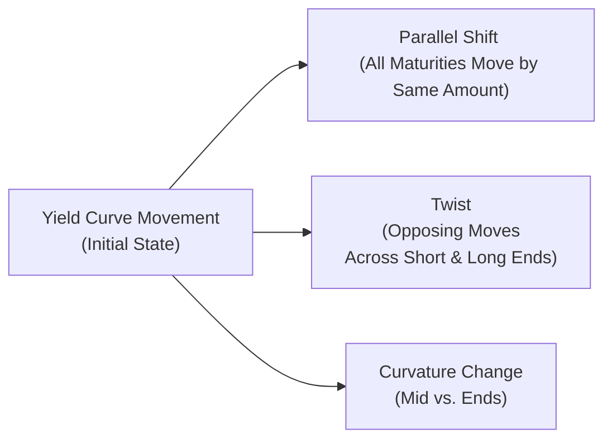

## Introduction and Context

So, the first time I ever tried explaining yield curve shifts to a friend, I could barely keep a straight face because I realized how abstract it can sound to anyone outside finance. I was like, “Hey, guess what? All interest rates can move up or down at once,” and my friend just blinked at me. The truth is, yield curves (as you’ve learned from earlier chapters in this text) are an essential tool for understanding fixed income markets. But they’re not just about predicting single changes in interest rates. They’re about the entire structure of rates across different maturities. Think short-term, intermediate-term, and long-term rates. These rates move in various patterns: sometimes in lockstep—sometimes not.

This section explores parallel shifts, twists, and curvature changes in the yield curve. While that sounds like three random dance moves, they’re actually how bond professionals interpret interest rate movements and measure the associated risks. They influence everything from pricing a Treasury security to constructing a full-blown multi-factor hedging strategy. And for sure, they’re super likely to pop up in your CFA® exam item sets—so let’s dig in.

## The Notion of Yield Curve Shifts

Before diving into each type of shift, let’s unpack what a yield curve actually is for those who might need a refresher. The yield curve plots yields (interest rates) on the vertical axis against bond maturities on the horizontal axis. Under normal conditions, you might see an upward-sloping curve: short-term rates that are lower than long-term rates. But this changes all the time with macroeconomic conditions, central bank policies, and market sentiment.

### Why Yield Curves Change

Yields might move due to:
• Central bank actions (e.g., changes in policy rates).  
• Shifts in inflationary expectations.  
• Supply and demand for bonds at different maturities.  
• Credit considerations, liquidity, or broad economic growth forecasts.

You probably recall from Chapter 25 that we dissected the basics of interest rate sensitivity (duration, convexity, key rate durations). Now we broaden the lens to look at how entire sections of the yield curve might rise, fall, steepen, flatten, or warp.

## Parallel Shifts

Parallel shifts are arguably the easiest to visualize and the scenario we often assume when we do a quick “what if rates go up 1% for everything” analysis. A parallel shift means every point on the yield curve—short-term, intermediate, and long-term bonds—experiences the same magnitude of yield change.

### Characteristics of a Parallel Shift

• Uniform Movement: Suppose yields rise by 50 basis points across 6-month T-bills, 5-year notes, and 30-year bonds. If it’s truly a parallel shift, the entire curve just moves up 50 bps.  
• Duration Emphasis: Portfolio managers typically size duration-based hedges to address these shifts, since if everything moves equally, the primary factor is how sensitive a portfolio is to overall interest rate levels.

### Example: Uniform 50 bps Rate Increase

Imagine a portfolio heavily weighted in long-duration bonds (e.g., 30-year bonds). If rates rise by 50 bps across the board, those long-duration positions take a bigger price hit than short-duration positions. If your portfolio is short-duration because you hold mostly short-term Treasuries, you lose less in this scenario.

At the risk of oversimplifying, a parallel shift is the bread and butter of interest rate risk management, and you can usually get a decent forecast of the price impact just by checking your portfolio’s duration. That said, real markets rarely deliver perfect parallel shifts. So, let’s see what else can happen.

## Twists of the Yield Curve

When we talk about a “twist,” it’s essentially a pivot around some point in the curve. Short-term yields might move in one direction or by a larger magnitude, while longer-term yields do something else. The slope of the curve changes—maybe it steepens, maybe it flattens.

### Two Common Twists

• Bear Steepener: The short end’s rates rise faster than the long end’s, making the curve steeper. In the realm of economic commentary, a “bear” market in bonds is typically associated with rising rates (and falling bond prices), hence the “bear” in “bear steepener.”  
• Bull Flattener: The long end’s rates fall faster than the short end’s, causing the yield curve to flatten. “Bull” indicates falling yields (rising bond prices).

### Key Rate Durations

To hedge or position your portfolio for twists, you can’t rely solely on plain-vanilla duration. Enter “key rate duration,” which breaks down interest rate sensitivity at specific maturity points (e.g., the 2-year, 5-year, 10-year, 30-year rates). If your portfolio is exposed to a twist around the 10-year point, for instance, you want to isolate the risk and hedge (or exploit) that exposure.

It’s kind of like checking your posture in front of a mirror and finding that not all parts of your spine line up the same way. The short end of the curve is your neck, the long end is your lower back, and a twist might mean your shoulders (i.e., mid-curve) shift one way, while your head (short end) moves another.

## Curvature Changes

Now, curvature changes are all about the shape of the belly of the curve. We’re not just talking about a slope pivot. We’re looking at a scenario where the middle segment—sometimes called the “belly”—moves independently of the short and long ends. A typical representation is the “butterfly spread” you might see in the market.

### The Butterfly Spread

Portfolio managers often use a butterfly strategy by combining positions in short-term and long-term bonds versus the mid-term maturity. The idea is that if the curvature changes (meaning the middle rise or falls relative to short and long ends), the strategy can generate profit. Another variation is the “reverse butterfly,” where you’re effectively betting that the middle might underperform relative to the wings (short and long).

### Why It Matters

A curvature shift can happen if, say, the Federal Reserve strongly influences the front end of the curve (through policy rate changes) and investor sentiment heavily impacts the long end (fluctuations in inflation or growth expectations), while the intermediate area sees a different dynamic altogether. If you only hedge for parallel shifts or standard twists, you might find yourself caught off-guard by changes in the belly.

## Advanced Considerations and Multi-Factor Models

Markets are dynamic, so to break down yield curve movements, you may want to incorporate multi-factor models. These are typically based on the idea that most of the variance in rate movements can be explained by three main factors:

• Level (akin to the parallel shift)  
• Slope (akin to the twist)  
• Curvature (related to belly vs. wings)

### Principal Component Analysis (PCA)

PCA is a statistical method used to identify which factors explain most of the variance in yield changes. Historically, the first principal component often corresponds to the level (parallel shift) factor, the second corresponds to slope (twist), and the third to curvature. By performing PCA on historical yield data, you might discover that:
• 80% or more of yield curve movement can be explained by parallel shifts.  
• 10–15% can be explained by slope changes.  
• 5–10% can be explained by curvature changes.  

Of course, these percentages vary by market and data sample. But the takeaway is that parallel shifts aren’t everything—twists and curvature changes really do matter in generating the rest of the yield curve’s dance moves.

### Using Market Instruments for Prediction

Perhaps you’re an active manager or a strategist. You can look at the prices of futures, swaps, swaptions, or even the shape of the forward curve to glean which segment of the yield curve is most likely to move. Yes, that’s definitely more advanced. But the main idea is that if the market is pricing in a certain tilt (like a flattening in the short term or a steepening over the long term), you might structure your bond portfolio or your hedges accordingly.

Sometimes, folks glean curvature or slope expectations from the spread between 2-year interest rate swaps and 10-year swaps or from swaptions with different maturities. This can be integrated with your fundamental analysis on inflation, central bank policy, and growth.

## Hedging and Trading Applications

### 1. Hedging Non-Parallel Shifts
One approach to hedge against twists or curvature changes is “key rate duration hedging.” You measure how exposed the portfolio is at different maturities and offset that with derivatives or opposite cash bond positions. That way, if the curve decides to pivot around the 5-year point, you’re not caught unprepared with a big mismatch in that region.

### 2. Relative-Value Trades
Some traders are out there looking for mispricings between different maturities. If the 10-year looks overpriced relative to the 5-year or 30-year, they might do a butterfly strategy—buy the cheap maturity and short the expensive segments, or vice versa. These trades can be profitable if the yield curve reverts to a more “normal” shape or if it evolves the way the manager expects.

### 3. Risk Management with Multi-Factor Tools
In large institutional portfolios—like those held by insurance companies, pension funds, or banks—risk managers monitor the portfolio’s exposure to each principal component. If you have a big exposure to curvature risk, a surprising belly shift can seriously hurt your performance. So, staff might run daily or weekly scenario analyses, focusing on how the portfolio would react to each factor’s shock.

## A Quick Mermaid Diagram

Below is a simple schematic of how we typically visualize yield curve changes:

## Common Pitfalls and Suggestions

• Over-Hedging for Parallel Moves: Sometimes people treat every yield curve shift as a parallel event and add interest rate futures to hedge. That can be dangerous if the actual shift is more of a twist or curvature.  
• Ignoring the Belly: Some folks might not think about that middle part of the curve if they’re used to focusing only on short and long maturities. This can lead to unanticipated exposures.  
• Not Updating PCA Regularly: PCA relies on historical data. Market regimes can change, so if you’re using out-of-date factor loadings, you might misread what the first, second, and third factors even represent.  
• Over-Complexity: One personal rant: it’s easy to get so deep into multi-factor models that you forget the basics of your portfolio’s objectives. Sometimes, you just need a simpler approach or to accept a bit of net exposure.

## Practical Exam Tips

• For a typical CFA Level II item set, you may get a short vignette where the yield curve changes in a twist manner, and you’re asked how it affects a bond portfolio with different maturities. You might need to compute the new bond prices or identify which maturity experiences the greatest price change.  
• You might see a scenario analyzing key rate durations: “Given a portfolio’s exposure at the 2-year, 5-year, and 10-year nodes, how will the portfolio’s value change if the yield curve experiences a bear steepener?”  
• Also watch for questions on designing a butterfly trade (like a sample combination of short or long positions across three maturities) to profit from a predicted curvature shift.  
• Remember to keep track of effective durations and convexities if you’re dealing with bonds that have embedded options, because changes in yield volatility also matter big time.

## Conclusion

We’ve covered how yield curves can shift in parallel, twist around the short vs. the long end, and change curvature around the belly. In reality, markets demonstrate a combination of these movements—rarely do you see a purely parallel shift that remains stable for days on end. The ability to decompose yield curve movements into these patterns—and calibrate your hedges or position your active strategy accordingly—can make a big difference in performance.

So yes, folks like to say “rates went up” or “rates went down,” but it’s rarely that simple. If you’re getting specialized in fixed income management, you’ll need a thorough understanding of how short-term and long-term yields diverge or converge—and how the belly can do its own thing. Keep working on key rate durations, multi-factor risk models, and scenario analysis. On exam day, or in real investment roles, these are the building blocks that will help you keep your bond portfolio from drifting off course.

## References and Further Reading

• Fabozzi, Frank J. “Bond Markets, Analysis, and Strategies.” 9th ed., Pearson.  
• Tuckman, Bruce, and Serrat, Angel. “Fixed Income Securities: Tools for Today’s Markets.” 3rd ed., Wiley.  
• BIS Quarterly Review articles on yield curve developments:  
  https://www.bis.org/publ/qtrpdf/r_qt  
• For interest rate hedging and PCA-based approaches, see academic and industry research such as the Journal of Fixed Income or relevant CFA Institute articles.  
• Review Chapter 25 (Measuring Interest Rate Risk) for additional background on duration, convexity, and partial durations.  

Anyway, good luck practicing. Let’s wrap with some practice questions below that might show up in a typical CFA Level II format—just keep your wits about you and remember that the yield curve can do more than just shift in parallel.

## Test Your Knowledge: Yield Curve Shifts and Their Implications



### Which of the following best defines a parallel shift of the yield curve?

- [ ] A change in the relationship between short-term yields and long-term yields.  
- [x] An upward or downward movement of the entire curve by the same basis point amount.  
- [ ] A change in the middle of the curve while short and long ends remain constant.  
- [ ] Any shift that increases yields for short maturities but decreases them for long maturities.  

> **Explanation:** A parallel shift is one in which every maturity experiences the same change in yield—hence the term “parallel.”

### In a bear steepener scenario, which part of the curve typically experiences the greatest relative increase in yield?

- [ ] Mid-maturities near 10 years.  
- [x] Short-term maturities.  
- [ ] Long-term maturities.  
- [ ] All maturities shift equally.  

> **Explanation:** A “bear steepener” means short-term rates are rising faster than long-term rates. So short-term maturities see higher yields, steepening the curve.

### An investor implements a butterfly trade by buying short-term and long-term bonds while shorting an equal market value of intermediate bonds. Which yield curve move would this strategy most likely profit from?

- [ ] Parallel upward shift.  
- [ ] Parallel downward shift.  
- [ ] A bull steepener.  
- [x] An increase in curvature, where the belly of the curve underperforms the wings.  

> **Explanation:** A butterfly typically profits when the mid-maturity segment moves less favorably than the short and long ends, capturing changes in curvature.

### Key rate duration is primarily used to:

- [ ] Estimate the average duration of a portfolio.  
- [ ] Eliminate credit risk from a bond portfolio.  
- [ ] Measure a portfolio’s exposure to currency fluctuations.  
- [x] Model sensitivities to yield changes at specific maturities.  

> **Explanation:** Key rate duration isolates the sensitivity of a bond or portfolio at each key maturity point, making it useful for identifying twist or curvature risks.

### Under a parallel shift assumption, which single measure would best capture the bulk of a bond’s interest rate risk?

- [ ] Key rate duration.  
- [ ] Convexity.  
- [x] Effective duration.  
- [ ] Spread duration.  

> **Explanation:** Effective duration typically measures sensitivity to a uniform shift in yields and is widely used for parallel shift scenarios.

### Which statement about the role of principal component analysis (PCA) in yield curve analysis is most accurate?

- [ ] PCA rarely explains more than 20% of yield curve variance.  
- [ ] PCA ignores both slope and curvature.  
- [x] The first principal component typically captures parallel shifts, explaining the largest share of yield movements.  
- [ ] The second principal component generally explains nearly all remaining yield curve changes.  

> **Explanation:** PCA usually reveals parallel shift as the dominant factor (the first component), with slope/ curvature showing up as second or third components.  

### A “bull flattener” describes a situation when:

- [ ] Long-term rates rise sharply while short-term rates fall.  
- [x] Long-term rates fall more than short-term rates, resulting in a flatter curve overall.  
- [ ] All rates move in parallel by 100 bps.  
- [ ] The belly of the curve underperforms both wings.  

> **Explanation:** In a bull flattener, the yield curve flattens because long-term yields drop more than short-term yields. “Bull” indicates falling rates (rising prices).

### When modeling a twist in the yield curve, which factor is most crucial to monitor?

- [ ] The portfolio’s overall effective duration.  
- [x] Key rate durations at each maturity point.  
- [ ] Bond ratings and credit spreads.  
- [ ] The yield spread between the US Treasury and emerging market debt.  

> **Explanation:** Twists affect yields differently at different maturities, so key rate durations—each capturing sensitivity at a specific maturity—are vital.

### Which best describes a curvature change in the yield curve?

- [ ] Equal changes across short, medium, and long maturities.  
- [ ] A shift where the short and long ends move in the same direction while the middle remains unchanged.  
- [x] A differential movement in the curve’s midpoint versus its short and long ends.  
- [ ] A reduction in bond yields across all maturities, typically caused by bullish sentiment.  

> **Explanation:** Curvature changes mean the belly of the curve shifts disproportionately compared to the wings, a phenomenon often traded via butterfly strategies.

### A forward-looking interest rate model that incorporates separate factors for parallel, slope, and curvature risk is typically:

- [x] A multi-factor risk model that uses PCA or similar techniques.  
- [ ] A single-factor model focusing on duration alone.  
- [ ] Irrelevant for institutional risk management.  
- [ ] An outdated approach replaced by simple yield projections.  

> **Explanation:** Multi-factor models capture distinct yield curve movements: level, slope, and curvature. PCA is a common technique to identify these factors.


