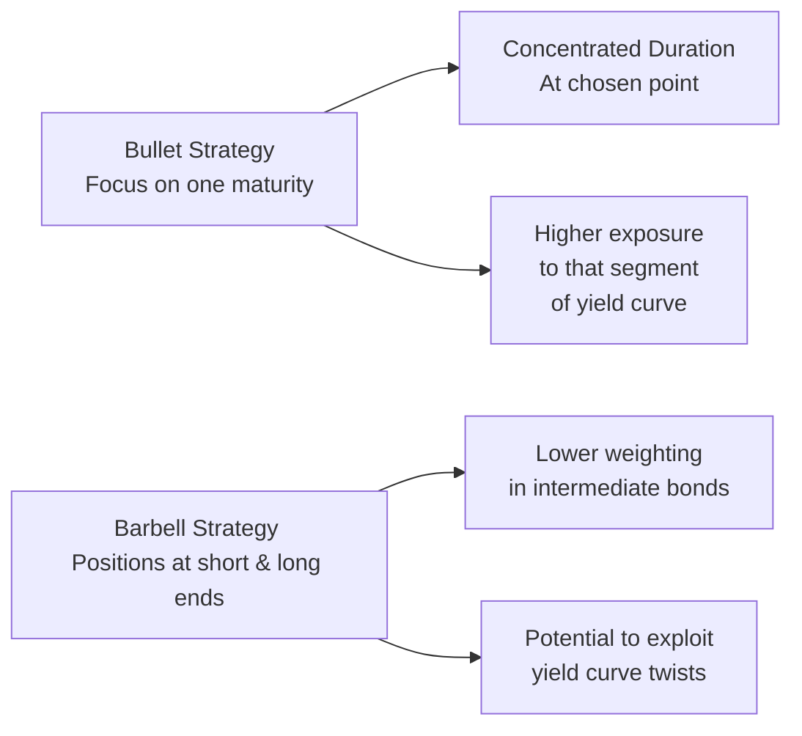

## Overview

So, let's dive into the heart of two common yield curve positioning strategies: bullet and barbell. If you’ve ever found yourself torn between focusing your bond maturities at a single point (to keep things organized) or spreading them out on both ends of the curve (to maybe take advantage of potential shifts in interest rates), you’re in the right place. The decision to go bullet or barbell often feels like standing at a fork in the road—one leading to more predictable duration targeting (bullet), the other offering greater flexibility in shifting environments (barbell).

Below, we’ll explore how these strategies work, why you might choose one over the other, and how they play out in real-world scenarios. We’ll also look into advanced considerations—like factor analysis of yield curve movements—and how you can measure and manage the risks in each approach.

## The Bullet Strategy

A bullet strategy concentrates bond maturities around a single target point along the curve. It’s something like having all your ducks in one row, lined up to mature right when you need the cash. For instance, if your investment horizon is five years, you might load up on bonds maturing in five years (or very close to it).

• Concentrated Maturity: By centering your maturities around that five-year marker (just as an example), you get an overall portfolio duration that’s neatly aligned with your investment horizon—or the liability you’re trying to match.  
• Duration Sensitivity: Because you’re pretty much all-in on a single portion of the yield curve, your portfolio’s valuation is particularly sensitive to yield shifts around that maturity range.  
• Potential Advantages:  
  – Simpler to Manage: You only really need to keep track of how rates move around that five-year point.  
  – Potential Stability: If the yield curve experiences a parallel shift, your bullet strategy may behave in a relatively predictable manner.  
• Potential Disadvantages:  
  – Less Cushion Against Curvature Changes: If the yield curve twists or flattens in unexpected ways, the portfolio might underreact or overreact at precisely the wrong place on the curve.  
  – Limited Flexibility: You don’t have much of a hedge if the short or long end of the curve starts moving significantly.

### Example in Action

I once remember constructing a small bullet portfolio for a local municipality that needed to finance specific liabilities in about seven years. The idea was to match a big chunk of maturities around the time the municipality had to make payments on an infrastructure project. Every now and then, I’d notice I was missing out on some rally at the longer end of the curve—but hey, that wasn’t the objective for them. Our job was to ensure that when year seven arrived, we had the necessary principal locked down, unaffected by short-end or long-end yield gyrations.

## The Barbell Strategy

On the other side of our yield curve “fork in the road,” we find the barbell strategy. With a barbell portfolio, you hold a combination of short-term and long-term bonds, with relatively minimal holdings (or sometimes none) in the middle.

• Split Maturities: Typically, half (or a portion) of the portfolio might be in short-term bonds—let’s say 1–2 years to maturity—while the other half is in long-term bonds, such as 10 or 20 years.  
• Exploiting Yield Curve Twists: If you anticipate the yield curve to steepen, flatten, or twist, a barbell might let you seize opportunity both at the short end (where reinvestment rates may move quickly) and the long end (where price changes can be dramatic if yields shift).  
• Potential Advantages:  
  – Flexibility: You can rebalance the short end easily, and if rates drop at the long end, you typically see a solid price appreciation.  
  – Dynamic Response: Because the barbell invests in maturities at two ends, it can capitalize on changes in the slope or shape of the yield curve more readily.  
• Potential Disadvantages:  
  – Higher Volatility: You can expect more price sensitivity because of the sizeable position at the long end.  
  – Complexity in Rebalancing: Juggling two distinct maturity buckets may mean more transaction costs and frequent monitoring.

### Example in Action

Imagine a situation where you foresee a flattening of the yield curve: short-term rates might rise, while long-term rates stay relatively stable. By placing a good chunk of your portfolio in the long end, you could enjoy stable yields and price gains if long rates drift down slightly. Meanwhile, your short-term holdings are maturing frequently, letting you reinvest at higher short-term rates. If your expectations come true, you might outperform a bullet strategy that’s stuck around one single point on the yield curve.

## Visual Comparison

Here’s a simple Mermaid diagram to illustrate how these strategies concentrate or distribute maturities:



## Comparing Bullet and Barbell

Below is a quick comparison of typical performance under various yield curve movements. Keep in mind these are general tendencies and not guaranteed outcomes:

| Yield Curve Move      | Likely Beneficiary         | Reasoning                                                         |
|-----------------------|----------------------------|-------------------------------------------------------------------|
| Parallel Shift        | Bullet (if aligned)        | Bullet positions can be more predictable under uniform rate moves.|
| Twisting (Steepening) | Barbell                    | Barbell can capture improvements at the short end (reinvestment at higher short-term rates) and price gains at the long end if the long end stays low or rallies. |
| Twisting (Flattening) | Barbell                    | Short end rises, but you can reinvest at higher rates; long end stable -> potential price resilience.        |
| Curvature Changes     | Barbell                    | Multiple maturity anchors offer more adaptivity to mid-curve distortions. |
| Minimal Movement      | Either, but bullet simpler | If rates are stable, a bullet is straightforward to manage.       |

Certainly, in a real portfolio, factors like credit risk, liquidity, transaction costs, and the investor’s time horizon play vital roles.

## Yield Curve Forecasting and Strategy Selection

Selecting between bullet and barbell often boils down to your forecast for the yield curve:

• Expect a Parallel Shift or Low Volatility Environment: A bullet can work nicely. It’s a “hold it and forget it” approach—at least from the perspective of big yield curve shape changes.  
• Expect a Steepening or Flattening: Consider a barbell. You’ll have positions in different maturity segments to exploit.  
• Credit Risk Tolerance: If you’re using corporate bonds, remember that the longer end might carry higher credit risk. A barbell might mean you’ve got a chunk of your portfolio in longer-duration corporate credits, which amplifies credit risk exposure.  
• Liquidity Concerns: The short-term portion of a barbell strategy is fairly liquid, potentially making rebalancing easier. Then again, if the short end is too large, you might be reinvesting at uncertain rates frequently, creating reinvestment risk in a falling rate environment.

## Real-World Scenario Walkthrough

Picture a global asset manager who expects the Federal Reserve to tighten policy in the short term, but sees moderate growth, keeping longer-dated rates from rising significantly. In that scenario:

1. The short end of the curve could experience higher yields due to central bank actions.  
2. The long end might stay put or even drop a bit because inflation expectations remain contained.  
3. A barbell that invests in short-dated corporates (or Treasuries) and some longer-dated bonds could potentially enjoy boosted yield at the short end and price appreciation at the long end if those rates dip.  
4. Meanwhile, if you had opted for a bullet strategy around seven-year maturities, you might do okay if rates shift uniformly—but if the yield curve flattens more significantly, the barbell is more likely to capture the advantage.

## Advanced Considerations

### Modified Barbell
Sometimes you just can’t decide between bullet and barbell. It’s totally okay—portfolio managers often combine these approaches, creating a modified barbell or intermediate barbell. Maybe you split the difference between short and mid-term or mid-term and long maturities, depending on your forecast.

### Factor-Based Analysis
In Chapter 25, we highlighted that key rate durations and the factors of level, slope, and curvature can explain most yield curve movements. A bullet strategy typically exposes you heavily to the level factor in one region of the curve. A barbell might give you a more diversified exposure across slope or curvature factors. By monitoring factor sensitivities, especially using tools like partial durations or key rate durations, you can better align your strategy with your view on how the yield curve will evolve.

### Portfolio Simulation Example (Optional Python Snippet)

Below is a minimal pseudo-code snippet showing how you might test bullet vs. barbell portfolios under different yield curve shifts. In real life, you’d incorporate far more detail—like credit spreads, transaction costs, or stochastically generated interest rate paths.

```python
import numpy as np

def price_bond(face_value, coupon_rate, maturity, yield_rate):
    # Very simplified bond pricing function:
    # Sum of discounted coupons + discounted face value
    periods = maturity
    coupon_payment = face_value * coupon_rate
    pv_coupons = sum([coupon_payment / ((1 + yield_rate) ** t) for t in range(1, periods+1)])
    pv_face = face_value / ((1 + yield_rate) ** periods)
    return pv_coupons + pv_face

scenarios = [-0.50, 0.00, 0.25, 0.50]  # yield shifts in %
bullet_prices = []
barbell_prices = []

for shift in scenarios:
    # Bullet: Single 5-year bond
    bullet_prices.append(price_bond(face_value=1000, coupon_rate=0.03, maturity=5, yield_rate=0.03+shift/100))
    
    # Barbell: Half in 1-year bond, half in 10-year bond
    short_bond = price_bond(face_value=500, coupon_rate=0.02, maturity=1, yield_rate=0.02+shift/100)
    long_bond = price_bond(face_value=500, coupon_rate=0.04, maturity=10, yield_rate=0.04+shift/100)
    barbell_prices.append(short_bond + long_bond)

print("Bullet Strategy Prices by Scenario:", bullet_prices)
print("Barbell Strategy Prices by Scenario:", barbell_prices)
```

You might run this kind of simulation with more sophisticated methods (e.g., Monte Carlo) to evaluate how each strategy might react across multiple yield curve shapes and economic conditions.

## Key Takeaways and Best Practices

• Duration Management: Regardless of which strategy you choose, be conscious of your portfolio’s net duration and how it aligns with expected interest rate moves.  
• Liquidity and Reinvestment: A barbell might require regular short-term reinvestments, which can be good or bad depending on rate trends.  
• Credit Considerations: Longer maturities in a barbell expose you to greater spread and default risk if you’re dabbling in corporates.  
• Monitoring the Curve: Stay on top of macroeconomic indicators, policy announcements, and forward curves (Chapter 4) to refine your forecast of yield curve movements.  
• Avoid Common Pitfalls:  
  – Overconcentration in a bullet strategy, missing opportunities elsewhere on the curve.  
  – Overcomplicating a barbell with too many moving parts and transaction costs.  
  – Ignoring convexity (especially relevant with large shifts or nonparallel moves).  
  – Failing to factor in your portfolio’s constraints such as liquidity needs, regulatory issues, or client objectives.

## Conclusion and Next Steps

Bullet vs. barbell is not an either/or proposition. Sometimes you’ll blend them; sometimes you’ll tilt more heavily to one strategy based on your best guess at future rate moves. In practice, these strategies live within the broader toolkit of yield curve management, which includes more nuanced approaches like laddered portfolios, interest rate derivatives overlays, and factor timing (see Chapter 26.1 and Chapter 24 for related derivatives strategies).

Keep in mind your final objective: are you trying to preserve capital by a certain date (the bullet approach might shine), or do you want the flexibility to exploit a changing curve (the barbell approach may be king)? With a clear yield curve forecast, a firm handle on duration, and an eye on practical constraints, you can pick the strategy that’s right for you or your client.

## References and Further Reading

• Choudhry, Moorad. “Fixed Income Markets: Management, Trading and Hedging.” Wiley.  
• CFA Institute. “Fixed Income Readings on Yield and Curve Strategies.”  
• Journal of Portfolio Management, articles on yield curve positioning strategies:  
  https://jpm.iijournals.com  

---

## Test Your Knowledge: Bullet vs. Barbell Strategies



### Which of the following best describes a bullet strategy in fixed income?

- [ ] Splits maturities across both short and long bonds.
- [x] Concentrates maturities at or near a single point on the yield curve.
- [ ] Invests exclusively in risk-free assets across multiple maturity points.
- [ ] Positions the portfolio solely in Treasury bills with rolling maturities.

> **Explanation:** A bullet strategy pools maturities around one segment of the yield curve, aligning closely with the investor’s horizon.

### In a barbell strategy, which of the following maturities typically sees minimal or no allocation?

- [ ] Short-term bonds
- [x] Intermediate-term bonds
- [ ] Long-term bonds
- [ ] Treasury bills

> **Explanation:** By definition, barbells focus on short and long maturities, leaving out the intermediate portion.

### A portfolio manager expects a flattening yield curve, with short-term interest rates rising more than long-term rates. Which strategy might outperform in such a scenario?

- [ ] Pure bullet strategy centered on 5-year maturities
- [x] Barbell strategy, with holdings in short and long maturities
- [ ] Laddered strategy with uniform allocations
- [ ] Equal allocations across short, intermediate, and long maturities

> **Explanation:** A barbell can take advantage of rising short rates by frequently reinvesting proceeds at higher rates, while the long end may see stable or even lower yields offering potential price appreciation.

### If a manager aims to minimize complexities in duration management and wants a straightforward portfolio that’s easy to align to a given liability date, which approach is most suitable?

- [ ] Barbell strategy focusing on short and long zones
- [ ] Laddered strategy that spans multiple maturities
- [x] Bullet strategy with a single focal maturity
- [ ] Hedged strategy using interest rate swaps

> **Explanation:** The bullet strategy allows the investor to concentrate maturities around one point and simplifies aligning cash flows to future liabilities.

### Which of the following is a common disadvantage of a bullet strategy?

- [ ] Higher reinvestment risk at the short end
- [x] Less protection against nonparallel yield curve shifts
- [ ] Increased operational complexity due to multiple maturity buckets
- [ ] Excessive turnover and transaction costs

> **Explanation:** Because it’s so concentrated, a bullet strategy can underperform if the yield curve twists or steepens away from the focal maturity.

### Which statement is true regarding the reinvestment risk of a barbell strategy?

- [x] Reinvestment risk is generally higher at the short end due to frequent bond maturities.
- [ ] Reinvestment risk is lower because maturities spread across multiple endpoints.
- [ ] Barbell strategies are completely immune to reinvestment risk.
- [ ] Only the long end of a barbell introduces reinvestment risk.

> **Explanation:** With short-term bonds maturing more frequently, the manager must often reinvest at possibly changing short-end rates.

### Which factor-based element would a bullet strategy typically be most exposed to?

- [x] Level effect at a specific maturity
- [ ] Slope factor across the entire curve
- [x] Curvature factor around two anchor points
- [ ] Zero-coupon effect for risk-free bonds

> **Explanation:** A bullet’s concentrated maturities are sensitive to level shifts at one point on the curve rather than broader slope or curvature changes.

### What is an advanced way to blend bullet and barbell characteristics?

- [ ] Pairing a bullet strategy with an inflation hedge
- [x] Constructing a modified barbell with short and intermediate bonds
- [ ] Building a bullet solely with discount bonds
- [ ] Using swap overlays without changing maturities

> **Explanation:** A modified barbell might combine short and intermediate maturities (or intermediate and long), achieving a smoother maturity distribution while retaining barbell-like features.

### What is the primary risk when using long-duration corporate bonds in a barbell strategy?

- [ ] Frequent liquidity rebalancing
- [ ] Guaranteed outperformance in flattening markets
- [x] Higher credit and spread risk
- [ ] Elimination of all price volatility

> **Explanation:** Longer-dated corporate bonds often carry greater credit and spread risk, so a barbell with significant long-duration corporates must carefully monitor credit conditions.

### True or False: A bullet strategy centered on a 5-year maturity is more likely to outperform a barbell when the yield curve experiences a dramatic steepening.

- [x] True
- [ ] False

> **Explanation:** If the yield curve steepens significantly between short and long maturities, a barbell can exploit both ends. In most cases of dramatic steepening, bullet strategies tend to miss out on such dual advantage, so they are less likely to outperform a barbell. Hence, the statement is false if you interpret it strictly. However, if the bullet is exactly at the point benefiting from the shift, it might outperform. This is a tricky scenario—it depends on where the pivot of the steepening occurs. Generally, barbell is favored in a steepening environment.


