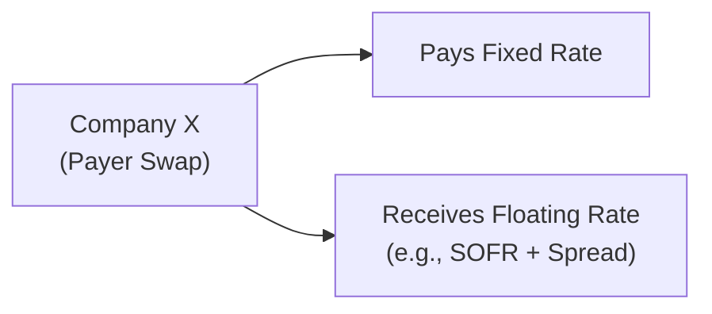

## Introduction

So, you’ve made it all the way here, diving deeper into yield curve management and spread risk techniques. Maybe you remember those days back in Level I when interest rate swaps first popped up in a footnote or two. Now, at Level II, we dig in with a full-scale approach: how do you effectively hedge bond portfolios using swaps, futures, forwards, and some more advanced instruments?

In this section, we’ll walk through the mechanics of interest rate swaps, how “payer” vs. “receiver” swaps work, and why swap spreads matter for hedging. We’ll also dip into alternatives like futures, forwards, and a few fancy moves like swaptions and spread locks. The goal? When the yield curve does something unpleasant—or credit spreads start to widen at the wrong moment—you’ll be prepared to preserve capital and manage risk effectively.

## Interest Rate Swaps for Hedging

An interest rate swap is, at its core, just a contract where two parties exchange streams of cash flows. One side typically pays a fixed rate, while receiving a floating rate linked to a reference index (e.g., SOFR). The other party does the opposite. That’s it. But as a bond portfolio manager, these swaps can be an incredibly powerful way to lock in or alter your portfolio’s rate exposure without selling existing securities.

• Payer Swap (Pay Fixed, Receive Floating)  
  If you’re worried rates might rise, you can enter into a payer swap to hedge. You pay a fixed rate to a counterparty and receive a floating rate in return. If market rates rise, your floating-rate receipts generally increase, offsetting higher interest costs or price losses on your underlying bond positions. Basically, the swap helps neutralize or reduce the portfolio’s duration.  

• Receiver Swap (Receive Fixed, Pay Floating)  
  On the flip side, you might be convinced rates will fall soon. To hedge or possibly profit, you could receive a fixed rate and pay floating. If rates decline, your fixed receipts will outpace the floating payments you owe, thus generating value. This is often used to reduce floating rate exposures or to lock in yields that you expect to drop.  

### Basic Valuation Framework for a Swap

At initiation, the fixed rate in an interest rate swap is chosen so that the swap has zero initial value (neglecting any bid-ask spreads or credit adjustments). The fixed swap rate is set such that:

1. Present Value (PV) of the fixed leg = PV of the floating leg.
2. Therefore, the net value = 0 at the start.

The floating leg’s value resets to par at each payment date (assuming the reference rate truly reflects the market). As time evolves, changes in rates will make the swap tilt in favor of one side or the other.

A simplified version of the swap’s value to the fixed-rate receiver might look like:

$$
V_\text{swap} = \text{Notional} \times \sum_{t=1}^{N} \Big[\text{DF}(t) \times \big(R_\text{fixed} - L_t\big)\Big]
$$

Where:  
• Notional is the underlying principal.  
• DF(t) is the discount factor for time t.  
• \\(R_\text{fixed}\\) is the fixed swap rate.  
• \\(L_t\\) is the expected floating rate at each payment date t.  

While you may not have to memorize the formula for the exam, understanding the mechanics behind it helps ensure you know how these instruments shift interest rate exposures in practice.

## Swap Spreads

A swap spread is basically the difference between the swap rate for a certain maturity and the yield on a government bond of the same maturity. For instance, if the 5-year swap rate is 5% and the corresponding 5-year Treasury yield is 4.7%, the swap spread is 0.3% or 30 basis points.

• Market Sentiment Indicator  
  Changes in swap spreads can signal whether market participants are feeling good or bad about credit risk. A widening spread often reflects increased risk aversion or decreased liquidity. A narrowing spread can imply more appetite for risk, as investors are comfortable receiving fixed payments in exchange for floating payments.

• Hedging Implications  
  Swap spreads can also affect how you manage bond portfolio risk. If you’ve got corporate bonds where spreads have widened, you might look to swap out of some credit exposure. Or if you anticipate that government yields and swap rates will diverge, you can implement trades to take advantage of that shift.

## Futures and Forwards as Alternatives

So, what if you want something more standardized than a swap—or you just want a shorter-term hedge? Treasury futures and FRAs (Forward Rate Agreements) provide an alternative path:

• Treasury Futures  
  Highly liquid and standardized, Treasury futures let you hedge against (or bet on) movements in government bond yields. You may find them more cost-effective for short-term or tactical adjustments. However, the standard maturity dates of futures might not perfectly match all your bond positions.  

• Forward Rate Agreements (FRAs)  
  If you’re specifically concerned about interest rates in a particular future period (e.g., you have a loan repricing in three months), an FRA lets you lock in a rate now. When that period arrives, if the market rate is higher than the FRA rate, your FRA position gains value (offsetting your higher borrowing cost). If rates are lower, your FRA has negative value, offset by cheaper funding. FRAs work best when your hedging horizon or exposure precisely matches the start and end dates of the agreement.

## Complex Strategies

Sometimes, you may need more nuanced or flexible hedges. That’s where instruments like swaptions and spread locks come in:

• Swaption  
  A swaption is simply an option on a swap. So if you are uncertain whether you will need to enter into a swap in the future, a swaption can be a neat solution. You pay a premium upfront for the right (but not the obligation) to pay fixed or receive fixed.  

  Let’s say you hold a large portfolio of floating-rate notes but you’re not sure how quickly rates will shift. You can buy a payer swaption: if rates rise, you then exercise your swaption to pay fixed and receive floating, effectively capping your cost. If rates stay flat or fall, you let the option expire.  

• Spread Locks  
  A spread lock is a way to fix the spread between two rates. For example, if you have an upcoming issuance of corporate debt and you’re worried that corporate spreads relative to Treasuries will widen, you can lock in that spread now. If the spread does widen, your spread lock (which profits when the spread widens beyond a locked level) compensates for the higher issuance cost.

These advanced strategies can be helpful if your main risk lies in the shape of the yield curve or in expected changes in credit spreads, not just in absolute yield levels.

## Risk Management Process

Hedging with swaps and other derivatives isn’t just about what instrument to pick—it requires a systematic approach to ensure your hedge aligns with your broader portfolio objectives.

• Identify Key Exposures  
  First, figure out exactly what you’re hedging. Do you have a big slug of floating-rate exposures that you want to convert to fixed? Is your bond portfolio particularly sensitive to a steepening yield curve? Are you worried specifically about corporate vs. Treasury spreads? Understand the underlying exposures thoroughly.  

• Select Liquid Instruments  
  Next comes instrument selection. If you need a longer maturity, a swap might be your best bet. For short-term exposures or smaller notional amounts, going with futures might be cheaper and simpler.  

• Position Size and Match  
  It’s also important to size your hedge properly. Look at your portfolio’s duration, key rate durations (see earlier chapters on yield curve risk), and spread exposures. You want to match the notional and maturity structure of your hedge to the portion of the portfolio you’re protecting.  

• Ongoing Monitoring and Rebalancing  
  Markets don’t stand still. You’ll probably want to rebalance your swap or futures positions if rates shift drastically, or if your portfolio composition changes. Because derivatives are marked to market, the hedge ratio that initially felt perfect can quickly become obsolete if your portfolio or market conditions change.

## A Quick Anecdote

I remember a time when I was convinced rates were about to spike after a surprising central bank announcement. My bond portfolio was long duration, so I entered into a payer swap, paying fixed and receiving floating. For a few months, it felt like I was burning money on that swap because rates actually dipped lower (so I was paying a higher fixed rate than I was receiving). But eventually, rates reversed course and climbed, and the swap offset most of the portfolio’s losses in market value. Moral of the story? Hedging can feel a bit uncertain in the short run, but if your analysis is sound and your hedge is appropriately set up, it can save your bacon when the big moves arrive.

## Illustrative Diagram: Payer Interest Rate Swap

Below is a simple flow diagram of a standard payer swap from the perspective of a company paying fixed and receiving floating. The logic is the same if you’re a portfolio manager:

In the diagram, the company’s main exposure is that they pay the fixed rate stream; if rates climb, the floating rate it receives goes up, mitigating the negative impact of rising rates on a fixed-rate bond portfolio.

## Potential Pitfalls and Best Practices

• Over-Hedging  
  Sometimes managers hedge 100% of their exposure. That can be okay or it can transform the portfolio into something too conservative. Make sure you’re comfortable with the net position after the hedge.  

• Ignoring Swap Spreads  
  Swap rates aren’t always in perfect lockstep with Treasury yields. Failing to account for changes in the swap spread can lead to a mismatch between what you’re paying or receiving and your underlying risk.  

• Credit Risk and Collateral  
  Swaps are subject to counterparty risk—especially if one side is losing big on the swap. Make sure your ISDA documentation, collateral agreements, and margining processes are up to par.  

• Liquidity Constraints  
  Futures and swaps have their own liquidity dynamics. For example, short-term interest rate futures are highly liquid, but out-of-the-money swaptions might not be. In times of market stress, wide bid-ask spreads can erode cost-effectiveness.

## Practical Examples

1. Hedging a Fixed-Rate Bond Portfolio with Payer Swaps  
   Suppose you manage a $100 million portfolio of 10-year corporate bonds. You expect interest rates to rise in the next year. You could enter a series of payer swaps (pay fixed, receive floating) with a notional of, say, $60 million to partially hedge your interest rate risk. If rates do rise, the mark-to-market losses on your bond portfolio are offset by the gains from receiving higher floating payments.  

2. Using a Swaption for Market Uncertainty  
   If you’re uncertain about rate directions but want the flexibility to hedge if rates do surge, you might purchase a payer swaption. You pay a premium to buy the right to initiate a payer swap. If the market moves against you, you exercise. If it moves in your favor, you happily let the option expire and keep your portfolio as is.  

3. Spread Lock for Corporate Debt Issuance  
   Let’s say your company plans to issue $50 million in corporate debt in three months. You see potential volatility in corporate credit spreads relative to Treasuries. By locking in the spread (through a spread lock), you effectively hedge against a widening of corporate spreads that would otherwise force you to issue at a higher coupon.

## Conclusion and Exam Tips

Hedging yield curve and spread risks is fundamental to active fixed income management. Interest rate swaps often sit at the heart of these strategies, but futures, forwards, swaptions, and spread locks can also be critical tools—particularly when market outlooks are uncertain. On the exam, expect item sets that give you a portfolio scenario and ask how to structure a hedge. They might test your understanding of:

• Choosing between payer or receiver swaps.  
• Evaluating a swaption’s benefit vs. a plain-vanilla swap.  
• Interpreting changes in swap spreads and how they influence cost.  
• Deciding on futures or FRAs for short-term hedging.  

The best approach is to be crystal clear on your portfolio’s duration, key rate exposures (see Chapter 25 for more on key rate duration), and credit spread risk. Then you’ll select the instrument that best fits the exposure you need to neutralize or the position you want to take.

Good luck, keep a watchful eye on those yields—and don’t panic if your hedge runs at a short-term loss. If your market thesis holds, you’ll likely be glad you set it up.

## References and Further Reading

• Hull, John C. “Options, Futures, and Other Derivatives.” 10th ed., Pearson.  
• Sundaresan, Suresh. “Fixed Income Markets and Their Derivatives.” 3rd ed., Academic Press.  
• International Swaps and Derivatives Association (ISDA):  
  https://www.isda.org/  
• For more on yield curve analysis and duration targeting, see Chapter 25 of this volume.

## Practice Questions: Hedging with Swaps and Other Instruments



### Which of the following best describes a “payer swap” in an interest rate swap?

- [x] The counterparty paying fixed and receiving floating.
- [ ] The counterparty receiving fixed and paying floating.
- [ ] A swap that locks in the existing yield.
- [ ] A swap solely used for currency hedging.

> **Explanation:** A “payer” swap typically means the party pays the fixed rate and receives the floating rate.  

### What does a swap spread represent?

- [ ] The fixed rate in an interest rate swap.
- [x] The difference between the swap rate and the government bond yield of the same maturity.
- [ ] The bid-ask spread on swaps quoted by dealers.
- [ ] The credit spread between corporate and government bonds.

> **Explanation:** The swap spread is the difference between the fixed swap rate and the yield on an equivalent maturity government bond.  

### Under which situation might a payer swaption be more appropriate than a plain vanilla payer swap?

- [x] When future exposure to rising rates is uncertain, and the manager wants the right but not the obligation to pay fixed.
- [ ] When the manager wants to guarantee paying floating and receiving fixed in the future.
- [ ] When the manager needs a currency hedge.
- [ ] When the manager believes rates will remain unchanged.

> **Explanation:** A payer swaption provides optionality, allowing the holder to enter into a pay-fixed/receive-floating swap if rates rise.  

### One primary benefit of using Treasury futures instead of interest rate swaps for hedging is:

- [x] Standardized contracts and high liquidity.
- [ ] Minimal basis risk between corporate bonds and Treasuries.
- [ ] Longer maturities than most swaps.
- [ ] The ability to avoid mark-to-market.

> **Explanation:** Treasury futures are heavily traded, standardized instruments offering deep liquidity, making it easy to enter and exit positions.  

### Which is a valid reason to use an FRA (Forward Rate Agreement)?

- [x] Locking in a future borrowing rate for a specific period.
- [ ] Hedging a corporate bond position’s default risk.
- [x] Securing the rate on an upcoming investment in short-term paper.
- [ ] Converting a floating-rate bond into a fixed-rate bond for the long term.

> **Explanation:** FRAs fix an interest rate for a future period, useful for short-term borrowing or lending needs. They aren’t typically used for long-term conversions of floating to fixed.  

### When would a spread lock be most beneficial?

- [x] When an issuer fears widening corporate spreads before issuing new bonds.
- [ ] When a manager seeks exposure to foreign exchange fluctuations.
- [ ] When rates are plunging and a manager wants to receive fixed.
- [ ] When the portfolio already has zero duration.

> **Explanation:** Spread locks help manage the differential between corporate and Treasury yields, especially before new bond issuance.  

### What is the main credit risk consideration in an interest rate swap?

- [x] Counterparty default risk over the life of the swap.
- [ ] Government bond issuer default risk when comparing yields.
- [ ] The risk of the central bank changing interest rates.
- [ ] The margin risk on futures contracts.

> **Explanation:** With swaps, each counterparty faces the possibility that the other might default on future payments, which is the key credit risk.  

### What’s a common pitfall in using swaps for hedging?

- [x] Overlooking changes in the swap spread, leading to imperfect hedging.
- [ ] Always receiving too much interest income.
- [ ] Not having enough standardization in swap contracts for customization.
- [ ] Excessive volatility from standardized margin calls.

> **Explanation:** Swap spreads can change independently of underlying government yields, resulting in potential mismatches in hedging if ignored.  

### Which type of swap would you enter if you believed interest rates were about to fall but still wanted to hedge your floating liabilities?

- [x] Receiver swap: Receive fixed, pay floating.
- [ ] Payer swap: Pay fixed, receive floating.
- [ ] Currency swap: Exchange principal in two different currencies.
- [ ] Commodity swap: Exchange fixed payment for a commodity-linked payment.

> **Explanation:** To lock in currently higher rates while expecting rates to fall, receiving fixed and paying floating can take advantage of a coming rate drop.  

### A swaption differs from a swap primarily because it:

- [x] Provides the holder the right, but not the obligation, to enter a swap.
- [ ] Is automatically exercised at maturity.
- [ ] Always costs nothing to initiate.
- [ ] Cannot be used to hedge interest rate exposure.

> **Explanation:** A swaption is an option on a swap, so it confers the right to enter a swap contract in the future.




