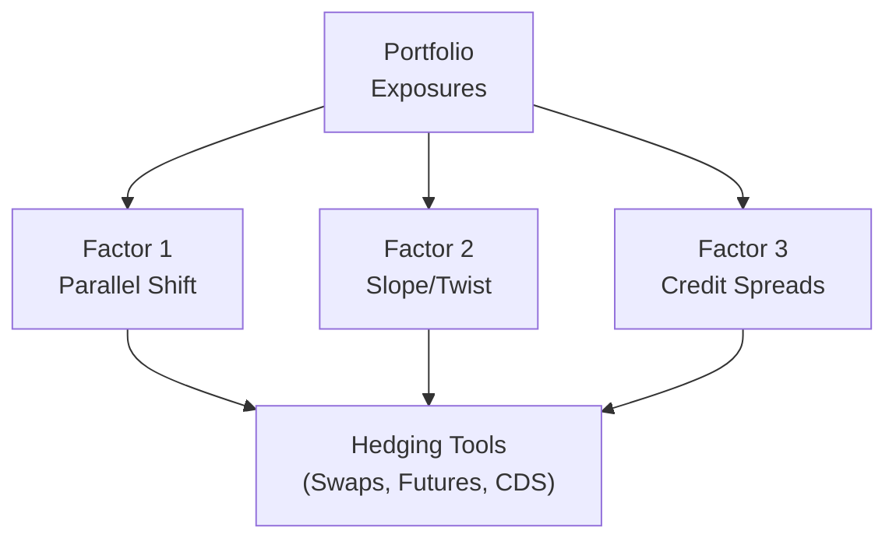

## Introduction
So you’ve got this fixed income portfolio, and you’re suspecting the yield curve isn’t just going to move in a neat, tidy way—like straight up or straight down. That old dream of simply measuring “duration” and calling it a day? Well, it might still give you a rough sense of how you’ll perform if interest rates bounce around, but it won’t give you the full picture. In the real world—and certainly on the CFA exam—yield curves can shift in multiple ways at once: a partial parallel shift here, a twist there, maybe even a dash of spread widening just to keep you on your toes.

This piece focuses on multi-factor risk management, particularly in scenarios where you’re juggling government bonds, corporate bonds, and interest rate swaps. We’ll run through core concepts like factor decomposition (parallel shift, slope, and credit spreads), scenario analysis, and stress testing. We’ll then look at a practical example involving derivative overlays to hedge or exploit these risks.

If you’re preparing for the CFA Level II exam, this is exactly the kind of scenario you might encounter in an item set—one that ends with questions like, “What’s the best hedge if the short end is tanking but the long end is rallying?” or “How do you handle credit spreads widening by 50 basis points alongside a 100 basis point shift in the overall curve?” Let’s check out some details.

## Setting Up the Scenario
Imagine a portfolio manager oversees a fixed income portfolio containing:
• A core allocation to government bonds (short-term Treasuries and intermediate Treasuries)  
• A handful of corporate bonds with varying credit quality  
• Several interest rate swaps used to fine-tune duration exposure  

The manager expects:  
• Partial parallel shift: Yields could rise across the curve, but not necessarily uniform at every maturity.  
• Twist: The long end might rise more than the short end, creating a steeper slope.  
• Widening Credit Spreads: Macro uncertainties could push corporate spreads higher, hurting bond prices.

In a typical CFA vignette, you’d be asked to measure how these factor moves may affect portfolio value and propose steps to mitigate unwanted risks.

## Factor 1: Parallel Shift Risk
A parallel shift is the old stalwart of yield curve changes: the entire curve moves up or down by a roughly uniform amount. Even if it’s “partial,” it often indicates that interest rates are generally trending up or down across short, intermediate, and long maturities. The simplest way to assess parallel shift risk is by checking your portfolio duration.

### Duration Basics
Modified duration (D_mod) is one measure of price sensitivity to interest rate changes:

D_{\text{mod}} = \frac{\partial P}{\partial y} \times \frac{1}{P}

where P is the bond’s price and y is the yield.

But for a big portfolio, you might total up weighted durations of each holding. If interest rates move uniformly by some basis-point amount, the portfolio’s approximate percentage change in price is:

\text{Portfolio Price Change} \approx - D_{\text{mod, portfolio}} \times \Delta y


### Hedging Parallel Shift
If the portfolio manager wants to reduce exposure to a general rate increase, they might:
• Use interest rate swaps, entering into a payer swap to profit if rates rise.  
• Short Treasury futures.  
• Sell some longer-duration bonds, or buy short-term securities.  

Just keep in mind that heavy reliance on a single measure like total duration won’t reveal how different parts of the curve move differently.

## Factor 2: Slope (Twist) Risk
Bond folks like to talk about the yield curve being “steep” or “flat,” and that’s the slope factor. One day you wake up, and short-term rates remain steady, but 10-year yields spike by 50 basis points. That’s a twist. Or simultaneously, the 30-year yield might barely budge while the 2-year yield jumps 30 basis points—another twist pattern.

### Key Rate Durations
To analyze slope risk, you dive into key rate durations (sometimes called partial durations). Instead of one lump-sum duration measure, key rate durations break down exposure to specific maturities. For example:

\text{Partial Duration}_i = \frac{\Delta P}{P} \Big/ \Delta y_i

Here, \\(\Delta y_i\\) is the yield change at the i-th key maturity (e.g., 2-year, 5-year, 10-year, 30-year). This helps you see where you are most vulnerable. Maybe your portfolio is heavily exposed at the 10-year point, meaning a big jump in the 10-year yield will hurt you more than if the 2-year yield moves.

### Strategies to Manage Slope Changes
If you anticipate a steeper curve:
• Enter into a receiver swap on the long end and a payer swap on the short end.  
• Buy short-end Treasuries (less yield but safer if the short end’s not moving much) and short long-end Treasuries (or use a long maturity futures contract).  
• Shift holdings into a barbell or bullet strategy, depending on your forecast of how the slope changes might play out.

## Factor 3: Credit Spread Risk
Credit spread risk is especially relevant if you hold corporate bonds or high-yield debt. Even if interest rates remain stable, corporate bond prices can drop if investors start demanding higher spreads due to, say, recession concerns, geopolitical tension, or anything that shakes confidence in a company’s ability to pay back its debt.

### Spread Duration
Spread duration measures how sensitive a security is to changes in credit spreads. A 50 bp widening in credit spreads for a bond with spread duration of 6 means an approximate 3% price decline (0.50% × 6).

If you believe spreads are about to widen, you can:
• Purchase single-name credit default swaps (CDS) on the corporate bonds you own. If spreads blow out and the bond price falls, your CDS hedge gains in value.  
• Use an index CDS for broad-based hedging if you have multiple corporate positions.  
• Adjust the weighting of corporate vs. government bonds so you’re less exposed to those big spread shocks.  

Of course, there’s basis risk: the specific bonds in your portfolio may not move perfectly in tandem with the index on which CDS is priced.

## Putting It All Together: Multi-Factor Analysis
Many real-world shocks aren’t polite enough to arrive one factor at a time. You may observe a partial parallel shift (e.g., 25–30 bp across the curve), a 50 bp steepening, plus a 25 bp credit spread widening in the space of a few weeks. The manager needs to track each factor’s effect on the portfolio, measure the combined drawdown, and figure out the best ways to hedge or exploit those moves.

Below is a quick diagram illustrating how these factors (parallel, slope, and spread) feed into your hedging toolkit:

## Advanced Analytical Tools
In advanced multi-factor risk management, scenario analysis, stress testing, and tracking error become vital.

### Scenario Analysis
Scenario analysis means you pick a plausible future environment—like “Fed hikes rates aggressively, creating a parallel shift up by 50 bp, while market uncertainty causes a moderate 20 bp broader credit spread widening.” Then you measure how your portfolio value theoretically changes.

1. Identify the yield curve changes: +50 bp across short and intermediate points, +30 bp at the long end.  
2. Add a moderate steepening effect if you expect the 10–30-year slope to widen.  
3. Incorporate credit spread changes for each rating category in your holdings.  

After you run your scenario, check which positions get hammered. Perhaps your long-duration corporate bonds take the biggest hit, or your short-dated Treasuries are relatively fine. You may choose to reduce your corporate exposure or buy CDS as a hedge.

### Stress Testing
Stress testing is scenario analysis on steroids. Instead of mild, “seems-likely” projections, you conjure extreme events: a 100 bp parallel shift plus a 50 bp twist plus a 50 bp credit spread blowout. Sure, it’s not your base case, but the purpose is to see if your portfolio goes into meltdown under severe conditions—or if you can still survive.

For instance:
• 100 bp parallel shift  
• Additional 50 bp steepening at the long end  
• 75 bp spread widening in high-yield corporate debt  

You measure potential losses and decide how comfortable you are holding that risk. If the hypothetical losses are too big, you consider:

• Reducing overall portfolio duration.  
• Hedging the slope with targeted swap strategies.  
• Buying credit protection on your riskiest corporate holdings.

### Tracking Error
Say you benchmark your portfolio to the Barclays Global Aggregate Index or some relevant broad-based bond index. If the index has different exposures to parallel shift risk, slope risk, or average credit quality, your returns might veer away from the benchmark’s performance once those factors move.

Tracking error quantifies the variability of the difference in returns. If you are an active manager who’s intentionally overweight a certain maturity or credit sector, a big shift in that sector might produce a large performance gap—positive or negative. Scenario analysis can help you see how big that gap could get.

## Practical Application Example
Let’s talk about a fairly typical real-world trade structure:

1. The manager has a large position in 10-year Treasuries but is worried about a partial parallel shift plus a serious steepening at the long end. The manager decides to lighten up that long-term exposure by entering a payer swap at the 10-year point. “Wait,” you might say, “Why a payer swap?” Because if rates rise, the manager will pay fixed (unfortunate if you only want to hold the bond), but the swap gains in relative value as floating rates also rise, offsetting the bond losses. It’s effectively shorting rates at that maturity.

2. Simultaneously, the manager purchases short-term Treasury futures to keep the overall notional coverage balanced. That means they’re not throwing away the entire interest rate exposure, just reconfiguring it. If short-term rates rise a bit, the impact is not as severe as a shift in the long end.

3. On the credit side, the manager holds a few corporate bonds and suspects a 25–30 bp spread widening could hit the sector. The manager uses an index CDS strategy to offset some spread duration. By purchasing protection on the index, if spreads widen, the manager collects gains on the CDS, partially or wholly offsetting losses on the physical bond positions.

Now, is this a perfect hedge? Probably not. Because basis risk lurks around the corner: the corporate index might not track each single-name bond precisely. But it’s often cheaper or more liquid to hedge broad-based credit risk this way rather than try to short each corporate issuer individually.

## Best Practices and Pitfalls
• Don’t Over-Hedge: Over-hedging can lead to negative carry. You might be paying out in swaps or shorting securities that rally unexpectedly.  
• Watch Liquidity: Futures, swaps, and CDS vary in liquidity. In stressed markets, you may struggle to exit positions.  
• Manage Basis Risk: If your corporate bond has, say, 8 years to maturity, the index you use to hedge might have different durations and credit profiles. Perfect alignment is rare.  
• Rebalance Regularly: Because yield curves can move fast, your hedges and exposures can shift quickly, too. Ongoing rebalancing keeps your multi-factor risk exposures in-check.

## Exam Tips
On your exam item set, you might see a scenario describing the manager’s forecast: “We expect a 30 bp upward shift in short rates, unchanged intermediate rates, and a 10 bp downward shift in long rates, combined with a 25 bp widening in BBB spreads.” The question can ask:

• How does the portfolio’s key rate duration structure influence potential losses?  
• Which derivative overlay is most appropriate for hedging?  
• How do you calculate the portfolio’s projected return differential from the benchmark?  

Follow these steps:
1. Identify which factor (parallel shift, slope change, spread movement) is most damaging based on partial durations.  
2. Recall the formulas for duration, key rate durations, and spread duration.  
3. Assess derivative solutions: payer/receiver swaps, futures, and CDS.  
4. Consider basis risk, cost of carry, and rebalancing frequency.  

If you can methodically address these points, you’ll be well-equipped to respond to nearly any multi-factor risk question.

## References
• CFA Institute. “Practice Vignette Examples in Fixed Income.”  
• Jarrow, Robert & Chatterjea, Arkadev. “An Introduction to Derivative Securities, Financial Markets, and Risk Management.”  
• Federal Reserve Board Research on multi-factor yield curve modeling: https://www.federalreserve.gov  

## Sample Exam Questions: Managing Multi-Factor Risk in Bond Portfolios



### Which of the following factors is most effectively addressed by total portfolio duration alone?

- [ ] A twist in the yield curve’s long end.
- [ ] A widening of credit spreads.
- [ ] Key rate durations around the 2-year sector.
- [x] A parallel increase in yields across all maturities.

> **Explanation:** Total duration primarily captures uniform (parallel) rate moves. It does not consider twists or credit spread changes in detail.

### A manager anticipates a steeper yield curve with minimal movement in the short end but a significant rise in long-term rates. Which hedging approach would best protect against this scenario?

- [ ] Buying long-dated zero-coupon bonds.
- [x] Entering a payer swap on the long end and maintaining or increasing short-term holdings.
- [ ] Shorting 2-year Treasury futures.
- [ ] Using single-name CDS for high-yield bonds.

> **Explanation:** When you expect a steepening at the long end, a payer swap on the long-dated exposures is often the way to hedge or profit from a rise in long rates.

### Which measure best reflects the potential loss from a 25 bp credit spread widening in a bond portfolio?

- [ ] Macaulay duration multiplied by 25 bp.
- [x] Spread duration multiplied by 25 bp.
- [ ] Key rate duration at the 30-year point.
- [ ] Modified duration for the entire portfolio.

> **Explanation:** Spread duration is specifically designed to measure sensitivity to changes in credit spreads. Modified or Macaulay duration typically capture interest rate risk, not spread risk.

### In constructing a scenario analysis for a multi-factor environment, which of these is most important?

- [x] Defining explicit parallel and non-parallel yield curve moves plus spread changes.
- [ ] Relying solely on a 100 bp parallel shift assumption.
- [ ] Using only historical data with no forward-looking adjustments.
- [ ] Ignoring correlation among different risk factors.

> **Explanation:** Multi-factor scenario analysis requires specifying parallel shifts, slope changes, and spread moves simultaneously to capture real-world complexities.

### A bond manager expects a 40 bp rise in the 10-year Treasury yield, a 20 bp rise in the 30-year yield, and no change in shorter maturities. Which factor is most relevant?

- [x] Slope or twist risk.
- [ ] Parallel shift risk.
- [ ] Credit risk only.
- [ ] Basis risk.

> **Explanation:** With different yield changes at different maturities, the yield curve is twisting, not shifting in a parallel manner.

### Which of the following derivative overlays can help protect a portfolio from credit spread widening?

- [x] Purchasing index CDS protection.
- [ ] Receiving fixed in an interest rate swap.
- [ ] Selling short-term Treasury futures.
- [ ] Entering a currency swap.

> **Explanation:** Index CDS protection is a direct hedge against credit spread widening for a broad set of corporate bonds. Interest rate and currency swaps are not designed to hedge spread risk directly.

### What does stress testing primarily examine in multi-factor risk management?

- [ ] Small, incremental changes in yields to see minor price fluctuations.
- [ ] The likely scenario that interest rates remain unchanged.
- [x] Extreme or worst-case yield curve and spread movements to assess portfolio resilience.
- [ ] The correlation between historical equity returns and bond returns.

> **Explanation:** Stress testing focuses on potential large or extreme moves, ensuring the portfolio can withstand significant shocks.

### In a partial duration (key rate duration) analysis, which maturity points are typically scrutinized?

- [ ] Only the 10-year point.
- [ ] Only the 30-year point.
- [ ] Only the short end of the curve.
- [x] Multiple maturities across the curve (e.g., 2-year, 5-year, 10-year, 30-year).

> **Explanation:** Key rate duration breaks down exposure by specific “key rates” at various maturities, allowing a better view of how slope changes may affect the portfolio.

### If the underlying bond in your portfolio matures in 8 years, but you hedge with a 10-year CDS index, what risk are you exposed to?

- [ ] Duration risk.
- [x] Basis risk.
- [ ] Default risk on the reference entity only.
- [ ] Prepayment risk.

> **Explanation:** Basis risk arises when the hedge instrument doesn’t perfectly match the characteristics (duration, maturity, credit quality, etc.) of the position you’re hedging.

### True or False: Tracking error measures the expected total return on your portfolio compared to a benchmark.

- [ ] True
- [x] False

> **Explanation:** Tracking error measures the variability (or volatility) of the difference in returns, not the absolute or expected total return itself.


