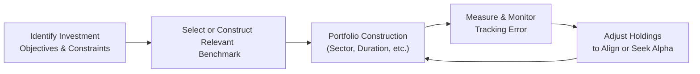

## Introduction
Imagine you’re building a fixed income portfolio for your client. You’ve got a sense of their risk tolerance, maybe even their preferences for duration or sector exposures, but you still need a clear target to measure your success. That’s where the benchmark comes into play—like a compass pointing you in the right direction. But, you know, sometimes that compass might not line up perfectly with the actual markets you’re navigating, which can create discrepancies between your portfolio’s performance and the yardstick you’re using. Those discrepancies are what we call “tracking error.”

In this section, we’ll explore why a well-chosen benchmark is so important, examine the elements that cause a portfolio to diverge from that benchmark, and share some practical approaches—both conceptual and hands-on—for managing any such deviations. Ultimately, our goal is two-fold: first, to help you select an appropriate benchmark that truly aligns with the portfolio’s objectives, and second, to minimize or optimize (depending on the manager’s mandate) the gap between your performance and that of the benchmark.

## The Role of Benchmarks in Fixed Income
A benchmark in fixed income is a reference portfolio or index that represents the risk and return characteristics of a particular segment of the bond market. If you flip back in this book (especially to Chapter 2: Fixed Income Instruments Overview), you’ll recall how bonds come in all shapes and sizes—government bonds, corporate bonds, mortgage-backed securities, structured products, you name it. Because fixed income markets can be so broad, it’s critical to choose a benchmark that lines up with an investor’s specific investment goals and constraints.

Some well-known bond benchmarks include:
• Bloomberg U.S. Aggregate (broad market, investment-grade focus).  
• Bloomberg Global Aggregate (global bond exposure).  
• ICE BofA U.S. High Yield Index (predominantly high-yield corporates).  
• Specialized sector- or maturity-based indices (e.g., short-duration corporate bonds, emerging-market debt).

But not every index is a one-size-fits-all solution. Maybe your investor wants to focus on investment-grade corporate bonds with maturities of five years or less. Or they might prefer a blend of government and mortgage-backed securities. The question is: “Which index best captures the market or strategy that I, as a portfolio manager, am trying to replicate or outperform?”

## Considerations in Benchmark Selection
Selecting a benchmark goes beyond just picking a name-brand index. You’ll want to consider the following:

• Credit Quality: Does the benchmark reflect investment-grade, high-yield, or a mix? If your target portfolio includes speculative-grade paper, you probably don’t want an investment-grade-only benchmark.  
• Duration and Maturity: Duration is the sensitivity of the bond (or portfolio) to interest rate changes. If your benchmark has an average duration of 7.0 years, while your portfolio has a duration of 2.0 years, it’s not a fair comparison.  
• Sector Weights: Government vs. corporate vs. securitized or emerging markets. Make sure your benchmark’s sector composition aligns with your portfolio’s.  
• Regional Exposure: If you manage a global bond fund, a purely domestic index won’t do.  
• Liquidity and Investability: Some indices contain illiquid securities. This can be problematic when you try to replicate an index that includes rarely traded, exotic bonds.  
• Currency Exposure: If you’re investing globally, what proportion is hedged vs. unhedged? Does the reference index reflect currency exposures that match your strategy?

Sometimes, you might have constraints: a maximum or minimum exposure to certain credit ratings, or a limit on certain industries or countries. If your chosen index is jam-packed with segments that violate your client’s policy constraints, you’re likely to see recurring tracking error. So a mismatch in sector or credit constraints can be a culprit right from the start.

## Tracking Error: Definition and Importance
Tracking error is the statistical measure of the difference between your portfolio’s returns and the benchmark’s returns. It is often expressed as the standard deviation of the return differential over a given time horizon. Mathematically, if \\(R_{p,i}\\) is your portfolio’s return in period \\(i\\), and \\(R_{b,i}\\) is the benchmark’s return, then define:


\Delta R_i = R_{p,i} - R_{b,i},


and let \\(\overline{\Delta R}\\) be the mean difference over \\(n\\) periods:


\overline{\Delta R} = \frac{1}{n} \sum_{i=1}^{n} (R_{p,i} - R_{b,i}).


Then the tracking error (TE) can be computed as:


\mathrm{TE} = \sqrt{\frac{1}{n - 1} \sum_{i=1}^{n} \bigl(\Delta R_i - \overline{\Delta R}\bigr)^2 }.


In plain language, tracking error tells you how tightly your portfolio results mirror the benchmark results. A lower tracking error signifies that your performance is hugging that benchmark fairly closely. A higher tracking error means your portfolio might be deviating from the benchmark—either in big positive ways (outperformance) or negative ways (underperformance). Active managers often tolerate higher tracking error in pursuit of alpha, while more index-oriented mandates try to minimize it.

Anyway, it’s important to know that a manager’s skill can’t be confirmed solely by a high or low tracking error—both are decisions related to the investment strategy. Passive managers want minimal tracking error; active managers accept more. Each is “right” or “wrong” depending on the investor’s goals, not an absolute standard.

## Sources of Tracking Error
A range of factors can cause your returns to be different from the benchmark:

• Duration Mismatch: If your portfolio’s duration is not aligned with the benchmark’s, changes in interest rates can cause divergences.  
• Spread Sector Allocations: Overweighting or underweighting corporate, government, or other spread sectors relative to the benchmark can create differences in yield and total return.  
• Credit Quality Differences: If your portfolio holds lower-rated bonds than the benchmark, you can see bigger swings in performance, especially during risk-on/risk-off market regimes.  
• Security Selection: Even within a sector or rating category, specific bond picks matter.  
• Currency Exposure: For global portfolios, currency fluctuations can amplify or reduce returns depending on your exposure vs. the benchmark’s.  
• Reinvestment Strategies: How you handle coupon payments (e.g., reinvestment rates) can differ from the index’s assumptions.  
• Fees and Transaction Costs: Indices typically ignore real-world investment frictions. If you have significant transaction costs or fees, your actual returns can drift below the index.  
• Liquidity Constraints: If the benchmark is not fully investable or includes illiquid bonds, that mismatch can force you into alternative securities.

## Managing Tracking Error in Practice
Let’s say you want to keep your tracking error under a certain threshold—maybe 1% annualized—for a near-index portfolio. Here are strategies to rein it in:

• Replication and Optimization: Directly replicate the benchmark’s index constituents or use an optimization approach to hold a representative sample that best replicates the index’s return and risk characteristics (so-called stratified sampling).  
• Sector-Neutral Positioning: Match the benchmark’s sector weights so that interest rate and credit spread exposures are in line.  
• Duration and Yield Curve Matching: Ensure your portfolio’s duration and key rate durations aren’t too far off the benchmark’s. (Recall from Chapter 25: Measuring Interest Rate Risk, key rate durations capture how sensitive you are to different points on the yield curve.)  
• Minimal Credit Quality Differentials: If you deviate significantly in quality distribution, you’re bound to get bigger tracking error.  
• Currency Hedging (if relevant): If the benchmark is currency-hedged, consider hedging your exposure to keep in step.

On the flipside, if you’re an active manager seeking alpha, a certain amount of tracking error is expected because you’re intentionally tilting the portfolio. You might overweight certain sectors or durations in which you have strong market convictions. The balancing act is to produce enough outperformance to justify the added volatility relative to the benchmark.

## Scenario and Stress Testing
Even if you’re trying to mirror a benchmark, sometimes the markets do surprising things—like sudden spread widenings or yield curve twists that can amplify small differences in durations or sector weights. Stress testing is one way to see how well or poorly your portfolio might track under extreme conditions.

• Interest Rate Shocks: Suppose rates spike by 200 basis points. How does that differentially impact your portfolio vs. the benchmark?  
• Credit Spread Widening: If we see corporate spreads blow out by 100 basis points, how much more or less sensitive is your portfolio?  
• Liquidity Squeeze: If liquidity dries up in certain bond sectors, can your portfolio quickly adjust to re-align with the benchmark?

By identifying how sensitive your portfolio is to those potential scenarios, you can get an idea of “worst-case” tracking error outcomes. It’s a good practice to run scenario analysis regularly—especially in volatile environments—so you’re not blindsided.

## Advanced Issue: Liquidity and Investability
It’s easy to talk about holding the same securities as the benchmark, but sometimes the realities of trading get in the way. An index might have thousands of small issues, many of which don’t trade actively, or it might include newly issued bonds that are impossible to purchase in large block sizes at the index’s official weighting. This mismatch between index construction and real-world investability can lead to forced deviations and tracking error.

A slightly informal personal anecdote: I recall a time when I tried to replicate a corporate bond index. Many of the index components were older, illiquid issues that, on paper, made up a decent chunk of the index weighting. But when I dialed up the bond desk to buy them, the dealers practically laughed, saying, “We haven’t seen that bond trade in months!” This forced me to pick alternative bonds—still close in rating and maturity but not precisely the same. This, in turn, caused my portfolio to register a modest tracking error over time. We eventually communicated to clients that perfect replication wasn’t feasible, which taught me that transparency is key when replicating or approximating a benchmark.

## Visual Overview in Mermaid Diagram
Below is a simple flowchart illustrating how benchmark selection feeds into portfolio construction and the cycle of monitoring tracking error:

The process is iterative—you choose a benchmark, build a portfolio, measure the deviations, then adjust as circumstances change or as new information arises.

## Vignette-Style Example
Imagine you’re managing the “Sunrise Fixed Income Fund,” which is constrained to only invest in investment-grade corporate and government bonds with maturities under ten years. You choose the Bloomberg U.S. 1-10 Year Government/Credit Index as your benchmark. Here are some constraints and choices:

• Maximum 70% in corporate bonds (benchmark weighting is about 65%).  
• Minimum average credit rating of A.  
• Duration should track within ±0.5 years of the benchmark’s 4.5-year duration.  

Then you notice that, in reality, you’re overweighting triple-B corporates because you believe they’re undervalued. This drives your portfolio’s yield up by 25 basis points more than the index, but it also increases credit risk. If we hit a market panic, those triple-B issues could widen and hammer your performance. Thus, your tracking error might go up in a volatile environment. Scenario analysis could help you see whether that bet is worth the potential underperformance in a stressed scenario.

## Best Practices and Common Pitfalls
• Always cross-check your portfolio sector exposure and credit profile against the benchmark to maintain intentional exposures.  
• Communicate to stakeholders or clients why certain deviations are allowed or even desired.  
• Avoid illiquid components unless you specifically intend to hold them for reasons that align with your strategy.  
• Rebalance regularly: Over time, coupon payments and bond maturities can drift you away from the benchmark structure.  
• Don’t chase alpha by ignoring risk constraints. Sometimes, alpha is overshadowed by negative performance if the bet goes against you.

## Final Exam Tips
• On your CFA exam, be prepared to identify the reasons for choosing a particular benchmark in a fixed income vignette. Watch for clues in the text about risk tolerance, credit constraints, portfolio liquidity needs, or duration targets.  
• Be aware of the formula for tracking error and how a question might test your understanding of it (e.g., with monthly or annual returns).  
• A question might feed you a scenario detailing changes in interest rates or credit spreads—then ask you to evaluate how the portfolio’s performance will deviate from the benchmark.  
• Watch for “gotchas” around reinvestment assumptions, currency exposures, and fees. The exam loves to highlight real-world frictions to see if you can spot them.  
• In an item set format, carefully read each detail of the portfolio’s constraints and compare them to the benchmark. That’s typically where tracking error creeps in.

## References
• Fabozzi, F. J. (Ed.). (2012). Handbook of Fixed Income Securities. McGraw-Hill.  
• CFA Institute. (2025). CFA® Program Curriculum, Level II, Volume 6: Fixed Income.  
• Ilmanen, A. (2011). Expected Returns: An Investor’s Guide to Harvesting Market Rewards. Wiley.  

---

## Test Your Knowledge: Benchmark Selection and Tracking Error



### Which of the following best describes tracking error in the context of a fixed income portfolio?
- [ ] The absolute difference between yield to maturity of the portfolio and its benchmark at a single point in time.
- [x] The standard deviation of the return difference between the portfolio and its benchmark over time.
- [ ] The variance of realized returns on the benchmark alone.
- [ ] The difference between the portfolio’s current market value and its initial investment.

> **Explanation:** Tracking error is typically the standard deviation of the difference between the portfolio’s returns and the benchmark’s returns.

### Which of the following would most likely increase a fixed income portfolio’s tracking error relative to its chosen benchmark?
- [x] Overweighting or underweighting particular bond sectors compared to the benchmark.
- [ ] Reducing bond turnover to minimize transaction costs.
- [ ] Matching the maturity profile of the benchmark.
- [ ] Replicating the exact credit ratings of the benchmark but in different coupon structures.

> **Explanation:** Major over- or underweights in certain sectors, such as corporate vs. government, would cause returns to diverge from the benchmark, thereby increasing tracking error.

### A manager wants to keep a portfolio’s tracking error below 1% while investing in an index that includes many illiquid issues. Which is the best practical approach to achieve this goal?
- [ ] Use only synthetic derivatives to replicate the benchmark exposure.
- [x] Construct a representative basket of more liquid securities with similar duration and sector weights as the benchmark.
- [ ] Tilt heavily into corporate bonds with higher yields to compensate for illiquidity.
- [ ] Avoid any credit exposure altogether.

> **Explanation:** In practice, using a representative basket of liquid securities that closely matches the benchmark’s characteristics is the standard method to minimize tracking error when full replication is not possible due to illiquidity.

### If a fixed income portfolio manager systematically underweights treasury bonds and overweights higher-yielding corporate bonds compared to a broad aggregate benchmark, which of the following is the most direct consequence?
- [ ] The portfolio’s duration will automatically be longer.
- [ ] Liquidity risk will be lower than the benchmark.
- [x] The portfolio may experience additional tracking error, especially in risk-off markets.
- [ ] The benchmark’s returns will increase to match the portfolio’s yield advantage.

> **Explanation:** Overweighting higher-yielding corporate bonds can be beneficial in stable or bullish markets but tends to amplify performance differences from a broad treasury-rich benchmark, driving tracking error higher.

### Which statement about benchmark selection for a fixed income portfolio is correct?
- [x] The credit quality and duration of the benchmark should be consistent with the portfolio’s strategy and constraints.
- [ ] It is usually preferable to select the benchmark with the highest historical return.
- [ ] Global benchmarks should always be hedged back to the domestic currency regardless of client preferences.
- [ ] Duration mismatch between the benchmark and portfolio is not a driver of tracking error.

> **Explanation:** Benchmark selection should align with the portfolio’s strategy in terms of credit, duration, and other relevant factors. Mismatches in duration or credit quality are key sources of tracking error.

### Suppose the difference in monthly returns between a portfolio and its benchmark is consistently near zero. Which statement is true?
- [x] The portfolio is displaying low tracking error relative to its benchmark.
- [ ] The portfolio is displaying high tracking error relative to its benchmark.
- [ ] The benchmark is flawed and irrelevant.
- [ ] This portfolio must be outperforming the benchmark.

> **Explanation:** Tracking error reflects the volatility of the return difference. A consistently small return difference suggests low tracking error. It doesn’t confirm outperformance, only consistency with the benchmark.

### Stress testing in the context of fixed income tracking error can be described as:
- [x] Simulating extreme interest rate or credit spread movements to see how divergences might occur.
- [ ] Calculating present values using forward rates in a binomial tree model.
- [ ] Applying only historical data to gauge realized volatility.
- [ ] Matching the exact composition of the benchmark under normal market conditions.

> **Explanation:** Stress testing involves analyzing potential extreme events (e.g., rate shocks, credit widening) and evaluating how they might cause the portfolio to deviate from the benchmark.

### A portfolio has a tracking error of 2% annually. Which statement is most correct regarding the portfolio’s performance vs. its benchmark?
- [x] Its returns can deviate from the benchmark by an estimated ±2% (one standard deviation) annually, based on historical patterns.
- [ ] It must be underperforming the benchmark by 2% annually.
- [ ] It has the same return distribution as the benchmark but with different coupon structures.
- [ ] It only differs from the benchmark in non-credit-related factors.

> **Explanation:** A 2% tracking error suggests that the portfolio’s returns historically vary around the benchmark’s returns by about 2% on average, but it doesn’t indicate whether the deviation is positive or negative.

### Why might a bond manager accept a higher tracking error?
- [x] To pursue alpha from intentional sector bets or duration tilts.
- [ ] Because they must follow an index replication strategy.
- [ ] Because the portfolio is fully hedged for currency risk.
- [ ] Because their benchmark is guaranteed to underperform in rising rate environments.

> **Explanation:** Managers who actively pursue outperformance (alpha) often deviate from the benchmark’s allocations, which naturally increases tracking error.

### True or False: Tracking error can be entirely eliminated if a portfolio exactly replicates the benchmark constituents.
- [x] True
- [ ] False

> **Explanation:** In theory, perfect replication of the benchmark constituents should produce the same returns, thus zero tracking error. In reality, transaction costs, liquidity, and other factors may make perfect replication challenging, but the statement is generally correct in a purely theoretical sense.


