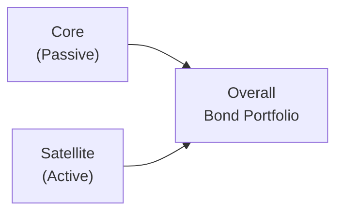

## Passive Bond Strategies

Some people joke that passive investing is essentially “set it and forget it,” but that might be oversimplifying. In passive bond strategies, the goal is to replicate or closely track a bond market index. Think of it like choosing to match the average outcome of the market rather than constantly trying to beat it. The benefits include lower management fees, less turnover, and (generally) lower transaction costs. The downside? You sacrifice the chance (some might say the thrill) of achieving substantial outperformance—also known as alpha.

There are two main ways to implement a passive bond strategy:

• Full replication: You buy every security in the index in appropriate weights. If the index contains 500 different corporate bonds, you literally hold those 500 issues in the same proportion as the index. This method aims to almost perfectly track the index return, with minimal tracking error. However, full replication can lead to higher transaction costs if the index is large or includes less liquid bonds.  
• Stratified sampling: Instead of buying every bond, you group the index’s securities by common risk factors—like maturity ranges, credit ratings, or sectors—and select representative bonds within each group. As long as these representative holdings reflect the index’s overall characteristics, your portfolio should behave similarly without the intense cost and complexity of full replication.  

So, which approach to pick? I once tried to replicate a high-yield corporate bond index exactly but discovered that a few of those bonds rarely traded, making them super expensive (and time-consuming) to acquire. Stratified sampling was way more practical and only introduced a barely noticeable tracking error. The choice often comes down to liquidity, index complexity, and cost considerations.  

## Active Bond Strategies

While passive strategies let you align with a benchmark and say, “Hey, I’m matching the market’s average return,” active strategies aim to outperform that benchmark. Active managers will typically make tactical or strategic bets across multiple dimensions:

• Duration management: Duration measures your bond portfolio’s sensitivity to interest rate changes. If you expect rates to rise, you might shorten your duration; if you think rates will drop, you’ll go longer to capture those capital gains.  
• Yield curve positioning: Picture the yield curve as a big slope that changes shape with economic expectations. Active managers may overweight certain maturities if they forecast flattening, steepening, or other types of curves.  
• Credit quality selection: Some will increase exposure to riskier (high-yield) bonds if they believe credit spreads will narrow. Others might choose a higher-rated bond if they predict tougher times ahead for lower-quality issuers.  
• Sector rotation: Move between corporate, government, securitized, or emerging market bonds based on where you see the best relative value.  
• Security selection: Even two bonds with the same rating and maturity might trade at slightly different yields. Identifying these mispricing opportunities can generate extra return if the disparity resolves in your favor.  

This approach requires solid research capabilities, constant re-evaluation, and typically more frequent trading. As a result, management fees and transaction costs can be higher. Yet, if done skillfully, active management can offer meaningful outperformance.  

I once tried a small-scale active strategy in my personal account. I realized pretty quickly that active bond management is not a side hobby—you really need adequate tools, market data, and time to watch how interest rates and credit spreads move. Otherwise, it’s easy to get burned by unforeseen market events.  

## The Core-Satellite Approach

But maybe you don’t want to be entirely passive or entirely active. One common hybrid solution is the “core-satellite” approach. In this structure, the portfolio is divided into two main segments:

• Core: A large portion of the portfolio closely tracks a benchmark or is very conservatively managed. This stable core aims to deliver returns in line with the broad bond market.  
• Satellite: A smaller, nimble piece of the portfolio takes active bets in areas with higher potential for alpha.  

This way, you have the “best of both worlds”: a reliable baseline to stay close to benchmark returns, plus a targeted area for seeking upside.

Below is a simple diagram illustrating how the core-satellite structure fits together:

In practice, the ratio between core and satellite can vary significantly. A conservative fund might keep 80% of its assets in a passive replica of the Bloomberg U.S. Aggregate Bond Index (for example) and reserve 20% for select credit or emerging market opportunities.  

## Advanced Considerations and Factor-Based Strategies

Markets have grown more complex, and many bond managers now look beyond traditional style distinctions (like “active vs. passive”) to incorporate factor-based views. Imagine your bond portfolio as a collection of factor tilts—value, momentum, liquidity, volatility—each of which you can dial up or down:

• Value factor: Seek undervalued bonds that appear cheap relative to their fundamentals.  
• Momentum factor: Invest in bonds whose prices have shown upward trends, expecting the trend to continue.  
• Low-volatility factor: Focus on bonds historically less prone to large price swings.  
• Credit/liquidity factor: Tilt toward issues that might offer higher spreads if you have confidence in stable or improving market conditions.  

The key is building or adjusting the portfolio to exploit these rewarded factors in a systematic way. Often, quantitative models help identify bonds that exhibit these factor characteristics. In active portfolios, factor-based investing can serve as a rigorous discipline, limiting the scope for personal biases. In passive or enhanced indexing contexts, factor exposures can be set methodically, reducing the risk of deviating from the desired risk profile.

## Vignette Example: Two Investors

Let’s consider a scenario. First, we have Karen, a high-net-worth investor who is primarily interested in preserving her capital with minimal surprises. She hates the idea of performance whiplash and prefers something that basically matches what she reads about in the “bond market” portion of her newspaper. Karen isn’t particularly excited about paying higher fees, either. A passive strategy—maybe even a stratified sampling approach that cuts down on trading—would likely make sense for her. 

On the other hand, we have Jamal, an institutional portfolio manager representing a pension fund that needs to generate enough returns to meet future liabilities. He has a dedicated research team, advanced analytics, and a long time horizon that lets him endure short-term market volatility. Jamal might choose an active strategy that invests in emerging market debt when spreads look attractive, or it might rotate into longer-duration Treasuries to capitalize on expected rate cuts. With more robust resources, Jamal has the capacity to search for alpha, operating with a measured level of risk that the institution finds acceptable.

For an exam scenario, you might get a “mini-story” describing these two individuals, along with a question about how best to tailor a portfolio for each. You’d apply your knowledge of passive and active approaches, referencing the risk and return trade-offs, and possibly specifying how each approach might handle interest rate forecasts or sector rotation.

## Best Practices, Pitfalls, and Final Notes

• Understand your resources: If you have limited time or research capability, a passive approach or a core-satellite strategy is usually more realistic.  
• Watch transaction costs: Active strategies can quickly eat into returns if you overtrade, especially in less liquid bond markets.  
• Monitor tracking error: For passive managers, it’s crucial to stay aware of how closely your portfolio is following the benchmark. Significant deviations defeat the purpose of passive investing.  
• Align with objectives: Are you (or your client) seeking consistent income, stable capital preservation, or aggressive pursuit of returns? Your strategy should reflect this big-picture requirement.  
• Factor exposures: Keep track of unintentional factor tilts. Even “passive” approaches can pick up biases if the benchmark itself has heavy sector or duration concentrations.  
• Risk management: Active managers must maintain robust risk oversight. A “great idea” can backfire if the yield curve shifts in an unexpected way, if credit conditions deteriorate, or if liquidity dries up.  

## References

• PIMCO. (n.d.). Understanding Fixed Income Strategies. Retrieved from https://www.pimco.com  
• CFA Institute. (2025). CFA® Program Curriculum, Level II, Volume 6: Fixed Income.  
• Branson, B. (2018). The Active-Passive Debate: Market Insights. Journal of Investment Strategies.  

## Test Your Knowledge: Active vs. Passive Bond Strategies



### In a passive bond strategy, which of the following techniques involves holding all securities in the index?

- [ ] Stratified sampling
- [x] Full replication
- [ ] Factor-based sampling
- [ ] Active replication

> **Explanation:** Full replication is a passive approach in which the manager attempts to hold every security in the index in the same proportion as the index itself, thereby minimizing tracking error.

### Which statement best describes a downside of passive investing?

- [ ] The strategy has higher transaction costs.
- [x] There is limited potential for outperformance (alpha).
- [ ] It requires advanced forecasting techniques.
- [ ] It requires frequent portfolio rebalancing.

> **Explanation:** Passive strategies are designed to match, not beat, a benchmark. Therefore, passive approaches typically cannot achieve alpha in excess of the index return (aside from minor tracking deviations).

### An active bond manager expecting a flattening yield curve might choose to:

- [x] Shift allocations from short-duration bonds to longer-duration bonds.
- [ ] Remain fully invested in short-term Treasury bills.
- [ ] Maintain equal durations across all maturities.
- [ ] Buy only floating-rate notes.

> **Explanation:** If an active manager expects the yield curve to flatten, they may place more assets in longer maturities, anticipating a relative outperformance from falling long-end yields.

### Under a core-satellite approach, the “core” typically:

- [x] Closely tracks a broad market index.
- [ ] Focuses exclusively on high-yield securities.
- [ ] Is a purely momentum-driven allocation.
- [ ] Consists only of floating-rate instruments.

> **Explanation:** The core portion is often passively managed or conservatively run to mirror a representative market index. The satellites are where active bets or factor tilts occur.

### Active managers can try to generate alpha by:

- [x] Identifying mispriced bonds relative to their fundamentals.
- [ ] Minimizing tracking error extremely close to zero.
- [x] Rotating between sectors to exploit perceived relative value.
- [ ] Sticking to exactly the same duration as their benchmark at all times.

> **Explanation:** Active managers will look for mispricing or sector opportunities and can deviate from benchmark positions. Matching the benchmark duration or minimizing tracking error is more aligned with passive management.

### One major reason an investor might choose a stratified sampling approach rather than full replication is:

- [x] Reduced transaction costs and improved liquidity management.
- [ ] The desire to hold derivatives only.
- [ ] The inability to decide on a benchmark.
- [ ] The focus on maximizing tracking error.

> **Explanation:** Stratified sampling can be more cost-efficient than holding every bond, particularly in an illiquid market or a highly varied index, thus reducing transaction complexities.

### Which statement about factor-based bond strategies is correct?

- [x] They systematically tilt the portfolio toward certain risk factors like value or momentum.
- [ ] They always underperform purely passive approaches.
- [x] They require quantitative models to identify factor exposures.
- [ ] They avoid any sort of duration management.

> **Explanation:** Factor-based strategies use systematic methods to capitalize on rewarded factors (like value, momentum, or low volatility). Quantitative tools are often key.

### If an investor wants pure representation of a benchmark with negligible tracking error, the best method would be:

- [ ] Stratified sampling.
- [x] Full replication.
- [ ] Holding only the cheapest bonds of the index.
- [ ] Purchasing a single bond that mimics the benchmark’s average yield.

> **Explanation:** Full replication replicates the index holdings exactly, making it the most direct way to shed tracking error.

### In constructing a bond portfolio, one of the main risks in an active strategy is:

- [x] Overtrading leading to high transaction costs.
- [ ] Minimizing style drift.
- [ ] Lack of skilled management fees.
- [ ] Eliminating alpha potential.

> **Explanation:** High turnover can erode returns with transaction costs and poor timing. Active strategies need prudent trading to avoid diminishing returns.

### True or False: The core-satellite approach can help an investor maintain a benchmark-like return while still seeking alpha in certain parts of the bond market.

- [x] True
- [ ] False

> **Explanation:** The core-satellite model is designed precisely for this reason. The core is predominantly passive or conservative, while the satellite portion is allocated to higher-risk, higher-return-seeking active investments.


