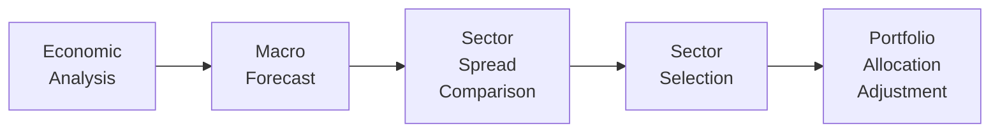

## Introduction
So, let’s talk about sector rotation and security selection in fixed income portfolios. When I was first studying bonds (and trust me, I was super overwhelmed back then), I remember thinking: “Wait, I need to pick sectors? Don’t I just pick a bond and hold it?” Well, it turns out that, just like in equities, rotating among different bond sectors and then zooming in on the right securities can drive outperformance—especially if you’re dealing with dynamic market conditions. 

Anyway, the idea is to actively shift allocations among Treasuries, corporate bonds, high-yield issues, and even emerging-market debt, depending on where you see macro trends unfolding. Plus, once you pick a sector, you’ve still got to do your homework on which specific bonds or issuers in that sector are most attractive. Whether you’re expecting central banks to tighten policy, or maybe you see an uptick in corporate leverage, sector rotation and security selection let you adapt quickly. Let’s walk through the principles in detail.

## The Rationale Behind Sector Rotation
In fixed income, “sector rotation” typically means you’re moving out of one sector—like, say, high-yield corporates—and into another, such as government bonds or high-grade investment-grade corporates. You do this in anticipation of changes in the economic cycle, central bank policy, or credit spreads.

• Economic Growth Forecasts: During an expansion, you might overweight high-yield bonds because default rates tend to fall when companies have better earnings. On the flip side, if you think a recession is in the cards, you’ll probably seek refuge in safer Treasuries or agency securities.  
• Relative Value: Even if your macro forecast is neutral, different bond sectors can become cheap or expensive at various times. Sometimes, high-yield bonds might offer substantial extra spread compared to investment-grade. Other times, that spread narrows, suggesting less value in staying in high-yield.  
• Monetary Policy: Central bank actions can tilt the yield curve, influence liquidity, and drive investors into or out of certain sectors. If the Fed or ECB is likely to hike rates, shorter-duration or floating-rate instruments may be more appealing.  
• Global Market Sentiment: Sentiment shifts can push capital flows into emerging markets (EM) when risk appetite is high, or out of EM when bad news hits. A sector rotation approach picks up on these cues and shifts accordingly.  

Sector rotation is not just “Oh, let’s buy corporates because we read a headline.” It requires a systematic approach—using economic analysis from, say, yield curve shapes (Chapter 26), growth forecasts (Chapter 4 references to forward rates), and sector-level credit fundamentals (Chapters 18–20 on credit risk).

## Steps in Implementing Sector Rotation
Imagine you’re a portfolio manager. You have a top-down view that interest rates might rise in the next six months, but maybe you foresee stable or mildly improving corporate fundamentals. You’d typically:

• Assess Macro Indicators: Look at GDP growth, inflation data, corporate earnings, default rates, etc.  
• Evaluate Central Bank Policy: Is the Federal Reserve or any other major central bank tightening? Are they in a prolonged pause?  
• Compare Sector Spreads: For instance, measure the spread between Baa-rated corporate yields and Treasuries (the credit spread), or the spread between emerging-market sovereign bonds and US Treasuries.  
• Weigh Sector Risk-Return: High-yield might provide tempting yields, but if you foresee a downturn, the potential jump in defaults can be brutal.  

Once you’ve ranked the sectors based on expected performance, you execute the rotation by adjusting the portfolio weights. For instance, you might reduce your allocation to long-duration Treasuries if you expect yields to rise, and shift some of that capital into short-term corporates or floating-rate notes.

### A Quick Mermaid Diagram
Below is a simple flow diagram illustrating how a fixed income manager might make decisions in a sector rotation process:



The diagram is straightforward: you start with your economic analysis, create a macro forecast, compare spreads across sectors, decide which sectors you want to overweight or underweight, and then adjust portfolio weights accordingly. 

## Security Selection
Let’s say you’ve decided to overweight investment-grade corporate bonds. Great start—but that’s still too broad, right? Now you need to pinpoint which issuers or bond issues look best. This is where credit research and selection come into play.

• Credit Metrics: For corporate bonds, net debt/EBITDA, interest coverage ratios, and free cash flow generation are typically key. You might also examine management’s track record of debt usage.  
• Bond Covenants: Some bonds come with protective covenants (e.g., restrictions on additional debt issuance), whereas others do not. These covenants can materially affect default risk.  
• Cash Flow Structure: Step-up bonds, floating-rate notes, or amortizing securities might behave differently depending on the interest rate environment.  
• Issuer-Specific Catalysts: Mergers, acquisitions, spin-offs, or regulatory changes can alter an issuer’s credit profile.  

Let’s keep it a bit informal: In practice, you’d probably have an analyst or a research team that digs into financial statements, attends earnings calls, maybe even visits the company. Once they do the legwork, you rank these bonds relative to their credit spreads. If a bond trades at a wider spread than you believe it’s worth, you might find a buying opportunity. 

### Avoiding Value Traps
In some cases, bonds look cheap for a reason—perhaps the issuer is heading into trouble. (“High yield but even higher headaches,” as a colleague of mine used to say.) That’s the essence of a “value trap.” You see a nice yield premium, but the risk of default or restructuring is so elevated that you could lose more than you gain. Good security selection includes robust stress testing under different scenarios (Chapter 19 on structural models and Chapter 20 on reduced-form models outline ways to gauge default risk probabilities).

## Advanced Techniques
In modern fixed income management, a combined top-down and bottom-up approach is often used:

• Top-Down for Sector Rotation: Start with the big picture. If you expect an economic slowdown, tilt more into safer bonds. If you see robust expansion, consider high-yield or emerging-market debt where yield prospects might be higher (albeit with higher risk).  
• Bottom-Up for Security Selection: Once each sector’s target allocation is set, apply fundamental and quantitative screens to find undervalued bonds.  

### Quantitative Screening
You might feed historical credit spreads, liquidity data, and macro factors into a statistical model that flags potential mispricings. For example, using Python:

```python
import pandas as pd
import numpy as np

# Issuer, Sector, CurrentSpread, HistoricalSpreadAvg, LiquidityScore

bond_data['SpreadDeviation'] = bond_data['CurrentSpread'] - bond_data['HistoricalSpreadAvg']
bond_data['Score'] = bond_data['SpreadDeviation'] / bond_data['LiquidityScore']

# and good liquidity).
undervalued_bonds = bond_data[bond_data['Score'] > 2.0]

print(undervalued_bonds)
```

This simplified snippet might help you quickly identify candidates that appear cheap relative to historical norms, factoring in liquidity constraints. Of course, you’ll still do fundamental research before you pull the trigger.

### Hedging with Derivatives
Sometimes you find an attractively priced corporate bond you want to own, but you’re not sure about the issuer’s idiosyncratic risk. You can hedge part of that risk with a single-name credit default swap (CDS). Similarly, if you have a particular rate view, you could use interest rate futures or swaps to adjust duration without selling the bond. 

Simply put, derivatives can help isolate the exposures you want and reduce the ones you don’t. For example, if you want corporate credit exposure but fear a big move upward in interest rates, you might buy the corporate bond but simultaneously enter an interest rate swap to pay fixed and receive floating. That way, your net interest rate exposure is reduced, while you keep the credit spread.

## Practical Applications in a Vignette Scenario
Imagine your exam vignette describes a scenario where central banks have signaled a potential rate hike cycle, and the yield curve is flattening. Corporate earnings remain solid, but high-yield default rates have edged up a bit:

1. Macroeconomic Outlook: Growth remains moderate, but inflation is ticking upward.  
2. Central Bank Policies: Rate hikes are expected in 3–6 months. Some market participants say the pace of hikes might accelerate.  
3. Corporate Fundamentals: Still healthy, though some companies are warning about margin pressures due to wage growth.  
4. Emerging Markets: Vulnerable to a strong US dollar, but selective opportunities remain.  

Given those conditions, you might propose rotating away from longer-maturity bonds (to reduce duration risk) and possibly lean into shorter-dated investment-grade issues or floating-rate notes. Meanwhile, for specific picks, you might choose corporates in defensive industries (like utilities or consumer staples) that have stable cash flows. On the EM side, you might only allocate to countries with decent foreign currency reserves and stable political climates, hedging currency if necessary.

## Common Pitfalls
• Misreading Macroeconomic Signals: If you incorrectly forecast a recession when the economy is still robust, you might rotate prematurely out of high-yield and miss subsequent gains.  
• Liquidity Risks: Some sectors, like high-yield or emerging-market corporate bonds, can become illiquid in market stress. You could end up stuck with a position at the worst time.  
• Overlooking Bond Structures: A bond’s embedded call or put features can drastically alter its price sensitivity to interest rates. Failing to isolate that effect is a frequent error.  
• Derivatives Mistakes: Hedging is not free. A poorly structured swap or incorrect CDS hedge can erode portfolio returns.

## Best Practices for Sector Rotation and Security Selection
• Maintain a Clear Top-Down Framework: Regularly monitor macro indicators and yield curve movements. Align your rotation with your forecasts.  
• Employ a Robust Bottom-Up Process: Pair financial statement analysis with quantitative screens to validate your selections.  
• Use Stress Testing: Model “what-if” scenarios (e.g., 200 basis points of spread widening, or a sudden drop in liquidity) to see how your picks might fare.  
• Diversify: Avoid concentration in one sector or issuer—even the best forecast can be wrong.  
• Monitor Continuously: The environment can shift quickly, so revisit your sector allocations.  
• Ethical and Professional Standards: Always disclose conflicts of interest and adhere to CFA Institute’s Code of Ethics, especially regarding material nonpublic information in issuer research.

## Conclusion
Sector rotation and security selection in fixed income are crucial tools in a manager’s arsenal. By systematically analyzing macro data and understanding the nuances of credit risk, you can adapt your portfolio to different economic climates. This can mean capitalizing on favorable bond spreads, avoiding default risks during downturns, or simply ensuring that your active management efforts add real value over a passive approach. It requires effort, sure, but the potential payoff in performance—and in risk mitigation—can be well worth it.

## Exam Tips
• Read the Vignette’s Macroeconomic Clues: The exam often sets up item sets with a specific economic outlook. Zero in on those details to guide sector rotation decisions.  
• Watch for Bond-Specific Triggers: Mergers, buybacks, or covenant changes might appear mid-vignette, altering an issuer’s credit outlook.  
• Practice Hedging Strategies: Know how to interpret or value an interest rate swap, or how a CDS can offset credit risk.  
• Time Management: In item set questions, prioritize the data that matter (like spreads, credit ratings, maturity, and yield curve context); skip extraneous fluff.  

## Additional References and Resources
• CFA Institute. (2025). CFA® Program Curriculum, Level II, Volume 6: Fixed Income.  
• Fabozzi, F. J. (2019). Bond Markets, Analysis, and Strategies (9th ed.). Pearson.  
• Collin-Dufresne, P., & Goldstein, R. S. (2001). Do Credit Spreads Reflect Stationary Leverage Ratios? Journal of Finance, 56(5), 1929–1957.  
• Brigo, D., & Mercurio, F. (2006). Interest Rate Models—Theory and Practice (2nd ed.). Springer. (For deeper insights on interest rate models)  
• CFA Institute Code of Ethics and Standards of Professional Conduct.

## Test Your Knowledge: Sector Rotation & Security Selection Quiz



### Which of the following is the primary purpose of sector rotation in fixed income?
- [ ] To identify mispriced individual bonds within a sector
- [x] To shift allocations among different bond categories based on macroeconomic and market forecasts
- [ ] To take advantage of arbitrage opportunities between foreign and domestic bonds
- [ ] To minimize portfolio duration at all times

> **Explanation:** Sector rotation focuses on switching among sectors like Treasuries, corporates, and EM debt when market or macro conditions change.

### In a rising interest rate environment, which sector strategy might a manager most likely pursue?
- [ ] Increase duration by going long on 30-year Treasuries
- [ ] Overweight very long-term high-yield bonds
- [x] Shift to shorter-duration or floating-rate notes
- [ ] Immediately exit all bonds to hold cash only

> **Explanation:** In anticipation of rising rates, managers typically shorten duration or move into floating-rate notes to mitigate interest rate risk.

### What is the primary risk of relying solely on top-down analysis for bond investments?
- [ ] Overdiversification across multiple bond sectors
- [x] Missing key issuer-level risks by not doing detailed credit research
- [ ] Overestimating the impact of central bank statements
- [ ] Spending too much time evaluating bond structures

> **Explanation:** A purely top-down approach overlooks the nuances of individual issuers, potentially leading to undesired default or rating downgrade risk.

### Which of the following best describes a value trap in bond investments?
- [ ] A bond that is fairly valued but offers a low coupon
- [ ] A bond with declining yields in a rising-rate environment
- [ ] A bond that appears overvalued but actually carries hidden risks
- [x] A bond that appears cheap but has a high chance of default or deterioration

> **Explanation:** A value trap is a bond that looks inexpensive due to its high yield, but fundamentals suggest it’s risky and likely to perform poorly.

### When a manager uses a single-name credit default swap (CDS) to hedge part of the credit exposure of a selected bond, the manager aims to:
- [x] Transfer default risk on a specific issuer to the CDS seller
- [ ] Increase the bond’s duration to enhance returns
- [x] Retain sector exposure while minimizing idiosyncratic risk
- [ ] Leverage the bond’s coupon payments for arbitrage gains

> **Explanation:** A CDS allows a manager to hedge default risk of a particular issuer. At the same time, the broader sector exposure may be retained by still holding the bond.  

### A bottom-up approach to security selection typically starts by:
- [x] Evaluating issuer fundamentals and bond covenants
- [ ] Aligning portfolio duration with market interest rates
- [ ] Assessing macroeconomic data
- [ ] Comparing sector-level spreads and forward rates

> **Explanation:** Bottom-up focuses on individual issuers first, looking at credit metrics, covenants, and other issuer-specific factors.

### Which of the following factors is most critical in deciding whether to rotate into an emerging-market debt sector?
- [x] Macroeconomic stability, currency risk, and default risk in target EM countries
- [ ] The availability of zero-coupon bonds within the EM market
- [x] Presence of strong foreign currency reserves and stable political climate
- [ ] Historical correlation between Treasuries and EM debt

> **Explanation:** Investors must carefully consider macro, currency, and sovereign risk profiles for each EM issuer or country.

### If a portfolio manager believes high-yield bonds are too pricey and wants to reduce emerging market exposure, which strategy aligns with that view?
- [x] Underweight high-yield and EM debt, overweight Treasuries or high-grade corporates
- [ ] Overweight high-yield, but maintain EM exposure
- [ ] Overweight only emerging-market corporate bonds
- [ ] Sell all corporates and only buy long-dated Treasuries

> **Explanation:** If you believe high-yield and EM are overvalued, it’s logical to reduce or underweight exposure to those sectors while rotating into safer or more attractively priced sectors.

### What is the main advantage of using quantitative models for bond security screening?
- [x] They can rapidly identify potential mispricing across thousands of issuers
- [ ] They eliminate the need for qualitative credit analysis
- [ ] They reduce liquidity risk by offering better spread estimates
- [ ] They guarantee outperformance when used consistently

> **Explanation:** Quantitative models process large data sets to flag potential mispricing, but they still require careful fundamental validation.

### True or False: Derivatives can be used to isolate certain risks and hedge unwanted exposures in a fixed income portfolio.
- [x] True
- [ ] False

> **Explanation:** Instruments like interest rate swaps and credit default swaps can separate interest rate or default risk from the desired market exposure.


