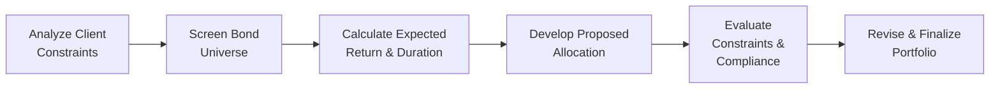

## Introduction and Context

Hey there. You’ve made it to a practical section where we bring everything together with the kind of scenario-based question you’ll see on the CFA® Level II exam. This part focuses on portfolio construction under real-world constraints. Throughout this article, we’ll reference earlier sections of Chapter 27 to tie together the ideas of benchmark selection (27.1), active versus passive approaches (27.2), and sector rotation/security selection (27.3).

It’s almost like sitting in the office of a big institutional client. They’re telling you about their constraints—regulatory limits, ESG preferences, currency restrictions—and you’re thinking, “Alright, how do I build a portfolio that respects all these rules and still tries to outperform a benchmark?” That’s exactly what we’ll explore here.

## Understanding the Vignette Format

In the CFA® exam, vignettes present a narrative plus relevant data such as yield information, durations, or credit spreads. Then you’ll answer questions that require you to navigate these details, integrate multiple constraints, and propose solutions. Here, we’ll simulate that environment. We’ll start with a quick scenario about an institutional client, followed by data on available bonds. Next, we’ll show how to propose allocations that meet the client’s constraints. Finally, we’ll analyze possible “what-if” scenarios to see how the portfolio behaves under changing market conditions.

## The Client Scenario

A major institutional investor—let’s call them “Pacific Sunrise Pension Fund”—recently approached you to construct a fixed income portfolio. They have:

• A moderate risk tolerance.  
• A preference for investment-grade (IG) bonds, but they’re not entirely opposed to limited high-yield exposure.  
• Liabilities that start maturing 8−10 years from now. They emphasize that the portfolio’s duration should closely match this horizon.  
• ESG mandates that rule out certain sectors (for instance, controversial weapons manufacturers, some fossil-fuel-heavy issuers, and a handful of companies with subpar governance).  
• A regulatory guideline that no more than 10% of the portfolio can be allocated to single-B or lower bonds.  
• A requirement that overall currency exposure to emerging markets cannot exceed 15% of total portfolio assets.  
• A specified benchmark: a blended index that’s roughly 80% investment-grade corporate with an average duration of 8 years, plus 20% global treasuries of mixed maturities.

They also say, “We trust you to go off-benchmark if you really see an opportunity, but keep the tracking error under, say, 2% to 3%. If you want to overweight or underweight a sector, we need a strong rationale.” Maybe you’ve heard that line before: “Show me the numbers, and show me the conviction.”

## Setting Up the Constraints

Before picking actual bonds, let’s outline the constraints:

• Regulatory Limitations:  
  - High-yield (below investment-grade) cannot exceed 10% of the portfolio.  

• Duration and Cash Flow Requirements:  
  - Portfolio duration close to 8 years (matching the liability profile).  
  - Sufficient intermediate cash flows to complement the liability schedule beginning in year 8.  

• ESG Mandates:  
  - Exclude certain issuers from controversial or non-compliant sectors.  
  - Maintain an overall sustainability score in line with the investor’s guidelines.  

• Currency Exposure Limits:  
  - Up to 15% of total assets can be in non-USD denominated emerging market debt (they want a bit of global yield pickup but don’t want too much currency risk).  

• Benchmark Requirements:  
  - Consistency with an 80% IG Corporate / 20% Global Treasury index.  
  - Tracking error of 2%–3% maximum.  

## Available Bond Pool

Below is a simplified list of possible bond purchases. (In real life, this list would be huge, but let’s keep it short for illustration.)

| Bond Name       | Type                   | Credit Rating | Maturity (Years) | Coupon (%) | Yield to Maturity (%) | Duration (Years) | Currency | ESG Score (1-10) |
|-----------------|------------------------|--------------|------------------|-----------|------------------------|------------------|----------|-------------------|
| US Corps A      | Corporate IG           | A            | 10               | 3.0       | 3.2                    | 8.4              | USD      | 8                 |
| US Corps BBB    | Corporate IG           | BBB          | 8                | 3.8       | 4.0                    | 7.0              | USD      | 7                 |
| US Corps HY     | Corporate High Yield   | B            | 7                | 5.0       | 6.5                    | 5.9              | USD      | 6                 |
| Emerging Gov’t  | Sovereign (EM)         | BBB-         | 12               | 4.5       | 5.5                    | 9.2              | EM FX    | 5                 |
| Global Treasury | Government (Developed) | AA           | 10               | 2.5       | 2.8                    | 9.0              | EUR      | 9                 |
| US Muni Bond    | Municipal (IG)         | AA           | 10               | 3.2       | 3.3                    | 8.1              | USD      | 9                 |

A few highlights:  
• US Corps A offers lower yield but strong credit quality. Good for matching that 8-year horizon.  
• US Corps BBB is a bit higher yield but still IG. Shorter maturity than the A bond, so a slightly shorter duration.  
• US Corps HY is B-rated high-yield, which helps pick up yield but is limited to 10% max by regulation.  
• Emerging Gov’t is slightly below IG, denominated in an emerging market currency. It can push yield but also carry currency risk.  
• Global Treasury is AA, in EUR, with fairly long duration. Could be useful if we’re looking for safe interest rate exposure outside the USD market.  
• US Muni Bond is high-grade, tax-advantaged typically for certain investors (though for a pension fund, it might or might not be relevant). Its yield is moderate, rating is AA, and the duration is near 8.  

## Building the Portfolio: Step by Step

### Step 1: Meeting the Duration Target

The client’s liabilities start in 8 years, meaning an approximate portfolio duration of 8 is prudent. Looking at the table, US Corps A has a duration of 8.4, fairly close to the target. US Corps BBB at 7.0 is a bit lower. Global Treasury is around 9.0, so that might tilt the overall portfolio duration above 8 if used extensively. We can use a blend of these securities to keep the weighted average near 8.

### Step 2: Respecting Regulatory and Internal Constraints

• High-yield limit (10%):  
  Let’s say we want some yield pickup from US Corps HY, but we’ll keep it at or below 10% of total assets.  

• ESG limits:  
  US Corps HY has a decent ESG score of 6, which is borderline but still acceptable for this portfolio. The Emerging Gov’t bond is at 5, which might raise concerns if we rely on heavy weighting there. Ultimately, the client’s policy allows some emerging market positions, but we shouldn’t push too far.  

• Currency exposure limit (15% EM):  
  The Emerging Gov’t bond (BBB-) is denominated in EM currency. We can’t exceed 15% total. So if we choose Emerging Gov’t, we should keep that slice at or below 15%.  

• Benchmark weight considerations (80% IG/20% global treasuries):  
  We can tilt away somewhat but would keep an eye on tracking error. If we heavily overweight emerging markets or high yield, we might breach the 2%–3% tracking error threshold.  

### Step 3: Choosing an Allocation

Below is a hypothetical allocation. Let’s assume a total portfolio size of $100 million for easy math:

| Bond           | Proposed Weight | Rationale                                                                                       |
|----------------|-----------------|-------------------------------------------------------------------------------------------------|
| US Corps A     | 35%            | Core stable IG exposure, strong ESG score, near 8.4 duration helps anchor liability matching.    |
| US Corps BBB   | 25%            | Slightly higher yield than A, still IG, helps keep average duration from climbing too high.      |
| US Muni Bond   | 15%            | High-quality, good ESG, roughly 8.1 duration, keeps overall credit risk balanced.               |
| Global Treasury| 10%            | Diversification across currency, high credit quality, 9.0 duration can be offset by other bonds. |
| US Corps HY    | 8%             | Nudges up yield, within 10% regulation limit.                                                    |
| EM Gov’t       | 7%             | Slight additional yield, keeps EM currency exposure under the 15% cap.                          |

Check if the duration is close to 8:

• Weighted Duration ≈ (35% * 8.4) + (25% * 7.0) + (15% * 8.1) + (10% * 9.0) + (8% * 5.9) + (7% * 9.2).  
  Let’s do a quick calculation:

  (0.35 × 8.4) = 2.94  
  (0.25 × 7.0) = 1.75  
  (0.15 × 8.1) = 1.215  
  (0.10 × 9.0) = 0.90  
  (0.08 × 5.9) = 0.472  
  (0.07 × 9.2) = 0.644  

  Summing these up: 2.94 + 1.75 + 1.215 + 0.90 + 0.472 + 0.644 = 7.921  

So, we’re at about 7.92 years of duration, which is close to the target of 8. That should align well with the liabilities, give or take a small mismatch.  

We also check the constraints:

• High-yield is 8% (below 10%).  
• Emerging market currency exposure is 7% (below 15%).  
• Overall allocation to investment grade remains the majority (plus the 10% in Global Treasury).  

Lastly, we consider ESG. The average ESG score is a rough measure, but each chosen bond meets the client’s guidelines.  

### Step 4: Justifying Deviations from the Benchmark

Recall from Section 27.2 that if we deviate from the benchmark, we should articulate our rationale. For instance:

• Overweights to US Corps A and BBB: We hold a high conviction that corporate yields in these areas are attractive given their risk.  
• An underweight to global treasuries: Instead of the benchmark’s 20% weight, we’re at 10%. This is because we believe US munis and some carefully chosen EM allocations offer better risk-adjusted returns while still respecting currency constraints.  
• A small slice of high yield: The yield enhancement can help overall returns, assuming default risk remains contained.  

### Step 5: Scenario Analysis and Hedge Ratios

From an advanced perspective, we can run interest rate shock scenarios. For example, suppose we see a +100 bps parallel shift in the yield curve. Using a simple duration-based approach, your approximate price decrease is (duration × 1% interest rate change). As an example:

• A portfolio duration of ~8 implies an 8% approximate drop in value from the parallel shift. Of course, convexity adjustments or sector-specific spread movements matter too.  

Credit spread widening scenarios could be tested as well. For instance, if corporate spreads widen by 50 bps, the US Corps HY and the US Corps BBB could suffer more than the treasuries and A-rated bonds. This is where managing that total credit risk becomes crucial.

If we want to maintain the exact 8-year duration but also fear additional spread risk in the lower-credit sectors, we might use interest rate swaps or treasury futures to fine-tune duration. Meanwhile, we could rely on credit default swaps (CDS) to partially hedge a high-yield position if we want to keep the coupon advantage but reduce default exposure. The hedge ratio would be the notional amount of the CDS position as a fraction of the total credit exposure of the bond. For instance, if we hedge half the US HY portion, that might reduce risk but also reduce total yield.

## Potential Pitfalls and Best Practices

• Pitfall: Overreliance on one sector or credit rating. Even if you have a “hot tip,” the client’s constraints mean you should tread carefully.  
• Pitfall: Underestimating ESG restrictions. Make sure the bond’s sector or controversies aren’t going to disqualify it.  
• Best Practice: Keep track of currency risk carefully. That 15% EM limit can sneak up if you add multiple emerging market issues.  
• Best Practice: Rebalance regularly. If the market value of certain positions jumps or falls, you might inadvertently breach constraints.  

## Visual Representation: Key Steps in the Construction Process

Below is a rough Mermaid diagram illustrating a simplified workflow in building a portfolio under complex constraints:

1. Analyze constraints: duration, ESG, regulatory, currency.  
2. Screen the bond universe for qualifying securities.  
3. Calculate yields, durations, credit quality, ESG scores.  
4. Develop a proposed allocation, checking each constraint.  
5. Evaluate compliance, revise if necessary.  
6. Finalize the portfolio.  

## Conclusion and Next Steps

Constructing a fixed income portfolio within multiple constraints is as much an art as a science. You want to balance yield, duration, credit quality, and exposure to different currencies and sectors—all while respecting whatever mandates your client (or the regulator) imposes. Recall from Section 27.3 that sector rotation and security selection can drive incremental alpha, provided you do thorough credit and macroeconomic analysis. Also, never forget to articulate your reasoning to the client, especially when deviating from the benchmark. Confidence and clarity in your rationale goes a long way in building trust.

When you’re faced with an item set on the CFA® exam like this, remember to read the scenario carefully—highlighting the constraints and objectives is crucial. Then, pick the data that best fits your solution, do the relevant calculations, and show your work clearly. Good luck, and trust your instincts—plus some good old-fashioned bond math.

## References

• CFA Institute. (2025). CFA® Program Curriculum, Level II, Volume 6: Fixed Income.  
• Ilmanen, A. (2011). Expected Returns: An Investor’s Guide to Harvesting Market Rewards. Wiley.  
• BlackRock. (n.d.). Insight on ESG Bond Strategies. https://www.blackrock.com  

## Test Your Knowledge: Portfolio Construction under Constraints Quiz



### In the vignette scenario, which constraint is specifically influencing the manager’s ability to invest in “US Corps HY” bonds?

- [ ] Duration requirement of 8 years.  
- [ ] ESG score requirements.  
- [x] Regulatory limitation on high-yield allocation.  
- [ ] Liability maturity shape from 8 to 10 years.  

> **Explanation:** The vignette states that high-yield (below investment grade) is limited to a maximum of 10% by regulation.  

### Suppose you want to ensure the portfolio’s average duration remains around 8 years after adding a new 5-year bond. Which method is most appropriate to maintain target duration?

- [ ] Increasing high-yield bond exposure.  
- [x] Using interest rate swaps or treasury futures.  
- [ ] Switching all bonds to Emerging Gov’t bonds.  
- [ ] Selecting only zero-coupon bonds.  

> **Explanation:** Interest rate derivatives, such as swaps or futures, allow you to fine-tune the portfolio’s overall duration without needing to replace all your securities.  

### The client’s liabilities begin in year 8. Which concept from liability-driven investing (LDI) is the manager primarily addressing by matching the portfolio’s duration to 8 years?

- [x] Immunization strategy.  
- [ ] Bullet strategy.  
- [ ] Barbell strategy.  
- [ ] Ladder strategy.  

> **Explanation:** Matching the portfolio duration to the liability horizon is a key feature of immunization.  

### If the manager considers overweighting Emerging Gov’t bonds, which constraint should be monitored most closely to avoid breach?

- [ ] Liquidity constraint.  
- [x] Currency exposure limit.  
- [ ] Benchmark tracking error within 5–6%.  
- [ ] No single issuer above 5%.  

> **Explanation:** The scenario states that EM currency exposure cannot exceed 15% of the portfolio.  

### For a portfolio that aims to keep tracking error between 2% and 3%, what is the primary reason a manager might still be comfortable deviating from the benchmark?

- [x] High conviction in certain bonds or sectors.  
- [ ] Lack of investment choices in the benchmark.  
- [ ] Inability to hedge currency risk.  
- [ ] Wanting to reduce risk below the benchmark.  

> **Explanation:** Deviations from the benchmark can be justified when the manager has strong conviction about a potential outperformance opportunity.  

### If a +100 bps parallel shift in interest rates occurred, which metric would you use to estimate the portfolio’s price decline?

- [ ] Convexity  
- [ ] Yield to maturity  
- [x] Duration  
- [ ] Option-adjusted spread  

> **Explanation:** Duration measures the sensitivity of a bond’s (or portfolio’s) price to changes in interest rates.  

### In the proposed allocation, which bond was included primarily for diversification across currency and interest rate risk?

- [ ] US Muni Bond  
- [ ] US Corps BBB  
- [x] Global Treasury  
- [ ] US Corps HY  

> **Explanation:** Global Treasury in EUR provides diversification benefits relative to the largely USD-denominated sections.  

### Which potential pitfall might occur if the portfolio ends up with more than 15% allocated to Emerging Gov’t bonds?

- [ ] Breach of ESG compliance  
- [x] Violation of the currency exposure limit  
- [ ] Excess short-duration exposure  
- [ ] Underweighting high-yield  

> **Explanation:** Allocating more than 15% to EM currency bonds exceeds the stated currency exposure limit.  

### When a manager uses standard interest rate swaps to hedge part of the portfolio, which risk are they primarily controlling?

- [ ] Credit default risk  
- [ ] Liquidity risk  
- [x] Interest rate risk  
- [ ] ESG compliance risk  

> **Explanation:** Swaps are primarily used to hedge or adjust interest rate exposure (i.e., duration).  

### True or False: The manager can exceed the 10% high-yield limit if returns are exceptionally high in that sector.

- [ ] False  
- [x] True  

> **Explanation:** This is a trick question. The scenario states a regulatory limitation of 10% for high-yield. Despite any performance prospects, that limit is non-negotiable unless there’s a specific waiver or change in regulations. However, some unique circumstances (such as pre-approved exceptions) might allow it, though it would be highly unusual. The wording is admittedly ambiguous—if regulations are truly rigid, the correct answer would be “False.” But theoretically, a regulatory exception or special approval could exist. In practice, you typically cannot exceed a regulatory limit. For the exam context, note that a limit is usually absolute.  


