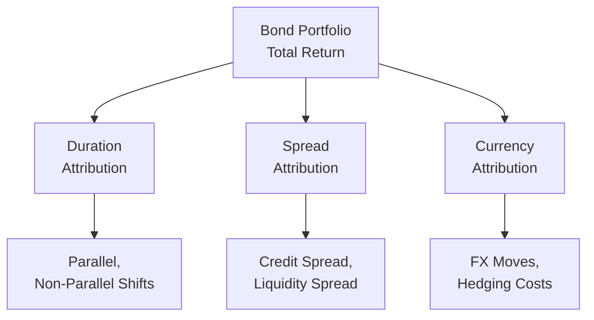

## Introduction and Big-Picture Context

So, you’ve probably heard that bond returns don’t just come from one single source—there’s this interplay of interest rate movements, spread changes, currency fluctuations, and the good old coupon clipping. With equities, you might view total return as capital gains plus dividends. But in fixed income, we generally need more granularity to figure out what’s really driving the performance and whether a portfolio manager’s skill is behind a gain (or loss) or if it was just luck. 

In this section, we’ll explore how to dissect or “attribute” the returns on a fixed income portfolio into the big three categories: duration (interest rate) return, spread return, and currency return. Sometimes you’ll also see folks split out coupon return separately (especially if they want a very detailed breakdown). Let’s see what’s what, and hopefully, by the end, you’ll be able to put on your “performance detective” hat and spot the real drivers behind your portfolio’s results.

## Why Return Attribution Matters

Before we jump into formulas, I want to share a little anecdote. Back in my early days as an analyst, I was asked why our corporate bond portfolio was consistently outperforming the benchmark. I thought, “Well, it must be that we’re picking better bonds!” But when we did a proper return attribution analysis, we realized the outperformance came mostly from a prolonged flattening of the yield curve where we just happened to be heavily tilted towards shorter-duration instruments during a time of rising yields. Sure, it was somewhat of a forecast call, but it wasn’t exactly a genius bond-picking skill. 

Point being, these breakdowns make it clear whether the portfolio’s success (or failure) is a manager skill in sector selection or maybe just broader macro factors like interest rates or currency moves.

## Components of Fixed Income Performance

### Duration (Interest Rate) Return

Duration return, often called interest rate return, is typically the portion of total return simply from changes in the base or benchmark yield curve. If your portfolio is mostly government debt or high-grade credit, the biggest driver might be how rates shift.

• A parallel shift upward in the yield curve generally lowers bond prices (and total returns).  
• A parallel shift downward tends to boost bond prices.  
• Non-parallel shifts (like steepening or flattening) can have more nuanced effects.

Your portfolio duration essentially measures how exposed you are to these yield moves. In Chapter 25 (Measuring Interest Rate Risk), we chatted about Macaulay and Modified Duration, so you can recall that higher duration = more price sensitivity.

We can represent the duration return mathematically. For a small change in interest rates Δy:


\text{Duration Return} \approx -D_{\text{mod}} \times \Delta y


where \\(D_{\text{mod}}\\) is the modified duration. This approximation assumes a small yield change and a linear relationship, though in real life convexity matters too.

But guess what? This interest rate environment might not just shift in a neat, parallel way. That’s why professional managers often use key rate durations (also covered in Chapter 25) to see how much each segment (e.g., the 2-year, 5-year, 10-year part of the curve) contributes to the portfolio’s sensitivity. When you do return attribution, key rate durations can help figure out how performance was affected if, say, the 10-year segment moved 30 basis points while the short end only moved 10 basis points.

### Spread Return

Spread return is the portion of performance arising from changes in the various spreads that your bonds carry above the benchmark rates. If you hold corporate bonds, emerging market debt, or mortgage-backed securities, you know spreads matter—sometimes a whole lot more than the base interest rate. 

Different spread components can include:

• Credit Spread: The extra yield demanded by investors to compensate for a corporate issuer’s default risk, relative to a government benchmark.  
• Liquidity Spread: A premium for less readily traded bonds.  
• Sector Spread: The difference in yields across broad market sectors (e.g., utilities vs. technology).  
• Swap Spread: The difference between swap rates and government bond yields.

If the credit spreads narrow (often because markets are feeling confident, or the issuer’s credit outlook improves), bond prices go up. That helps you, as a bondholder, earn a positive spread return. Conversely, if spreads widen, that portion of your portfolio might take a hit.

Analogous to duration, we can measure a bond’s sensitivity to spread by a measure called spread duration. Spread duration can be conceptually similar to interest rate duration, but specifically for how sensitive a bond is to changes in spreads. So if spreads blow out by 50 basis points, the negative price impact is about:


\text{Spread Return} \approx -D_{\text{spread}} \times \Delta s


where \\(D_{\text{spread}}\\) is the spread duration, and \\(\Delta s\\) is the change in the spread.

### Currency Return

Now, for bonds denominated in foreign currencies, you have an additional risk-and-return factor: exchange rates. Let’s suppose you buy a UK Gilt denominated in GBP while your home currency is USD. If the pound appreciates relative to the dollar, you’ll get some extra return when you convert your coupon or principal back into USD. On the flip side, a strong dollar can wipe out some (or even all) of your bond yield advantage.

Managers can choose to hedge the currency exposure, which can reduce (but not eliminate) your foreign exchange risk. This hedge has a cost, typically related to interest rate differentials or forward points. So overall currency return is:

• The unhedged currency movement.  
• Plus or minus any gains or costs from the hedge.  
• Plus or minus any hedge effectiveness mismatch.

Attribution analysis can show whether that decision to hedge or not, or partial hedging, was beneficial. If you see big currency swings overshadowing your bond returns, you might investigate adjusting your hedge ratios.

### Coupon Return

In many academic or theoretical models, coupon income is that predictable portion of bond returns. Strictly speaking, it’s the easiest part to measure—just total coupon received over the period. Some attribution models just fold coupon in with everything else. Others isolate coupons so you see how much pure “income” contributed versus price changes from rates, spreads, and currency.

If you want a total return equation, you could do something like:


\text{Total Return} 
= \text{Coupon Return} 
+ \text{Duration Return} 
+ \text{Spread Return} 
+ \text{Currency Return}


Different shops have slightly different naming conventions, but the general principle is the same: break down all the sources of return.

## Portfolio vs. Benchmark Comparisons

Typically, the manager’s skill (or the portfolio’s performance) is judged against a reference or benchmark, like the Bloomberg Global Aggregate Index or a specialized index if you’re focusing on a certain credit quality or region. When you do return attribution, you’re comparing:

1) The portfolio’s exposures to duration, spreads, and currency.  
2) The benchmark’s exposures to those same factors (or others, if the benchmark differs).  

By seeing how each factor differs from the benchmark, you can see the effect of active management decisions—like overweighting corporate bonds in a bullish economy or extending duration in a falling rate environment.

Many managers do a top-down decomposition first (macro-level decisions such as overall duration or spread exposure), then a bottom-up approach to see which specific issuers or positions outperformed or underperformed. If they find that half the outperformance came from an overweight in high yield, then they’ll examine which high-yield credits actually did well or poorly.

## Using Key Rate Durations for Attribution

Let’s get a bit deeper into the yield curve’s effect. If you recall from Chapter 25, a partial (or key rate) duration approach helps you measure the effect of shifts at different maturity segments. This can be super helpful for:

• Identifying exactly where your portfolio is taking on the majority of its interest rate risk (short, intermediate, or long maturities).  
• Breaking down performance based on shape changes (steepening or flattening).  

For instance, let’s say we do a partial duration analysis and discover that the bond portfolio has a big exposure in the 5–10 year range. During a period where the yield curve steepens (long end goes up in yield more than the short end), the portfolio might underperform or outperform depending on how precisely we positioned that mid-section of the curve. By attributing that difference to the partial durations, you can see whether the manager was precisely right or got hammered by that particular shape shift.

Below is a small (simplified) sample table that might illustrate partial duration exposure and attributed returns. (Assume just the portfolio vs. benchmark for a given period, and ignore spread/currency for now.)

| Maturity Bucket (Years) | Portfolio Key Rate Duration | Benchmark Key Rate Duration | Yield Move (bps) | Attributed Return Difference (%)  |
|-------------------------|-----------------------------|-----------------------------|-------------------|-----------------------------------|
| 0–2                     | 0.7                         | 0.5                         | +10              | -0.14                             |
| 2–5                     | 1.2                         | 1.0                         | +20              | -0.48                             |
| 5–10                    | 3.5                         | 2.8                         | +15              | -0.39                             |
| 10+                     | 2.0                         | 2.2                         | +5               | +0.10                              |
| **Total**               |                             |                             |                   | **-0.91**                          |

In a rough sense, this table suggests that because the portfolio was slightly “longer” in the 0–2, 2–5, and 5–10 segments compared to the benchmark, it lost more when yields rose in those maturities. The difference in the 10+ segment partially offset the loss. Summing them up gives the net effect of non-parallel yield moves.

## Spread Attribution: Breaking Down the Drivers

Spread attribution gets interesting, especially in corporate or mortgage-backed portfolios. One approach is to break down the overall spread for each bond (or sector) into sub-spreads. For example:

• Sector Spread: The difference between a broad corporate index yield and government yields.  
• Quality Spread: The gap between AAA and BBB, for instance.  
• Idiosyncratic Issuer Spread: The piece that’s unique to one company’s fundamental risk.  

In practice, you might see more advanced breakdowns if you’re dealing with many industries or structured products. The general idea is to identify how much of your performance came from a broad-based rally in corporate spreads (maybe driven by overall market sentiment) versus your picking specific undervalued bonds in the energy sector that outperformed.

You might have a structure like:


\text{Spread Return} = \text{Sector Spread Return} 
+ \text{Issuer Selection Return} 
+ \text{Residual / Interaction Terms.}


Yes, the math can look messy. But at the end of the day, you want a clean story to tell your investors or your CFO: “We added 30 basis points of alpha by overweighting AAA industrials that tightened significantly due to improved corporate earnings.”

## Currency Attribution and Hedging Effectiveness

Some of you might recall from Chapter 29 (Global Bonds and Currency Risk) that currency can overshadow everything when you hold foreign bonds. The simplest approach is to measure the total foreign exchange movement in the period and see how it affected your returns. Then you compare that to your benchmark’s currency exposure. 

If you hedged your currency exposure, you also want to measure:

• The cost of buying forward contracts or currency swaps.  
• Any residual difference between your actual currency returns and the “ideal” fully hedged scenario.  

Sometimes, an incomplete hedge or an inefficient hedge can cause small mismatches. If your portfolio’s currency “gain” from a partial unhedged position is large, was that due to your specific forecast that, say, the euro would appreciate? Or was it random good luck? That’s exactly what currency attribution tries to clarify.

### A Quick Mermaid Diagram of Return Attribution

Below is a simple diagram that shows how total return gets broken down into each factor. It’s not fancy, but hopefully it helps visually:

## Hedging Strategies and the Cost-Benefit Dimension

Managers can hedge duration (using interest rate futures, swaps, or options), spreads (to a lesser degree, often via credit derivatives), or currency (forward contracts, currency options, cross-currency swaps). Whenever you see a big chunk of your portfolio’s outperformance or underperformance attributed to currency, you might want to evaluate hedging. But hedging typically has a cost, and you can’t guarantee that cost is trivial.

In a low-rate environment, the cost of hedging might be relatively small if interest rates are near parity. However, large interest rate differentials can make hedging expensive. That’s why, for instance, some managers prefer partial hedges to reduce volatility without fully eliminating currency risk.

## Top-Down vs. Bottom-Up Attribution

A top-down analysis starts with broad exposures:

• Duration positioning relative to a government yield curve.  
• Aggregate spread exposure relative to an index’s typical spread.  
• Overall currency weighting.  

Then, if you want more detail, you do a bottom-up approach looking at each bond or sector in the portfolio to see exactly how it performed relative to the relevant benchmark component. This can be quite data-intensive, but it provides deeper insights. In real life, big asset managers might have proprietary systems that crunch all these numbers daily or weekly, slicing and dicing the portfolio’s performance from every angle.

## Stress Testing and Scenario Analysis

Sometimes, you don’t just want to know how your portfolio performed historically—you want to see how it might perform under stressful conditions. This is where scenario analysis ties in nicely with return attribution. You can run hypothetical shifts: “What if the yield curve flattens by 50 basis points, spreads blow out by 30 basis points, and the yen depreciates 5%?” Then you see how each factor in your portfolio would respond, using your partial durations for both rates and spreads, plus your currency exposure. 

If your stress test reveals that a big chunk of your outperformance might vanish in a risk-off environment, that’s a clue you might want to rebalance exposures before volatility hits. Or if you see that you’re significantly leveraged to a certain currency move, maybe you’d reexamine your hedge ratio.

## Common Pitfalls

• Ignoring Convexity: Relying solely on a linear approximation for big yield moves can cause attribution errors. Proper return attribution might require adjusting for convexity.  
• Double Counting Effects: Spread and interest rate changes can interact, especially for lower-rated bonds.  
• Overcomplicating the Model: You can keep subdividing returns into narrower slices, but eventually, you get diminishing returns in practical terms.  
• Hedge Slippage: If your currency hedge ratio changes during the period or you roll forward contracts at different times, it can complicate your currency attribution significantly.  
• Biased Benchmark: If the benchmark has different characteristics (like average maturity, sector weighting, or credit quality), you’ll have to account for those differences before you blame or praise the manager too much.

## Putting It All Together

When done carefully, return attribution tells a compelling story: “Okay, we outperformed by 50 basis points. About 20 came from yield curve positioning (we were shorter duration in a rising rate environment), 15 came from overweight in corporate spreads (especially in the energy sector), and 15 from favorable currency moves that we partially anticipated. Our coupon income was in line with the benchmark’s yield to maturity.” 

That’s the sort of clarity you want. Investors appreciate it, and it helps managers refine their approach.

## Final Thoughts

Anyway, I remember the first time I saw a return attribution report with color-coded bars for each factor. It was a “lightbulb moment.” You could literally see how the multi-dimensional bond factors each contributed. If you’re studying for the CFA exam, definitely practice walking through hypothetical scenario vignettes where you have partial durations, spread durations, currency exposures, and you break down how each piece changes. “Yes, the yield curve steepened, so that portion of the portfolio lost value. However, credit conditions improved, so we gained on spread narrowing.” 

Once you get comfortable with this, you’ll be able to handle real portfolio analytics tasks more confidently—and hopefully pass your exams in the process.

## References and Further Reading

• CFA Institute Level II Curriculum, Fixed Income Readings (Performance Evaluation sections).  
• Fabozzi, F. J. (Ed.). (2021). Fixed Income Analysis. CFA Institute Investment Series.  
• “Fixed Income Attribution: A Guide to Best Practices.” Barclays Research White Paper.  
• “Currency Management in Fixed Income Portfolios” by JPMorgan Asset Management.

---

## Practice Questions on Return Attribution in Fixed Income



### Which of the following best describes duration return in a fixed income portfolio?

- [ ] The part of return that comes from currency rate fluctuations.
- [x] The part of return arising from changes in the underlying yield curve or interest rate environment.
- [ ] The part of return directly attributable to changes in credit spreads.
- [ ] The portion of return associated with expected default risk on the bond.

> **Explanation:** Duration return (or interest rate return) is specifically related to changes in the base yield curve or the benchmark interest rate environment.

### In a key rate duration approach, which of the following yield curve movements would have the greatest impact on a bond with heavy exposure in the 5- to 7-year range?

- [ ] A 25-basis-point move in the 30-year sector only.
- [ ] An isolated 10-basis-point move in the 2-year sector.
- [x] A 20-basis-point move centered around the 5-year point.
- [ ] A parallel shift of 5 basis points across all maturities.

> **Explanation:** Key rate duration isolates specific maturities. A movement around the 5-year point would most impact a bond with heavy exposure in that segment.

### You are analyzing a corporate bond portfolio that appears to be outperforming its benchmark. Which factor in spread attribution is most likely responsible if the portfolio’s energy holdings tightened by 40 bps while the benchmark’s energy component remained stable?

- [ ] A shift in the overall yield curve.
- [ ] Global currency appreciation.
- [x] An idiosyncratic issuer or sector spread change.
- [ ] A broad-based equity market rally.

> **Explanation:** When energy sector spreads tighten substantially more than the benchmark’s equivalent holdings, the outperformance likely stems from idiosyncratic spread changes specific to that sector or those issuers.

### In evaluating currency returns, which statement is most accurate for a fully hedged foreign bond position?

- [ ] There is zero possibility of currency-related gains or losses.
- [x] Hedge costs or gains can still create a net currency impact on returns.
- [ ] A fully hedged portfolio consistently outperforms an unhedged portfolio.
- [ ] Full hedging always reduces the overall volatility to zero.

> **Explanation:** Even a “fully hedged” position may realize gains or losses based on interest rate differentials, forward premium/discount, and transaction costs. No hedge is entirely cost- or volatility-free.

### When dissecting fixed income performance, which component is defined primarily by the investor’s receipt of scheduled coupon payments?

- [ ] Currency return
- [ ] Spread return
- [ ] Duration return
- [x] Coupon return

> **Explanation:** Coupon return is the income component from periodic interest payments made by the bond.

### If a bond manager wants to isolate the effect of different maturity buckets on portfolio returns due to non-parallel yield curve movements, they are most likely to use:

- [ ] A single measure of effective duration for the entire portfolio.
- [ ] Regression analysis with overall yield changes.
- [x] Key rate duration analysis.
- [ ] Only a price-to-earnings ratio method.

> **Explanation:** Key rate duration analysis allows the portfolio manager to attribute part of the performance to shifts at specific points on the yield curve.

### Which of the following best captures “spread duration”?

- [ ] The bond’s sensitivity to parallel shifts in the benchmark yield curve.
- [x] The bond’s sensitivity to changes in the credit or swap spread.
- [ ] The bond’s exposure to foreign exchange movements.
- [ ] The measure of shape changes in the yield curve.

> **Explanation:** Spread duration measures how sensitive a bond’s price is to changes in credit or other non-treasury spread factors.

### In a top-down approach to fixed income attribution, a primary focus is:

- [x] Broad exposures such as overall duration, overall credit quality, and currency weights.
- [ ] Tiny nuances in the credit risk of individual issuers.
- [ ] Perfectly timing each bond’s coupon payment dates.
- [ ] Analyzing only unsuccessful investment decisions.

> **Explanation:** A top-down approach first looks at larger, macro-level allocations (duration, spreads, currency weights, etc.) rather than individual bond selection details.

### Manager A and Manager B both have foreign bond portfolios with similar average maturities and credit quality. Manager A hedged 50% of the currency exposure, while Manager B remained fully unhedged. If the foreign currency significantly depreciates, the most likely outcome is:

- [x] Manager A experiences less negative currency return compared to Manager B.
- [ ] Manager A experiences more negative currency return compared to Manager B.
- [ ] Both managers experience the same currency return.
- [ ] Manager B experiences zero currency impact.

> **Explanation:** A partial hedge (50%) will mitigate some of the exchange rate losses, so Manager A will be less negatively impacted than Manager B, who is fully exposed to the depreciation.

### True or False: Stress testing in performance attribution is only backward-looking and does not consider hypothetical scenarios.

- [ ] True
- [x] False

> **Explanation:** Stress testing can and often does use forward-looking or hypothetical scenarios to see how the portfolio might perform under various adverse (or positive) conditions.


