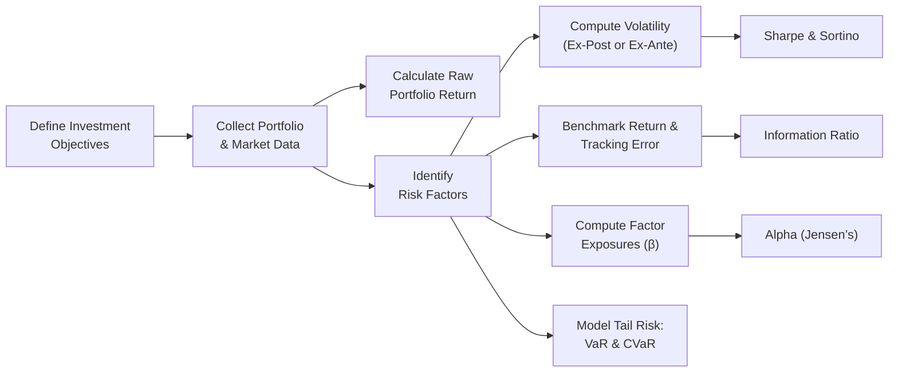

## Understanding the Need for Risk-Adjusted Performance Measurement

It’s happened to me more than once: I’ve run into investors who get super-excited when they see a fixed income portfolio returning a comfortable 8% per year, only to find out later that the manager had taken on huge interest rate risk or was heavily concentrated in low-credit-quality bonds. That’s where risk-adjusted metrics come in. They help us figure out how much “bang for our buck” we’re getting in returns relative to the amount of risk we’re shouldering.

Unlike raw returns, which say little about risk levels, risk-adjusted measures offer a clearer perspective on whether a portfolio is truly delivering “skillful” returns or just piling on leverage or venturing into high-yield corners of the bond universe. For instance, a bond portfolio might look stable—until you realize illiquid or thinly traded securities hide actual price volatility, or that the manager is quietly using derivatives that amplify the portfolio’s exposure to credit spreads. These complexities are precisely why risk-adjusted measures exist.

## Sharpe Ratio

One of the most widespread risk-adjusted performance metrics (and a personal favorite for quick, back-of-the-envelope comparisons) is the Sharpe Ratio. It’s formally defined as:


\text{Sharpe Ratio} = \frac{ R_p - R_f }{ \sigma_p },


where:  
• \\( R_p \\) = portfolio return  
• \\( R_f \\) = risk-free rate  
• \\( \sigma_p \\) = standard deviation (volatility) of the portfolio’s excess return  

The interpretation is: how much excess return per unit of total risk is the portfolio delivering? That’s helpful, but there are a few pitfalls:

• The Sharpe Ratio penalizes both upside and downside volatility equally, even though, in real life, we’re typically more worried about downside risk.  
• In illiquid fixed income markets, price quotes might not move daily (or even weekly), artificially compressing the measured volatility and inflating the Sharpe Ratio.  

Despite these drawbacks, the Sharpe Ratio remains a valuable first stop. It’s most insightful when comparing portfolios or funds that share comparable mandates—like two core bond funds or two global fixed income funds—rather than, say, a short-duration Treasury fund vs. a high-yield emerging market bond fund.

### A Quick Example

Imagine we have a bond portfolio earning 6% annually over the risk-free rate of 2%. If the portfolio’s standard deviation (annualized) is 4%, then:


\text{Sharpe} = \frac{6\% - 2\%}{4\%} = 1.0


A Sharpe Ratio of 1.0 tells us that the portfolio generates one unit of excess return for every unit of risk. If another portfolio has the same 6% return but a standard deviation of 6%, its Sharpe Ratio would be approximately 0.67—indicating less efficiency from a risk perspective.

## Sortino Ratio

If you’re more concerned about downside risk (which is often the case with fixed income portfolios—nobody likes default risk or severe drawdowns), the Sortino Ratio can be a better measure. Instead of penalizing both upside and downside volatility, it focuses only on downside deviation. Mathematically:


\text{Sortino Ratio} = \frac{R_p - R_{\text{MAR}}}{\sigma_{\text{downside}}},


where \\( R_{\text{MAR}} \\) is the minimum acceptable return (often set to the risk-free rate or zero), and \\(\sigma_{\text{downside}}\\) is the standard deviation of negative returns only.

### Why It Matters for Fixed Income

Say you’re running a portfolio of investment-grade bonds but you worry about big drawdowns during periods of rapid rate hikes or credit spread widening. The Sortino Ratio can help by zooming in on those “bad times,” ignoring the seemingly benign upside variance. This approach can offer a more realistic sense of how the manager handles crisis periods.

However, the Sortino Ratio (like any ratio) can be influenced by how frequently we measure returns (daily, weekly, monthly) and by how we define “downside.” Plus, if illiquidity or infrequent trading masks actual volatility, we might still get an overoptimistic ratio.

## Information Ratio

Fixed income managers often target outperformance relative to a specific benchmark, such as the Bloomberg U.S. Aggregate Bond Index or some custom government/corporate blend. The Information Ratio (IR) is key here:


\text{Information Ratio} = \frac{ \text{Portfolio Return} - \text{Benchmark Return} }{ \text{Tracking Error} },


where tracking error reflects the standard deviation of the difference between portfolio returns and benchmark returns.

### Interpreting the IR

• A positive IR indicates that the portfolio is consistently outperforming the benchmark on a risk-adjusted basis.  
• A negative IR suggests that, relative to its active risk (i.e., deviation from the benchmark), the portfolio is underperforming.  

For fixed income, ex-ante tracking error might factor in durations, yield curve mismatch, or sector tilts. For instance, a manager could intentionally overweight corporate bonds within the index to capture favorable spreads. If everything goes well, you might see a higher IR. But if credit spreads blow up, the outperformance can vanish quickly.

## Alpha (Jensen’s Alpha)

When you hear someone say, “This manager’s alpha is 2%,” they’re usually referencing Jensen’s Alpha from the Capital Asset Pricing Model (CAPM) or a similar risk model. In simplified form:


\alpha = R_p - [R_f + \beta_p (R_m - R_f)],


where \\( \beta_p \\) is the sensitivity of the portfolio to the market (or a relevant factor set), and \\( R_m \\) is the market (or broad index) return.

### Why It’s Useful

• Measures how much the portfolio outperformed or underperformed after accounting for market-related or factor-related risk.  
• In a multi-factor fixed income model, you might incorporate separate betas for interest rate risk, credit spread risk, and potentially currency risk.  

In practice, you might see an alpha calculation that includes multiple risk factors—especially relevant for global and corporate bond strategies. Positive alpha suggests the manager is adding value beyond what traditional risk factors (duration, spreads, etc.) can explain.

## Ex-Ante vs. Ex-Post Analysis

### Ex-Ante (Forward-Looking)

Managers often forecast volatility, tracking error, or even expected shortfall to anticipate how their strategy might perform under future market conditions. In fixed income, we might incorporate:

• Projected interest rate fluctuations  
• Assumed correlation among bond sectors  
• Potential moves in credit spreads or default rates  

A well-prepared ex-ante analysis might say something like, “We expect to earn an alpha of 1% with a tracking error of 2%,” which implies an Information Ratio around 0.50. Just be mindful forecasts can be wrong—especially in volatile markets where interest rate or credit spread dynamics can shift rapidly.

### Ex-Post (Historical Records)

Ex-post measures use historical returns and realized volatility. They’re often more reliable snapshots of what actually happened. On the flip side, ex-post results are backward-looking. A bond portfolio that performed brilliantly in a declining interest rate environment might not fare as well if rates start climbing.

## Factor-Based Perspectives

Modern fixed income analysis often breaks a portfolio down into factors like:

• Interest Rate (duration or curve positioning)  
• Credit Spreads (corporate, high-yield, EM, etc.)  
• Liquidity (how tradable are the assets?)  
• Currency (for non-domestic portfolios)  

Evaluating your risk-adjusted performance by factor might reveal that your strong returns mainly came from a big bet on tightening credit spreads, rather than a truly diversified approach. If you can isolate each factor’s contribution to returns, you can see how much risk you’re taking along specific dimensions—and measure whether that risk-taking has been truly rewarded.

## Handling Illiquidity and Trading Frequency

In some corners of the bond market—especially emerging markets or specialized securitized products—there’s a risk that “stale” prices can understate volatility. Suppose your thinly traded fixed-rate municipal bonds are quoted only once a month, or your distressed bonds rarely trade hands. You might record a smooth performance line with minimal perceived risk, but in reality, if forced to sell in a hurry, you’d likely face a big discount.

It’s worth acknowledging that standard deviation- and tracking error-based metrics might not fully capture this hidden risk. A best practice is to supplement these measures with “liquidity scoring” or to compare the portfolio’s mark-to-market price volatility with a hypothetical scenario where faced with large redemption requests.

## VaR and Expected Shortfall (CVaR)

### Value at Risk (VaR)

Value at Risk attempts to estimate the maximum expected loss over a given period at a certain confidence level. For example, a 1-day 99% VaR of \$1 million means there’s only a 1% chance the portfolio will lose more than \$1 million in a single day. However, VaR:

• May fail to capture extremely low-probability, high-severity events (the famous “black swan” scenario).  
• Can be unstable and highly sensitive to the assumptions used (historical vs. parametric vs. Monte Carlo approaches).  

### Expected Shortfall (CVaR)

CVaR (Conditional Value at Risk) looks beyond the VaR cutoff to estimate the average loss in the worst-case scenarios. If VaR is the “fence,” CVaR is the “view over the fence,” focusing on how bad things can get once you’ve crossed the VaR threshold. It’s a more robust tail-risk measure, particularly relevant in stressed credit spread environments.

For a bond portfolio heavily exposed to stress events—like a spike in defaults—CVaR can reveal potential catastrophic losses. Yet, keep in mind even CVaR depends on the accuracy of your underlying risk model and correlations. The best approach is to combine these metrics with scenario analysis to see how your portfolio might behave if, say, credit spreads unexpectedly widen or interest rates climb by 200 basis points.

## Combining Multiple Metrics

Let’s face it, no single metric holds all the answers. Here’s a quick summary chart:

| Metric             | Focus                 | Key Formula / Component                          | Pros                                         | Cons                                                |
|--------------------|-----------------------|--------------------------------------------------|----------------------------------------------|-----------------------------------------------------|
| Sharpe Ratio       | Total Volatility      | (R_p – R_f) / σ_p                                | Easy to understand.<br/>Widely used.         | Penalizes all volatility equally.                   |
| Sortino Ratio      | Downside Volatility   | (R_p – R_f) / Downside Deviation                | Focuses on downside risk.<br/>More relevant for safety-seeking investors. | Sensitive to how “downside” is defined.              |
| Information Ratio  | Benchmark Comparison  | (R_p – R_b) / Tracking Error                    | Great for measuring active management.       | Benchmark selection can skew results.               |
| Alpha (Jensen’s)   | Outperformance Above Factor Model | R_p – [R_f + β(R_m – R_f)]           | Isolates manager skill beyond market risk.   | Requires robust model, often simplified in practice.|
| VaR                | Tail Risk             | Probabilistic measure of worst-case losses       | Straightforward risk limit.                  | Doesn’t capture magnitude of losses beyond VaR.     |
| CVaR (Expected Shortfall) | Extreme Tail  | Average loss beyond VaR                          | More complete tail view than VaR.            | Still reliant on assumptions and data.              |

In practice—especially for complex fixed income portfolios that might hold MBS, CLOs, or derivatives—managers frequently employ a combination of these measures. A manager might:

• Use the Sharpe Ratio for a broad snapshot of efficiency.  
• Track an ex-post Information Ratio to ensure actual performance is in line with the intended strategy vs. the benchmark.  
• Keep an eye on VaR or CVaR to manage tail risk or potential blowups.  
• Monitor alpha to see whether the manager is adding skill-based returns or just riding the market tide.

## Helpful Mermaid Diagram

Below is a simple flow diagram that shows how these risk-adjusted metrics fit into an overall performance-evaluation process for a fixed income portfolio:



## Practical Example and Small Python Snippet

Let’s say you have monthly return data for a bond portfolio and the risk-free rate, and you want to estimate the Sharpe Ratio:

Example:  
• Monthly portfolio returns: [0.5%, 0.2%, –0.1%, 0.6%, …]  
• Monthly risk-free rate: 0.1% overall (annual risk-free ~1.2%)  

In Python, you might do something like:

```python
import numpy as np

portfolio_returns = np.array([0.005, 0.002, -0.001, 0.006, 0.003, -0.002, 0.004, 0.005, 0.009, 0.002])  # example monthly
rf_monthly = 0.001  # approximate monthly risk-free

excess_returns = portfolio_returns - rf_monthly
sharpe_ratio = (np.mean(excess_returns) / np.std(excess_returns)) * np.sqrt(12)  # annualize
print("Annualized Sharpe Ratio:", sharpe_ratio)
```

Here we annualize by multiplying by \\(\sqrt{12}\\) (assuming 12 months). The result might give you a single-number snapshot of risk-adjusted performance. Of course, you’d adapt or refine for your precise data set, including monthly updates or rolling windows.

## Manager Skill: Beyond the Numeric Ratios

Finally, to evaluate a manager’s skill, you can’t rely solely on a single ratio. You might ask questions like:

• How much of the manager’s “outperformance” is due to a concentrated bet on high-yield corporate debt?  
• Is the portfolio robust against recessions or rate hikes?  
• Does the manager have a disciplined process for controlling tail risk?  

Sometimes, we also look at performance in stress periods or re-check the results over multiple market cycles. A manager might do great in a stable or falling-rate environment but underperform drastically when the Federal Reserve tightens monetary policy.

## Best Practices and Pitfalls

• Combine Metrics: Use Sharpe, Sortino, Information Ratio, alpha, and some tail risk measures.  
• Keep Time Horizons Consistent: Short data windows can create spurious Sharpe or Information Ratios.  
• Don’t Ignore Liquidity: Thinly traded instruments can superficially boost your ratio.  
• Watch Benchmark Alignment: The “correct” benchmark matters for valid IR calculation and for alpha attribution.  
• Stress Test: Rely on scenario analyses to see how your results shift in extreme scenarios.  

## Exam Tips

• You might see an item set description of a bond portfolio’s historical returns, risk-free rate, and benchmark returns. You’ll likely be asked to compute one or more of these ratios and interpret them.  
• Expect questions about whether the manager truly added active value or if outperformance can be explained by taking large, one-sided bets (e.g., credit risk or yield curve positioning).  
• Always confirm whether the question references ex-ante or ex-post metrics—because the approach to the calculation (or the relevant data set) will differ.  
• Watch for partial data or incomplete returns data in the vignette. In the real exam, they’ll often give you enough clues, but it might not be in an immediately obvious place (like a footnote or a small table).  

## References and Further Reading

- CFA Institute Level II Curriculum, Performance Evaluation in Fixed Income.  
- Grinold, R. C., & Kahn, R. N. (2000). Active Portfolio Management.  
- “Risk-Adjusted Returns: Understanding the Metrics.” Bloomberg Professional Tutorials.  

---

## Practice Questions on Risk-Adjusted Performance Metrics



### Calculating the Sharpe Ratio
A fixed income portfolio has an annual return of 8%, while the risk-free rate is 3%. The portfolio’s annualized standard deviation of excess returns is 5%. What is the portfolio’s Sharpe Ratio?

- [ ] 0.60
- [x] 1.00
- [ ] 1.60
- [ ] 5.00

> **Explanation:** Sharpe Ratio = (8% – 3%) / 5% = 5% / 5% = 1.0.


### Sortino vs. Sharpe
Which statement best captures the difference between the Sortino and Sharpe ratios?

- [ ] Sortino Ratio uses a 12-month rolling window, while Sharpe Ratio uses a short-term daily window.
- [ ] Sortino Ratio is only applicable to equity portfolios, while Sharpe Ratio applies to all assets.
- [x] Sortino Ratio penalizes only downside volatility, while Sharpe Ratio penalizes both upside and downside.
- [ ] Sortino Ratio adds liquidity risk factors explicitly.

> **Explanation:** The key difference is that the Sortino Ratio replaces total volatility with downside volatility.


### Information Ratio
A bond portfolio returns 7%, while its benchmark returns 6%. The portfolio’s tracking error is 2%. What is the Information Ratio?

- [x] 0.50
- [ ] 1.50
- [ ] 2.00
- [ ] 3.50

> **Explanation:** Information Ratio = (7% – 6%) / 2% = 1% / 2% = 0.50.


### Interpretation of Alpha
If a fixed income manager’s alpha is consistently negative according to a multi-factor model, what does this imply?

- [ ] The portfolio is less volatile than the market.
- [ x ] The manager is underperforming relative to the risk taken.
- [ ] The portfolio’s benchmark is inaccurate.
- [ ] The portfolio has excess liquidity risk.

> **Explanation:** Negative alpha suggests the manager hasn’t produced excess return after accounting for the relevant risk factors.


### Ex-Ante vs. Ex-Post
What is a key distinction between ex-ante and ex-post tracking error in performance evaluation?

- [ ] Ex-post is always lower than ex-ante.
- [ ] Ex-ante includes short positions, ex-post does not.
- [x] Ex-ante is based on forecasts and models, while ex-post uses realized data.
- [ ] Ex-post excludes standard deviation of returns.

> **Explanation:** Ex-ante uses predictive modeling to estimate future variance, while ex-post measures actual historical variance.


### Downside Focus
Which risk-adjusted performance measure focuses specifically on negative returns rather than overall volatility?

- [ ] Sharpe Ratio
- [ ] Information Ratio
- [x] Sortino Ratio
- [ ] Jensen’s Alpha

> **Explanation:** The Sortino Ratio measures performance relative to downside risk only.


### Liquidity Consideration
How might illiquidity in a fixed income portfolio affect its measured volatility?

- [x] It can artificially reduce measured volatility because prices may be stale or not updated frequently.
- [ ] It makes volatility spike falsely, leading to an underestimated Sharpe Ratio.
- [ ] It always negates the advantage of alpha.
- [ ] It has no effect on performance measures.

> **Explanation:** Illiquid bonds often do not trade frequently, leading to artificially smooth price data and lower measured volatility.


### Tail Risk
Which statement best describes VaR in the context of fixed income portfolios?

- [ ] VaR estimates the probability of earning a certain excess return during normal market conditions.
- [x] VaR estimates a threshold loss over a given period at a certain confidence level.
- [ ] VaR focuses on upside potential rather than negative potential.
- [ ] VaR always includes margin calls on illiquid assets.

> **Explanation:** VaR typically estimates worst-case losses at a specific confidence interval, like 95% or 99%.


### Expected Shortfall
Which measure is considered an extension of VaR that focuses on the average loss beyond the VaR threshold?

- [ ] Tracking Error
- [ ] Alpha
- [x] CVaR (Expected Shortfall)
- [ ] Sortino Ratio

> **Explanation:** CVaR, or Conditional VaR, captures the expected loss in the “tail” beyond VaR.


### True or False: Multiple Metrics
Using only one risk-adjusted performance metric is sufficient to gain a complete view of a fixed income portfolio's performance.

- [ ] True
- [x] False

> **Explanation:** No single measure captures all aspects of risk and return. Combining various metrics provides a more holistic assessment.


