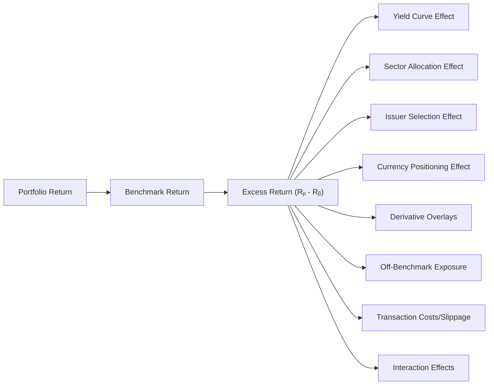

## Overview

Let’s be honest: it can be pretty thrilling to see a fixed income portfolio edge out its benchmark by a few basis points—especially when you realize that extra juice might come from a well-timed yield curve call or a savvy off-benchmark play. In this section, we’ll explore how to formally decompose (or “attribute”) that outperformance or underperformance, known as excess return, to its underlying drivers. Often, you need to show investors precisely where you beat (or missed) the mark in order to justify your strategy, highlight your skill, and learn from any missteps. Let’s dive right in.

## Absolute Return vs. Excess Return

One of the most fundamental distinctions in performance evaluation is the difference between absolute returns (also referred to as total returns) and relative or excess returns.

• Absolute (Total) Return: This is the portfolio’s own return over a specified period, typically calculated from inception to date or over a shorter time window (like monthly or quarterly).  
• Excess Return: This is what you get when you compare your portfolio’s return against the benchmark. Mathematically:


\text{Excess Return} = R_{p} - R_{b},


where Rₚ is the portfolio return and Rᵦ is the benchmark return.

From an investor’s perspective, absolute returns are important for assessing whether you’re making or losing money. But if you’re paid to outperform an index, your excess return is the real bottom line. Understanding how that excess return is generated reveals your active decisions—like overweighting certain maturities, selecting specific issuers, or tactically hedging with derivatives.

## Key Sources of Excess Return

A well-structured performance attribution report typically splits your portfolio’s excess return into “buckets” that represent key investment decisions. While different asset managers have slightly different labels or groupings, the following components are fairly common in fixed income.

### Yield Curve Positioning

Yield curve positioning captures how your portfolio's exposure to interest rate risk (duration and the shape of the yield curve) differs from the benchmark. Being overweight at certain maturities (e.g., 5-year sector of the curve) or underweight at others (e.g., 30-year sector) can help or hurt returns depending on how rates move.

• Duration and Convexity: Are you running a longer or shorter duration than the benchmark?  
• Curve Shape: Do you favor a barbell (overweight short and long maturities) or bullet structure (focus on the belly of the curve)?  

This is often the first step in attribution because yield curve dynamics can play an outsized role in total return.

### Sector Allocation

Sector allocation refers to the active decision to overweight or underweight certain bond market segments (e.g., government, corporate, securitized, emerging market). For example, if your benchmark is a broad investment-grade index, you might choose to tilt toward corporate bonds when you expect spreads to tighten. Conversely, you might prefer a heavier weighting in Treasuries if you predict a flight-to-quality scenario in the broader market.

### Credit (Issuer) Selection

Once you’ve decided on a sector weighting, your next big decision is which issuers you believe will outperform. If you’re overweight in a certain corporate issuer that rallies on strong fundamentals, the selection effect can generate positive excess return. This piece is typically referred to as the “issuer selection” or “stock selection” effect in equity language.

### Currency Positioning

In some cases, especially for globally oriented fixed income portfolios, currency exposures that deviate from benchmark weights or hedging policies can produce gains or losses. If you expect a strengthening in the euro relative to the U.S. dollar (and your benchmark is heavily USD-based), you might choose to keep some unhedged euro exposure that yields an active currency effect.

### Derivative Overlays

Bond managers often use futures, interest rate swaps, swaptions, or other derivatives. These can be used to quickly adjust duration, yield-curve posture, or credit exposure without physically trading large amounts of bonds:

• Interest Rate Swaps: Often used to modify duration or gain exposure to a different part of the yield curve.  
• Futures: Commonly used to manage short-term tactical positions or to hedge exposures.  
• Options (Caps, Floors, Swaptions): Provide asymmetric payoffs that might protect from rate spikes or profit from volatility moves.

Derivative overlays that deviate from the benchmark’s derivative usage can be carved out as a separate attribution bucket.

## Visualizing the Decomposition

It’s helpful to picture how these different pieces tie together. The following Mermaid diagram provides a high-level flow:

At the center is your total excess return, from which each labeled arrow represents a distinct component of performance attribution.

## Hierarchical Attribution Approaches

Many investment managers start with top-level exposures and then drill down:

1. Duration and Yield Curve: Compare portfolio vs. benchmark duration. Then slice by curve “buckets” (e.g., short, intermediate, long) to see how overweight or underweight positions fared.  
2. Sector Allocation: Within each duration bucket, see if your overweight or underweight in corporate vs. government vs. securitized added or subtracted from returns.  
3. Credit Selection: Finally, analyze issuer-level picks within each sector.  

In practice, advanced attribution models will incorporate interaction terms. For instance, if you were overweight in corporate credit (sector bet) and also lengthened duration in that corporate segment (curve bet), the combined effect can exceed the simple sum of each factor independently.

## Off-Benchmark Positions and Transaction Costs

### Off-Benchmark Exposure

Off-benchmark positions simply means holding instruments that aren’t included in the benchmark index. You might, for example, hold a convertible bond from a mid-cap issuer or an emerging market local-currency sovereign bond, even though your benchmark is purely U.S. investment-grade. These exposures can notably change your risk and return profile.  
• Potential Upside: Diversification and alpha generation if the off-benchmark asset outperforms.  
• Potential Downside: Additional risk and potential underperformance if the off-benchmark asset lags or faces liquidity issues.

### Transaction Costs and Slippage

We all want to think that if we see an asset priced at 100.25, we can just buy it at 100.25. But the reality is you might end up having to pay 100.26, or even 100.30 if the market is moving quickly. That difference, plus commissions, has a direct influence on your realized returns. Transaction costs are a critical part of performance attribution because they reduce your net gains. Properly capturing these costs ensures you don’t overstate your actual alpha.

## Incorporating Interaction Effects

Factor-based and multi-factor methodology is crucial in fixed income because returns can arise from overlapping decisions. For instance, consider the interplay between yield curve and credit spreads. If a flattening environment hits corporate bonds more severely in the long end, your yield-curve bet and credit bet are not purely additive.  

Many firms adopt partial or full multi-factor models that attempt to isolate these “interaction effects.” While it can get pretty intricate—and data-intensive—multi-factor models provide a more accurate reflection of the real world, where bond prices shift for multiple reasons simultaneously.

## Example of a Simple Decomposition

Let’s walk through a quick example. Suppose you have a $100 million portfolio and you’re comparing it to a standard investment-grade benchmark over one quarter:

• Portfolio Return: 3.20%  
• Benchmark Return: 2.90%  
• Excess Return: 3.20% – 2.90% = 0.30%

Now let’s break that 0.30% down:

• Yield Curve Positioning: +0.10%  
  - You had heavier exposure to the intermediate segment, which performed best during the quarter.  
• Sector Allocation: +0.08%  
  - You were overweight industrial corporates versus the benchmark. Investment-grade industrials tightened spreads significantly.  
• Issuer Selection: +0.06%  
  - Within industrials, a handful of names with strong earnings boosted your relative performance.  
• Currency Positioning: +0.03%  
  - Your slight overweight to the euro (unhedged) paid off as the euro rose modestly against the USD.  
• Derivatives Overlay: ±0.00%  
  - You used some interest rate futures to manage duration, but the net effect canceled out.  
• Off-Benchmark: +0.05%  
  - You held a small allocation to a Latin American sovereign bond not in the benchmark that rallied.  
• Transaction Costs: -0.02%  
  - Slippage and commissions from rebalancing subtracted from your gains.

When you add them all up, you get:


0.10\% + 0.08\% + 0.06\% + 0.03\% + 0.00\% + 0.05\% - 0.02\% = 0.30\%


It’s a tidy illustration of how each decision contributed to your outperformance.

## Practical Considerations and Best Practices

• Consistent Time Periods: Align your attribution with the same start and end dates for both portfolio and benchmark.  
• Common Pricing Sources: At least try to use the same price feeds for the portfolio and the benchmark to avoid mismatches.  
• Transparency of Assumptions: Because yield curve interpolation, defaulted bond treatment, or off-benchmark classification can differ among providers, it’s critical to document these assumptions for reproducibility.  
• Integrate with Risk Management: Factor exposures in attribution should mirror how the risk management team measures portfolio exposures. This alignment fosters consistency across the investment process.

## Closing Thoughts

Decomposing excess return over a benchmark might sound technical at first, but it’s one of the most important aspects of managing and explaining a fixed income strategy—especially at the CFA Level II, where you’re expected to apply these concepts in real-world vignettes. By systematically attributing each portion of your performance to a discrete factor, you not only gain insight into how your strategy paid off (or backfired) but also highlight your skill in making active decisions.

As always, keep a watchful eye on transaction costs and be mindful of off-benchmark trades because these subtle factors can make or break your outperformance. The more transparent and consistent your attribution framework is, the stronger your credibility with investors, teammates, and exam graders alike.

## Glossary

• Excess Return: The difference between the portfolio’s total return and the benchmark’s total return.  
• Yield Curve Positioning Effect: The portion of excess return attributable to how you positioned the portfolio across different maturities relative to the benchmark.  
• Sector Allocation Effect: Gains or losses stemming from being overweight or underweight various bond market sectors in comparison to the index.  
• Issuer Selection Effect: Additional performance (positive or negative) that arises from picking specific issuers within each sector.  
• Off-Benchmark Exposure: Allocations in securities or instruments not included in the benchmark index.  
• Slippage/Transaction Costs: Differences between expected and executed trading prices, along with commissions and fees.  
• Benchmark Weights: The proportion of different securities or sectors in the designated benchmark.  
• Interaction Effects: The combined, nonlinear effect of multiple simultaneous active bets (e.g., duration and credit together).

## References & Further Reading

• CFA Institute Level II Curriculum, “Attribution Analysis for Fixed Income”  
• MSCI Barra Handbook, “Fixed Income Portfolio Attribution”  
• JP Morgan Asset Management Research, “Multi-Factor Attribution in Bond Markets”  
• CFA Institute Code of Ethics and Standards of Professional Conduct  

## Ten Practice Questions: Decomposing Excess Return over Benchmark



### Excess Return Fundamentals

- [x] Excess return is the difference between portfolio return and benchmark return.
- [ ] Excess return is the same as total return for a portfolio.
- [ ] Excess return only measures alpha from currency decisions.
- [ ] Excess return only applies to equities, not fixed income.

> **Explanation:** By definition, excess return equals the portfolio’s total return minus the benchmark’s total return.  

### Yield Curve Positioning

- [ ] It has no measurable effect on excess return if the portfolio has the same duration as the benchmark.
- [x] It can generate positive excess return by overweighting maturities that outperform.
- [ ] It primarily affects currency returns rather than interest rate risk.
- [ ] It only matters in a rising interest rate environment.

> **Explanation:** Yield curve positioning influences how different maturity segments contribute to performance. Overweighting or underweighting certain maturities relative to the benchmark can create excess return if those segments move favorably.

### Sources of Excess Return in Fixed Income

- [x] Sector allocation, yield curve positioning, issuer selection, currency, and off-benchmark exposures.
- [ ] Sector allocation and off-benchmark exposures only.
- [ ] Yield curve positioning and currency exposures only.
- [ ] Derivative overlays are not considered in fixed income attribution.

> **Explanation:** A standard decomposition includes yield curve positioning, sector allocation, issuer selection, currency positions, and any off-benchmark or derivative exposures.

### Off-Benchmark Positions

- [x] May generate incremental returns if the off-benchmark asset outperforms.
- [ ] Are always more liquid than benchmark assets.
- [ ] Are excluded from performance attribution to remain consistent.
- [ ] Have no transaction costs associated with them.

> **Explanation:** Off-benchmark positions can produce additional alpha if they outperform, but they come with potential liquidity concerns and transaction costs. They must be accounted for in attribution because they can meaningfully affect returns.

### Transaction Costs Impact

- [ ] Transaction costs can be ignored if you focus on gross returns only.
- [ ] Slippage refers only to gains from unexpected price moves.
- [x] They should be subtracted to get a more realistic assessment of net excess returns.
- [ ] They are always zero for U.S. Treasury trades.

> **Explanation:** Transaction costs and slippage reduce net performance, making it important to account for them when measuring actual excess returns.

### Interaction Effects

- [x] Occur when two or more factors (e.g., credit and duration) overlap, creating a combined effect.
- [ ] Are automatically accounted for in single-factor attribution.
- [ ] Cannot be measured in a multi-factor model.
- [ ] Always produce a positive contribution to excess return.

> **Explanation:** Interaction effects happen when multiple factors affect a security’s performance in ways that aren’t perfectly additive. Multi-factor models explicitly measure these overlapping influences.

### Attribution Hierarchy

- [x] Typically starts with duration and yield curve effects before examining sector and issuer-level decisions.
- [ ] Should begin with issuer selection, then move to yield curve and duration.
- [ ] Is never appropriate in global fixed income portfolios.
- [ ] Only matters if you hold derivatives.

> **Explanation:** Most hierarchical approaches start with the broadest decisions (duration and yield curve positioning) and then move to more detailed sector or issuer-level attributions.

### Currency Positioning

- [x] Captures gains or losses from divergent exchange rate moves relative to the benchmark’s currency composition.
- [ ] Only applies if you’re trading currency futures.
- [ ] Is irrelevant for global bond portfolios.
- [ ] Has no effect on excess return for an unhedged portfolio.

> **Explanation:** Currency positioning is an active source of risk and return in global bond investing. Deviations from the benchmark’s currency exposures can lead to positive or negative excess return.

### Consistency in Data

- [x] Ensures that both portfolio and benchmark returns are calculated on the same basis and time frame.
- [ ] Means you can combine monthly and quarterly data arbitrarily in the same attribution model.
- [ ] Is only necessary in equity attribution, not fixed income.
- [ ] Usually requires ignoring slippage.

> **Explanation:** Aligning data sources, pricing, and time frames for both portfolio and benchmark is crucial to produce meaningful and reproducible attribution results.

### True or False:  
A broad-based yield curve shift can generate both a yield curve effect and an issuer selection effect simultaneously.

- [x] True
- [ ] False

> **Explanation:** A parallel or nonparallel shift in the yield curve affects all bonds, but specific issuers or sectors may respond differently, leading to both yield curve and issuer selection effects.


