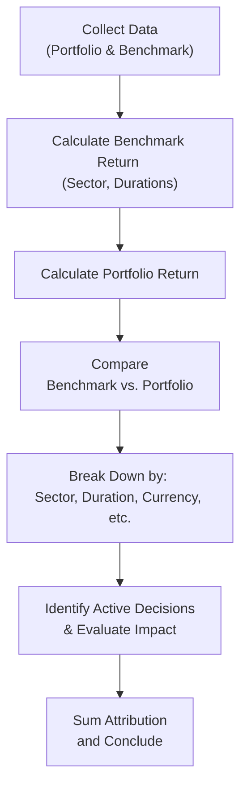

## Understanding Performance Attribution Data

Performance attribution in fixed income might sound, well, a bit intimidating at first glance. I remember the first time I stared at a table crammed with sector weights, yield curve exposures, and currency breakdowns—it felt like reading a puzzle with no slight clue where the corners were. But, you know, once you realize that each row and column is basically telling you a story about how each decision added (or subtracted) from performance, it starts clicking.

In a typical CFA Level II item set, you’ll see a vignette presenting a portfolio, its benchmark, and an entire matrix of “who did what” during the reporting period: did the manager’s overweight in high-yield corporates deliver a nice performance boost, or did currency exposures in emerging markets cause a little headache when the local currency dove unexpectedly? The exam might toss in some extra data for good measure—like partial durations at different maturities or derivative contracts that were used to hedge (or amplify) risk. The real skill is filtering out what’s crucial and connecting the right dots.

Below, we’ll walk through the structure of a performance attribution exhibit. Then we’ll step into the mechanics of how to interpret each piece—comparing portfolio vs. benchmark returns, breaking down sector-level results, and analyzing the effect of yield curve shifts, credit spreads, and currency moves. By the way, if you spot negative or unexpected attribution, you’ll want to note that as an area for improvement or deeper analysis.

## The Performance Attribution Flow

Sometimes it helps to see the big picture. The flowchart below (in Mermaid code) might feel a bit simpler than your typical manager’s monthly performance report, but it captures the gist of how data streams into an attribution calculation:

As you interpret an item set, you’re essentially retracing these steps. The difference is that the exam will present them in a single cohesive (sometimes chaotic) table, instead of a nice flowchart. Let’s explore each of these steps and see how they show up in the data.

## Data Collection and Key Rate Durations

You’ll typically see an exhibit with portfolio and benchmark holdings across sectors (Treasuries, corporate bonds, mortgage-backed securities, emerging market debt, etc.), along with items like:

• Weight in each sector (in percent).  
• Yield to maturity (YTM) or yield spreads.  
• Duration metrics, often broken down into key rate durations, which measure exposure at particular maturity points along the curve (e.g., 2-year, 5-year, 10-year, 30-year).  
• Currency exposures (if the portfolio invests in multiple currencies or includes currency overlay strategies).  

Key rate durations can be especially sneaky. If you see that your portfolio has a heavier 5-year key rate duration than the benchmark (let’s say 2.5 vs. 1.0), it means you’re more sensitive to changes in 5-year yields. If 5-year yields rise unexpectedly, your portfolio could suffer more price decline than the benchmark, potentially resulting in negative attribution from that maturity bucket. On the flip side, if the 5-year yield falls and everything else remains stable, your heavier exposure might deliver outperformance.

## Breaking Down “What Happened” to Returns

The typical big-picture returns you’ll see are:

• Portfolio total return (e.g., 6.20% for the period)  
• Benchmark total return (e.g., 5.75% for the same period)  
• Outperformance (or underperformance) = 6.20% – 5.75% = +0.45%  

But that’s just the net figure. Performance attribution helps you dissect that 0.45% difference (45 basis points) among a few major drivers:

• Duration or interest rate decisions (including yield curve positioning).  
• Credit spread (sector) decisions (overweighting certain corporate sectors vs. the benchmark).  
• Currency positioning (often lumps in the effect of foreign exchange fluctuations).  
• Security selection (which specific bonds, within a given sector or rating tier, you chose).  
• Derivatives usage (like interest rate futures, swaps, or credit default swaps).  

Picture it this way: if you see +30 bps from sector allocation, +20 bps from currency, and –5 bps from rate decisions, the final net is +45 bps. That’s how the manager’s active calls line up under the hood.

## Negative or Unexpected Attributions

It’s not all sunshine. Sometimes your big call backfires: maybe you expected credit spreads in high-yield to tighten further, so you overweighted that sector. Then, surprise, an economic data release triggers risk-off sentiment. Spreads blow out, your high-yield bonds drop in value, and you end the quarter with a negative sector allocation effect. In an item set, you’d see something like –0.15% (i.e., –15 bps) in the sector allocation line. That’s a direct sign that your overweight in high-yield subtracted from performance relative to the benchmark (which presumably held less high-yield exposure).

What does the exam want from you here? Probably to identify that negative mark and comment on the portfolio’s underperformance in that area. They might want you to note that the manager’s credit assumption didn’t pan out or that there was an unanticipated macro event.

## Derivatives: Hidden in Plain Sight

Derivatives can complicate your attribution breakdown, but the principle is the same: a derivative position is effectively another source of exposure to rates, spreads, or currencies. The exam might show a table listing interest rate swap positions or futures contracts on certain bond indices. Then you’ll see a small row on the attribution exhibit labeled “Derivatives.” If the manager used a swap to reduce duration exposure, it might have offset some movement in the underlying portfolio. Maybe that ended up saving the portfolio from a bigger loss if rates rose. Or, if the manager used credit derivative overlays to gain extra exposure to a rallying sector, that could be a big source of outperformance.

Keep an eye out for the difference between the manager’s physical holdings and the synthetic exposures introduced by derivatives. In real-world practice, you might see something like:

• Physical portfolio is underweight investment-grade corporates.  
• Derivative overlay uses an IG corporate index total return swap that effectively reverses that underweight—and then some.

Attribution tables often show this net effect. For exam day, just be sure to read the footnotes about how the derivative usage is accounted for in the portfolio. The item set might present the derivatives effect in a separate column or combined into each main category (like “Duration – Derivatives Adjusted”). Don’t let that extra labeling trip you up.

## Step-by-Step Calculation Outline

While the exam might not ask you to produce every line item from scratch (they’ll usually give partial data), you should know the broad strokes:

1. Calculate total portfolio return.  
2. Calculate total benchmark return.  
3. Attribution due to asset allocation (sector weights vs. benchmark).  
4. Attribution due to yield curve positioning (looking at key rate durations).  
5. Attribution due to security selection within each sector (comparing portfolio bond performance to benchmark bond performance).  
6. Attribution from currency movements (if applicable).  
7. Summation of the factors, which should equal the difference in total returns between the portfolio and the benchmark.  

The exam question might read: “Based on the data in Exhibit 2, identify which components of the portfolio’s active decisions added the most value relative to the benchmark. Show your calculations.” Then you go line by line, perhaps referencing specific pieces of the table.

## Example: Hypothetical Scenario

Let’s piece together a quick hypothetical example to see how the data might look:

|                        | Portfolio   | Benchmark   | Attribution (bps) |
|------------------------|------------:|------------:|-------------------:|
| **Total Return**       | 6.20%       | 5.75%       | +45               |
| Duration (Rates)       | 2.1 years   | 2.4 years   | +5                |
| Yield Curve Position   | ---         | ---         | +10               |
| Credit Spread (IG)     | Overweight  | Neutral     | +15               |
| Credit Spread (HY)     | Slight OW   | Neutral     | –5                |
| Currency (USD/EUR)     | 20%        | 15%         | +15               |
| Currency (Emerging)    | 10%        |  5%         | –2                |
| Security Selection     | ---         | ---         | +7                |
| **Net Factors**        | ---         | ---         | +45               |

In this construction, the portfolio’s total return is 45 bps higher, coming from a variety of pluses and minuses. Notice the negative 5 bps from the high-yield overweight. Maybe the manager guessed that spreads would tighten, but they widened. The currency from emerging markets also delivered a negative (–2 bps) because of a surprise local political event that impacted returns. Still, net net, the portfolio outperformed by 45 bps.

## Filtering Relevant vs. Irrelevant Data

An exam item set might jam in more columns:

• Weighted average coupon.  
• Weighted average maturity.  
• Price for each bond in the portfolio.  
• Macroeconomic data (unemployment, inflation, etc.).  
• Additional layers about the manager’s style or constraints.  

Not all of this data is directly relevant to your performance attribution question. The trick is to pick out the columns that explain why the portfolio performed differently than the benchmark (sectors, durations, credit spreads, currency). If the question specifically references “the effect of yield curve bulge at the 5-year point,” then sure, you’ll zero in on partial durations at 5 years. But if the question is about whether the manager successfully added value through active currency management, you’ll focus on the currency snapshot.

## Practical Recommendations

Once you’ve identified what worked and what didn’t, the exam might nudge you to recommend changes. Maybe the manager’s short-duration position underperformed because rates actually fell, so you lost out on some price appreciation. In that case, you’d write something like, “The manager should consider slightly extending duration to align more closely with the benchmark in the near term, particularly if rates remain stable or decline further.” That kind of statement indicates you understand how to use the attribution results, not just read them.

## Pitfalls and Common Missteps

• Double Counting: Watch out for attributing the same effect to both duration and sector spread.  
• Ignoring Hedge Overlays: If there’s a mention of interest rate futures, be sure to incorporate that effect in your interest rate attribution.  
• Focusing on the Wrong Time Frame: Sometimes the item set includes data from a prior quarter for comparison. Make sure you’re focusing on the correct date range.  
• Missing Thorough Explanations: The exam might ask, “What are the key drivers of outperformance?” Don’t just say “duration.” Mention that “The portfolio’s shorter duration mitigated interest rate downside in a rising rate environment, thus adding X basis points relative to the benchmark.”

## Best Practice Exam Strategy

• Read the vignette carefully. It’s tempting to jump straight to the table. But context might explain the manager’s rationale and give clues about which data to prioritize.  
• Organize calculations systematically. If asked for a step-by-step breakdown, mirror the usual formula approach: total return difference = sum of (duration + sector + currency + selection + derivatives).  
• Keep an eye on extraneous details. The exam might throw in a random commentary on inflation or a rumor about future central bank policy that’s not part of the actual question. Don’t let it derail your calculations unless specifically asked.  
• Summarize with clarity. If you present your findings in a short narrative—like “The largest source of outperformance was currency positioning (+15 bps), followed by yield curve position (+10 bps), while credit spread (HY) subtracted 5 bps”—the exam grader can see you’ve identified the correct drivers.  

## Visualizing a Sample Key Rate Duration Table

While partial durations may appear in a more complicated exhibit, it often helps to visualize them:

| Key Rate (Years)  | Portfolio Duration | Benchmark Duration |
|-------------------|--------------------|--------------------|
| 1                 | 0.60              | 0.50              |
| 2                 | 0.85              | 0.90              |
| 5                 | 1.00              | 0.50              |
| 10                | 0.40              | 0.60              |
| 30                | 0.25              | 0.25              |
| **Total**         | 3.10              | 2.75              |

If interest rates at the 5-year point rise, the portfolio is more affected (1.00 vs. 0.50) and might underperform at that maturity. However, if 5-year yields decrease, that big exposure can be beneficial. The net effect of these yield curve changes will appear in the “yield curve position” line of the attribution summary.

## Item Set Exam Day Mindset

The key to nailing item sets is tying the data together. If the text says, “The manager believed the 5-year portion of the curve would invert due to increased mid-term inflation risk,” that’s a clue about their rationale. Then the table shows an overweight in that maturity. If yields actually rose or fell, figure out which direction impacted the portfolio.

Also, expect multi-step reasoning:

1. Summarize the manager’s strategy.  
2. Check how the external environment changed.  
3. Use the exhibit to see how the portfolio and benchmark returns differ.  
4. Attribute these differences to the manager’s decisions.  

You might be asked to show an intermediate calculation. For instance, if the manager had a 10% overweight in high-yield, and high-yield outperformed by 3% over the period, then the approximate contribution is 0.10 × 0.03 = 0.30% (30 bps) outperformance. If the question says “Show your work,” you’d better do that math on your scratch paper (or the on-screen notepad in the exam environment).

## Conclusion and Next Steps

Interpreting performance attribution data is about reconstructing the “why” behind the difference between a portfolio’s returns and its benchmark. In an exam context, you’ll typically sift through item-set data to figure out exactly how interest rate exposure, credit spread selection, currency positioning, and derivatives usage all added up. Identifying negative or surprising attributions shows you can spot potential risks. And by explaining what happened and why, plus making suggestions for improvements, you demonstrate the higher-level thinking the CFA exam looks for.

Don’t worry if it feels overwhelming at first. Practice reading example item sets and come up with your own mental process for picking out the relevant lines in the data. Over time, you’ll see that each table basically follows the same logic: difference in performance equals the sum of the active bets (duration, curve shape, credit, currency, security selection, derivatives).

Be sure to revisit Chapter 25 on Measuring Interest Rate Risk and Chapter 27 on Fixed Income Portfolio Construction—they dovetail nicely here by reinforcing how we measure exposures and how they ultimately feed into performance results.

## References and Further Reading

• CFA Institute Level II Curriculum: Official readings and sample item sets for Fixed Income.  
• “Practical Bond Portfolio Attribution Examples,” Pimco Insights.  
• Bloomberg’s “Portfolio & Risk Analytics” user guide—good resource for seeing real industry-level attribution.  
• Chapters 25 and 27 of this volume, covering interest rate risk and portfolio construction.  

## Sample Exam Questions: Performance Attribution Insights

Below are 10 sample multiple-choice questions to help you test your understanding of interpreting performance attribution data in item sets.

## Test Your Knowledge: Performance Attribution Data



### When analyzing an item set showing negative attribution for a high-yield bond overweight, which statement is most accurate?

- [ ] The manager's overweight in high-yield bonds likely benefited from declining credit spreads.
- [ ] The negative attribution suggests the broad high-yield bond market outperformed the benchmark.
- [x] The manager's decision to overweight high-yield bonds underperformed relative to the benchmark.
- [ ] Negative attribution always indicates a currency loss, not a spread loss.

> **Explanation:** Negative attribution for high-yield indicates the manager’s overweight position lost value relative to the benchmark. The item set data likely shows high-yield spread widening or an adverse credit event.

### Suppose your portfolio has a key rate duration of 1.0 at the 5-year point vs. the benchmark’s 0.5. If 5-year yields rise more than expected, how is the portfolio most likely affected?

- [x] The portfolio may underperform because of greater exposure to the 5-year yield increase.
- [ ] The portfolio may outperform due to diversification benefits.
- [ ] The portfolio’s extra exposure to 2-year duration helps hedge the 5-year risk.
- [ ] There will be no difference in attribution from the 5-year point.

> **Explanation:** A heavier exposure (1.0 vs. 0.5) means more price sensitivity if 5-year rates rise, leading to a likely negative performance impact.

### To calculate the contribution to active return from a 10% overweight in emerging market debt that outperformed by 2% (200 bps), which approach is correct?

- [ ] 10% × 2% = 2.0% contribution
- [ ] 2.0% ÷ 10% = 20% contribution
- [x] 10% × 2% = 0.20% (20 bps) contribution
- [ ] 2.0% – 10% = –8% contribution

> **Explanation:** Weight (0.10) multiplied by outperformance (0.02) yields 0.002 (or 20 bps). This is the standard approach for calculating contribution.

### Which of the following best describes how derivatives typically appear in performance attribution?

- [ ] They are excluded because derivatives do not affect portfolio performance.
- [x] They represent an additional source of exposure that can be isolated in the attribution results.
- [ ] They always lower volatility, so they do not have an attribution impact.
- [ ] They appear only in the final summary, not in detailed tables.

> **Explanation:** Derivatives are another form of exposure to rates, spreads, or currencies and can be broken out in attribution results. They increase or decrease portfolio risk and can contribute positively or negatively to returns.

### An attribution table shows your portfolio outperformed by 0.40%. It also shows +0.15% from duration, +0.10% from currency, +0.20% from credit allocation, and –0.05% from selection within each sector. How do these add up to the total outperformance?

- [ ] 0.15 + 0.10 + 0.20 – 0.05 = 0.50%
- [ ] 0.15 × 0.10 × 0.20 – 0.05 = 0.07%
- [x] 0.15 + 0.10 + 0.20 – 0.05 = 0.40%
- [ ] 0.15 + 0.10 + 0.20 + 0.05 = 0.50%

> **Explanation:** Summing the contributions 0.15% + 0.10% + 0.20% – 0.05% = 0.40%. Straight addition (and subtraction) is used in performance attribution, not multiplication.

### A portfolio manager believes short-term interest rates will rise significantly. The manager reduces the total portfolio duration relative to the benchmark. If rates indeed rise, how would that likely show up in attribution?

- [ ] Negative contribution from duration because the portfolio was less protected.
- [x] Positive contribution from duration because the portfolio suffered less price decline.
- [ ] Negative contribution from currency because short-duration hedges are performed abroad.
- [ ] No change because short-term yields rarely affect total duration.

> **Explanation:** A shorter duration in a rising rate environment usually experiences smaller price declines, resulting in positive duration attribution.

### An item set shows that the overall attributions for sector allocation and security selection within the same sector are identical. Which conclusion makes the most sense?

- [ ] The manager made no active decisions.
- [ ] The manager’s sector-level positioning offset the security-level positioning.
- [x] The manager’s sector choices and selections within each sector added the same amount to active return.
- [ ] The item set data must contain an error.

> **Explanation:** Identical attributions for sector allocation and security selection can happen if both decisions contributed the same level of outperformance (or underperformance).

### In a performance attribution table, you see a line item labeled “residual.” Which scenario is most likely?

- [ ] It indicates a 0% difference from rounding errors.
- [x] It represents the unexplained portion of returns due to rounding or interactions among factors.
- [ ] It is the main driver of returns.
- [ ] It only appears when currency is involved.

> **Explanation:** “Residual” or “interaction” typically captures the small unexplained portion due to rounding or complex interactions between allocation and selection effects.

### Which action helps isolate currency effects in a global bond portfolio attribution?

- [ ] Convert all returns into the local currency of each bond.
- [x] Convert all returns into the portfolio’s base currency and measure currency changes separately.
- [ ] Ignore currency because it doesn’t affect bond prices.
- [ ] Use only partial durations for currency analysis.

> **Explanation:** By standardizing returns in the portfolio’s base currency, you can measure how much of the return was driven by currency movements vs. the bond’s underlying performance.

### True or False: Negative overall performance attribution indicates the benchmark always outperformed in every category.

- [x] True
- [ ] False

> **Explanation:** If the total attribution is negative, on net, the portfolio lagged the benchmark. However, it does not mean that the portfolio must have underperformed in every individual category, only that the sum of the categories leads to an overall shortfall.


