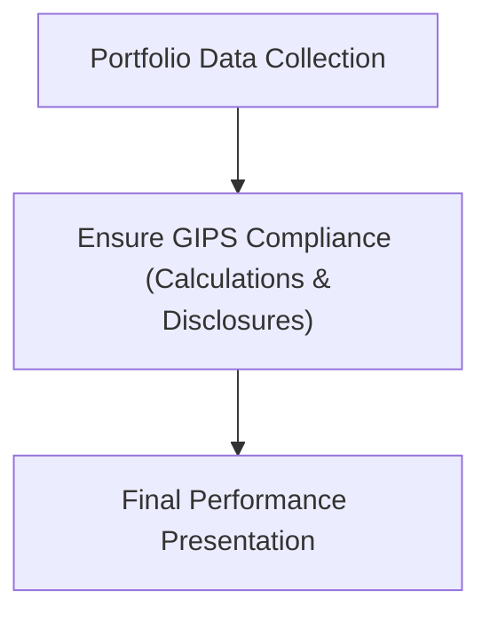
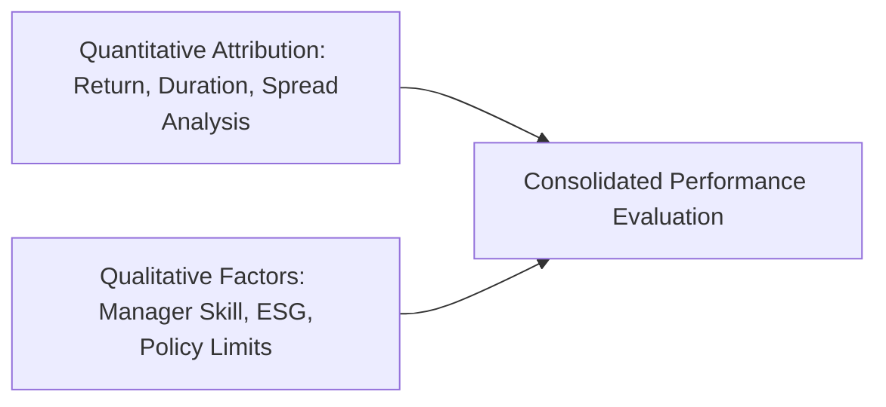

## Introduction
Performance evaluation in fixed income might sound pretty straightforward at first—measure returns, compare to a benchmark, and you’re good to go. But, well, you know how things go in real life: throw in multiple currencies, possible leverage, liquidity constraints, stale prices for certain bonds, plus GIPS compliance and tax considerations, and it quickly gets complex. In this section, we’ll delve into these additional performance-evaluation considerations, highlighting how each factor can shape the final picture of a bond portfolio’s success (or hiccups!).

## Multi-Currency Portfolios and Currency Influences
Let’s start with multi-currency portfolios. If you’re holding bonds denominated in different currencies, you need to consider currency translation effects in your performance calculations. Even if you do everything right locally, movements in the currency market can overshadow your local alpha. This can be further complicated by:

• Fluctuating exchange rates  
• Cross-currency basis swaps (used for hedging or yield enhancement)  
• Different local interest rates that impact yield comparisons  

I once worked with a portfolio manager who confidently reported a 2% local return, only to see that same 2% vanish in a single day due to a currency mismatch. It was a harsh reminder that, for multi-currency bond portfolios, evaluating both local performance and currency effects is crucial.

Here is a simple flow diagram illustrating where currency adjustments fit into your return calculation:

Whenever you measure total returns in your base currency, you’ll want to distinguish between local bond performance and currency performance. Sometimes, you’ll hedge part (or all) of the currency exposure using forward contracts or cross-currency swaps, in which case the hedge gains or losses should be factored into your performance attribution.

## Leverage and Margin Use
Another biggie is leverage. Using borrowed capital to boost returns can be powerful—and risky. If your leveraged positions go well, you’ll magnify returns; if not, well, the downside is magnified, too. In performance evaluation:

• You need to separate the portion of returns generated by the “unlevered” portfolio from the portion attributable to leverage.  
• Leverage costs—like the interest you pay on borrowed funds—must be accurately reflected.  

One pitfall is ignoring the timing of cash flows associated with margin calls or collateral requirements. If your margin call forces you to liquidate bonds at inopportune times, it can drastically alter realized returns. For an accurate attribution analysis, reflect these forced trades or unexpected sales in your performance data.

## GIPS Compliance
The Global Investment Performance Standards (GIPS) offer a consistent methodology for reporting performance. For instance, GIPS prescribes how to deal with fundamentals like composite creation, subscription/redemption effects, and external cash flows. In the context of fixed-income portfolios:

• Treatment of accrued interest and how you handle transaction costs is standardized.  
• The use of hypothetical or backtested performance is restricted.  
• Requirements for disclosure are extensive, ensuring that marketed performance truly represents the strategy.  

GIPS helps you compare apples to apples between different managers or periods. However, staying GIPS-compliant can be operationally demanding. You might need system upgrades or better data management to keep up with GIPS guidelines.  

Below is a simplified diagram showing performance reporting flows under a GIPS-compliant framework:

## Operational Constraints and Data Lags
If you have ever attempted to generate daily performance numbers for a large bond portfolio, you already know that “slippage” can arise from delayed transaction recording, especially if trades settle on different days (T+2 or T+3). Thinly traded securities sometimes have stale quotes, which leads to:

• Potential misstatement of daily or intraday net asset values (NAV).  
• Mismatches between actual realized gains/losses and model estimates.  

If your data feed doesn’t update for illiquid bonds flagged as “price not available,” you might inadvertently carry forward the last known quote—a practice known as “stale pricing.” When you finally get an updated quote, the jump can significantly affect calculations of volatility, drawdown, or daily P&L.

## Impact of Taxes
Tax considerations can be a real curveball, especially if you manage portfolios for taxable investors. Tax brackets, withholding taxes, or specialized bond taxation (like municipal bonds in the US) can alter the after-tax yield. For instance, if a corporate bond yields 4% pre-tax, but your investor pays tax at, say, 30%, the net yield is effectively 2.8%. This difference can cause:

• Distortions in risk-return comparisons across portfolios.  
• Divergent preferences for certain bond types (tax-exempt vs. taxable bonds).  

In some jurisdictions, bond amortization or discounts must be treated differently for tax purposes, creating complexities in your performance calculations. A large difference between gross and net-of-tax returns can shift investment decisions quite a bit.

| Return Measure           | Description                                             |
|--------------------------|---------------------------------------------------------|
| Pre-Tax Returns          | Excludes any applicable taxes.                          |
| After-Tax Returns        | Adjusted for investor’s specific tax rate or bracket.  |
| Realized vs. Unrealized  | Potential mismatch between realized gains and holdings if partial liquidations trigger taxes. |

## Liquidity and Market Stress
We all want to buy and sell at “fair value,” but in stressed markets, that’s easier said than done. Liquidity can evaporate, forcing you to sell at deep discounts. Wide bid-ask spreads might lead to:

• Realized losses that are higher than your model might suggest.  
• Inconsistent or incomplete performance data (because trades occur sporadically).  

When assessing a manager’s performance, ask whether the manager had to execute trades under forced conditions or if they had the leeway to wait for better prices. Performance evaluation becomes trickier if the manager is forced to meet redemptions and must liquidate specific positions prematurely.

## Real-World Data Issues (Stale Pricing)
As mentioned earlier, infrequent trading can give rise to stale bond pricing. If an asset price remains the same day after day just because it’s not trading, your performance metrics—like volatility or Sharpe ratios—could look artificially smooth. Then one day, a trade happens at a wildly different price, and your “stable” portfolio is suddenly not so stable. Some managers might implement “fair value pricing” or use matrix pricing to estimate prices, but that can introduce subjectivity and model risk.  

## Influence of Policy Limits
Most bond portfolios have policy limits such as duration range, credit rating floors, or sector constraints (e.g., no more than 20% in high yield). These limits:

• Substantially shape portfolio composition.  
• Can cause your performance to deviate from a broad-based benchmark that doesn’t have the same restrictions.  

If your limit prevents you from investing in certain opportunities (say you spotted a great triple-B bond but your policy prohibits anything below A–), that opportunity cost is never captured in your final returns. When evaluating performance, you must compare your portfolio to an appropriate benchmark that accounts for these constraints.  

## Intangible Factors and Manager Appraisal
Numbers don’t capture everything. Manager experience, team continuity, research depth, relationships with dealers, and ESG integration can all affect bond selection and trading. Sometimes an experienced manager can sniff out a liquidity crunch coming or foresee that a specific issuer’s fundamentals are weakening. These “soft” factors often manifest in performance only after some significant market move.  

ESG integration is another intangible that can alter performance. If you systematically exclude certain bond issuers due to environmental concerns, your performance might lag a broader index. Or, if ESG is a hot theme and demand for green bonds is strong, you might actually see outperformance. Either way, you won’t see that nuance just by looking at a standard performance report.

## Putting It All Together: A Holistic Framework
A truly comprehensive performance evaluation merges quantitative attribution with qualitative assessments. Here’s a high-level picture:

• Quantitative metrics (return attribution, duration matching, spread dynamics) tell us what happened in numerical terms.  
• Qualitative factors (manager skill, team stability, ESG preferences, etc.) add context to interpret why certain results occurred.  

With this framework, you can address complex realities like multiple currencies, differences between pre-tax/post-tax returns, leverage-induced volatility, GIPS compliance, stale pricing, and so on.  

## Conclusion and Best Practices
Anyway, the bottom line is that fixed-income performance evaluation is not just about measuring yield. You have to watch out for currency swings, pay attention to how leverage magnifies outcomes, keep your data clean (or as clean as possible!), and interpret results in light of stress liquidity conditions. Don’t forget the big intangible picture: a manager’s experience, research capabilities, risk appetite, and ESG stance can have real performance implications that pure math might not capture.

Following GIPS is a smart move for standardized performance reporting. But be sure to consider tax and policy constraints specific to each investor or mandate. By weaving together robust quantitative analysis with nuanced qualitative assessments, you get closer to the real story behind those performance numbers and avoid misinterpreting the signals.

## References and Further Reading
- CFA Institute Level II Curriculum, “Advanced Fixed Income Performance Evaluation.”  
- Global Investment Performance Standards (GIPS) Handbook, CFA Institute.  
- “Fixed Income Portfolio Management—Challenges in Performance Evaluation,” Institutional Investor Journals.

---

## Test Your Knowledge: Additional Performance Evaluation Considerations



### Which of the following best describes the impact of stale pricing on bond portfolio performance measurement?
- [ ] It reduces reported volatility, reflecting genuine stability.
- [x] It can artificially smooth returns and lower measured volatility.
- [ ] It increases both measured returns and volatility significantly.
- [ ] It has no effect on benchmark comparison.

> **Explanation:** Stale prices do not reflect recent market transactions, which can artificially smooth portfolio returns and dampen reported volatility.

### When dealing with multi-currency fixed-income portfolios, which factor is most critical to isolate when evaluating total return in a base currency?
- [x] Currency translation effects.
- [ ] Management fees.
- [ ] Forward points on yield curve trades.
- [ ] Asset allocation by geography.

> **Explanation:** The shift from local currency returns to base currency returns can be significant and needs to be isolated to understand managerial skill vs. currency movements.

### An investor uses leverage to improve returns on a bond portfolio. Which statement accurately describes the effect of borrowing on performance evaluation?
- [x] Leveraging magnifies both gains and losses and must be accounted for separately from the unlevered portion.
- [ ] Leveraging only affects cash flow timing but does not impact total returns.
- [ ] Calculating the cost of borrowed funds is optional in performance attribution.
- [ ] Leveraging does not impact risk-adjusted metrics if margin calls are avoided.

> **Explanation:** Leverage amplifies returns (up or down) and carries a borrowing cost, so it must be carefully separated from the unlevered core of a portfolio in attribution.

### GIPS (Global Investment Performance Standards) primarily aims to:
- [x] Provide a standardized framework for performance calculation and presentation.
- [ ] Restrict leverage usage in fixed-income portfolios.
- [ ] Lower the cost of performance reporting.
- [ ] Improve global bond liquidity.

> **Explanation:** GIPS exists to establish ethical and standardized guidelines for performance presentation, ensuring comparability across managers and markets.

### Suppose a portfolio manager invests in municipal bonds for US-based clients with high tax rates. Why might pre-tax returns differ substantially from after-tax returns?
- [x] Municipal bonds may provide tax-exempt income, making after-tax returns higher than they appear on a pre-tax basis.  
- [ ] Municipal bonds always yield more than corporate bonds pre-tax.  
- [ ] Transaction costs for municipals are negligible, leading to higher realized gains.  
- [ ] Taxation only applies to coupon income, not capital gains.

> **Explanation:** Municipal bonds are often tax-exempt, so high-tax-bracket investors benefit more than what a simple pre-tax yield comparison suggests.

### In stressed markets, wide bid-ask spreads can lead to which performance evaluation distortion?
- [x] Realized losses may exceed model-based estimates due to forced selling.  
- [ ] Overnight interest accrual becomes the dominant factor.  
- [ ] Negative convexity disappears completely.  
- [ ] Stale pricing ceases to be relevant.

> **Explanation:** When markets are stressed, forced selling at unfavorable bid prices can lead to losses above what steady-state models predict.

### Why is it important to consider operational constraints (e.g., settlement lags, reconciliation delays) in performance measurement?
- [x] They can cause discrepancies between actual portfolio values and reported figures.  
- [ ] They reduce the overall bond yield.  
- [ ] They are required by GIPS to ensure standardization.  
- [ ] They influence interest rate caps in multi-currency portfolios.

> **Explanation:** Data delays, reconciliation problems, or settlement lags can create timing mismatches, potentially inflating or deflating reported returns.

### What is an example of a policy limit affecting performance?
- [x] A rule capping high-yield bond exposure at 10% of the portfolio.  
- [ ] Selecting only callable bonds for income generation.  
- [ ] A short-term interest rate falling below zero.  
- [ ] The portfolio requiring minimum daily liquidity reporting.

> **Explanation:** Policy limits—like capping high yield at 10%—can shift the risk profile and exclude potential opportunities, thereby shaping performance outcomes.

### Including qualitative factors in performance evaluation might reveal:
- [ ] Overreporting due to stale pricing.  
- [x] The influence of managerial skill, ESG preferences, and research capabilities on returns.  
- [ ] A universal method of normalizing multi-currency exposures.  
- [ ] The best approach to measure liquidity constraints.

> **Explanation:** Qualitative factors help explain performance beyond the raw numbers, adding insight into a manager’s decision-making, experience, and ESG approach.

### True or False: A comprehensive performance evaluation framework should include both quantitative measures and qualitative assessments.
- [x] True
- [ ] False

> **Explanation:** Quantitative measures give the numeric breakdown of performance, but qualitative assessments add contextual understanding of a manager’s skill, compliance, risk tolerance, and ESG approach, providing a more complete view.


