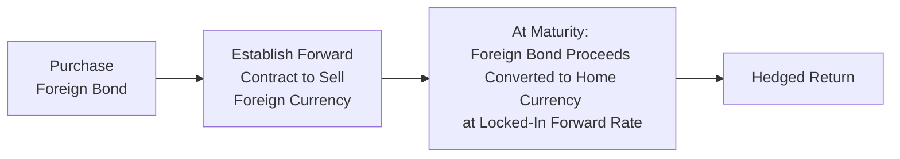

## Overview
Currency risk can be quite the roller coaster, right? Picture this: you buy a foreign bond yielding 5% annual return—seems great on paper. But if your home currency suddenly strengthens, you might end up actually losing money when converting that return back into your currency. That’s the headache known as currency risk, and it can dramatically shape the total returns of global bond portfolios. 

This section explores how currency fluctuations affect global bond investments, outlines different types of exposures, and discusses various hedging techniques. We’ll also talk about partial vs. full hedging (weighing the possibility of missing out on currency gains against added volatility), and even specialized solutions like currency overlay strategies. Our goal here? Equip you with the knowledge and confidence to handle foreign exchange (FX) risk effectively, especially for non-base-currency investments.

## Types of Currency Exposures
Currency risk comes in various flavors, each with potential repercussions for a bond portfolio:

• Transaction Exposure: This is the near-term risk of exchange rate fluctuations between the initiation of a transaction and its settlement date. For instance, let’s say you strike a deal to buy a Japanese Government Bond, but you won’t actually pay for it until next month. A big swing in USD/JPY during that period can be a bit nerve-racking.

• Translation Exposure: Here we’re dealing with an accounting perspective. Translation exposure is about converting foreign subsidiaries’ or foreign holdings’ financial statements into your home currency. While it may feel more like a paper (rather than actual cash) gain or loss, it can still affect reported financial performance and key ratios.

• Economic Exposure: This is the broader, more strategic form of risk, referring to how currency moves can affect the long-term competitiveness or market value of an entity. For a bond portfolio, it’s about how changes in exchange rates can systematically alter the attractiveness or pricing of foreign-currency-denominated bonds over time.

## Tools for Currency Hedging
When it comes to managing these exposures, investors typically pick among four standard hedging instruments: forward currency contracts, currency futures, currency options, and currency swaps. Each approach has its quirks, advantages, watch-outs, and liquidity considerations.

### Forward Currency Contracts
A forward contract is a private, over-the-counter (OTC) agreement between two parties to exchange a specific amount of currency at a predefined rate on a future date. Because forwards are customizable (in terms of size, maturity, and currencies), they’re frequently used by fixed income managers to hedge exposure for a certain bond position. Costs (in terms of bid-offer spreads and credit risk) and contract details can vary depending on your counterparties.

Forward contracts often lock in the exchange rate now, for settlement later. That might be perfect if you want certainty. But watch out, because if the currency moves favorably in your direction, you won’t be able to benefit from that upside. Also, because forwards are not exchange-traded, you’re exposed to counterparty risk (though you might use collateral agreements to reduce it).

### Currency Futures
Futures are exchange-traded contracts, standardized in amount and settlement dates. You can buy or sell currency futures on recognized exchanges, and the credit risk is lower because a clearinghouse stands between you and the other side of the trade. Margin requirements, however, can complicate your life a bit, especially if you’re used to forward contracts that often have different collateral requirements. 

Some managers prefer futures for their transparency and liquidity, while others find them too restrictive because you can’t fully customize the notional amount or the maturity. If your hedge requirements match a popular contract (like EUR/USD or JPY/USD), futures can be handy.

### Currency Options
Currency options grant you the right (but not the obligation) to buy or sell a particular currency at a specified strike price before or at the contract’s expiration date. Options offer asymmetry: you get to profit from favorable currency movements while limited risk to the premium paid if the market moves against you. Of course, like any insurance, premiums for currency options can be more expensive than forward/futures strategies if implied volatility is high.

• A call option on a foreign currency benefits you if the foreign currency appreciates.  
• A put option on a foreign currency benefits you if that currency depreciates beyond your strike.

Because you only exercise the option if it’s beneficial, this approach might make sense for managers who want partial protection but still leave some upside potential open.

### Currency Swaps
Currency swaps involve exchanging principal and interest payments in one currency for principal and interest payments in another. Swap structures can be very flexible: you might take a certain amount of USD principal and swap it for EUR principal, paying a fixed or floating rate in USD while receiving a fixed or floating rate in EUR (or vice versa). 

Swaps are typically used for longer-term hedges, especially when the notional amounts are large and persistent. Multinational corporations also use them to manage ongoing foreign-currency cash flows from different jurisdictions. For portfolio managers, a currency swap can transform the currency exposure of a foreign bond into the home currency, effectively “converting” a euro-denominated bond into a USD-equivalent bond, for example.

## Partial vs. Full Hedging Approaches
Now, do you want to hedge 100% of your currency exposure or just a portion? That question can lead to interesting debates among portfolio managers. A full hedge might eliminate all currency volatility, but you also lose the chance of boosting returns if the foreign currency suddenly appreciates. 

• Full Hedge: Maximizes certainty—if you plan your hedge ratio perfectly, your end return in your base currency should closely match the local-currency return of the bond. But you’ll incur hedging costs such as bid-ask spreads, possibly margin or collateral, and you’ll lose out on any favorable currency movement.  

• Partial Hedge: You hedge just enough to manage your comfort level of risk. Let’s say you anticipate moderate appreciation in the foreign currency, but you’re not fully confident. You might hedge half of the notional. That way, you dampen some volatility while leaving some upside open.

## Cross-Hedging
Sometimes, a direct currency hedge is unavailable or crazy expensive due to illiquidity. Maybe your portfolio is exposed to a more exotic currency from an emerging market. If you can find a developed-market currency that’s historically correlated with that currency, you might use it as a “proxy” hedge. That’s cross-hedging in a nutshell: employing a currency that moves similarly to the currency you want to hedge.

Cross-hedging is never perfect, of course. Correlations can break, especially in stressed markets. So you might not get the exact offset you desire. But in practical terms, cross-hedging can reduce a chunk of your currency risk when direct hedging is too costly or unfeasible.

## Currency Overlay Strategies
There’s an entire mini-industry built around the idea of currency overlay. The “overlay manager” takes neutral or active positions in currency instruments, aiming either to insulate the portfolio from unwanted FX risk or to generate alpha via an active currency strategy. The underlying fixed income portfolio manager might focus on bond selection and yield-curve positioning while the overlay manager independently controls currency exposures.

This separation can be beneficial because currency management requires specialized expertise, risk models, and real-time trading. For example, if you think a certain currency is undervalued, an overlay manager might treat that as a source of potential outperformance while maintaining appropriate hedges on other positions to control overall volatility.

## Operational Execution and Practical Considerations
Hedging is never purely theoretical. Here are operational details to consider:

• Margin Requirements: Currency futures and some forward trades may require initial margin or collateral. Frequent margin calls can disrupt liquidity management.  
• Settlement and Collateral: Forwards are often settled at maturity, but you might need to periodically exchange collateral. Ensure you have the correct settlement instructions and procedures in place.  
• Rollovers: If the hedge extends beyond the contract’s maturity, you’ll need to roll forward or close the old position and open a new one. Transaction costs can accumulate.  
• Accounting and Regulations: Different jurisdictions apply different rules to FX gains and losses, and the CFA Institute’s Code and Standards emphasize proper disclosure and transparency when using derivatives.  
• Credit/Counterparty Risk: With OTC instruments like forwards and swaps, keep an eye on your counterparty. Your hedge won’t help you if the other side defaults.

## Calculating Hedged vs. Unhedged Returns
Imagine you invest in a euro-denominated bond yielding 4% in local terms, but over the holding period, the EUR falls by 2% against your base currency. Your unhedged return might be only +1.92% in your home currency (the math involves compounding subtlety). That’s obviously annoying if you anticipated the full 4%. 

With a hedge in place, you lock the FX rate at the start (though you pay some cost). A simplified formula for hedged return might be:


R_{\text{hedged}} \approx \bigl(1 + R_{\text{local}}\bigr)\times \frac{F}{S} - 1


where:

• R_local is the local-currency bond return,  
• S is the spot rate at the beginning, and  
• F is the forward rate at contract initiation.

The difference (F/S) represents how the forward market is pricing future currency changes, which typically aligns with interest rate differentials under covered interest parity. In practice, you would also factor in transaction costs. 

## Diagram: Basic Currency Forward Hedge
Here is a simple depiction of how you might establish a forward hedge for a foreign bond:

• Step 1: You buy the foreign bond.  
• Step 2: You immediately lock in the exchange rate by selling the anticipated future foreign proceeds forward.  
• Step 3: Upon maturity, you receive bond proceeds in the foreign currency, deliver them into the forward contract, and you get your home currency at the predetermined forward rate.  
• Step 4: Profit or loss relative to that locked rate is effectively set, so you have less currency-related uncertainty.

## Conclusion and Exam Tips
Managing currency exposure is central to global bond investing. It’s a balancing act: hedge too aggressively, and you give up potential gains or pay unnecessary costs; hedge too loosely, and big currency swings can rattle your returns. In practice, managers often adopt nuanced, dynamic strategies, factoring in interest rate differentials, liquidity, Macaulay duration (see Chapter 25 for a refresher), and even tactical market views.

When you’re faced with a vignette on currency hedging (which is common in the CFA exam setting), watch for these classic pitfalls:
• Ignoring or misinterpreting interest rate differentials when calculating forward prices.  
• Missing the roll cost for forward contracts.  
• Overlooking partial hedging or cross-hedging scenarios.  
• Mixing up transaction versus translation exposure in a hypothetical question.  

On the exam, double-check your currency pairs, keep an eye on the notional amounts, and be mindful of time horizons. A misread can lead to an entirely wrong hedge ratio. 

## References and Further Reading
- CFA Institute Level II Curriculum, Fixed Income and Derivatives Sections.  
- “Currency Management” by the CFA Institute Research Foundation.  
- Bank for International Settlements (BIS) Publications on FX Markets: https://www.bis.org  
- “FX Swaps and Forwards: A Guide to Central Bank Operations” (IMF Working Paper).  
- Investopedia article on “Currency Hedging”: https://www.investopedia.com  

----

## Test Your Knowledge: 10 Sample Questions for Currency Exposure and Hedging



### A portfolio manager invests in a foreign bond that yields 3% in local terms. The foreign currency depreciates by 2% relative to the manager’s home currency. Ignoring other factors, which of the following best approximates the unhedged return in the home currency?  
- [x] About 1.94%  
- [ ] About 3.06%  
- [ ] Zero percent  
- [ ] Negative 2%  

> **Explanation:** The approximate formula for combined return is (1 + 3%) × (1 – 2%) – 1 = 1.03 × 0.98 – 1 ≈ 1.94%.  

### An investor wants to eliminate currency risk on a Japanese yen–denominated bond. They enter into a forward contract to sell yen for the home currency at maturity of the bond. Which of the following exposures are they primarily hedging?  
- [x] Transaction exposure  
- [ ] Translation exposure  
- [ ] Economic exposure  
- [ ] Operating exposure  

> **Explanation:** By locking in a forward rate to sell yen proceeds, the investor addresses the transaction exposure—risk arising from potential exchange rate fluctuations between the purchase and settlement dates.  

### Partial hedging can be advantageous because:  
- [x] It may capture some upside from favorable currency movements.  
- [ ] It completely eliminates currency risk.  
- [x] It reduces overall hedging costs if the currency does not move significantly.  
- [ ] It is mandatory under most accounting standards.  

> **Explanation:** When you hedge only partially, you maintain some exposure to favorable currency swings while reducing costs from a full hedge. Partial hedges do not eliminate all currency risk.  

### Which of the following statements is most accurate regarding forward currency contracts?  
- [x] They are privately negotiated contracts to exchange currencies at a future date.  
- [ ] They require posting initial margin or collateral at an exchange.  
- [ ] They provide unlimited upside potential similar to options.  
- [ ] They cannot be customized in terms of size or maturity.  

> **Explanation:** Forward contracts are OTC instruments that are privately negotiated and customizable; they do not require the same margin structure as exchange-traded products.  

### An investor owns an emerging market currency bond with limited liquidity in the currency forward market. They might use a cross-hedge by:  
- [x] Hedging into a liquid, correlated developed-market currency.  
- [ ] Buying put options on the bond’s issuer’s equity.  
- [x] Using a basket of currencies that broadly track the emerging currency.  
- [ ] Hedging using interest rate swaps.  

> **Explanation:** A cross-hedge uses a correlated but more liquid currency to reduce unwanted currency risk when direct hedges are impractical or expensive.  

### A currency futures contract differs from a forward contract because:  
- [x] It is exchange-traded, standardized, and cleared by a central counterparty.  
- [ ] It involves no daily settlement or margin requirements.  
- [ ] It poses higher counterparty risk than a forward contract.  
- [ ] It purely mirrors accounting exposure.  

> **Explanation:** Futures are standardized and exchange-traded with daily mark-to-market. This reduces counterparty risk compared to an OTC forward.  

### Which of the following typically does NOT factor into the forward price of a currency pair under covered interest parity?  
- [x] The local inflation rate from three years ago.  
- [ ] The spot exchange rate between the two currencies.  
- [x] The short-term interest rates of each currency.  
- [ ] Time to maturity of the forward contract.  

> **Explanation:** Under covered interest parity, forward prices are primarily driven by current spot rates, interest rate differentials, and the time to maturity. Prior-year inflation data is not directly used.  

### What is one primary advantage of using currency swaps for a long-term hedge on a foreign-currency bond?  
- [x] They can transform the bond’s currency exposure to the investor’s home currency over the entire life of the bond.  
- [ ] They are fully standardized and traded on exchanges.  
- [ ] They offer unlimited upside potential.  
- [ ] They are exclusively used for intraday speculative trades.  

> **Explanation:** Currency swaps allow an investor to exchange principal and interest in one currency for principal and interest in another, effectively “converting” the bond’s exposure for the duration of the bond’s life.  

### A portfolio manager implementing a currency overlay typically:  
- [x] Separates the currency management function from the asset selection function.  
- [ ] Eliminates all currency risk by definition.  
- [ ] Uses only currency options to manage exposure.  
- [ ] Avoids any active currency positions for alpha generation.  

> **Explanation:** Under a currency overlay, an external or specialized manager independently manages currency exposures, aiming for risk control or active alpha, while the main portfolio manager focuses on the underlying bonds.  

### True or False: Full hedging of foreign currency exposure always provides higher realized returns than leaving currency exposure unhedged.  
- [x] True  
- [ ] False  

> **Explanation:** This is actually a tricky statement. Generally, full hedging removes currency risk, but the final outcome could mean giving up potential gains if the currency moves favorably. However, from a risk standpoint, some managers prefer certainty over unknown fluctuations. In many cases, “higher realized returns” is not guaranteed. The question’s statement that “full hedging always provides higher returns” is simplistic, but the best perspective for exam scenarios is that a full hedge ensures you capture your local bond yield with minimal currency volatility, although not necessarily the highest overall return if the currency appreciates.  


