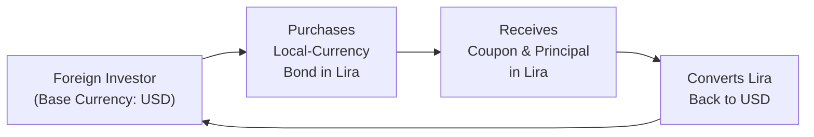
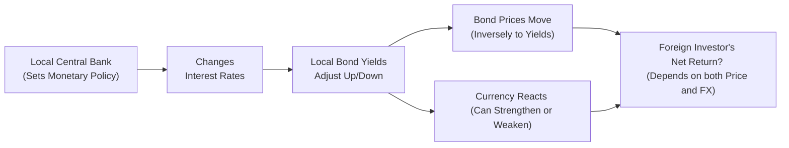

## Introduction

Let’s be honest: investing in international bonds can sometimes feel like a puzzle, with multiple pieces that do not always fit together in predictable ways. For instance, you’ve probably seen countries issuing debt in their own currency, while others prefer a strong foreign currency (like USD) to attract capital. Why do some choose local-currency debt and others choose “hard-currency” debt? Which is safer from an investor’s standpoint? More importantly, how do you, as a CFA Level II candidate (and a budding global bond analyst), parse the risk factors and do it quickly under exam pressure?

Below, we’ll dive into the nitty-gritty: local-currency vs. hard-currency debt. We’ll talk about currency risk, sovereign credit dynamics, liquidity constraints—and we’ll even check out a few real-life examples to help everything click. We aim to keep this grounded, a bit conversational, and definitely exam-relevant. So buckle up; let’s face the global bond universe head-on.

## Key Differences Between Local-Currency and Hard-Currency Debt

Local-currency debt is, as the name suggests, denominated in a country’s domestic currency (for instance, Brazilian real, Indian rupee, or Mexican peso). Hard-currency debt, on the other hand, is typically denominated in major reserve currencies such as the US dollar (USD), the euro (EUR), or the Japanese yen (JPY). For many international investors, “hard currency” is essentially code for a currency that is widely accepted, stable, and relatively less prone to severe devaluation in short periods.

• Local-Currency Debt:  
  – Issued in the issuer’s home currency.  
  – Currency risk mostly borne by foreign investors.  
  – Potential benefit if the currency appreciates against an investor’s base currency.  
  – Potential risk if local currency depreciates sharply.  

• Hard-Currency Debt:  
  – Issued in a commonly utilized global reserve currency (USD, EUR, JPY).  
  – Reduced exchange-rate volatility for the investor if the hard currency is closer to their base currency.  
  – Potentially higher default or restructuring risk if the issuer struggles to secure enough foreign currency reserves for coupon or principal repayment.  

This distinction already suggests that the choice of currency for a bond involves trade-offs between currency risk and default (credit) risk. If you’re an investor in, say, Berlin, buying euro-denominated emerging-market debt will spare you from worrying about exchange-rate fluctuations—at least in principle. But if that issuing country undergoes political turmoil and can’t scrape together enough euros, that’s a separate (and pretty big) can of worms.

## Currency Risk Challenges in Local-Currency Debt

If you’re a foreign investor buying local-currency bonds, the biggest headache is often currency risk. Let’s say your base currency is USD, and you’re buying a bond denominated in Turkish lira. Sure, the coupon might look juicy—maybe 15%—but the potential for the lira to weaken against the dollar is always in the background. If the lira depreciates by 10%, that big coupon might lose its shine once you convert everything back to USD.

### Visualizing Currency Risk

Here’s a quick diagram showing what that currency risk flow might look like:

In this flow:

• Step 1: An investor with a USD base currency decides to buy a Turkish lira bond.  
• Step 2: The bond coupons and principal are eventually paid in lira.  
• Step 3: The investor must convert the lira proceeds back into USD at prevailing exchange rates.  
• Step 4: This final step can introduce currency gains or losses.  

If that currency moves favorably for you—fantastic, you might harvest a higher total return. If it moves in the other direction, you can lose money even if the bond itself had relatively stable prices in local terms.

## Credit and Sovereign-Risk Dynamics

### Local-Currency Debt: Independence but With a Catch

When a government issues local-currency debt, it taps its domestic investor base and central bank. In many cases, a country is less likely to default on debt denominated in its own currency because, well, it theoretically has the power to “print” more money (though not without consequences like inflation or currency devaluation).

• Benefits for the issuer:  
  – Greater independence from external financing constraints.  
  – Lower direct exposure to global interest-rate fluctuations.  
  – Flexibility in monetary policy.  

• Risks to the investor:  
  – Inflation risk: If the issuer prints money aggressively to service debt, it can reduce the real value of coupon and principal payments.  
  – Currency devaluation risk: A glutted money supply can hammer exchange rates, leaving the investor stuck with a weakening local currency.  

### Hard-Currency Debt: Less Currency Risk for Investors but Higher Default Risk

Now, with hard-currency debt, the currency risk mostly shifts onto the issuer. Emerging and frontier-market governments often find it challenging to accumulate the foreign-exchange reserves necessary to meet obligations on USD or EUR debt. If their local economy sputters, exports dive, or foreign investment flows out, they may face default if they simply cannot pay a dollar or euro coupon.

• Benefits for the investor:  
  – Reduced exchange-rate volatility relative to the investor’s base currency (especially if it’s also USD or EUR).  
  – Potentially easier to trade or hedge in well-developed global markets.  

• Risks for the issuer:  
  – Increased default risk if foreign currency reserves are inadequate.  
  – Potentially higher interest costs because investors demand compensation for that default risk.  
  – Vulnerability to global macro cycles.  

### Balancing Act

So there’s a trade-off: local-currency debt can reduce the issuer’s immediate default risk but raises currency uncertainty for foreign investors; hard-currency debt stabilizes the investor’s currency exposure but heightens the issuer’s precariousness in times of economic stress.  

## Liquidity Considerations

Liquidity is that subtle but critical part of fixed-income investing. If you get stuck with a bond that nobody wants to trade or that you can’t sell easily, you’re going to pay for it via wider bid-ask spreads and less transparent pricing.

- **Local-Currency Markets**:  
  • Potentially less liquid.  
  • Familiar to local investors, but foreign investors may face higher transaction costs.  
  • Trading volumes can be smaller and more volatile, particularly during periods of heightened political or economic uncertainty.  

- **Hard-Currency Debt Markets**:  
  • Often trade on global platforms with more consistent visibility.  
  • Typically deeper secondary markets for USD- or EUR-denominated emerging-market bonds, especially sovereigns.  
  • Tighter spreads, lower transaction costs, and better market depth (though not guaranteed in crisis conditions).  

Occasionally, you’ll see that a local-currency bond in a major emerging-market country (like China or India) might be highly liquid in its domestic market but less so internationally due to capital controls or investor restrictions. Meanwhile, a dollar bond from the same issuer might be actively traded, with real-time quote availability in London or New York. So, as an investor, it’s a balancing act: higher yields in local currency markets might come with tricky liquidity constraints.

## The Role of Central Banks and Monetary Policy

Here’s another key difference: in local-currency debt markets, the local central bank’s monetary policy is front and center. When central banks adjust interest rates, they naturally alter the yield curve for local-currency bonds. For foreign investors, sudden changes in these local rates can produce large mark-to-market fluctuations in bond prices—on top of currency swings.

• Tightening monetary policy to fight inflation often raises local yields, leading to bond price declines in the short term.  
• Easing monetary policy can drive yields down, boosting bond prices, but may also weaken the currency.  

### Diagram: Policy Shifts and Foreign Investor Returns

Monetary policy changes can produce a “double-edged sword” effect on a foreign investor. An interest rate hike might support the local currency but depress bond prices; a rate cut might boost bond prices but undermine the currency.

## Case Studies: Emerging Market Issuers with Dual Debt

Over the years, many emerging market economies have taken a mixed approach to raise funds. Let’s consider (in a simplified manner) a hypothetical sovereign named Republic of Mustaria. Mustaria issues:

• A local-currency bond (the Mustarian Kron) with an 8% coupon.  
• A USD-denominated Eurobond with a 5% coupon.  

From an investor’s vantage point, the Mustarian Kron bond yields 8%, but that’s not the end of the story. If Mustaria experiences currency depreciation of 4% annually versus the investor’s base currency, that effective yield advantage shrinks. And if it depreciates more sharply—say 10% in a crisis—suddenly your seemingly appealing yield might feel like a disappointment.

On the flip side, the USD bond with a 5% coupon might look stable, but if Mustaria struggles to earn export revenue in a global downturn, the risk of default or credit-rating downgrades could pressure bond prices. Consequently, yields for USD-denominated Mustarian debt might spike in the market as investors demand higher compensation for the heightened credit risk.

## Exam Tips: Navigating Local vs. Hard-Currency Debt Questions

• **Identify the Relevant Risk**: Ask yourself, is the investor worried about exchange rates (local-currency bond) or the issuer’s ability to raise foreign reserves (hard-currency bond)?  
• **Check Monetary Policy Impact**: For local-currency debt, pay attention to shifts in local interest rates, inflation, or central-bank independence.  
• **Look for Liquidity Clues**: The exam might include subtle references to how frequently a bond trades, or mention big swings in bid-ask spreads in local vs. external debt markets.  
• **Beware of Political or Sovereign Risk**: Hard-currency defaults are serious. But if a local currency collapses, foreign investors also take a hit. The exam might ask which scenario leads to higher yields or how credit rating agencies interpret each type of issuance.  
• **Calculations**: You may see item sets testing currency conversions, or yield spreads on local vs. USD debt. Be comfortable with formula-based conversions:  
  (1 + R_local) × (1 + R_fx) – 1 ≈ Effective Return  

  Where R_local is the local bond return and R_fx is the percentage change in the exchange rate.  

## Glossary Recap

• **Local-Currency Debt**: Bonds issued in an issuer’s home currency. Currency risk is borne by foreign investors.  
• **Hard-Currency Debt**: Bonds denominated in a major global currency (often USD, EUR, JPY), mitigating currency volatility for investors but passing foreign exchange reserve risk to the issuer.  
• **Sovereign Risk**: The risk a government may default or restrict capital flows. Pay special attention to countries with poor fiscal metrics or dwindling foreign exchange reserves.  
• **Liquidity Premium**: The extra yield demanded by investors for holding less liquid bonds that may be harder to sell at a fair price.  

## Best Practices and Common Pitfalls

• For local-currency bonds, beware of hidden political or policy influences. Central banks might cap yields artificially or institute controls that affect repatriation of coupons.  
• For hard-currency bonds, remember that yields can swing fast if the sovereign’s fundamentals change (like a crash in commodity exports).  
• In an exam vignette, look for mention of capital controls, currency pegs, or big shifts in a country’s trade balance. These often hint at where the exam question is going.  
• Always interpret yields in the context of real return (yield minus inflation) and currency moves.  

## References and Further Reading

• IMF Global Financial Stability Reports exploring sovereign debt structures:  
  https://www.imf.org  
• World Bank guidelines on local-currency bond market development:  
  https://www.worldbank.org  
• Standard & Poor’s and Moody’s guides on sovereign credit ratings.  
• “Managing Emerging Market Debt” by the CFA Institute Research Foundation.  

---

## Test Your Knowledge: Local vs. Hard-Currency Debt Quiz



### Which statement best describes a key distinction between local-currency and hard-currency debt?

- [ ] Local-currency debt always carries lower risk than hard-currency debt, regardless of issuer.  
- [x] Local-currency debt shifts currency risk to foreign investors, whereas hard-currency debt can shift default risk to issuers.  
- [ ] Hard-currency debt is generally issued by central banks only.  
- [ ] Hard-currency bonds are automatically more liquid in all market conditions.  

> **Explanation:** Local-currency debt denominates payments in the issuer’s domestic currency, meaning foreign investors face exchange-rate volatility. Meanwhile, hard-currency debt can expose the issuer to a higher risk of default if foreign reserves are inadequate.

### A foreign investor holds an emerging-markets bond in the local currency. If the local currency depreciates sharply against the investor’s base currency, what is the most direct impact on the investor’s returns?

- [x] The investor’s effective return decreases when converted back to the base currency.  
- [ ] The bond's local yield automatically increases.  
- [ ] The bond's coupon payments become worthless.  
- [ ] The bond is immune to interest-rate changes.  

> **Explanation:** When a local currency depreciates, the value of the coupons and principal (denominated in that currency) falls relative to the investor’s home currency, shrinking effective returns.

### What primary factor increases the potential for sovereign default on a hard-currency bond?

- [ ] The issuer’s central bank can print more money in a hard currency.  
- [x] Scarcity of foreign-exchange reserves needed to make payments in that currency.  
- [ ] Demand for local currency is always high.  
- [ ] Government budget surpluses.  

> **Explanation:** Issuers need sufficient foreign currency reserves to service debt denominated in a hard currency. Inadequate reserves can increase default risk, even if the country’s local currency is stable.

### When interest rates rise significantly in the local market of an emerging economy, which type of bond is more likely to experience a larger immediate price decline?

- [x] Local-currency bonds, as they are directly sensitive to the local interest rate environment.  
- [ ] Hard-currency bonds, because they do not depend on emerging markets’ rates.  
- [ ] Neither bond is affected.  
- [ ] Both respond identically, with no difference.  

> **Explanation:** Local-currency bond prices move inversely with local interest rates. Hard-currency bonds may be more sensitive to external market conditions or global benchmark rates.

### Which of the following is a likely advantage for an emerging market issuing local-currency debt instead of hard-currency debt?

- [x] Reduced reliance on foreign reserves to meet coupon obligations.  
- [x] Greater freedom in shaping domestic monetary policy.  
- [ ] Elimination of inflation risk.  
- [ ] Guaranteed lower cost of borrowing.  

> **Explanation:** Local-currency debt lets a government avoid constantly replenishing foreign exchange reserves. It also offers the sovereign more independence in monetary policy. However, local-currency debt does not remove inflation risk, nor does it guarantee lower borrowing costs.

### A foreign investor is comparing two bonds from the same emerging market sovereign: a local-currency bond yielding 10% and a USD-denominated bond yielding 6%. If the local currency is expected to depreciate 5% annually against the investor’s base currency, what is the approximate effective yield of the local-currency bond?

- [x] (1 + 0.10) × (1 – 0.05) – 1 = 4.50%  
- [ ] 6.00%  
- [ ] 5.00%  
- [ ] 10.50%  

> **Explanation:** The approximate effective return formula is (1 + R_local) × (1 + R_fx) – 1. Since the local currency is depreciating, R_fx is negative 5%. Hence: (1 + 0.10) × (1 – 0.05) – 1 = 1.10 × 0.95 – 1 ≈ 0.045 or 4.5%.

### In periods of local liquidity constraints, foreign investors in local-currency debt may face:

- [x] Wider bid-ask spreads.  
- [ ] More transparent pricing.  
- [x] Higher transaction costs.  
- [ ] Perfectly stable bond prices.  

> **Explanation:** Liquidity constraints lead to limited trading volumes, which typically increases bid-ask spreads and transaction costs. Prices may also become more volatile.

### How might a strong central bank commitment to targeting inflation influence local-currency bond yields?

- [x] It can lower local-currency bond yields by stabilizing inflation expectations.  
- [ ] It guarantees a currency appreciation.  
- [ ] It eliminates sovereign default risk.  
- [ ] It causes immediate capital controls to be implemented.  

> **Explanation:** A central bank that credibly fights inflation helps keep inflationary expectations anchored, often leading to lower nominal yields on local-currency bonds.

### Which choice best describes the trade-off in local-currency debt from an investor’s standpoint?

- [x] Higher yields but the potential for currency devaluation.  
- [ ] No currency risk and no default risk.  
- [ ] Guaranteed zero inflation.  
- [ ] Full liquidity in all market conditions.  

> **Explanation:** Local-currency yields in emerging markets may be attractive but come with the threat of depreciation. There is no guarantee of zero inflation or total liquidity.

### True or False: Hard-currency bonds completely eliminate sovereign default risk for foreign investors.

- [ ] True  
- [x] False  

> **Explanation:** Hard-currency bonds do not remove the possibility of default. They merely shift the currency exposure; the issuer may still face a default if it fails to accumulate the necessary foreign currency.


