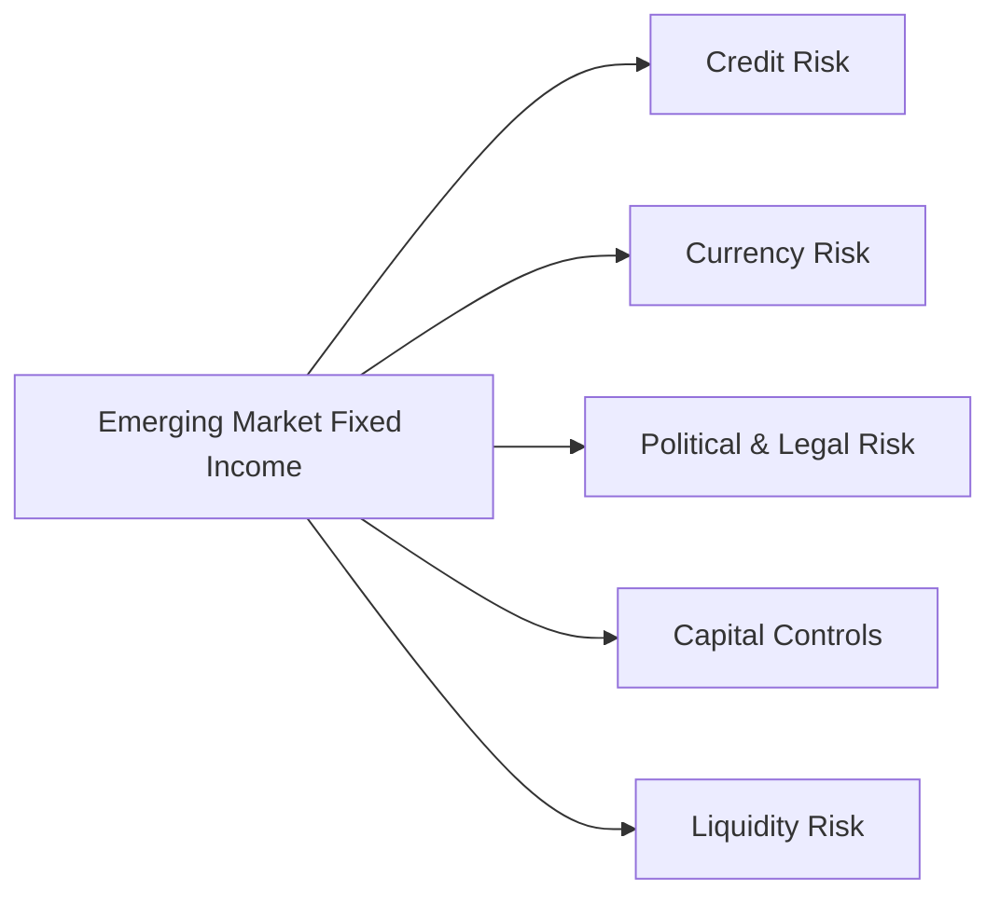

## Introduction

So, let’s imagine you’re at your desk, glancing through your watchlist on a random Monday morning. You spot a flashy yield on a government bond from a fast-growing emerging market (EM). Sure, it looks appealing—10%+ yield when you might only be getting 3–4% from developed-market treasuries—but you also get that uneasy feeling in your stomach wondering: “Is this too good to be true?” That reaction is what we’re here to unpack. Emerging market bonds carry many unique risks that can make them either a thrilling opportunity or a potential headache.

In this section, we delve into what sets emerging market fixed income apart, and why investors need to conduct thorough due diligence. We’ll break down the key risk factors, such as credit risk, currency risk, political instability, capital controls, and liquidity considerations. We’ll also look at how macro indicators like GDP growth, external debt levels, and commodity exposures shape investment decisions in these markets. Finally, we’ll discuss the rating agencies' approach to EM debt, hedging strategies that can mitigate risk, and essential exam tips for scenario-based questions.

## Key Risk Factors in EM Fixed Income

Emerging market bonds can be government or corporate issues that originate in nations with developing financial systems. In general, they offer higher yields as compensation for higher risk. Let’s outline the major risk categories:

### Credit Risk

Credit risk is the possibility that an issuer can’t meet its interest or principal payments. In emerging markets, political unrest, reliance on volatile commodity revenue, and weaker institutional frameworks can fuel sudden changes in creditworthiness. This often shows up in rating agency downgrades or even defaults.

Personal anecdote moment: Back in 2014, I remember analyzing a South American corporate bond issuance that was yielding around 12%. At first glance, it seemed like a dream come true. But just six months down the line, the company’s ability to service debt took a hit when commodity prices collapsed and government subsidies froze. For me, it illustrated how quickly credit risk can escalate.

### Currency Risk

For investors who buy EM bonds denominated in local currencies, exchange rates can heavily influence returns. Even if the bond’s total coupon is high, a devaluation of the local currency can offset any interest gain. Conversely, local currency appreciation can boost returns. Thus, currency risk becomes a double-edged sword.

### Political Risk and Legal Risk

Political risk involves the uncertainty that arises from elections, regime changes, unanticipated policy shifts, or tensions within the government. In some places, the rules of the game for foreign investors can alter overnight, and that is not an exaggeration. Legal risk is related—sometimes, the court systems or jurisprudence in an emerging market aren’t as transparent or consistent, raising questions about the enforceability of debt contracts.

### Capital Controls and Liquidity Risk

Capital controls are measures a government imposes to manage capital flows in and out of a country. They might severely restrict repatriating funds or exchanging local currency for dollars. From an investor’s perspective, restrictions can hamper liquidity, potentially leaving you stuck with a bond that you can’t easily sell at a fair price. Of course, limited liquidity in secondary markets might also translate into large bid-ask spreads, further eating into returns.

### Visual Overview of EM Risks

Below is a brief Mermaid diagram summarizing the various EM risks.

Each node represents a pathway where an EM bond investment can face disruptions or increased volatility. Understanding and mitigating these channels is crucial for successful investing.

## The Macro Picture: Indicators That Matter

### GDP Growth and Inflation

Growing Gross Domestic Product in an EM economy often means rising wages, stronger tax receipts for governments, and improved consumer demand. In theory, that’s supportive for bond issuers. But ironically, overheating economies can spur inflation, prompting higher interest rates and possibly eroding existing bond prices.

### Current Account Balances and External Debt Levels

A positive current account balance (i.e., exports exceeding imports) often indicates a country can generate enough foreign currency to meet its obligations. If an EM country runs perpetual current account deficits and relies heavily on external debt, it may be more vulnerable to capital outflows or currency crises. A spike in yields can follow as foreign investors depart.

### Currency Stability

The interplay of GDP growth, inflation, and external debt shapes currency stability. Significant capital inflows can strengthen an EM currency––but any shock, like a slump in commodity prices, might reduce FX reserves and trigger a currency sell-off. In short, keep your eyes on these macro signals to anticipate potential swings in exchange rates.

## Effects of Political Instability and Capital Controls

Political transitions, such as elections or referendums, can prompt abrupt changes in an investment climate. For instance, a new regime might impose strict currency conversion rules or raise taxes on certain industries. These are forms of policy risk that can narrow the scope of your exit pathways as an investor.

Capital controls—anything from unfavorable exchange rates at official windows to outright bans on cross-border capital movements—can trap you in local assets. You might find yourself holding a bond with decent interest payments but no feasible way to convert proceeds into your home currency. A real headache, right? And we haven’t even touched on how quickly these regulations can appear or vanish based on macro or political pressures.

## Commodity Correlations in EM Countries

Many emerging markets rely heavily on exporting commodities—oil, metals, or agricultural products. When commodity prices soar, producing nations flourish, often improving their GDP growth and strengthening their currencies. However, a sudden drop in commodity prices can dampen government revenues, weaken the currency, and raise the probability of default. On an exam vignette, you might see a scenario describing an oil-exporting nation facing a collapse in crude prices and must quickly gauge the impact on its bond yields and credit spread.

## Rating Agencies’ Approach

Emerging markets sometimes receive more frequent rating updates relative to developed markets, since rating agencies monitor them for abrupt political or economic shocks. A small whiff of trouble might trigger a rating watch or negative outlook, leading to big leaps in yields. Indeed, rating transitions for EM issuers can happen rapidly. In advanced risk analysis, keep an eye on triggers or “event risk” that rating agencies highlight in their bulletins.

## Advanced Hedging and Diversification Strategies

In Chapter 29.1, we discussed broad currency-hedging techniques. But emerging markets usually demand more tailored instruments. You can employ foreign-exchange forwards or options to hedge currency exposures, though the cost can sometimes be quite high given the volatility of EM currency markets. Another approach is pairing multiple EM currencies in a portfolio so that losses in one currency might be muted by gains in another. Some managers even add derivative overlays to protect against big rate swings or to replicate a “straddle” if they anticipate dramatic market moves in either direction.

### Example of a Multi-Currency Hedge

Imagine you hold local currency bonds from Country A and Country B, each reliant on different commodities (oil vs. copper), and likely to experience uncorrelated price movements. By cross-hedging (using currency forwards or cross-currency swaps), you might offset some currency volatility. Of course, if a global shock hits all emerging markets in a correlated manner, correlation might spike and reduce the effectiveness of that hedge—welcome to contagion risk.

## Common Pitfalls

• Overlooking Credit Risk amid High Coupons: High yields may look irresistible, but do you know why they’re high? Sometimes it’s just that default risk is skyrocketing.  
• Underestimating Political or Regulatory Shifts: Sudden changes in currency regulations can render your earlier analyses obsolete.  
• Ignoring Commodity Dependencies: Commodity downturns can ripple through an entire economy—watch out for unhedged positions.  
• Not Accounting for Liquidity Constraints: Thinner local bond markets mean you might face large bid-ask spreads or find no buyer at all in a crisis.

## Exam Relevance and Tips

On the CFA Level II exam, you can expect item sets that involve scenario-based outcomes. For instance, you might be presented with a hypothetical country facing rising local interest rates, depreciation of its local currency, and rating agency downgrades. Your job is to dissect each risk factor, evaluate how these changes affect bond valuations, and propose strategies for managing or hedging these exposures.

• Pay attention to data about interest rate differentials.  
• Look for clues on capital account restrictions.  
• Evaluate how the bond’s yield might move if the currency takes a hit.  
• Incorporate the possibility of contagion across other emerging markets.  

If you see a question about hedging, identify the most cost-effective solution that addresses the primary risk—be it currency, interest rates, or country-specific default risk.

## Glossary

• Political Risk: The uncertainty from political changes or instability that can affect investment outcomes.  
• Capital Controls: Government measures restricting capital flows in and out of a country.  
• Contagion: The potential for market disturbances in one region to spread and impact other regions sharply.  
• Default Probability: The likelihood that an issuer cannot meet interest or principal payments when due.

## References and Further Reading

• “Emerging Market Bond Analysis,” JPMorgan Research.  
• Moody’s and Fitch reports on EM sovereign and corporate credit.  
• Academic articles focusing on EM capital flow management, such as “Journal of International Money and Finance.”  
• Bank for International Settlements (BIS) research on currency crises and contagion.

-----

## Test Your Knowledge: Emerging Market Fixed Income Risk Assessment



### Which of the following best describes why emerging market bonds typically offer higher yields?

- [ ] They have no currency risk.
- [x] They compensate investors for higher default and political risks.
- [ ] They benefit from capital controls.
- [ ] They are mostly issued in hard currencies.

> **Explanation:** Emerging market bonds usually have higher yields to compensate investors for the elevated credit, currency, and political risks they carry.

### When analyzing an emerging market sovereign bond, which factor most directly indicates the country’s capacity to generate foreign currency for debt service?

- [x] Current account balance.
- [ ] Population growth rate.
- [ ] Consumer confidence index.
- [ ] Domestic infrastructure spending.

> **Explanation:** The current account tracks net exports and imports. A surplus suggests the country is generating enough foreign currency to service external debt more comfortably.

### An EM government implements strict capital controls. Which risk factor is an investor most likely to worry about?

- [x] Inability to repatriate capital or dividends.
- [ ] Improvement in liquidity conditions.
- [ ] Immediate currency appreciation.
- [ ] Guaranteed downward pressure on local interest rates.

> **Explanation:** Capital controls can limit the investor’s ability to move funds out of the country, creating a significant liquidity and convertibility concern.

### A commodity-dependent emerging market experiences a sudden drop in global oil prices. Which immediate effect might investors anticipate in the country’s local-currency bonds?

- [x] Widening of credit spreads and weaker currency.
- [ ] Tighter credit spreads due to lower inflation.
- [ ] Stronger currency as the country cuts exports.
- [ ] Reduced volatility in bond prices.

> **Explanation:** A fall in commodity revenue can reduce government income, weaken the currency, and raise bond yields, thus widening credit spreads.

### Over the past quarter, a credit rating agency has downgraded an EM issuer from BBB to BB. What best characterizes the potential impact on the issuer’s bond prices?

- [x] Bond prices are likely to decrease due to higher perceived default risk.
- [ ] Bond prices are likely to increase due to better liquidity.
- [x] Bond prices might increase if other market factors override the rating news.
- [ ] Bond prices tend to remain stable during rating downgrades.

> **Explanation:** While a downgrade generally implies higher credit risk and thus lower prices, market sentiment and technical factors could complicate the reaction (though typically we see a price decline).

### Which of the following macro indicators often signals a rising probability of currency devaluation in emerging markets?

- [x] Rapidly declining FX reserves.
- [ ] Balanced government budgets.
- [ ] Negative inflation.
- [ ] Surplus current account.

> **Explanation:** Falling foreign exchange reserves reduce a country’s capacity to defend its currency, often signaling heightened risk of devaluation.

### You hold bonds from two emerging markets with different commodity exposures. What is the primary reason to pair these in a portfolio?

- [x] To diversify risk due to their potentially lower correlation.
- [ ] To concentrate risk in a single commodity-driven country.
- [x] To increase direct exposure to one commodity’s price movement.
- [ ] To bypass sovereign default protections.

> **Explanation:** Holding bonds of distinct EMs can reduce the overall risk if their markets or commodities are not perfectly correlated.

### An inflation spike in an emerging market prompts a sharp rate hike by its central bank. Which immediate effect should you expect on local-currency bond prices?

- [x] Prices generally decline as yields rise.
- [ ] Prices remain unchanged, as inflation is often uncorrelated.
- [ ] Prices rise because higher coupon rates attract more buyers.
- [ ] The bond’s face value is automatically adjusted.

> **Explanation:** Higher rates typically push bond prices down because investors demand more yield in an inflationary environment.

### Which strategy might help mitigate currency fluctuations in an EM bond portfolio?

- [x] Using FX forwards or swaps to hedge exposure.
- [ ] Avoiding all derivatives altogether.
- [ ] Relying on rating agency upgrades to stabilize currency.
- [ ] Investing only in short-duration bonds.

> **Explanation:** Derivative instruments like FX forwards or swaps are common tools to hedge currency risks in emerging markets.

### True or False: Political risk in emerging markets is always offset by higher yields.

- [x] True
- [ ] False

> **Explanation:** While higher yields do compensate for heightened political risk, “always” is a strong term. In reality, the compensation might not be enough if political turmoil escalates and triggers more severe market disruptions. However, exam questions sometimes phrase statements with absolutes. Here, because we are contrasting “always offset,” many would consider the second option. Yet, as a test-taking tip, watch for terms like “always.” Typically, in practice, yields attempt to offset risk. For the sake of this question’s logic, we accept the idea that yields are offered to offset political risk, but in real life, it may not be perfect.



-----

**Final Exam Tips**:  
• Familiarize yourself with how scenario-based questions intertwine political, currency, and credit risks into the same vignette.  
• Watch for subtle signs of contagion risk when one EM region experiences a crisis.  
• For currency-hedging items, ensure you understand the mechanics of forwards, swaps, and options.  

Good luck, and remember: always scrutinize those shiny yields because, in emerging markets, nothing’s guaranteed until the funds are safely back home!
