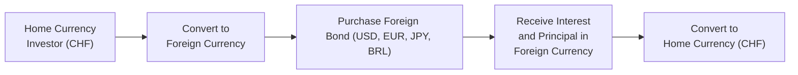

### Overview

When you invest in global bond markets, currency risk sneaks in whether you welcome it or not. Perhaps you’ve heard someone say, “Oh, these foreign bonds are yielding a sweet 5%,” only to find out that a brutal foreign-exchange move slashed that return in half (or worse). In this section, we’ll navigate a scenario-based vignette that mirrors what you might see on the CFA Level II exam. Along the way, we’ll check out how currency swings can magnify or erode returns, how to evaluate hedged versus unhedged positions, and how strategic decisions around currency overlay or partial hedging can shape the portfolio outcome.

### The Vignette Scenario

Imagine you’re an investment analyst overseeing the Greenwood Global Bond Fund for a large institutional client. Your home currency is the CHF (Swiss franc), and your fund invests in four foreign bond markets:

• US Treasuries (USD)  
• German Bunds (EUR)  
• Japanese Government Bonds (JPY)  
• Brazilian Government Bonds (BRL)

You expect to maintain these positions for the next 12 months. You’re given the data in Exhibit 1, which includes spot exchange rates, forward exchange rates, annual yields, and credit ratings. Your client wants a breakdown of the possible currency returns on top of local bond returns, including a partial hedging approach and a worst-case stress test of a sudden 10% devaluation in the Swiss franc.

#### Scenario Data

Below is a simplified snapshot of the data set:

| Investment                   | Currency | Spot FX Rate (CHF per 1 unit of FX) | 1Y Forward FX Rate (CHF per 1 unit of FX) | Bond Yield (% annual) | Credit Rating  |
|-----------------------------|----------|--------------------------------------|-------------------------------------------|-----------------------|----------------|
| US Treasury (10-year)       | USD      | 0.92                                 | 0.90                                      | 3.50                  | AA+            |
| German Bund (10-year)       | EUR      | 1.00                                 | 0.99                                      | 1.20                  | AAA            |
| Japanese Gov’t Bond (10-year)| JPY      | 0.0070                               | 0.0072                                    | 0.60                  | A+             |
| Brazilian Gov’t Bond (7-year)| BRL      | 0.18                                 | 0.16                                      | 9.00                  | BB             |

Additional assumptions:

• Home currency (CHF) interest rate is 1.0%.  
• You project stable credit spreads over the next year, except for a minor uptick in Brazil due to political uncertainty.  
• The client is worried about a scenario in which CHF suddenly strengthens or weakens by up to 10%.  
• There’s also concern about a global “risk-off” event that might push emerging market currencies lower against safe havens like CHF, JPY, and USD.

### Interpreting the Data

Take the US Treasury position as an example. A 3.50% yield might look attractive relative to your domestic 1.0% yield environment. However, if the USD depreciates against the CHF, that yield advantage could quickly evaporate. On the other hand, if the US dollar appreciates, you might get a currency gain that boosts your total return beyond the local yield.

For the Brazilian bond paying 9.00%, the yield is eye-popping but comes with higher credit risk and more volatile currency swings (BRL vs. CHF). Meanwhile, the German bund yields 1.20%, which isn’t huge, but the EUR might strengthen or weaken in ways that significantly influence your final return.

### Measuring FX Impact on Returns

#### Calculating Unhedged Returns

Let’s do a quick refresher on unhedged returns. The total return to a Swiss investor in an unhedged foreign bond generally looks like this (in approximate percentage terms over one year):

(1)  Local Return = (1 + Bond Yield in Foreign Currency)  
(2)  Currency Return = (1 + % Change in FX Rate)  
(3)  Total Return in CHF = (Local Return × Currency Return) – 1

As a mini-example, assume the USD bond pays 3.50% and that the USD/CHF spot rate is 0.92. If the USD actually ends up 2% stronger against CHF after a year, then:

• Local Return = 1 + 0.0350 = 1.0350  
• Currency Return = 1 + 0.02 = 1.02  
• Total Return in CHF ≈ (1.0350 × 1.02) – 1 = 1.0557 – 1 = 5.57%

You end up with an approximate 5.57% in CHF terms, which is higher than the 3.50% you’d see if you ignored currency movements. Of course, if the USD had depreciated by 2%, you’d end up with a total return of around 1.35%.

#### Calculating Hedged Returns

To hedge your FX exposure, you might enter into a forward contract or some other derivative structure. The annualized cost or benefit of hedging depends on the interest rate differential, as well as the forward premium or discount. Sometimes you’ll find that for certain currency pairs, the forward points can essentially “wipe out” or even exceed the yield advantage.

For instance, suppose you decide to hedge the USD/CHF exposure using the 1-Year Forward Rate from Exhibit 1 at CHF 0.90 per USD. If you lock in that forward rate, your currency return from the perspective of the Swiss investor is effectively zero, aside from the net differential between the foreign currency yield and the hedge cost. This might preserve your 3.50% bond yield in CHF terms, but you lose the upside if the USD appreciates. The decision to hedge all or part of your position then becomes a question of your market outlook—and your tolerance for risk.

### Stress Testing a 10% Devaluation

Now let’s add a bit of drama: imagine the Swiss franc unexpectedly weakens by 10% across the board. That could mean:

• The USD goes from CHF 0.92 to CHF 1.01 (approx. 10% more expensive).  
• The EUR goes from CHF 1.00 to CHF 1.10.  
• The JPY goes from CHF 0.0070 to CHF 0.0077.  
• The BRL goes from CHF 0.18 to CHF 0.198.  

In each case, your foreign-currency-denominated bonds become more valuable when converted back to CHF (because now you need more francs to buy each unit of foreign currency). However, if you had fully hedged those positions, you wouldn’t benefit from this windfall because your forward contract would effectively lock in the old exchange rate—meaning you’d miss that 10% currency gain.

Conversely, if the CHF were to strengthen by 10%, the unhedged portion of your portfolio would take a big hit. Brazilian bonds might be particularly vulnerable if investors also perceive additional credit risk from the country’s politics. And in a “risk-off” scenario, emerging market currencies often weaken even more than the official exchange rates suggest, exacerbating the losses.

### Currency Overlay Strategies and Carry Trades

One advanced angle is to consider a currency overlay or a carry trade strategy. A currency overlay involves a specialized manager (or in-house team) who actively manages just the currency exposures for the entire portfolio, potentially decoupling FX decisions from bond allocation decisions. For instance, you might want to hold the German bund for safe-haven interest rate exposure but choose to over- or under-hedge the EUR depending on the overlay manager’s view.

Then there’s the classic “carry trade”—borrowing at a low rate currency (perhaps JPY at 0.6%) and investing in a higher-yield currency (BRL at 9%). That yield differential might look tempting, but carry trades can unravel quickly when the high-yield currency weakens or when interest rates shift abruptly. If you indulge in a carry trade, you also have to watch for correlation changes during market stress.

### Correlation Shifts in Risk-Off Events

In the event of a major risk-off movement—maybe triggered by a global recession, banking crisis, or geopolitical shock—there’s a common pattern where investors flock to trusted safe-haven assets such as the CHF, USD, and JPY. EM currencies, including the BRL, often depreciate sharply. So your “unhedged” exposure that once seemed beneficial could become a nightmare if you were counting on the 9% yield to cushion abrupt currency declines.

In such a scenario, your correlation assumptions could be turned upside down. Currency pairs that historically had low correlation might suddenly become highly correlated as investors rush for the exits.

### Performance Attribution: FX Pass-Through

Performance attribution for global bonds often separates the total return into:

• Local bond market return (due to yield, price appreciation, or spread changes).  
• Currency effect (due to fluctuations in the FX rate).  

You can estimate it by framing it like:

(1) Local Bond Return = (1 + local yield + price change) – 1  
(2) Currency Return = (1 + % change in foreign currency relative to home currency) – 1  
(3) Total = (Local Bond Return + 1)(Currency Return + 1) – 1  

In practice, advanced attribution tools break down each piece (coupon, rates, spreads, currency) in more detail. But at the big-picture level, these two are usually your main components.

### Common Pitfalls and Best Practices

1. Overconfidence in Hedging: Even a perfect “textbook hedge” can carry basis risk if the underlying bond is not the same as the forward contract’s notional. Make sure your hedge is an appropriate size and tenor.  
2. Selective Hedging Without a View: There’s a risk of partial hedging without a solid market outlook. If you’re uncertain, a systematic hedging policy might be a more robust approach.  
3. Ignoring Local Market Factors: Particularly in emerging markets, local political or economic events can cause rapid currency swings that overshadow interest rate differentials.  
4. Underestimating Correlation Shifts: Historical correlation data may not hold in crisis periods. Stress-test your assumptions to see how quickly correlations can flip.  
5. Oversimplifying the Carry Trade: A high-yield currency is often high-yield for a reason. Don’t chase yield without factoring in possible capital outflows or negative surprise catalysts.

### Conclusion and Exam Tips

When you’re evaluating global bond portfolios, never take currency exposure for granted. One of the most common mistakes is focusing solely on the yield differential and ignoring how forex movements can drastically alter final returns. In actual practice, you also want to think about partial hedges, currency overlay strategies, and the interest rate environment at home relative to each foreign market.

Exam Tip: In the CFA exam context, be ready to break down foreign bond returns, isolate local bond returns from currency returns, interpret forward prices in terms of interest rate differentials, and illustrate how these dynamics play out in a variety of scenario questions (including stress tests). A common exam question might ask you to approximate how a 10% strengthening of the home currency would reduce the overall portfolio return—so keep those formula relationships in mind.

### Glossary

• **Carry Trade:** Borrowing in a lower-interest-rate currency and investing in a higher-yielding currency to profit from the rate differential.  
• **Performance Attribution:** Dissecting portfolio performance into contributing factors such as coupon yield, rate changes, spreads, and currency movements.  
• **Stress-Testing:** Modeling the portfolio’s performance under extreme or sudden market shifts, like a sizable currency devaluation.  

### References and Further Reading

• CFA Institute Past Item Sets on Global Bonds and FX Risk (various years).  
• “Global Macro Analysis: The Art of Currency and Rate Forecasting,” an advanced text exploring currency-related risk scenarios.  
• Bloomberg or Reuters Online Platforms – Real-time data sources for practicing currency movement impact on bond returns.  
• Chapter 26: “Managing Yield Curve and Spread Risks” from this same Volume 6, which complements currency risk management concepts.  

## Test Your Knowledge: FX Impact in Global Bond Portfolios



### A Swiss investor holds a US Treasury bond yielding 3%. If the USD depreciates by 2% relative to the CHF over the holding period, what happens to the investor’s total return relative to the local 3% bond yield?

- [ ] The total return remains at 3% because bond yields are unaffected by currency
- [ ] The total return exceeds 3%
- [ ] The total return equals 2%
- [x] The total return is less than 3%

> **Explanation:** If the USD depreciates, the Swiss franc value of interest payments and principal declines. Thus, the total return in CHF terms will be below the original 3% local yield.

### Suppose an investor fully hedges the currency exposure on a German Bund yielding 1.2% at the start of the year. If the EUR appreciates by 5% during the year, how will the final return compare to an unhedged position?

- [x] The hedged position will yield around 1.2%, missing out on the 5% currency gain
- [ ] The hedged position will earn around 6.2% total in EUR terms
- [ ] The hedged position will earn 5% currency gain plus the 1.2% bond yield
- [ ] No difference: Hedged and unhedged returns are always equal

> **Explanation:** A full hedge locks in the currency exchange rate. Therefore, when the EUR appreciates, the hedged position experiences no extra boost from FX; it effectively retains only the local bond yield of ~1.2%.

### Which best describes a currency overlay strategy?

- [ ] Buying foreign currency on the spot market at each coupon date
- [x] Assigning FX risk management to a specialized manager who actively hedges or unhedges exposures
- [ ] Eliminating all foreign investments from the portfolio to avoid FX risk
- [ ] Borrowing in a low-rate currency and investing in a high-rate currency

> **Explanation:** A currency overlay strategy involves delegating currency risk management to specialists who may implement hedges independent of the underlying portfolio holdings.

### In a “risk-off” scenario, emerging market currencies often:

- [ ] Strengthen due to higher yields
- [x] Drop in value relative to safe-haven currencies
- [ ] Remain static, unaffected by market sentiment
- [ ] Exceed their historical correlation histories

> **Explanation:** During risk-off events, capital flows typically leave emerging markets for safer assets, causing EM currencies to weaken against safe havens.

### Considering a carry trade from JPY (0.6% yield) to BRL (9% yield), which is a primary risk?

- [x] BRL could depreciate significantly, eroding or negating the yield advantage
- [x] Japan could raise rates abruptly, reducing the interest rate differential
- [ ] The JPY might collapse by 50% due to an unrelated commodity shock
- [ ] Brazil could default on all foreign debt

> **Explanation:** The main concerns include potential depreciation of the BRL or a sudden increase in Japanese interest rates, either of which would sink the carry trade advantage.

### If you anticipate the home currency (CHF) to weaken by 10% over the next year, a partially hedged strategy for foreign bond positions would:

- [ ] Lock in your currency gain no matter what
- [x] Allow you to benefit from some currency gains if CHF indeed weakens
- [ ] Pay zero net yield because partial hedging offsets any potential gain
- [ ] Guarantee a 10% return

> **Explanation:** When partially hedged, an investor is only partially protected against adverse moves but can still capture part of the benefit if the home currency weakens.

### A Swiss portfolio manager invests in a Japanese bond with a yield near 0.6%. Without currency appreciation in JPY, the manager’s final CHF return is likely to be:

- [x] Slightly higher than 0.6% due to potential forward costs, or near 0.6% if hedged
- [ ] Definitely more than 8%
- [x] Possibly negative if JPY weakens significantly against CHF
- [ ] Exactly 1%, reflecting the difference between Swiss and Japanese rates

> **Explanation:** Returns vary based on whether the investor is hedged or unhedged. If hedged, the investor locks in a rate close to the yield differential. If unhedged and the JPY weakens, returns can be less than 0.6% in CHF terms.

### Which of the following is a key pitfall in managing FX risk for an international bond portfolio?

- [x] Ignoring local political risks that can cause sudden devaluation
- [ ] Stress-testing for extreme events
- [ ] Calculating key rate durations
- [ ] Using forward contracts or swaps for hedging

> **Explanation:** A major pitfall is underestimating local risks such as political turmoil that can trigger abrupt currency shocks. Stress-testing is actually a best practice, not a pitfall.

### During performance attribution for a global bond portfolio, the currency effect is:

- [ ] Always higher than the yield effect
- [x] Separated from the local bond return to show how FX movements impact overall return
- [ ] A negligible factor if rates do not change
- [ ] The only factor that matters for total return

> **Explanation:** Currency effect is typically shown as separate from local bond performance. Even if rates stay put, currency fluctuations can significantly alter total returns.

### When the exam asks you to estimate how a sudden 10% strengthening of the home currency would affect your foreign bond returns, you should:

- [x] Apply the approximate formula for total return in home currency = (1 + local bond return)×(1 + currency return) – 1
- [ ] Add 10% to your bond’s yield
- [ ] Multiply the domestic yield by the depreciation of the foreign currency
- [ ] Use the hedged yield ignoring currency changes

> **Explanation:** You typically apply the multiplicative approach that integrates local bond returns and currency returns. Strengthening the home currency reduces foreign-currency returns in home-currency terms.


