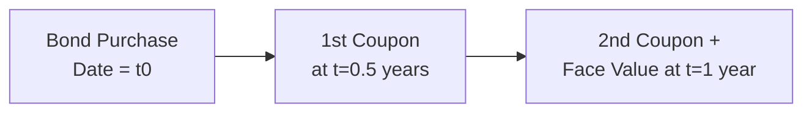

## Introduction
Sometimes in fixed income, it feels like we’re buried in different ways to say “here’s your return.” Seriously—Yield to Maturity, Current Yield, Yield to Call, and so on. I remember staring at those yields in my first real finance job, thinking: “Wait, they all sound the same, but they’re actually not. So which one’s correct?” The answer is often “depends,” because each yield measure captures a slightly different story about how your bond’s potential return is structured and realized.

Let’s peel back those layers one by one. In the context of the CFA® Level II curriculum, you should know exactly how to calculate, interpret, and compare these measures. This includes making sense of discount/premium bonds and how time to maturity affects your results, especially if your bond can be called or put early. The best approach is to become familiar with the underlying assumptions behind each metric—like reinvestment rates, call prices, coupon schedules—and then practice within a vignette context. Trust me, it’s one of the big building blocks you’ll need to ace those item-set questions.

## Yield to Maturity (YTM)
Yield to Maturity (YTM) is often seen as the “big one.” It’s the internal rate of return (IRR) on the bond’s cash flows if you hold the bond until it matures—assuming (and here’s the subtlety) you reinvest coupons at that same yield. So it’s quite a mouthful, but we can break it down.

• YTM is computed by solving for the discount rate that makes the present value (PV) of future coupon payments plus the redemption at par value equal to the bond’s current market price.  
• If the bond is priced at a premium (price > par), the coupon rate is higher than market yields, and the YTM will be less than the coupon rate. Conversely, if the bond trades at a discount (price < par), the YTM will exceed the coupon rate.  

On the calculations front, let’s remind ourselves of a simple example using annual coupon payments:

Let:  
• P = Bond’s current price  
• C = Annual coupon payment (in currency units)  
• F = Par (face) value  
• r = YTM (annual)  
• n = Number of years until maturity  

Then the price, P, is given by:


P = \frac{C}{(1 + r)} + \frac{C}{(1 + r)^2} + \dots + \frac{C}{(1 + r)^n} + \frac{F}{(1 + r)^n}.


In practice, you solve for r using a financial calculator (or iterative methods in Python or Excel). If coupons are paid semiannually or quarterly, you just adapt the formula by adjusting for the coupon frequency. We’ll talk more about how those frequencies can alter “effective yields” or “bond-equivalent yields” in a bit.

One thing that’s important to keep in mind is that YTM is a theoretical measure: it assumes you can reinvest intermediate coupons at exactly that YTM rate. But, as you’re probably aware, real-world reinvestment rates can fluctuate, meaning your realized return may differ from the stated YTM.

### Quick Personal Anecdote
I recall one portfolio manager who grumbled that while YTM is a neat yardstick, markets rarely stand still, so the yield environment can shift within weeks of your bond purchase. That’s the reality of “reinvestment risk.” Doesn’t mean we toss out YTM entirely—it’s still crucial for an apples-to-apples comparison. But it’s always layered with the assumption that you’re reinvesting each coupon at that same yield until maturity, which may not pan out in the real world.

If the bond also carries call or put options, then YTM is not always your go-to measure. You might need yields specific to the call date or put date, which is where we get yield to call or yield to put. But let’s not get ahead of ourselves.

## Current Yield
Current yield is much simpler in concept than YTM. It’s basically the ratio of the bond’s annual coupon payment to its current price:


\text{Current Yield} = \frac{\text{Annual Coupon Payment}}{\text{Bond Price}}.


If you want a quick snapshot of how much income you’re getting relative to the bond’s price, current yield does the trick. Suppose you have a bond paying a coupon of $50 per year (on a par of $1,000), and it’s currently trading at $900. The current yield is:


\frac{50}{900} \approx 5.56\%.


That 5.56% tells you how much coupon income you’re getting for each dollar invested, but no more. It doesn’t consider the time value of money, how long you’ll hold the bond, or whether you get capital gains or losses at maturity (which is a big deal). Because it ignores redemption value and assumes no reinvestment, it’s more like a “coupon yield right now.” If the question in the exam is about the total return on the bond over its life, you definitely want YTM. But if it’s about “how much annual income am I earning on what I paid,” current yield is your quick reference.

## Yield to Call (YTC) and Yield to Put (YTP)
This is where bonds with embedded options come into play. Some bonds can be redeemed (or “called”) early by the issuer, typically after a lockout period and at a predetermined call price. Others might be “putable,” meaning the investor can force the issuer to redeem the bond early at a specified price. In these scenarios:

• Yield to Call (YTC) assumes the bond is called on the first call date (or sometimes a subsequent call date if that’s the scenario tested) and calculates the yield accordingly, using the call price for redemption instead of par.  
• Yield to Put (YTP) assumes the investor exercises the put option at the earliest put date and put price.  

When you read an item set in the exam that states the bond is “callable at 101% of par in exactly two years,” or “putable in three years at par,” your job is often to figure out if calling or putting is beneficial/likely under certain yield levels—and how that changes the yield calculation.

Calculating YTC is structurally similar to calculating YTM, except your timeline ends at the call date, and your redemption value is the call price, not the par value (unless the call price happens to be par). Then you solve for the discount rate that makes the PV of future coupons (until the call date) plus the call price at that date equal to the current bond price. Yield to put is handled in a similar fashion, just substituting a put date and put price.

## Yield to Worst (YTW)
Now, imagine a bond is both callable and putable. That means myriad potential redemption points exist—some favorable to the issuer, some to the holder—and you need to ensure your analysis picks the most conservative yield for your scenario. That’s the yield to worst (YTW). Effectively, it’s the lowest yield among YTM, YTC, and YTP for all relevant call or put dates. From the exam standpoint, you might see a question that asks, “What is the yield to worst for this bond given the following call schedule and put provisions?” And you’ll systematically compute each scenario’s yield, and whichever is lowest is YTW.

## Effective Yield or Bond Equivalent Yield (BEY)
If a bond pays coupons more than once a year, we often annualize the yield for comparability. A common approach is:


\text{Bond Equivalent Yield} = \left(\text{Periodic Yield}\right) \times \text{Number of Periods per Year}.


For instance, if you have a semiannual coupon bond and you solve for the semiannual yield, you’d multiply that semiannual yield by 2 to get the bond equivalent yield. Keep in mind, this is different from an effective annual yield (EAY), which would compound the periodic yield instead of just multiplying it by the frequency. The EAY is:


\text{EAY} = (1 + \text{Periodic Yield})^{\text{Number of Periods per Year}} - 1.


For exam-level questions, watch out for the distinction. The “bond equivalent yield” is the standard convention in many fixed income circles, especially in the U.S., but “effective annual yield” might come up in certain contexts where compounding is relevant. The formula used must match what the question is asking.

## Reinvestment Rate Assumption
Let’s circle back to the notion of reinvestment risk. YTM calculations typically assume you can reinvest coupon payments at exactly the same yield you used to discount them. If the interest rates in the market fall, you might end up reinvesting those coupons at a lower rate, meaning your true realized yield will be less than the original YTM.

That can be a rude surprise for many bondholders, especially if their bond has a high coupon. You might receive these nice juicy coupon payments, but if interest rates have plummeted, you won’t find the same yield opportunities to reinvest your coupons. The overall return might drop. In a rising-rate scenario, you might see better reinvestment opportunities, leading to a realized return above the initial YTM. But that obviously is not guaranteed, as markets can jump around.

For exam item sets, pay special attention if they mention that reinvestment at YTM is not feasible or if they provide an alternative rate at which coupons are reinvested. You might have to adjust your yield calculations accordingly.  

## Merely a Glimpse: A Visual Diagram
Here’s a simple Mermaid diagram that shows the timeline of a bond’s cash flows over one year with semiannual coupons, to illustrate how these might be discounted or reinvested:

This quick diagram is basically a simplified cash-flow timeline for a 1-year bond with two coupon periods, but the logic extends to multi-year horizons. Each node shows a coupon payment, and at final maturity (here, t=1 year), you get both the coupon and the face value. You discount each of these back to present value using the yield to maturity or the relevant discount rate.

## Best Practices and Common Pitfalls
• Always clarify the coupon frequency: Don’t just assume annual. The exam item can specify monthly, quarterly, or semiannual payments, altering your yield calculations.  
• Identify call/put features: If a bond can be called in one year, you should see if YTC or YTW is more relevant than YTM alone.  
• Watch out for day count conventions: In real markets, day count can affect accrued interest or yield calculations, although for exam item sets, the day count may be simplified or explicitly stated.  
• Face value vs. call price or put price: Double-check if the redemption value is par or some premium. Using par by default for a call scenario can lead to a wrong yield.

## Example: Premium Bond with a Call Option
Let’s say you have a 5-year 8% annual coupon bond. Par value = $1,000, and it’s currently priced at $1,050. The issuer can call the bond at $1,030 in 2 years. How might you quickly compare YTM vs. YTC?

• First, compute YTM ignoring the call. Let’s say you find YTM = 6.9%.  
• Next, compute YTC with 2 years to call and a call price of $1,030. If you do a quick calculation, you might find YTC = 6.5%.  
• If it’s putable, you’d do the same for YTP. Then, if you want yield to worst, you see which is the smallest among those yields.  

In this scenario, the bond trades at a premium, and the coupon rate (8%) is likely higher than market rates. The issuer might have an incentive to call, especially if interest rates drop further, so the yield to call (6.5%) might be your more realistic scenario. This is precisely the scenario you might see in a Level II item set, where you’re asked to identify which yield measure best reflects the bond’s “conservative estimate of return.”

## Exam Tips
• Time Management: For yield calculations, your best friend is your financial calculator. Using the IRR function can drastically speed up calculations in exam settings. Know how to switch coupon frequency and set up the cash flows quickly.  
• Vignette Details: You’ll often see text describing redemption features or hinting that the issuer plans to call when rates drop. Don’t skip such hints; they’re telling you which yield measure is relevant.  
• Memorize the Core Formulas: Ensuring you know the difference between current yield, YTM, YTC, YTP, YTW, and especially how to annualize yields is crucial.  
• Reinvestment Rate Changes: If the vignette says something like “coupons are reinvested at 4%,” while your YTM is 6%, you have to note that your overall realized return will differ from the standard YTM.  
• “Yield to Worst” is frequently tested, especially with calls. Don’t let that slip under your radar.  

## References for Further Exploration
• Fabozzi, F. J. (Ed.). (2022). Bond Markets, Analysis, and Strategies. A great resource for thorough bond yield calculations and examples.  
• CFA Institute. (2025). CFA® Program Curriculum Level II, Volume 6: Fixed Income. The official reading on yield measures. Highly recommended for exam prep.  
• Investopedia pages on “Yield to Maturity” and “Current Yield”: Good quick refreshers, though for the exam you want textbook-level detail.

## Conclusion
When thinking about yields, remember to ask: “What assumption am I making about time horizon, redemption features, reinvestment, and coupon frequency?” YTM tries to unify those assumptions into one neat measure, but it’s not always the definitive view. Sometimes you’ll need yield to call, yield to put, or yield to worst, especially if there are embedded options. And if you just need a quick, back-of-the-envelope idea of your coupon income, current yield might suffice—though it’s limited in scope.

Ultimately, these yield measures feed into deeper bond pricing strategies and advanced analytics, which we’ll explore in subsequent sections. Keep practicing how these yields are calculated and how to interpret them in real-world or exam scenarios. It’s a vital skillset that helps you price bonds accurately and gauge where value might lie in a fast-moving market.

Remember, the key is to build a strong mental map of which measure applies to which scenario. If you do that—and you bring your financial calculator or Python skills to the table—you’ll be well on your way to mastering any yield question that shows up in a Level II item set.

## Test Your Knowledge of Bond Yields



### A bond priced below par with a fixed coupon rate will most likely have which relationship between its yield to maturity and its coupon rate?

- [x] Yield to maturity is greater than the coupon rate.
- [ ] Yield to maturity is equal to the coupon rate.
- [ ] Yield to maturity is less than the coupon rate.
- [ ] Yield to maturity cannot be calculated for a discounted bond.

> **Explanation:** For a bond priced at a discount (below par), the YTM is higher than the coupon rate because the investor also gains from the price appreciation as the bond heads toward par at maturity.

### Which of the following statements regarding current yield is correct?

- [x] It ignores the time value of money and redemption at maturity.
- [ ] It fully accounts for reinvestment risk.
- [ ] It equals YTM if the bond sells at par.
- [ ] It proves that coupon rate always equals yield to maturity.

> **Explanation:** Current yield only takes the annual coupon and divides it by the bond's current price, ignoring any time value of money or potential capital gains/losses at maturity.

### For a callable bond priced at a premium, which yield measure would typically be the most relevant for an investor concerned about early redemption?

- [ ] Yield to maturity (YTM)
- [x] Yield to call (YTC)
- [ ] Current yield
- [ ] Yield to worst (YTW) always exceeds yield to call.

> **Explanation:** When a bond is priced at a premium and has a call feature, yield to call is particularly relevant because the issuer may call the bond to refinance at lower rates. Yield to worst might also matter, but YTC is typically the first measure to check when the bond is trading above par.

### What does “Yield to Worst” (YTW) usually represent?

- [ ] The highest of YTM, YTC, and YTP.
- [x] The lowest yield among YTM, YTC, and YTP.
- [ ] The average yield for all possible redemption dates.
- [ ] Link between coupon payments and reinvestment risk.

> **Explanation:** Yield to worst is the conservative measure, representing the lowest yield an investor might realize, considering all possible call or put scenarios.

### A bond that makes semiannual coupon payments has a 4% semiannual yield. Its bond equivalent yield is:

- [x] 8%
- [ ] 4%
- [ ] 2%
- [ ] 16%

> **Explanation:** The bond equivalent yield (BEY) for a semiannual-paying bond is simply (semiannual yield × 2). In this case, 4% × 2 = 8%.

### Which type of yield measure assumes that coupon payments can be reinvested at the same rate throughout the bond’s life?

- [x] Yield to maturity
- [ ] Current yield
- [ ] Yield to call
- [ ] Spot yield

> **Explanation:** Both YTM and YTC make a similar type of reinvestment assumption, but “yield to maturity” generally refers to the reinvestment assumption over the entire remaining life of the bond.

### If a bond is callable at 105 and currently trades at 110, which statement is most accurate?

- [ ] Yield to maturity will be less than yield to call.
- [x] The bond likely trades at a premium and YTC may be lower than YTM.
- [ ] The current yield must be equal to the yield to call.
- [ ] The bond is trading at a discount; YTC exceeds YTM.

> **Explanation:** Trading at 110 is above par, indicating a premium. Because the issuer can call at 105, the redemption would be lower than the bond’s current price, pushing the yield to call lower than YTM.

### Which measure simply divides the annual coupon by the bond’s current market price?

- [x] Current yield
- [ ] Yield to maturity
- [ ] Yield to worst
- [ ] Effective annual yield

> **Explanation:** By definition, the current yield formula is Annual Coupon ÷ Current Bond Price.

### Which scenario most increases an investor’s reinvestment risk?

- [x] Receiving a series of high coupon payments in a falling interest rate environment.
- [ ] Holding a zero-coupon bond.
- [ ] Bond trading at par with no coupon.
- [ ] Issuer default risk.

> **Explanation:** High coupon payments received during periods of falling interest rates must be reinvested at lower rates, exacerbating reinvestment risk.

### If a bond’s annual coupon is $30, par value is $1,000, and it trades at $1,020, which statement about its current yield is true?

- [x] True
- [ ] False

> **Explanation:** Current yield = 30 ÷ 1020 = 2.94%. This figure is below the bond’s coupon rate of 3% (i.e., $30 on a $1,000 par), because the bond is trading at a slight premium. Hence, the statement that current yield < coupon rate is correct.


