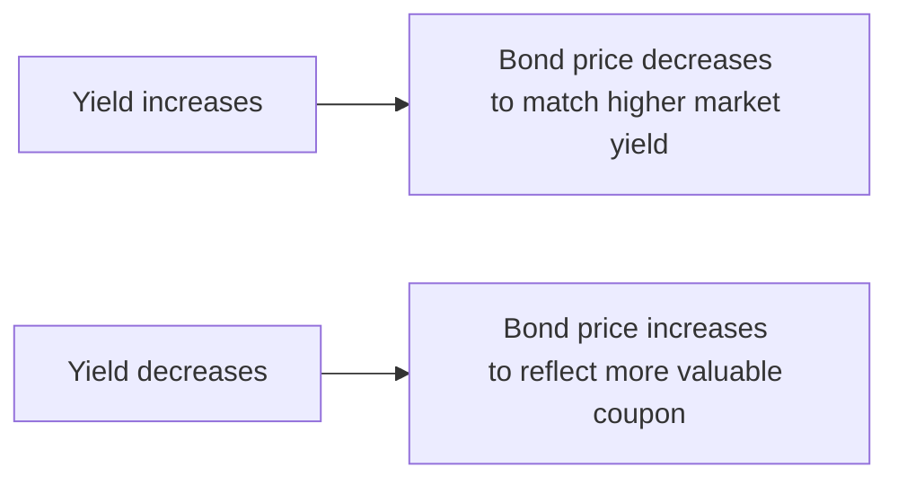

## Price-Yield Inverse Relationship

So let’s start with what might seem like a simple concept, but it can feel a bit surprising when you first see it. You know that seesaw you played on as a kid, right? One side goes up, the other side goes down. Well, bonds have a similar seesaw dynamic with yields. When market yields go up, bond prices go down. When market yields go down, bond prices go up. That’s basically the foundational rule of bond math, and it’s something the CFA® Program loves to test.

Why does this happen? Imagine you hold a bond that pays a fixed coupon of 5% annually. If market interest rates suddenly rise to 6%, new bonds come out offering a 6% coupon. Yours is only paying 5%, so nobody wants it at the old price—at least not unless the price is cheaper, so it can effectively generate a yield (for the new buyer) that’s closer to 6%. Hence, your bond’s price must drop. The reverse happens if rates fall below 5%: your 5% coupon looks awesome, so more people want your bond, driving its price above par.

Just remember that it’s an inverse relationship. And yes, it truly is one of the cornerstones of fixed income theory.



## The Bond Pricing Formula

Beneath that inverse relationship lies the key formula that the CFA® Exam expects you to master. Let’s break it down step by step.

A bond’s price is essentially the sum of the present values of all future cash flows. These cash flows include:
• The coupon payments you’ll receive periodically.  
• The principal (or face value) that you get back at maturity.

Mathematically, if you assume an annual coupon for simplicity, it looks like this:


\text{Bond Price} = \sum_{t=1}^{T} \frac{C}{(1 + y)^t} + \frac{\text{Par Value}}{(1+y)^T}


Where:  
• \\( C \\) is the annual coupon payment.  
• \\( y \\) is the bond’s yield (per year, in decimal form).  
• \\( T \\) is the total number of years to maturity.

But bonds can pay coupons more often than annually—which is where things get interesting.

## Different Coupon Frequencies (Annual vs. Semiannual)

Many U.S. corporate and Treasury bonds pay coupons every six months (semiannually). If that’s the case, you need to adjust both your coupon payment and your yield to a per-period (semiannual) basis. Here’s how that typically looks:

• Semiannual coupon = (Annual coupon rate × Par Value) / 2.  
• Semiannual yield = Annual yield / 2.  
• Number of total coupon periods = Years to maturity × 2 (for semiannual).

So if you have a 9% annual coupon bond with semiannual payments, each payment is 4.5% of par value twice a year. If the yield is quoted at 10% (annual), for bond pricing under semiannual compounding, you treat it as 5% per half-year.

Let’s do a super brief numeric example. Suppose you have:
• A 5-year bond  
• Annual coupon rate: 5%  
• Yield to maturity (effective annual): 6%  
• Coupons paid semiannually

Step 1: Convert everything to semiannual terms.  
• Semiannual coupon rate = 5% / 2 = 2.5%.  
• Semiannual coupon payment = 2.5% × par value (if par = 1,000, that means 25 per half-year).  
• Semiannual yield = 6% / 2 = 3%.  

Step 2: Discount each coupon and the final principal by 3% every six months, for 10 periods (5 years × 2 periods/year = 10).  

The bond price is:


\sum_{t=1}^{10} \frac{25}{(1+0.03)^t} + \frac{1000}{(1+0.03)^{10}}


This approach ensures you’re capturing the same idea in the standard bond pricing formula, just with semiannual compounding.

## Quick Python Example

Anyway, if you’re a coding person like me, you can whip up a quick Python snippet to compute a bond’s price for a given face value, coupon rate, yield, etc. It’s purely optional, but it helps clarify how the math works.

```python
def bond_price(face_value, annual_coupon_rate, years_to_maturity, annual_yield, coupon_frequency=2):
    """
    Calculate bond price based on standard discounting of future cash flows.
    face_value: e.g. 1000
    annual_coupon_rate: e.g. 0.05 for 5%
    years_to_maturity: e.g. 5
    annual_yield: e.g. 0.06 for 6%
    coupon_frequency: e.g. 2 for semiannual
    """
    coupon_payment = face_value * annual_coupon_rate / coupon_frequency
    periodic_yield = annual_yield / coupon_frequency
    periods = int(years_to_maturity * coupon_frequency)

    price = 0
    for t in range(1, periods + 1):
        price += coupon_payment / ((1 + periodic_yield) ** t)
    price += face_value / ((1 + periodic_yield) ** periods)
    return price

p = bond_price(1000, 0.05, 5, 0.06, 2)
print("Bond Price:", round(p, 2))
```

## Discount vs. Premium Bonds

Once you run through a few examples, you’ll notice some interesting patterns. For instance, if your bond’s coupon rate is below the yield that the market wants, the bond’s price will be below par (trading at a discount). That’s because no one’s too excited about a coupon rate that’s subpar unless they can buy the bond for cheaper.

On the flip side, if the coupon rate is higher than the market yield, the bond ends up priced above par—people are actually willing to pay a premium because the bond offers above-market coupon payments.

Here’s a quick table to lock that in:

| Relationship            | Coupon Rate vs. Market Yield | Bond Price       |
|-------------------------|------------------------------|------------------|
| Discount Bond           | Coupon Rate < Yield          | < 100 (par)      |
| Par Bond                | Coupon Rate = Yield          | = 100 (par)      |
| Premium Bond            | Coupon Rate > Yield          | > 100 (par)      |

Most folks in the market talk about par value as 100 (or 1000, or some other standard). The big idea is that discount vs. premium reveals right away how the bond’s coupon stands relative to the market yield.

## Price Sensitivity and Duration

The bond price doesn’t move with yield in a perfectly linear way—there’s a curvature to that relationship, often referred to as convexity. But, focusing on the first “slope” measure, we have duration. Duration (which we’ll explore deeply in later chapters) captures the approximate percentage change in a bond’s price if yields change by 1%. It’s basically telling you, “Hey, if yields go up by a little bit, your bond price might drop by X%.”

• Higher duration = more sensitivity to interest rate movements.  
• Lower duration = less sensitivity.

In practice, you’ll see all kinds of durations: Macaulay Duration, Modified Duration, Effective Duration, and so forth. The main takeaway is that different bonds have different sensitivities. It depends on factors like time to maturity, coupon size, and yield levels. So if you suspect yields will move a lot, bonding (pun intended) with the concept of duration is crucial.

## Practical Exam Tip (Vignette Application)

On the Level II exam, it’s common to get a vignette describing multiple bonds with different coupons, maturities, and yields. You might be asked to:

• Identify which bond is trading at a discount or a premium.  
• Calculate its price given a particular yield.  
• Compare the price changes if yields move up or down by a certain basis point measure.

One little pitfall: watch for day count conventions and the exact timing of coupon payments. Some vignettes specify odd periods or irregular coupon schedules. Make sure to carefully parse the dates. Also, remember that in real life, you might pay accrued interest if you buy a bond between coupon payments—but that’s in Section 3.3 on accrued interest. For now, focus on discounting the bond’s future cash flows precisely.

## Real-World Applications

I still remember the first time I tried to price an old Treasury bond in a real portfolio. It was paying a coupon that was way below current market rates, so when I plugged in the yield, the price ended up around 95 cents on the dollar. Yet ironically, that discount bond was perfect for a strategy we wanted—ensuring minimal reinvestment risk. The moral? The bond’s price alone might not tell the whole story about its risk-return profile, but it’s always the starting point to figuring out its yield.

And if you’re curious about how bond yields and prices look in the real world, check out yield curve data published by major central banks like the Federal Reserve in the U.S. They often post daily yield curve estimates, which can serve as an awesome cross-reference. You can see exactly how a 2-year note or a 10-year note trades, and watch how price-yield relationships shift around with market news.

## Conclusion

Price-yield relationships in bonds encapsulate the essential give-and-take of interest rates. Bond math—whether annual or semiannual discounting—boils down to the present value of future cash flows. The difference between discount, par, and premium bonds stems directly from comparing the coupon rate to the market yield. 

On the Level II exam, expect to handle multiple scenarios involving compounding frequencies, partial periods, or changes in yields. Keep your calculations precise, but don’t lose sight of the big picture: as yields fluctuate, the bond’s price adjusts. 

So if you remember that bond seesaw from your childhood, you’re halfway there. Don’t forget to practice a bunch, and double-check your conversions between annual and periodic rates. That’s a huge source of silly mistakes, but with a bit of caution, you’ll handle it like a pro.

---

## References

- Tuckman, B., & Serrat, A. (2011). Fixed Income Securities: Tools for Today’s Markets.  
- Fabozzi, F. J. (2023). The Handbook of Fixed Income Securities.  
- Federal Reserve Yield Curve Data: https://www.federalreserve.gov  

---

## Test Your Knowledge: Price-Yield Relationship and Bond Math Quiz



### Which of the following statements best describes the relationship between bond price and yield?

- [x] Bond price moves inversely with bond yield.
- [ ] Bond price always equals par when yields change.
- [ ] Bond yield remains constant even if the bond price changes.
- [ ] Bond price and yield are always positively correlated.

> **Explanation:** The fundamental inverse relationship is that when yields increase, bond prices decrease, and vice versa.


### A bond with an annual coupon rate of 8% is priced at par. Which of the following best describes its yield if coupons are paid semiannually?

- [ ] 8% annual and 4% semiannual
- [ ] 4% annual and 2% semiannual
- [x] 8% nominal annual and 4% semiannual
- [ ] 16% annual and 8% semiannual

> **Explanation:** If a bond pays an 8% annual coupon at par, the yield to maturity must also be 8% annually (nominal), which translates into 4% each semiannual period.


### When a bond’s coupon rate is lower than its yield, the bond is typically:

- [ ] Trading at par.
- [x] Trading at a discount.
- [ ] Trading at a premium.
- [ ] Priced exactly equal to yield.

> **Explanation:** A lower coupon rate than yield means the bond must be discounted to attract investors. Hence it trades below par.


### Which of the following is true regarding semiannual compounding?

- [x] You need to halve the annual yield and coupon to perform correct pricing calculations.
- [ ] You multiply the annual yield by 2 to find the semiannual yield.
- [ ] The bond price is unaffected by the coupon frequency.
- [ ] You only adjust the coupon rate if the bond is at par.

> **Explanation:** With semiannual compounding, both the yield and coupon must be divided by 2, and the number of periods doubles compared to annual compounding.


### A 10-year, 6% coupon bond with annual payments has a yield of 5.5%. This bond is:

- [x] A premium bond because the coupon rate is higher than the yield.
- [ ] A discount bond because the coupon rate is lower than the yield.
- [ ] A par bond because the coupon equals the yield.
- [ ] Trading at the same price as a 5.5% coupon bond.

> **Explanation:** The coupon (6%) exceeds the yield (5.5%), so it’s trading at a premium.


### How does duration primarily affect bond price sensitivity?

- [x] Duration estimates the percentage change in bond price for a 1% change in yields.
- [ ] Duration is always fixed, so it doesn’t affect sensitivity.
- [ ] Duration is an exact measure of price change with no approximation.
- [ ] Duration only applies to zero-coupon bonds.

> **Explanation:** Duration measures the approximate price change in response to yield changes and is a key sensitivity metric.


### In a typical exam vignette, an investor is asked to price a bond showing yields in annual terms but coupons are semiannual. What is the most common pitfall?

- [x] Forgetting to convert the annual yield to a per-period yield.
- [ ] Using the bond’s coupon rate as the discount rate.
- [ ] Mixing coupon rates of two different bonds in the same question.
- [ ] Ignoring the effect of day count convention.

> **Explanation:** The usual mistake is failing to adjust the annual yield (and the coupon) to correctly price the bond for semiannual payments.


### You have a 7% coupon bond with 10 semiannual periods remaining. The semiannual yield is 4%. Which expression correctly calculates its market price (without a calculator for now)?

- [x] Present value of 3.5 per period for 10 periods at 4% plus principal discounted at 4% for 10 periods.
- [ ] Present value of 7 per period for 10 periods at 4% plus principal discounted at 4% for 10 periods.
- [ ] Present value of 7 per period for 5 periods at 4%.
- [ ] No discounting needed because it’s a fixed coupon.

> **Explanation:** Since it’s a 7% annual coupon with semiannual payments, each period’s coupon is 3.5% of par, discounted at 4% for each half-year.


### Which of the following is most likely to occur if market interest rates decline sharply?

- [x] Bond prices will rise, reflecting the older, higher coupon as more attractive.
- [ ] Bond yields will match the existing coupon rate.
- [ ] Bonds will be repurchased by the issuer at par.
- [ ] All bonds instantly convert to premium bonds.

> **Explanation:** When rates drop, existing bonds with higher coupons are more attractive, so their prices increase.


### A bond that sells for less than par value but pays 7% coupon has a yield to maturity that is:

- [x] Higher than 7%.
- [ ] Equal to 7%.
- [ ] Lower than 7%.
- [ ] Not determinable without the spot rate curve.

> **Explanation:** If the bond is priced at a discount, its yield to maturity must be higher than its coupon rate.


