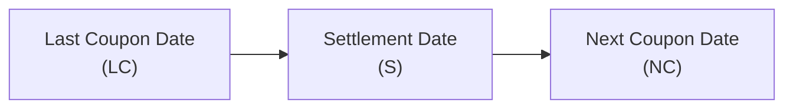
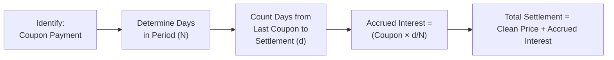

## Understanding Accrued Interest

Let’s start with a simple question: Have you ever bought something partway through its “useful life”—like purchasing a season ticket halfway through the season? In that case, you might pay a bit extra to compensate the seller for the portion of the season you didn’t attend but the ticket was still valid. Bonds work similarly with something called accrued interest.

In bond markets, accrued interest is the interest that has accumulated since the last coupon payment but hasn’t yet been paid out. If someone buys a bond “today,” and the last coupon was paid 45 days ago, the seller is entitled to the interest earned during those 45 days. Because the seller won’t be around to receive the next coupon in full, an extra payment—i.e., the accrued interest—makes sure the seller is fairly compensated.

### Key Points

• Accrued interest belongs to the seller, who held the bond for part of the coupon period.  
• It’s added to the quoted bond price at settlement.  
• The concept is universal in fixed income: if you hop in mid-stream, you pay the portion of the coupon that’s effectively “already earned.”

Mathematically, you might see it expressed like this:

$$
\text{Accrued Interest} 
= \text{Coupon Payment} \times 
\frac{\text{Days from last coupon date to settlement date}}
{\text{Days in the coupon period}},
$$

with the day count convention determining exactly how you measure those “Days.”

Below is a simplified timeline showing the relevant dates:

• LC: Last coupon payment date.  
• S: Settlement date when the bond is purchased or sold.  
• NC: Next coupon date (when the coupon is actually paid).

The fraction from LC to S is used to calculate accrued interest owed to the seller.

## Clean Price vs. Full (Dirty) Price

You might notice two different prices quoted for bonds: a “clean price” and a “full (or dirty) price.” Don’t worry; this has nothing to do with a bond’s moral character.

• The clean price is what you see quoted on Bloomberg, trade platforms, or financial news. It excludes accrued interest. It’s considered “clean” because it focuses purely on the present value of the bond’s future cash flows.

• The full (dirty) price is the actual price paid by the buyer and received by the seller at settlement. It includes both the clean price and the accrued interest. That might surprise folks the first time they buy a bond: “Wait, I thought the price was 99.50, so why am I paying 100.20?” The difference is the accrued interest portion. 

The relationship is straightforward:

$$
\text{Full (Dirty) Price} = \text{Clean Price} + \text{Accrued Interest}.
$$

In everyday market dialogue, professionals often talk about “the price of the bond” without specifying whether they mean clean or full. By convention, it’s usually the clean price. But on exam day (and trust me, I’ve been there), watch carefully. If the question or the vignette is describing a “settlement amount,” you’re dealing with the full (dirty) price.

## Day Count Conventions

Now, how do we figure out that fraction in the accrued interest calculation? After all, not all months have 30 days, and we have leap years, half months, and all sorts of partial periods.

That’s where day count conventions come in. They’re standardized rules for counting days. Different bond markets and regions can use different conventions, so it’s important to know which one you’re dealing with:

| Day Count Convention | Brief Description                                       |
|----------------------|---------------------------------------------------------|
| 30/360              | Treats each month as 30 days, leading to a 360-day year. |
| Actual/Actual (Act/Act) | Uses the actual days in each month and the actual days in the year. Often applied to government bonds. |
| Actual/365          | Counts actual days, but assumes 365 days in a year.      |

Here’s the thing: it may sound small, but using the wrong day count can lead to errors in accrued interest, yield calculations, or price quotes. If you’re 5 or 6 days off on your day count for a large bond position, that can add up to a real difference in payments—especially if interest rates are high or the trade involves big principal amounts.

## Real-World Relevance

You might wonder, “Am I ever going to face this in reality?” Absolutely. In secondary bond markets, almost every transaction includes the concept of accrued interest. Traders pay close attention to upcoming coupon dates, because ironically, right after a coupon is paid, the accrued interest resets to zero. Some investors try to schedule purchases around coupon payment dates to manage cash flows and to minimize or maximize the accrued interest “hit.” Others simply factor the cost into their yield-based strategies.

Moreover, day count conventions can vary between domestic and international markets. A bond denominated in different currencies can have different day count assumptions. If you’re dealing with cross-border trades or analyzing global bond funds, it’s crucial to nail these details.

## Exam Tips and Pitfalls

• Be sure to track whether the exam question uses clean or full prices. Many times, an item set will give you a “quoted price” but the actual settlement cost is higher because you need to add accrued interest.  
• Double-check day count details. The vignette might drop a subtle mention: “Bond X uses a 30/360 convention.” Don’t ignore that line!  
• When calculating yield, keep in mind that the yield is typically derived off the clean price, while the actual cost is the dirty price. This can be a sneaky source of confusion.  
• The difference between the day count from the last coupon to settlement (for accrued interest) vs. the day count for the entire coupon period (for yield) might trip you up if you’re not paying attention.  

I’ll share a personal confession: early in my career, I seized an “amazing” bond deal at 99.00, only to be caught off guard at settlement paying an unexpected chunk of accrued interest. I guess I learned the “dirty” side of bond pricing the hard way.

## Putting It All Together: A Quick Example

Imagine we have a semi-annual coupon bond with a 6% annual coupon (3% every six months), and it pays coupons on January 1 and July 1. Suppose you’re buying this bond on March 1, having missed two months of coupon accrual. Let’s assume we have a simple 30/360 day count:

• Time from last coupon (Jan 1) to purchase date (Mar 1): 60 days (using 30/360 logic: January = 30 days, February = 30 days if we’re ignoring actual days).  
• Length of coupon period in 30/360 terms: 180 days for six months.  

Accrued interest for that 60-day portion:

$$
\text{AI} 
= \left( \frac{6\% \times \$1{,}000 \text{ par}}{2} \right) 
\times \frac{60}{180} 
= \$1.00.
$$

(The coupon for six months is \$30 on \$1,000 par: 6% of \$1,000 = \$60 per year → \$30 every six months. Then we take 60/180 = 1/3 of \$30 = \$10, sorry let’s walk carefully here.)

Let’s break that down carefully to avoid the dreaded slip:

• Annual coupon = 6% × \$1,000 = \$60 per year.  
• Semiannual coupon = \$30.  
• Fraction of coupon period passed = 60/180 = 1/3.  
• Accrued interest = \$30 × 1/3 = \$10.  

So if the clean price is \$975, the full price is \$975 + \$10 = \$985. And that’s what changes hands when you settle the trade.

## Diagram: Simplified Accrued Interest Calculation

Sometimes, it’s helpful to visualize the computation flow. Here’s a quick diagram linking day counts, coupon amounts, and the final settlement:

## Summary

• Accrued interest represents the slice of coupon interest earned between coupon dates.  
• Clean prices exclude accrued interest, while full (dirty) prices include it.  
• Day count conventions (30/360, Actual/Actual, Actual/365, etc.) define how we measure the fraction of the coupon period.  
• On the exam, always confirm whether the question wants the clean or full price and watch those day counts.  

If you can master these basics, you’ll glide through many of the bond pricing and yield-related item sets with confidence. Trust me, ignoring accrued interest is a classic “gotcha,” and the exam writers know it!

## References and Recommended Readings

• CFA Institute. (2025). CFA® Program Curriculum Level II, Volume 6: Fixed Income.  
• International Capital Market Association (ICMA). “Accrued Interest Calculations” for Eurobond Market.  
• Khan Academy – Bonds and Accrued Interest.  
• Our discussion in Chapter 2.1 on Types of Bonds and coupon structures, for additional background on coupons.  

## Bond Pricing and Accrued Interest Quiz



### Which of the following best describes accrued interest?

- [ ] The difference between a bond’s clean price and dirty price when there is no coupon period remaining.
- [x] The interest earned by the seller since the last coupon date but not yet paid.
- [ ] A penalty the buyer must pay when settling a bond trade early.
- [ ] A variable cost tied to the bond’s credit rating.

> **Explanation:** Accrued interest is the portion of the coupon that has accrued from the last coupon payment date until the settlement date.  

### A bond’s clean price is typically:

- [x] The price quoted in the market excluding accrued interest.
- [ ] The total amount the buyer pays at settlement.
- [ ] The bond’s face value discounted at the yield to maturity.
- [ ] Equal to the sum of the bond’s face amount and accrued interest.

> **Explanation:** Clean price is almost always quoted without accrued interest, which is why the quoted price differs from the full (dirty) price on the settlement document.  

### If you see a bond quoted at 102.50, but the settlement amount is 103.20, the difference is most likely due to:

- [x] Accrued interest added to the price.
- [ ] A coupon payment scheduled for the next day.
- [ ] A hidden broker fee not disclosed.
- [ ] The bond default risk premium.

> **Explanation:** The difference between 102.50 and 103.20 reflects the accrued interest on top of the clean price.  

### In a 30/360 day count convention, how many days are typically assumed in a month?

- [ ] 28  
- [x] 30  
- [ ] 31  
- [ ] Actual number of days in the month

> **Explanation:** By definition, the 30/360 convention treats each month as 30 days and each year as 360 days.  

### When calculating accrued interest on a semiannual bond with annual coupon of 8%, which is the correct approach?

- [ ] Use 8% × face value × fraction of the year.  
- [x] Use 4% × face value × fraction of the half-year.  
- [ ] Use 2% × face value × days in the full year.  
- [ ] No accrued interest is computed for semiannual bonds.

> **Explanation:** If the bond has an 8% annual coupon and pays semiannually, each coupon is 4% of face value. Accrued interest is then based on how many days have passed in that half-year coupon period.  

### What is the relationship between the bond’s full (dirty) price and its clean price?

- [x] Full price = Clean price + Accrued interest.  
- [ ] Full price = Clean price – Accrued interest.  
- [ ] Full price is always higher than the quoted yield spread.  
- [ ] There is no difference; they always converge at coupon payment dates.

> **Explanation:** The dirty price or full price is the clean price plus any accrued interest.  

### How does the day count convention affect accrued interest?

- [ ] It has no effect on accrued interest calculations.  
- [x] It sets how the fraction of the coupon period is measured.  
- [ ] It only affects yield but not accrued interest.  
- [ ] It only applies for government bonds traded in the U.S.

> **Explanation:** Different conventions (30/360, Actual/Actual, etc.) define the “days elapsed” framework, altering the fraction of the coupon period for the accrued interest calculation.  

### Which scenario might require particularly careful calculation of accrued interest?

- [ ] When buying a bond immediately after a coupon payment.  
- [x] When the bond’s settlement date is near the coupon payment date, but the day count is not a simple 30/360.  
- [ ] When the bond trades at exactly par.  
- [ ] When the bond is a zero-coupon security.

> **Explanation:** Close to coupon payment dates with more complex day count rules can make accrued interest calculations more prone to mistakes.  

### Suppose a bond uses Actual/Actual (ICMA) for day count. To determine accrued interest for 45 days, you must:

- [x] Count the actual calendar days between the last coupon date and settlement date over the actual days in the coupon period.  
- [ ] Assume 30 days each month.  
- [ ] Assume 365 days in a year for every scenario.  
- [ ] Never add more than 15 days of accrued interest in a single period.

> **Explanation:** Actual/Actual requires counting each calendar day in the actual calendar months, dividing by the total actual days from coupon date to coupon date.  

### True or False: A bond’s clean price is always higher than its dirty price.

- [ ] True  
- [x] False

> **Explanation:** The dirty (full) price = clean price + accrued interest, so the clean price is usually lower (or at most equal right after a coupon is paid).  


