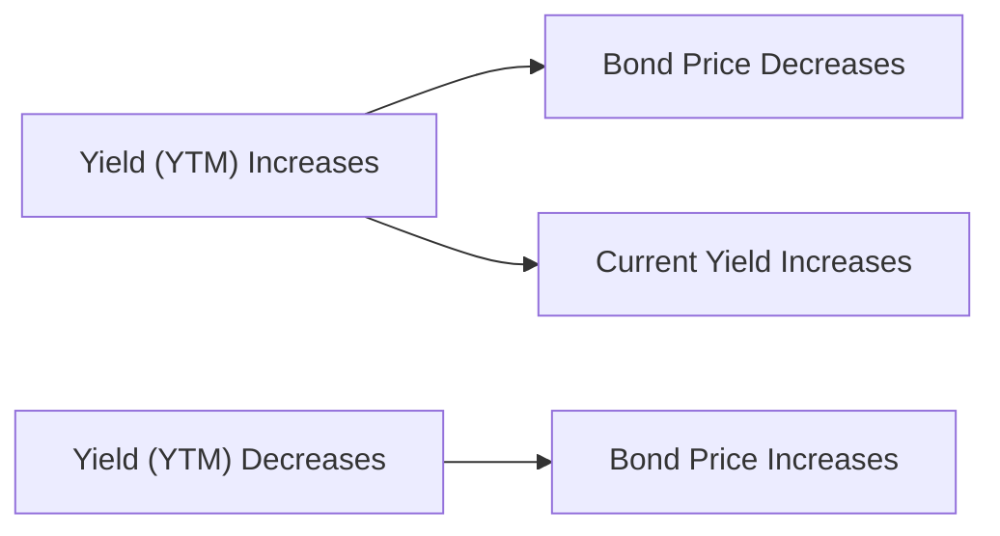

## Introduction and Scenario Overview

Imagine you’re settling into your new role as a junior portfolio manager at Lantern Capital, sifting through a stack of bond reports. Your mentor hands you a vignette—basically, a scenario-based package of information—and says, “Check out these bonds. Let’s see if you’re on top of clean prices, yield calculations, and how a little rate hike might change the numbers.” You swallow nervously, thinking you just mastered these in your last exam session. But here it is, real life testing your knowledge. That’s pretty much what happens at Level II of the CFA® Program, too. You get these item sets (vignettes) where they expect you to juggle multiple concepts, from day count conventions to yield to call (YTC) or yield to maturity (YTM), all in one seamless scenario.

Anyway, in this practice vignette, you’ll find a collection of bonds—each with its own specific quirks. We’ll walk through the calculations for accrued interest, clean versus full prices, and highlight the differences between various yield measures. We’ll also examine how a small shift in market rates might affect your bond valuations, and we’ll top it off with a handful of conceptual questions.

Before we start, remember that this whole exercise is a great reflection of what you might see on exam day. It’s not enough to know definitions in isolation; you need to see how all these pieces fit together when the clock is ticking and you’re under pressure.

## The Bond Data

Below is a snippet of the scenario data you’ve received. Let’s say you have three bonds—Bond A, Bond B, and Bond C. They’re all corporate bonds with different coupon structures, maturities, and call features. For simplicity, assume semiannual coupons (paid twice a year) unless stated otherwise, and a 30/360 day count convention (finicky, but commonly used for corporate bonds).

| Bond | Coupon Rate | Maturity Date | Frequency  | Days Since Last Coupon | Market Price (per $100 par) | Call Date     | Call Price |  
|-----:|:-----------:|:-------------:|:----------:|:----------------------:|:---------------------------:|:-------------:|:----------:|  
|  A   |   5.00%     |  Mar 15, 2030 | Semiannual |          45            |           $102.50           |   None        |   N/A      |  
|  B   |   6.50%     |  Jun 1, 2032  | Semiannual |          90            |           $ 99.75           |  Jun 1, 2027  |  $100.00   |  
|  C   |   4.25%     |  Sep 30, 2028 | Annual     |         180            |           $ 98.00           |   None        |   N/A      |

### Key Observations

• Bond A has no embedded options.  
• Bond B is callable in about five years.  
• Bond C pays coupons only once a year (annual frequency). So we must be mindful of how many days are in the coupon period.  

We’re also assuming a 30/360 day count convention. This means that for each month, we treat it as if there are 30 days, and for the year, we treat it as if there are 360 days. Each bond might be a bit different in real life, but let’s keep it consistent here.

## Accrued Interest Calculation

Accrued interest reflects the interest owed to the seller of the bond from the last coupon payment date up to the settlement date. If you buy a bond between coupon payments, you’re responsible for compensating the seller for the interest they earned but haven’t received as a coupon yet.

Accrued interest can differ based on day count conventions, but the general formula for a 30/360 convention (for a semiannual coupon bond) often looks like this:


\text{Accrued Interest} = \text{Annual Coupon Payment} \times \frac{\text{Days Since Last Coupon}}{\text{Days in Coupon Period (30/360 basis)}} \times \frac{1}{\text{Payment Frequency}}


But let’s break it down more concretely. For Bond A, the coupon rate is 5.00%, with a $100 par and semiannual coupons. So:

• Annual Coupon = 5.00% of $100 = $5.00  
• Semiannual Coupon Payment = $5.00 ÷ 2 = $2.50 per payment  

Now, for the 30/360 convention:

• A single coupon period in a 30/360 world is always 180 days (6 months × 30 days each).  
• Days Since Last Coupon: 45  

Thus,

Accrued Interest(A) = $2.50 × (45 ÷ 180) = $2.50 × 0.25 = $0.625

So if you bought Bond A right at day 45 of the coupon cycle, you’d owe the seller $0.625 for every $100 par value in accrued interest.

For Bond B, let’s do a similar approach:

• Annual Coupon @ 6.50% of $100 par = $6.50  
• Semiannual Coupon = $3.25  
• Days Since Last Coupon = 90 (using 30/360)  
• Days in Coupon Period = 180  

Accrued Interest(B) = $3.25 × (90 ÷ 180) = $3.25 × 0.5 = $1.625

Bond C is annual, which is a bit easier in terms of frequency. The total coupon is 4.25% × $100 = $4.25 per year. Because they only pay once per year:

• Days in Annual Coupon Period = 360 under 30/360  
• Days Since Last Coupon = 180  

Accrued Interest(C) = $4.25 × (180 ÷ 360) = $4.25 × 0.5 = $2.125

This step is straightforward, but in the exam pressure cooker, it’s also easy to slip and pick the wrong fraction or forget that Bond C is on annual frequency. The examiner might even mention a settlement date near an ex-coupon date to test your vigilance.

## Clean Price vs. Full Price

The “clean price” of a bond is the quoted price that excludes accrued interest. It’s sort of the “headline” price you see and is the standard for many bond markets. The “full price” (or “dirty price”) is the actual price you pay, which is:

Full Price = Clean Price + Accrued Interest

Let’s say the Market Price (in the table above) refers to the clean price for each bond. So:

- Bond A’s clean price is $102.50.  
- Bond B’s clean price is $99.75.  
- Bond C’s clean price is $98.00.  

Hence, the full prices are as follows:

- Full Price(A) = $102.50 + $0.625 = $103.125  
- Full Price(B) = $ 99.75 + $1.625 = $101.375  
- Full Price(C) = $ 98.00 + $2.125 = $100.125  

Always double-check whether a quoted price is “clean” or “full,” especially if you see a discrepancy in the total you’re paying for a bond. Many people, especially if they’re new to the fixed income game, get caught off-guard.

## Comparing Yield Metrics

One of the trickiest parts for new analysts is remembering that there are multiple ways to “figure out the yield” on a bond. Which one do you choose? The short answer: the yield measure that best reflects the bond’s timing and amounts of cash flow. Let’s break down the main ones:

### Current Yield

Current yield is a quick snapshot: Annual coupon divided by the current market price. It tells you the annual income relative to what you paid.


\text{Current Yield} = \frac{\text{Annual Coupon in Dollars}}{\text{Market Price}}


For Bond A (clean price basis):


\text{Current Yield} = \frac{5.00}{102.50} = 4.88\%


Not a perfect measure, because it ignores reinvestment of coupon and the timing of cash flows, but it’s a decent, straightforward yardstick.

### Yield to Maturity (YTM)

YTM is the discount rate that equates the present value of all future cash flows (including coupons and redemption of par at maturity) with the current market price. This measure accounts for the time value of money, the reinvestment of coupon payments (at the YTM), and the maturity date.

While we won’t do a full formula solve here in text (it’s typically done via a financial calculator or iterative approach), the concept is:


\text{Market Price} = \sum_{t=1}^{T} \frac{\text{Coupon}_t}{(1 + r)^{t}} + \frac{\text{Par Value}}{(1 + r)^{T}}


Here, \\(r\\) is the per-period yield, and for semiannual bonds, you’d adjust accordingly. On the exam, you might do a quick IRR function on your calculator to solve for \\(r\\) if they give you the bond’s price, coupon, and maturity.

### Yield to Call (YTC)

For callable bonds like Bond B, we should also consider yield to call. That’s the yield you’d get if the issuer exercises the call option at the call date. So we shorten our horizon from maturity to the call date. We also replace par value redemption with call price redemption. If the market price is higher than par, it’s quite possible the bond will be called, especially in a lower-rate environment. If it’s below par, maybe not. But hey, the exam loves to test whether you know the difference.

### Yield to Worst (YTW)

For a bond with multiple embedded call or put features, YTW is simply the lowest yield among all the possible redemption scenarios (maturity, call schedules, put schedules, etc.). It’s effectively a “take the worst-case scenario from your perspective as the investor.” If you’re analyzing credit risk, you might also incorporate yield to put, though that’s a separate conversation altogether.

## Scenario Analysis: Impact of a 25 bps Rate Hike

Let’s pretend the market experiences a 25 basis point (bps) rate hike. That’s 0.25%. You get the updated prices from your trading desk and see that Bond A’s clean price might fall to $101.60, Bond B’s might drop to $98.80, and Bond C might go to $97.40. Absolutely, this is an oversimplification in real life, but let’s see what’s happening:

- The new current yields would shift a little:  
  • Bond A: ~ (5.00 / 101.60) = 4.92%  
  • Bond B: ~ (6.50 / 98.80) = 6.58%  
  • Bond C: ~ (4.25 / 97.40) = 4.36%

- YTM typically goes up as well, because lower prices yield higher returns, all else equal. On the exam, you might have to re-calculate these or at least point to the direction of change. Usually, a 25 bps rise in interest rates leads to a drop in prices and an uptick in yields.

### Tracking the Accrued Interest Mid-Period

Be mindful that if that 25 bps shift happens mid-coupon period, your accrued interest is also slowly ticking up day by day. If you’re 90 days into a period, that portion of interest is higher than if you’re just 20 days in. The calculation approach is the same, but the fraction changes. On exam day, you might see a slight trick: the day count convention shifts from Actual/365 to 30/360 or vice versa. That can produce a small but notable difference.  

## Visualizing the Price-Yield Relationship

A picture is often worth a thousand words. Below is a simple Mermaid.js flowchart showing the inverse relationship between yield changes and bond price movements. It’s not a fancy yield curve chart, but it captures the direction:

This inverse relationship is crucial. Always keep in mind the big principle: yields up, prices down.

## Common Pitfalls and Best Practices

• Mixing up Day Count Conventions: If you botch the day count, your accrued interest or yield measure can be off. In practice, read the bond indenture. In the exam, read the footnote or data reference.  

• Ignoring Embedded Options: If the bond can be called away, your yield might actually be yield to call, not yield to maturity. Not paying attention to that can cause big errors in your item set answers.  

• Confusing Clean and Full Price: The exam might show a “quoted price” but ask for the “purchase price.” Don’t forget to add accrued interest if needed.  

• Overlooking Payment Frequency: Annual vs. semiannual vs. quarterly coupons lead to different discounting intervals. A quick glance at the coupon rate might be deceptive if you forget how often it’s paid out.  

• Failing to Reconcile Partial Periods: If you’re near an ex-coupon date, the next coupon might belong to the seller or the buyer, leading to differences in how you handle accrued interest.  

## Practical Exam Tips

1. Label Each Step: When you calculate accrued interest, label the day count approach, frequency, and fraction. If you’re consistent and show your steps, you’ll avoid confusion.  
2. Use Your Calculator Efficiently: Be comfortable with the IRR function or the built-in bond functions for YTM. Practice with different day count assumptions so you don’t panic in a new scenario.  
3. Check Reasonableness: If interest rates go up, does your final yield go down? That defies logic. So if you see a result that goes against fundamentals, you might have keyed in a decimal incorrectly.  
4. Think About Real World: Sometimes, a higher coupon bond will drop less in price when interest rates rise (due to higher coupon “cushion”). Being aware of bond math nuances can help you guess-check your results.  
5. Manage Your Time: Vignette-style questions can have multiple sub-questions. Tackle the ones that obviously flow from your calculations first, then revisit conceptual ones to tie everything together.  

## Additional References

• CFA Institute Learning Ecosystem: Practice the item sets labeled under “Yield Measures and Bond Pricing Basics.”  
• Bloomberg Market Concepts (BMC): Great interactive modules on bond pricing.  
• “Term Structure and Bond Pricing,” The Journal of Fixed Income. Deep dive into how yield curves and term structures shape bond yields.

## Sample Questions

Below are 10 sample multiple-choice questions to test your knowledge. These are structured similarly to exam-style item sets, though on the actual exam you’d see them tied to a single vignette narrative. Work through these one by one and see if you can untangle the logic behind each correct answer.

## Test Your Knowledge: Yield Metrics Under Different Scenarios



### 1. Based on a 30/360 convention, which of the following best describes the accrued interest for a semiannual bond with a $4.00 annual coupon, with 60 days since the last coupon?

- [ ] $1.00
- [ ] $0.67
- [x] $0.67 per $100 par, added to the clean price
- [ ] $1.33

> **Explanation:** For a $4.00 annual coupon, the semiannual payment is $2.00. With 60 days elapsed out of 180 (30/360 assumption), the fraction is 60/180 = 1/3. So accrued interest = $2.00 × 1/3 = $0.67.  

### 2. If Bond A is purchased at $102.50 clean, and accrued interest is $0.625, what is the full price?

- [ ] $106.00
- [x] $103.125
- [ ] $101.875
- [ ] $102.50

> **Explanation:** Full price = Clean price + Accrued interest = 102.50 + 0.625 = 103.125.  

### 3. A bond with a 6% coupon, priced at $95.00, has which of the following current yields?

- [ ] 6.31%
- [x] 6.32%
- [ ] 6.36%
- [ ] 5.71%

> **Explanation:** Current yield = (6.00 / 95.00) × 100% = 6.3158%, which rounds to about 6.32%.  

### 4. Which yield measure incorporates reinvestment of coupon payments until final maturity?

- [ ] Current Yield
- [ ] Yield to Call
- [x] Yield to Maturity
- [ ] Nominal Yield

> **Explanation:** Yield to maturity (YTM) assumes coupons are reinvested at the YTM rate until final maturity.  

### 5. Which best describes yield to worst (YTW)?

- [ ] The highest yield among potential redemption dates
- [ ] The yield you calculate by ignoring call features
- [x] The lowest yield among all redemption possibilities
- [ ] The yield that always applies if the bond is not called

> **Explanation:** Yield to worst is the minimum of all calculated yields to every possible call, put, or maturity date.  

### 6. A 25 bps increase in market interest rates typically results in which immediate effect?

- [x] Decrease in bond prices and increase in yields
- [ ] Increase in bond prices and decrease in yields
- [ ] No effect on financial markets
- [ ] Decrease in bond coupons

> **Explanation:** As rates rise, bond prices generally fall, and new yields go up.  

### 7. For a callable bond priced above par, which yield measure is typically most relevant to an investor in a declining rate environment?

- [ ] Yield to Maturity
- [x] Yield to Call
- [ ] Current Yield
- [ ] Nominal Yield

> **Explanation:** If rates decline, the issuer is more likely to call the bond, so yield to call becomes more relevant—especially if the bond is priced above par.  

### 8. When calculating a bond’s accrued interest, what is the biggest immediate difference between 30/360 and Actual/365 day count conventions?

- [ ] No difference at all
- [ ] 30/360 always gives a higher figure
- [ ] Actual/365 always gives a higher figure
- [x] The total days in the period can differ, altering the fraction used

> **Explanation:** 30/360 standardizes each month and year, while Actual/365 uses actual calendar days. The fraction multiplied by the coupon might differ.  

### 9. For an annual-pay bond, which of the following is true regarding accrued interest halfway through the coupon period (under 30/360)?

- [ ] It is zero because the bond only pays once a year
- [x] It equals half of the annual coupon
- [ ] It must exceed the semiannual coupon
- [ ] It cannot be calculated under 30/360

> **Explanation:** For 180 days out of 360, that’s exactly half the year, so you accrue half the annual coupon.  

### 10. With a bond that has no embedded options, which yield metric and date combination will the investor rely on?

- [x] Yield to Maturity at the final maturity date
- [ ] Yield to Call at the next call date
- [ ] Yield to Worst at the earliest put date
- [ ] Yield to Conversion at maturity

> **Explanation:** If there are no embedded options, yield to maturity at the final maturity date is the relevant measure.  



---

Use these practice questions to reinforce the key points: day count conventions, how to interpret current yield vs. YTM vs. YTC, the difference between clean and full prices, and the effect of interest rate movements. Keep refining your process. The more you practice, the more second-nature these calculations (and conceptual leaps) become. And on exam day, trust me, being adept at this can be a major time-saver.

Good luck with your studies—and if you find yourself stumbling over a decimal or two, remember we’ve all been there. It just takes consistent practice, a clear head under pressure, and thorough knowledge of the fundamental formulas. You’ve got this!
