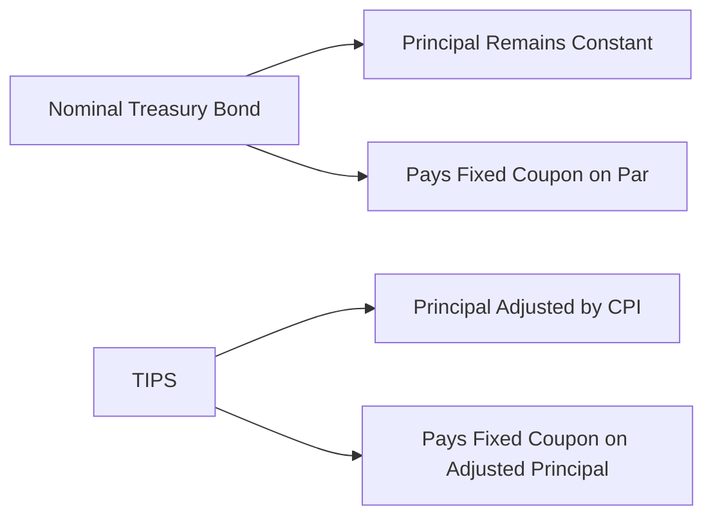

## Introduction and Context

So, let’s talk about inflation-linked bonds, specifically Treasury Inflation-Protected Securities (TIPS) in the U.S. market. If you’ve ever worried about inflation eating away at your coupon payments, TIPS might be your new best friend. They’re designed to help investors preserve purchasing power by adjusting the principal based on consumer price changes. In a sense, you get paid more coupon dollars when inflation goes up and, in some ways, you’re partially shielded when inflation goes down. But watch out—there are nuances, like indexation lags, deflation floors, and potential tax implications (depending on your jurisdiction and account type) that can be tricky.

This article also covers derivative products known as inflation caps and floors. These can be integral if you’re building a portfolio that needs to ride out big surprises in inflation—either upward or downward. They essentially create a framework that sets maximum or minimum inflation-linked adjustments or cash flows, so your portfolio’s inflation sensitivity goes only so high or so low.

We’ll delve into all these features in detail. From a CFA® Level II perspective, you’ll need a deeper, more quantitative understanding of how TIPS returns are computed, how to interpret “real yields,” and how to structure inflation derivatives in a fancy portfolio. We’ll pepper our discussion with some short coding examples, a few formulas, and a mermaid diagram or two, so buckle up and get ready to see how TIPS can help you stay ahead—or at least pace with—inflation.

## Overview of TIPS

Treasury Inflation-Protected Securities (TIPS) are a special class of U.S. Treasury bonds. They were introduced, in large part, to provide investors with a relatively safe way to hedge inflation risk. As you probably recall from the earlier chapters on bond pricing (see Chapter 2 and Chapter 3 for fundamentals), standard nominal Treasuries offer a coupon payment on a fixed principal. That means if prices rise unexpectedly, you retain the same nominal coupon but lose some real purchasing power.

TIPS fix that problem by adjusting the principal in line with the Consumer Price Index (CPI). Whenever inflation is measured in the CPI, that updated inflation rate eventually flows into your TIPS principal. So if CPI rises by 2%, the bond's principal is bumped up by roughly 2%. You then receive coupon interest calculated on this higher principal, which translates into bigger nominal coupon payments to keep pace with rising prices. At maturity, you get the higher inflation-adjusted principal, or par value, whichever is greater. The latter guarantee is known as the deflation floor.

Using TIPS can serve several critical goals:

• Hedge inflation risk: TIPS maintain purchasing power and protect bond investors who’d otherwise be hammered by rising prices.  
• Diversify fixed income portfolios: TIPS often respond differently to macro trends compared to nominal bonds.  
• Base for real yield curves: Bond geeks use TIPS yields to infer real interest rates in the economy and compare them with nominal yields to estimate inflation expectations (the break-even inflation rate).

## Principal Adjustments Mechanism

One essential point about TIPS is that they typically apply an indexation lag—commonly around two or three months. This might feel a bit weird at first, but the rationale is that the U.S. Bureau of Labor Statistics (BLS) needs time to collect and publish the CPI data. So TIPS catch up with reality on a delayed schedule.

Here’s a rough example:

1. Suppose the reference CPI for April is published in mid-May.  
2. The TIPS bond that references April CPI might apply that data from June onward.  
3. By June, your principal is adjusted to reflect April’s inflation reading.

Mathematically, you might represent the inflation-adjusted principal, Pᵃ, as:


P^a = P_0 \times \frac{\text{CPI}_{\text{current reference}}}{\text{CPI}_{\text{issue date reference}}}


Where:  
• P₀ is the original par value at issuance.  
• CPI_current reference is the relevant CPI reading for the adjustment date.  
• CPI_issue date reference is the CPI reading from when the bond was issued (or the base reference date).

Your coupon payment is then calculated as:


\text{Coupon Payment} = \text{Coupon Rate} \times P^a


To get a sense of how this might look in practice, let’s do a quick (and somewhat simplified) Python snippet:

```python
par_value = 1000.0
annual_coupon_rate = 0.02  # e.g., 2%
inflation_index_ratio = 1.03  # Suppose inflation jumped 3% since issuance

adjusted_principal = par_value * inflation_index_ratio
coupon_payment = adjusted_principal * annual_coupon_rate

print(f"Adjusted Principal: ${adjusted_principal:.2f}")
print(f"Coupon Payment: ${coupon_payment:.2f}")
```

In this snippet, we assumed a 3% inflation factor. With a principal that’s nudged up to $1,030, the coupon is $1,030 × 2% = $20.60—compared to $20 on the original $1,000. It’s a modest jump, but over many years, these incremental increases can keep your purchasing power from drifting too far behind.

## Real Yield vs. Nominal Yield

So, heads up: TIPS yields are typically referred to as “real yields.” This real yield is the interest rate you get over and above inflation—meaning the quoted TIPS yield is basically your inflation-adjusted return. If you compare TIPS yields to regular nominal Treasury yields, you can glean what the market expects for inflation over the life of the bond.

For instance, let’s do a quick hypothetical:

• Suppose a 10-year nominal Treasury yields 4%.  
• A 10-year TIPS yields 1.2%.  
• The difference of 2.8% is often interpreted as the market’s break-even inflation rate (though that also includes liquidity and risk premiums, so it’s not always a clean measure).

A big chunk of TIPS analysis at the Level II exam might revolve around evaluating exactly these relationships. Like, you might see a vignette where inflation is projected to spike. The question: Are TIPS fairly priced given the break-even inflation rate? Spoiler: If actual inflation ends up far exceeding that break-even, TIPS might outperform nominal Treasuries. If inflation stays tame, TIPS might underperform because nominal Treasuries started off paying the higher yield.

## Illustrating TIPS vs. Nominal Yields

Below is a simple Mermaid flowchart comparing nominal Treasury bonds with TIPS:



Think about it as two parallel universes. In one, you get a stable principal but potentially eroding purchasing power. In the other, your principal can shift upward (or downward, but not below par at maturity) as inflation data fluxes.  

## Inflation Caps/Floors (Derivatives)

Inflation caps/floors are derivative contracts linked to inflation metrics—usually some version of the CPI. They set boundaries on how much inflation can increase (cap) or decrease (floor) the indexation of coupon payments or the principal over a specified time. 

Why might you want these? Maybe you anticipate that inflation could blow past typical expectations, but you only want so much inflation exposure. Or, conversely, you might worry that deflation or extremely low inflation for many years could hamper your returns. These instruments let you tailor how you experience inflation in your portfolio. If inflation rises too high, a cap means you’ll effectively get no further benefit from the bond’s inflation adjustment over that cap. If deflation is too deep, a floor ensures you won’t get hammered beyond a certain point.

It’s kind of akin to interest rate caps/floors—only the underlying is the inflation index rather than, say, LIBOR or SOFR. Portfolio managers sometimes add these to TIPS to shape the payoff structure. You could end up with piecewise linear exposures to inflation that might smooth out your cash flows. Typically, these can be either embedded features in structured notes or purchased as standalone over-the-counter derivatives through banks.

## Strategic Use in Portfolios

• Liability matching: TIPS can be extremely helpful if you have inflation-sensitive liabilities, like pensions or retirement obligations that must keep pace with standard-of-living adjustments.  
• Maintain real spending power: If your key objective is preserving real wealth, TIPS do a splendid job, especially if you’re concerned about moderate to high inflation scenarios.  
• Diversification benefits: TIPS returns often differ from nominal Treasuries because of their unique adjustment mechanism. That said, everything is still nominally risk-free from a credit perspective if you assume the U.S. government can always pay. Liquidity might differ from standard Treasuries, but TIPS are typically more liquid than most corporate alternatives.  
• Use with caps/floors: Adding inflation caps can protect from paying too high a coupon if inflation skyrockets. Conversely, floors can guarantee a minimum payout if inflation tanks. For a manager seeking to reduce convexity risks or limit exposure to extreme inflation outcomes, these derivatives are quite handy.

One cautionary tale I encountered once: an investor I knew rushed into TIPS in a period of high inflation hype. The hype collapsed, inflation came in well below expectations, and the investor felt disappointed when TIPS underperformed nominal Treasuries. The moral? TIPS are awesome for actual inflation, but if inflation never arrives, you might end up with a lower yield than you’d get from a plain-vanilla bond.

## Advanced Considerations for Level II Candidates

There are a few finer points that commonly arise in exam scenarios:

1. Calculating real coupon payments and principal accretion:  
   • Expect numeric questions that involve applying a certain CPI increase to find the adjusted principal. Then multiply by the stated coupon rate (not the YTM).  

2. Comparing TIPS vs. nominal performance:  
   • You might get a table of expected CPI values over 3 to 5 years. The question could ask, “Under scenario X, which security outperforms?” Typically, you compare the net present value of TIPS cash flows with that of a nominal bond.  

3. Understanding deflation floors and negative inflation:  
   • TIPS won’t pay below par at maturity. So even if the reference CPI goes below the issuance date’s CPI, you’re still assured your original principal.  

4. Using inflation caps/floors:  
   • You might have to demonstrate how a cap or floor changes the payoff diagrams. Think of it similarly to a call or put option, but on the inflation index rather than a stock price.  

In an item-set question, you might see a portfolio with TIPS plus an inflation floor. The scenario could test your ability to compute the net effect on cash flows if inflation dips below zero. Or you might need to interpret how the derivative payoff modifies the final bond redemption.

## Practical Example: Pricing a TIPS Bond Over Time

Let’s walk through a hypothetical, multi-year TIPS. Assume:

• 3-year TIPS with par = $1,000 and coupon rate of 2%.  
• Annual inflation rates for each year: 2.5% the first year, 3.0% the second, and 1.0% the third.  

For simplicity, we’ll assume annual compounding with no indexation lag. This is not strictly realistic, but it’s enough for illustrating.

Year 0 (Issue):  
• Principal = $1,000  

Year 1:  
• Inflation = 2.5%  
• Adjusted principal = 1,000 × (1 + 0.025) = $1,025  
• Coupon payment = 1,025 × 0.02 = $20.50  

Year 2:  
• Additional inflation = 3.0%  
• Adjusted principal = 1,025 × (1 + 0.03) = $1,055.75  
• Coupon payment = 1,055.75 × 0.02 ≈ $21.12  

Year 3:  
• Additional inflation = 1.0%  
• Adjusted principal = 1,055.75 × (1 + 0.01) ≈ $1,066.31  
• Coupon payment = 1,066.31 × 0.02 ≈ $21.33  
• Maturity redemption = $1,066.31 (because it’s above $1,000)  

If deflation had occurred, we’d follow the same logic, but the principal might trend downward. However, at final maturity, the TIPS cannot pay you less than $1,000. That’s the built-in deflation floor.

## Inflation Caps/Floors: A Deeper Look

An inflation cap is a series of call options on an underlying inflation index (often called “caplets”) across multiple periods. If inflation is above a certain strike rate, you get paid the difference. Conversely, with an inflation floor, you hold put options on the inflation index (often called “floorlets”). If inflation falls below a certain strike, you receive a compensating payout.

Think of it in payoff terms:

• Cap payoff in period t ≈ Notional × max(Inflation(t) – Strike, 0)  
• Floor payoff in period t ≈ Notional × max(Strike – Inflation(t), 0)  

You can embed these in inflation-linked notes or buy them separately. Sometimes, a manager with TIPS holdings might sell an inflation cap to generate premium income if they believe inflation is unlikely to skyrocket beyond the cap level. Alternatively, a manager anticipating deflation might buy an inflation floor to guarantee a certain yield.

Managers also use inflation derivatives to shape portfolio “convexity” to changes in inflation. If you think about it, typical TIPS already have optionality regarding the par floor. Adding caps/floors modifies how the bond’s cash flows respond to big or small CPI changes. The net effect can be fine-tuned to a manager’s macro outlook.

## Best Practices and Pitfalls

Here are some helpful tips and potential pitfalls to keep in mind:

• Stay realistic with inflation assumptions. TIPS can underperform if inflation ends up lower than the break-even rate.  
• Remember the index lag. Don’t be surprised to see a short-term mismatch in your interest or principal adjustments versus the actual inflation data.  
• Be mindful of tax treatment (especially if you’re in the U.S.): Even though you don’t physically receive the inflating principal until maturity, any upward principal adjustments can be taxable each year (for investors in taxable accounts).  
• Watch out for liquidity differences. TIPS trading volumes can be lower in certain maturities compared to on-the-run nominal Treasuries.  
• For exam questions, carefully track each step: coupon calculation, principal adjustments, real yield vs. nominal, and final redemption.  

From personal experience, I’ve seen candidates lose track of the indexing formula or forget to apply it to the entire principal each time. Another common slipup is ignoring the deflation floor at maturity—and incorrectly computing a negative redemption amount. The exam might present a twist question with a deflationary environment near maturity, so keep that in your mental toolkit.

## Exam Tips

CFA Level II typically loves to test:

• TIPS vs. nominal Treasuries performance: You might see a scenario with specific inflation assumptions.  
• Calculation of coupon payments: They might give you partial-year lags or monthly inflation data.  
• OAS or spread analysis: In advanced contexts, TIPS can have an OAS measure relative to real yield curves.  
• Derivatives with TIPS: Possibly a question about inflation caps/floors or a real yield swap.  
• Summaries of key rate durations (see Chapter 25) or sensitivity to real interest rates vs. inflation expectations.  

Time management is crucial: an item set might contain multiple references to the same TIPS security across different time frames, each requiring a fresh calculation. Speed and precision matter—practice some quick ratio computations.

## References and Further Reading

• CFA Institute Program Curriculum, Fixed Income Readings (2025 Edition).  
• U.S. Department of the Treasury – TreasuryDirect:  
  https://www.treasurydirect.gov/indiv/research/indepth/tips/res_tips.htm  
• “Inflation-Indexed Securities: Bonds, Swaps, and Other Derivatives” by Mark Deacon, Andrew Derry, and Dariush Mirfendereski.  
• Securities Industry and Financial Markets Association (SIFMA):  
  https://www.sifma.org/ – Research and statistics on inflation-linked securities.  

Anyway, that covers the main gist. TIPS and inflation caps/floors can be invaluable if you want to preserve your real wealth or shape inflation risk. They’re especially relevant in uncertain macroeconomic environments when everyone’s buzzing about which way inflation is headed. Now that you’ve got a sense of the nuts and bolts, let’s test that knowledge with some practice questions.

## Assess Your Knowledge: TIPS and Inflation Caps/Floors



### If a TIPS bond’s principal is adjusted from $1,000 to $1,030 due to inflation and the coupon rate is 2%, what is the new coupon payment?

- [ ] $10
- [ ] $20
- [x] $20.60
- [ ] $25

> **Explanation:** The inflation-adjusted principal is $1,030. With a 2% coupon rate, the annual coupon is 2% × 1,030 = $20.60.

### Which best describes the deflation floor on TIPS?

- [ ] It reduces the coupon payment to zero if inflation is negative.
- [ ] It ensures the bond doubles in principal if inflation is negative.
- [ ] It caps the inflation adjustment at a certain percentage.
- [x] It guarantees redemption at least at the original par value.

> **Explanation:** The deflation floor ensures the investor never receives less than the original par value at maturity, even if cumulative inflation has become negative.

### A 10-year nominal Treasury yields 3.8%, while a 10-year TIPS yields 1.0%. The difference of 2.8% is generally interpreted as:

- [ ] The real yield in the market.
- [x] The break-even inflation rate.
- [ ] The coupon on TIPS.
- [ ] The TIPS indexation lag.

> **Explanation:** The gap between nominal and real yields is often read as the market’s implied inflation expectation (the break-even rate).

### Which of the following is a primary reason investors prefer TIPS during periods of rising inflation?

- [ ] TIPS yields move inversely with inflation.
- [x] TIPS principal is adjusted upward, leading to higher coupon payments.
- [ ] TIPS default risk decreases in high inflation.
- [ ] TIPS provide maximum volatility in real terms.

> **Explanation:** TIPS adjust principal upwards for inflation, resulting in larger nominal coupon payments that help preserve purchasing power when inflation rises.

### Which statement about inflation caps/floors is most accurate?

- [ ] Inflation caps/floors are identical to interest rate caps/floors.
- [ ] Inflation caps/floors guarantee a fixed nominal yield.
- [x] They protect investors from inflation moving above or below preset bounds.
- [ ] They are standard exchange-traded products.

> **Explanation:** Inflation caps/floors put boundaries on inflation adjustments to cash flows. They are conceptually similar to interest rate caps/floors but are based on an inflation index, not an interest rate index.

### What typically happens if deflation occurs during the life of a TIPS?

- [ ] The bond’s principal is permanently set to zero.
- [x] The principal decreases, potentially lowering coupon payments, but not below par at maturity.
- [ ] The deflation is ignored, and the principal remains unchanged.
- [ ] Coupons accelerate to compensate.

> **Explanation:** TIPS principal does adjust downward in periods of deflation, which can reduce coupon payments. However, at maturity, redemption does not fall below the bond’s original par value.

### A portfolio manager wants to limit gain from high inflation on her TIPS holdings to a maximum of 3% per year. Which derivative might she use?

- [ ] Purchase an inflation floor with a strike at 3%.
- [x] Sell an inflation cap with a strike at 3%.
- [ ] Buy a nominal interest rate cap at 3%.
- [ ] Sell a TIPS bond.

> **Explanation:** Selling an inflation cap at 3% effectively transfers potential gains above 3% inflation in exchange for receiving a premium.

### If the 3-year cumulative CPI was lower at maturity than it was at issuance, how does the deflation floor affect the TIPS redemption?

- [ ] It does not affect redemption; redemption is still the reduced principal.
- [ ] Yields automatically increase to compensate for deflation.
- [ ] Coupons are restructured to zero.
- [x] The bondholder still receives at least the original par value.

> **Explanation:** The deflation floor ensures that, regardless of negative cumulative inflation, the matured value is never below par.

### How do TIPS differ from standard nominal Treasuries in terms of yield quotes?

- [ ] TIPS quotes include expected inflation plus real yields.
- [x] TIPS yields reflect a real yield, separate from expected inflation.
- [ ] Nominal Treasuries quote a real yield.
- [ ] They do not differ; both reflect nominal interest rates.

> **Explanation:** TIPS yields are often cited as real yields, indicating the return in excess of inflation, whereas nominal Treasury yields are not inflation-adjusted.

### TIPS coupon calculations are based on:

- [x] The inflation-adjusted principal.
- [ ] The difference between nominal and real bond yields.
- [ ] A fixed nominal principal that never changes.
- [ ] The forward rate agreement.

> **Explanation:** TIPS coupons are computed using the fixed coupon rate multiplied by the inflation-adjusted (and potentially changing) principal.


