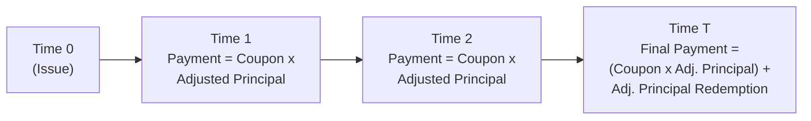

## Real Discount Rates vs. Nominal Discount Rates
Sometimes, when we first hear the words “real” vs. “nominal,” we might feel a bit overwhelmed—like, which is which again? But trust me, it’s simpler than it looks. Think of a nominal discount rate as an “all-in” rate that includes the market’s expectation of inflation, while a real discount rate is the portion that excludes the inflation component. Inflation-linked bonds, like most Treasury Inflation-Protected Securities (TIPS) in the US, are designed to isolate this inflation component so we can focus on the “real” return. 

From a valuation standpoint, using a real discount rate means we discount inflation-adjusted cash flows by a rate that’s purged of expected inflation. So the idea is: if you’re receiving cash flows adjusted for changes in the price level, that “real” series of payments should be matched with a “real” discount rate. By contrast, with regular (nominal) bonds, we handle nominal coupon payments using nominal discount rates.

In practice, the real discount rate is often derived from the real yield curve specific to TIPS or index-linked securities. The market for these bonds typically provides a real yield at each maturity, reflecting the time value of money over and above inflation.

## Projected Cash Flow Analysis
To nail down the valuation, the next step involves projecting the cash flows. Here is where a little guesswork about the path of inflation comes in:

• Base-Case Inflation Scenario: You take an inflation forecast—maybe gleaned from break-even inflation levels or from an official central bank forecast—and project how the bond’s principal is going to evolve. For TIPS, principal is typically recalculated by multiplying the original principal by the ratio of the Consumer Price Index (CPI) at the coupon date to the index at issuance.

• Alternative Scenarios: Markets can be unpredictable, and inflation can stray from the base-case path. Doing a sensitivity analysis means you take a look at what happens if inflation is higher or lower than you forecast. If actual inflation leaps upward, your coupon payments and redemption amount on an inflation-linked bond should rise (ceteris paribus). If inflation lags, well, your cash flows grow more slowly. 

One personal anecdote: I once saw a portfolio manager run multiple simulations for an institutional client where each simulation stressed inflation upwards or downwards by a few percentage points. Some illusions got shattered when the “seemingly safe” bond position still had a bit of volatility thanks to uncertain future inflation. It just goes to show how crucial inflation projections can be.

Below is a simple Mermaid diagram that shows—at a high level—how inflation-adjusted principal and coupon payments might evolve over time:

## Index-Linked Bond Pricing Formula
In many Level II texts, you’ll encounter the standard formula for pricing an index-linked bond. Conceptually, you’re summing up the present value of each coupon payment plus the redemption (principal repayment), where each is adjusted for inflation. 

If we let:
• \\( \mathrm{AI}_t \\) = the inflation adjustment factor at time \\( t \\) (often \\(\mathrm{AI}_t = \frac{\mathrm{CPI}_t}{\mathrm{CPI}_0}\\)),  
• \\( r_t \\) = real yield or real discount rate applicable for time \\( t \\),  
• \\( C \\) = annual coupon rate (as a percentage of par),  
• \\( P_0 \\) = the original principal (at issuance),  

then a simplified expression for the bond price might look like:


\text{Bond Price} 
= \sum_{t=1}^{T} \frac{(P_0 \times \mathrm{AI}_t \times C)}{(1 + r_t)^t} 
\;+\; \frac{P_0 \times \mathrm{AI}_T}{(1 + r_T)^T}.


Here, the coupon at each period \\( t \\) is \\( P_0 \times \mathrm{AI}_t \times C \\), since the principal has been adjusted by the ratio \\(\mathrm{AI}_t\\). And at maturity \\( T \\), you repay the adjusted principal \\(\bigl(P_0 \times \mathrm{AI}_T\bigr)\\). 

You might recall from Chapter 3: Yield Measures and Bond Pricing Basics that we covered how to discount cash flows for nominal bonds. With inflation-linked bonds, same principle—just note that your principal and coupons keep getting scaled by the inflation index, and your discount factor (i.e., the real yield) is typically smaller than a nominal yield because it doesn’t have that built-in inflation premium.

## Impact of Deflation
Inflation goes up. Inflation goes down. It can get a little nerve-wracking if you have large positions in inflation-linked securities and talk in the press starts swirling about “unexpected deflation.” In many markets, TIPS have a deflation floor. This means, even if the reference index (like the CPI) plunges, the security’s redemption amount won’t fall below par (the original face value).

And that floor can throw a little curveball into our valuation. Mechanically, the deflation floor behaves somewhat like a put option on the inflation index, offering protection if inflation plummets. This optionality can give your bond a bit of a premium compared to a hypothetical “purely linear” inflation-linked security without a floor. 

However, the exact advantage of this embedded protection depends heavily on the probability and severity of deflation scenarios. If your deflation outlook is minimal, the floor may not matter much in your pricing. But if you anticipate deflation risk—maybe you’re looking at severe recessions or historical patterns—then that floor can significantly affect the final payoff.

## Advanced Topics—OAS and Real Option-Adjusted Spreads
In many inflation-linked issuances, the basic structure is straightforward (like standard TIPS). But every now and then, you’ll run into variants with additional embedded features—caps, enhanced floors, or other bespoke structures. In those cases, analysts might resort to an Option-Adjusted Spread (OAS) framework using real discount rates (hence a “real OAS”).

Here’s the gist:  
• We try to isolate the spread over a standard real yield curve by accounting for the value of embedded options.  
• The complexity is that typical OAS models revolve around nominal interest rate trees or forward curves. So you often adapt or “translate” those frameworks into real terms to properly reflect the inflation-linked nature of the security.  
• If you see a large OAS, it might indicate that the bond is trading cheap relative to the real yield curve after factoring in the embedded features—though you have to be sure your model is capturing the wide range of inflation scenarios.

This real OAS approach is especially relevant in markets outside the U.S., where local inflation-linked structures can deviate from the standard TIPS framework. For instance, some countries might have partial deflation floors, or the index might lag inflation by multiple months, so you embed that into your scenario analysis.

## Common Pitfalls and Strategies for the Exam
• Ignoring the Deflation Floor. Some candidates accidentally treat TIPS as if the redemption amount will always follow CPI downward. Not so. Remember the embedded floor, because that can impact your final discounted cash flow calculation.  
• Mixing Up Real and Nominal Rates. Don’t discount real cash flows at a nominal rate. It’s easy to slip up if you’re in a hurry. Double-check you’re using real discount rates for inflation-adjusted cash flows.  
• Underestimating Sensitivity. Inflation-linked bonds can still be volatile if real interest rates shift unexpectedly. Don’t let the moniker of “inflation protection” lull you into ignoring yield curve fluctuations.  
• Overcomplication. Yes, inflation modeling can get complicated, but sometimes a straightforward scenario approach is enough for a question or exam scenario. Don’t get lost in the weeds—keep an eye on the big conceptual picture.

## Glossary
• Real Discount Rate: A rate reflecting the time value of money in “inflation-free” terms, separate from any inflation premium.  
• Deflation Floor: A protection feature that ensures the bond’s principal does not fall below par, even if inflation goes negative.  
• OAS (Option-Adjusted Spread): A spread measure that accounts for the value and impact of embedded options in a bond.  
• Nonlinear Payout Profile: A payoff structure that doesn’t map in a purely linear way to interest or inflation changes—often attributed to embedded options or floors/caps.

## References and Further Reading
• CFA Institute – Level II Material on Bond Valuation Methods (2025 edition).  
• Tuckman, B. & Serrat, A. (Latest Edition). “Fixed Income Securities: Tools for Today’s Markets.”  
• Bank for International Settlements (BIS) Reports on inflation-linked bond markets:  
  https://www.bis.org/  

## Test Your Knowledge: Valuation Adjustments in Inflation-Linked Securities



### Which discount rate is typically used to value inflation-linked bonds?

- [ ] Nominal rate that factors in expected inflation.
- [ ] The prime rate set by the government.
- [x] Real discount rate derived from an inflation-linked yield curve.
- [ ] The same discount rate as used for high-yield bonds.

> **Explanation:** Inflation-linked bonds separate inflation compensation from the coupon. Hence, they are valued using a real discount rate on real (inflation-adjusted) cash flows.

### What is the role of the deflation floor in TIPS?

- [ ] It allows negative coupon payments during a deflationary period.
- [x] It guarantees the principal payment will not fall below par.
- [ ] It transfers all deflation risk to the bondholder.
- [ ] It is a feature that significantly reduces the bond’s maturity date.

> **Explanation:** The deflation floor ensures that, at maturity, investors receive at least the original par value even if the price index declines below the issue date level.

### Which of the following elements does not directly influence the price of an inflation-linked bond?

- [ ] Expectations of future inflation.
- [ ] The deflation floor’s optionality.
- [x] The issuing company’s equity price.
- [ ] The real yield curve shaping discount rates.

> **Explanation:** For inflation-linked government securities, the issuing company’s (or government’s) equity price is irrelevant. Inflation expectations, the deflation floor, and real yields all directly factor into valuation.

### In an OAS framework for inflation-linked bonds, which scenario would best demonstrate the real OAS concept?

- [ ] Applying a nominal yield curve to discounted real cash flows.
- [ ] Ignoring inflation altogether when constructing a binomial tree.
- [x] Adjusting the short-rate tree for real interest rates and modeling inflation scenarios to price the embedded options.
- [ ] Using standard corporate bond spreads that ignore inflation linkages.

> **Explanation:** Real OAS involves building or adapting a short-rate model that incorporates real interest rates (and typically inflation paths) to properly price the options in an inflation-linked context.

### When performing a projected cash flow analysis on an inflation-linked bond, which approach is most appropriate?

- [x] Adjust the principal for projected inflation and discount cash flows by a real yield.
- [ ] Subtract the nominal discount rate from the inflation adjustment factor.
- [x] Perform multiple sensitivity analyses on inflation assumptions.
- [ ] Use a single scenario forecast that ignores inflation volatility.

> **Explanation:** Inflation-linked bonds are typically projected under different inflation scenarios to gauge sensitivity, with each future payment adjusted for inflation and discounted at the real yield.

### What might happen to the price of TIPS if the general level of real interest rates rises, assuming no change in inflation expectations?

- [x] The price will likely decrease.
- [ ] The price will likely increase.
- [ ] The price will remain unchanged.
- [ ] The coupon rate will automatically reset higher.

> **Explanation:** Higher real interest rates reduce the present value of the inflation-linked bond’s cash flows, causing its price to drop.

### How does the embedded deflation floor affect the bond’s payoff profile?

- [x] It introduces an element of optionality that provides downside protection.
- [ ] It converts TIPS into a floating-rate note.
- [x] It can make the bond’s payoff nonlinear in the face of severe deflation scenarios.
- [ ] It compels investors to pay extra if deflation occurs.

> **Explanation:** The deflation floor is akin to a put option on the inflation index, providing a floor on redemption value, thereby making the bond’s payoff profile nonlinear for large negative inflation swings.

### In a real OAS calculation for a bond with an inflation cap, how might the cap affect valuation?

- [x] It limits the bond’s upside from unexpectedly high inflation.
- [ ] It deletes all principal adjustments due to inflation.
- [ ] It causes the bond to carry a lower yield than other TIPS with no cap.
- [ ] It swaps the real yield for a nominal yield after a threshold date.

> **Explanation:** A cap restricts principal or coupon escalation beyond a certain inflation level. As a result, it limits upside potential, potentially changing the OAS relative to a standard bond without that feature.

### Which of the following is a reason that OAS modeling might be more complex for inflation-linked bonds than for nominal bonds?

- [x] Real yield curves and inflation risk must be modeled simultaneously.
- [ ] There are fewer data points for inflation markets than for equity markets.
- [ ] The spread structure completely ignores any interest rate risk.
- [ ] Inflation indexing is only relevant to short-duration bonds.

> **Explanation:** Inflation-linked OAS models combine interest rate volatility, inflation volatility, and potential option features, making them more complex than nominal bond OAS modeling.

### An investor states, “TIPS always guarantee positive returns after inflation.” Is this statement true?

- [x] True
- [ ] False

> **Explanation:** TIPS return is designed to protect against inflation by adjusting the principal in line with the CPI. However, note that interest rate movements can still cause price fluctuations intra-holding period, but at maturity, you do preserve real purchasing power relative to inflation.


