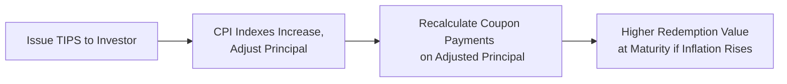

## Vignette Context

Let’s say you’re a portfolio manager at a mid-sized insurance company. You’ve got your eyes on Treasury Inflation-Protected Securities (TIPS) as an inflation hedge, but you wonder how they stack up against conventional nominal Treasuries, especially now that your team is forecasting a possible uptick in the inflation rate. You’re contemplating whether TIPS would preserve purchasing power more effectively—even if it means giving up some nominal yield today.

You receive a data set from your research analyst:

• Current yield on a 5-year nominal Treasury note: 3.2%  
• Current real yield on a 5-year TIPS: 1.0%  
• Market-implied break-even inflation (historical average over last decade): ~2.2%  
• Your internal inflation forecast (over the next 5 years): 3.0%  

Your goal: Decide whether TIPS is the better choice based on these assumptions. You’ll also need to compute break-even inflation, analyze the TIPS principal adjustment, and evaluate likely total returns under different inflation scenarios.

## Break-Even Inflation and Decision Making

The fundamental formula in TIPS vs. nominal bond analysis is the break-even inflation (BEI). At a high level, it’s:

$$
\text{Break-Even Inflation} = \text{Nominal Yield} - \text{TIPS Real Yield}.
$$

Interpreting that result is pretty straightforward: If you believe actual inflation over the bond’s life will exceed the break-even rate, TIPS becomes attractive. If you think inflation will stay below the break-even rate, a nominal Treasury may offer a higher real return.

From the data above:

• Nominal Yield = 3.2%  
• TIPS Real Yield = 1.0%  

So:

$$
\text{Break-Even Inflation} = 3.2\% - 1.0\% = 2.2\%.
$$

If your inflation forecast is 3.0%—which is higher than 2.2%—then TIPS is likely to outperform nominal Treasuries over the same period, because you’ll gain from the higher-than-expected inflation adjustment.

## How TIPS Adjust for Inflation

TIPS pay a real coupon rate on a principal amount that adjusts according to changes in the Consumer Price Index (CPI). When inflation rises, the principal is marked up, and future interest payments go up accordingly (since coupons are calculated on the adjusted principal). Let’s break this down with a hypothetical short example:

• Par value at issuance: $1,000  
• Annual coupon rate (real): 1.0%  
• Inflation in Year 1: 3.0%  

After one year, the principal might be adjusted to:

$$
\$1{,}000 \times (1 + 0.03) = \$1{,}030.
$$

The coupon for Year 1 is then:

$$
\$1{,}030 \times 1.0\% = \$10.30.
$$

So, as inflation continues, principal gets ratcheted up (or down if inflation is negative), and investors continue to receive coupon payments based on that adjusted principal. By maturity, if inflation has been positive, you’ll redeem your bond at the higher (inflation-adjusted) principal.

Below is a quick visual illustrating the TIPS mechanics:

## Scenario Analysis and Real Returns

Scenario analysis can help confirm your intuition. You might explore three different cases—pessimistic, base, and optimistic:

• Pessimistic scenario: Inflation sits around 1.5%.  
• Base case: Inflation aligns with 2.2% break-even.  
• Optimistic scenario: Inflation ticks up to 3.0% or higher.

In lower-inflation environments, nominal bonds may have an edge. But if inflation creeps above the break-even rate, the all-in return on TIPS could exceed that of a nominal Treasury. It’s worth highlighting that TIPS are about maintaining purchasing power, so focusing on the real return perspective is crucial.

## Example: TIPS Payment Calculation Over Two Years

Imagine a simplified two-year timeline for a TIPS with a 1.5% real coupon, a $1,000 par value, and the following annual inflation forecasts:

• Year 1 inflation: 2.5%  
• Year 2 inflation: 3.5%  

End of Year 1:
• Adjusted principal = $1,000 × (1 + 0.025) = $1,025.  
• Coupon payment = 1.5% × $1,025 = $15.38.

End of Year 2:
• New principal = $1,025 × (1 + 0.035) = $1,061 (rounded).  
• Coupon payment = 1.5% × $1,061 ≈ $15.92.  
• Redemption amount at maturity ≈ $1,061.

You can see how yields and coupons adapt to inflation conditions. That characteristic can provide a better hedge for your real return if those inflation forecasts are accurate (or if inflation surprises to the upside).

## Interpreting Higher-Than-Expected Inflation

If inflation ends up being higher than 2.2% (the break-even), TIPS holders rejoice because both principal accretion and coupon payments get a bigger boost. Nominal Treasury holders could find themselves locked into a 3.2% coupon while real purchasing power declines.

On the flip side, if disinflation or deflation hits, TIPS might underperform nominal Treasuries. However, there is a floor on the TIPS principal (it cannot go below par at maturity), which offers some downside cushion in a deflationary scenario—albeit it’s less beneficial than a coupon from a higher nominal rate if deflation is modest.

## Common Pitfalls for Exam-Takers

• Mixing up nominal and real rates: Always label your data carefully.  
• Forgetting partial-year adjustments: If the exam vignette has you computing inflation for half-year periods, keep an eye on how the test deals with annualization.  
• Overlooking the principal floor: TIPS will not mature below par value even if the CPI goes negative.  
• Confusing break-even inflation with forward inflation: Break-even is an implied measure from current yields, whereas forward inflation is a forecast or actual future outcome.

## Tips for the Exam

• Identify the exam’s “key numbers” quickly, especially nominal yield, real yield, and inflation forecasts.  
• Use the standard formula for break-even inflation and interpret results in the context of the scenario.  
• Remember that TIPS coupons and principal both adjust to inflation, so examine the bigger picture of total returns.  
• Always ask: “What if inflation is higher/lower than the break-even?” Then consider the real purchasing power angle.

## Brief Glossary Refresher

• Scenario Analysis: Evaluating how TIPS returns change if inflation is 1%, 2%, 3%, etc., to see how your final payoff might differ.  
• Purchasing Power: The real value of your money in terms of what it can buy. TIPS aim to maintain it by shifting principal with CPI.  
• Real Return: The actual growth of your purchasing power, adjusted for inflation.

## Further Reading

• U.S. Treasury’s Office of Debt Management: Technical notes on TIPS auctions, tax treatment, etc.  
• PIMCO and BlackRock Research: White papers on incorporating TIPS into fixed income portfolios.  
• Previous CFA® Program Vignettes: Look for break-even inflation item sets to see how questions might appear on the exam.

## Test Your Knowledge: TIPS Yield Analysis



### 1. Which formula correctly defines break-even inflation for TIPS vs. nominal Treasuries?

- [x] Nominal yield – TIPS real yield = Break-even inflation
- [ ] TIPS real yield – Nominal yield = Break-even inflation
- [ ] Inflation rate – Real yield = Break-even inflation
- [ ] TIPS principal – Nominal yield = Break-even inflation

> **Explanation:** The break-even inflation rate is nominal yield minus TIPS real yield.  

### 2. Suppose a 10-year TIPS has a real coupon of 1.2% and the comparable nominal Treasury yield is 3.0%. If expected inflation is 2.0%, which statement is most accurate?

- [ ] The TIPS will outperform nominal Treasuries because expected inflation is below the break-even. 
- [x] The TIPS will likely underperform nominal Treasuries if inflation remains at 2.0%. 
- [ ] Both bonds will have the same real yield because nominal yield exceeds TIPS by 1.8%.  
- [ ] The nominal bond has a higher real yield than the TIPS.  

> **Explanation:** Break-even inflation is 1.8% (3.0% – 1.2%). If actual inflation is 2.0%, it is above 1.8% but very close. TIPS might slightly outperform if inflation is strictly above 1.8%, but we often consider small margins or other factors. Generally, if the question frames it that 2.0% is “expected” rather than guaranteed, TIPS might underperform if inflation hovers around that level because of coupon differences, liquidity, or risk premium considerations.  

### 3. A TIPS with a 2.0% real coupon is purchased at $1,000 par. Inflation in the first year is 4.0%. What is the adjusted principal at the end of Year 1?

- [x] $1,040
- [ ] $1,020
- [ ] $1,400
- [ ] $1,004

> **Explanation:** The principal is adjusted by 4%. $1,000 × (1 + 0.04) = $1,040.  

### 4. Which of the following is a key benefit of TIPS compared to nominal Treasuries?

- [ ] They offer higher nominal yields in all environments.  
- [x] They provide explicit inflation protection by increasing principal in line with CPI.  
- [ ] They have no interest rate risk.  
- [ ] They maintain a higher liquidity premium than nominal Treasuries.  

> **Explanation:** TIPS adjust principal for inflation, providing a measure of real protection that nominal Treasuries lack.  

### 5. A portfolio manager estimates that actual inflation over the life of a TIPS will be 2.7%. If the break-even inflation rate implied by the market is 2.5%, what is the likely outcome for TIPS vs. nominal Treasuries?

- [x] TIPS will likely produce a higher real return than nominal Treasuries.  
- [ ] Nominal Treasuries will likely provide a higher nominal coupon but lower overall real return.  
- [x] TIPS will probably outperform because actual inflation (2.7%) is above 2.5%.  
- [ ] TIPS will underperform unless inflation exceeds 3.5%.  

> **Explanation:** TIPS become more favorable when actual inflation surpasses the break-even of 2.5%.  

### 6. In a scenario analysis, if deflation occurs, how do TIPS typically behave?

- [x] They never mature below par principal, offering a floor in deflationary conditions.
- [ ] They lose all coupon payments in deflation.  
- [ ] They track nominal yields exactly.  
- [ ] They pay a floating rate coupon based on inflation.  

> **Explanation:** TIPS’ principal cannot fall below its original par value at maturity, so deflation risk is partly mitigated.  

### 7. Which statement best characterizes the difference between real yield and nominal yield?

- [x] Real yield is adjusted for inflation; nominal yield is not.  
- [ ] There is no difference; they are the same term.  
- [x] Nominal yield includes expected inflation; real yield excludes it.  
- [ ] Real yield solely depends on credit risk, while nominal yield depends on default risk.  

> **Explanation:** Nominal yield includes the inflation component; real yield concentrates on the portion above inflation.  

### 8. Investors in TIPS focus primarily on:

- [x] Changes in real purchasing power.  
- [ ] Changes in nominal returns only.  
- [ ] Volatility of the Treasury yield curve spreads.  
- [ ] Short-term rate fluctuations.  

> **Explanation:** TIPS are designed to protect real purchasing power, thus that is the key focus.  

### 9. An investor holds a TIPS whose break-even inflation is 2.0%. When actual inflation averages 2.4% over the holding period, which outcome is most likely?

- [x] TIPS provides higher total returns than the nominal bond.  
- [ ] Both TIPS and nominal bond yield the same real return.  
- [ ] The nominal bond outperforms due to a higher coupon.  
- [ ] The TIPS principal remains unchanged.  

> **Explanation:** Since inflation exceeded the break-even level, TIPS outperforms.  

### 10. Which of the following statements about TIPS is TRUE?

- [x] They adjust principal upward with inflation, giving holders an inflation hedge.
- [ ] They adjust coupon rates downward when inflation declines.
- [ ] They always pay a floating-rate coupon tied to short-term interest rates.
- [ ] They offer no principal floor in a deflationary scenario.

> **Explanation:** TIPS adjust principal in line with inflation and pay coupon on the adjusted principal.  



---

**References and Further Study**  
• CFA Institute Level II Curriculum, Fixed Income and Inflation-Linked Securities Readings  
• U.S. Treasury’s official TIPS website for auction details and FAQs  
• Research articles from large asset managers (PIMCO, BlackRock) on TIPS strategy and break-even analysis  

Feel free to reference these sources for a deeper exploration. Happy studying, and best of luck navigating TIPS on your upcoming exam!
