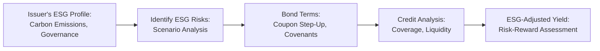

## Vignette Context and Scenario

Imagine you’re evaluating a newly proposed sustainability-linked bond issued by GlobalManuCo, a large manufacturing firm with plants across multiple continents. GlobalManuCo is known for its robust corporate governance, but, well, it also has a reputation for higher-than-average carbon emissions. Let’s say the bond includes explicit coupon adjustments tied to emission-reduction targets, in line with the firm’s public promise to shrink its carbon footprint under a new regulatory environment pushing for net-zero commitments.

Anyway, the storyline is: you’ve been assigned to figure out if this sustainability-linked bond is investable for your firm’s fixed income portfolio, taking into account both standard credit metrics and environmental, social, and governance (ESG) factors. There’s a bit of a personal reminder in here for me—once, I overlooked a minor but critical clause in a sustainability framework that ended up causing confusion about coupon step-ups, so I’ve learned to pay extra attention to the fine print. Let’s dive in systematically.

## Step-by-Step ESG Integration

### Review the Issuer’s ESG Disclosures and Track Record

First things first. GlobalManuCo publishes, on a yearly basis, an Integrated Sustainability Report aligning with several recognized frameworks (e.g., TCFD). They outline their greenhouse gas (GHG) reduction goals, workforce safety measures, and governance structures aimed at ensuring compliance with local environmental regulations. They also regularly engage in stakeholder dialogues with local communities and employees—good for the “S” in ESG.

But you can’t just trust stated disclosures alone. In this step, you:

• Study their historical progress in meeting stated emission reduction milestones.  
• Evaluate whether those goals were missed, hit, or exceeded, and how consistently.  
• Examine independent reports or third-party ESG rating agencies (like MSCI ESG Ratings, Sustainalytics, etc.) to cross-check what the issuer claims.  

Keep in mind: Overreliance on a single ESG score can be risky. Check whether the rating agencies are capturing the full range of controversies or improvements. If GlobalManuCo has a strong governance structure but has faced repeated fines for pollution, that should remain top of mind.

### Compare the Embedded Coupon Step-Up

Next, the new sustainability-linked bond includes a “Coupon Step-Up” clause. If GlobalManuCo fails to cut emissions by 20% within three years, the coupon will rise from, say, 3.00% to 3.50%. Now, from a purely yield-driven perspective, a coupon step-up might sound good for investors—who doesn’t like a higher yield if the issuer misses targets? 

But remember, an issuer failing environmental goals might erode its broader reputation, face new regulatory penalties, and see increased costs from carbon pricing. That can dampen overall credit quality. So you weigh the attractiveness of a potential coupon bump against possible credit deterioration if the issuer stumbles.

Quantitatively, you might want to run separate yield calculations. One scenario where, if all environmental targets are met, the bond remains at 3.00%. Another scenario where the coupon steps up mid-life, and you incorporate that extra 0.50% in your internal rate of return (IRR) modeling. Then discount those cash flows by the issuer’s credit risk, possibly layering in any increased risk premium if missing environmental targets signals deeper structural issues.

### Conduct a Thorough Credit Analysis

You can’t just treat ESG as an add-on. Integrating ESG means harmonizing it with existing credit fundamentals. So, you’ll do your usual deep credit dive:

• Debt coverage ratios: Does the firm’s free cash flow from operations comfortably cover interest expense, even if a carbon tax is imposed?  
• Leverage: Does GlobalManuCo’s total debt-to-equity ratio or net-debt-to-EBITDA remain manageable under different carbon pricing scenarios?  
• Macroeconomic sensitivity: In a downturn or if there’s a big push from regulators to accelerate net-zero transitions, could that hamper the company’s ability to service debt?

Don’t forget scenario analysis. For instance, if GlobalManuCo is forced to invest heavily in new tech to reduce emissions, does that hamper near-term liquidity? Are there potential regulatory fines for non-compliance that might spike outflows?

Here’s a small numeric illustration. Suppose the firm’s baseline free cash flow (FCF) for the next fiscal year is $500 million. In a “carbon tax scenario” where carbon is priced at $40 per ton, the firm’s additional cost might be $50 million, cutting FCF to $450 million. This flows into coverage ratio calculations:

Coverage Ratio = FCF / Interest Expense

If interest expense is $100 million, absent carbon tax, coverage is 5.0x. After factoring an extra $50 million cost, coverage falls to 4.5x. You might repeat this under different carbon prices ($60, $80, etc.) to see how coverage might degrade.

### Cross-Reference Internal or Third-Party ESG Scores

Now, your firm might have an internal ESG scoring framework that merges qualitative analysis (e.g., management’s track record, controversies) with quantitative metrics (e.g., carbon intensity). You’d also consider external ESG ratings from recognized providers. That way, you see how GlobalManuCo ranks compared to its industry competition. If the entire sector has stepped up sustainability, but GlobalManuCo is lagging, that might be a red flag. Or if they’re forging ahead, that could be a plus.

One caution: not all ESG rating methodologies are the same. They can emphasize different pillars—some might weigh social or hot-button controversies more than carbon footprints. So if your internal rating is drastically different from a leading external rating, investigate the discrepancy thoroughly.

### Monitor Controversies or Negative Headlines

Even if you’re satisfied with GlobalManuCo’s environmental commitments, keep scanning for negative PR that might overshadow any progress. For instance, maybe a major labor dispute emerges or there’s a product safety recall. Those events can swiftly derail stable operations and hamper finances—particularly if lawsuits or regulatory sanctions pop up.

Stakeholder engagement is also crucial. If the company has a robust mechanism for listening to employees or local communities, it may mitigate these controversies faster. But if historically, GlobalManuCo has brushed aside such issues, that’s a governance warning sign. Sizable controversies can hit bond prices quickly and widen spreads, so active monitoring is as important as initial due diligence.

## Common Pitfalls and How to Address Them

• Overreliance on a Single ESG Score: When you rely solely on an external ESG rating, you risk missing subtle details. Maybe the scope of the rating doesn’t capture some localized controversies or region-specific environmental regulations.  
  → Solution: Cross-verify multiple ESG frameworks, question outliers, and dive deeper into the rationale behind each score.

• Lack of Climate Scenario Testing: With regulatory changes pushing net-zero, a carbon tax or compliance cost is more than a remote possibility. If you fail to incorporate these future costs in your credit analysis, you might underprice risk.  
  → Solution: Use scenario analysis that includes best-case, moderate, and worst-case regulatory scenarios. Adjust your internal rating or spread accordingly.

• Assuming a Coupon Step-Up Fully Offsets ESG Downside: Sure, a failure to meet emission targets might yield a higher coupon, but if that shortfall erodes the firm’s credit quality, you could face bigger total return risk.  
  → Solution: Evaluate changes in both yield and credit spreads if ESG performance falters, not just the nominal coupon.

## Best Practices for ESG Integration in Bond Selection

• Combine Qualitative and Quantitative Factors: Evaluate intangible factors like management’s integrity, labor relations, or brand reputation. Integrate them with traditional credit metrics—coverage ratios, liquidity, debt covenants, and so on.  
• Ongoing Monitoring: ESG factors can turn on a dime if the firm is linked to controversies or new regulations. Setting up a formal policy to revisit ESG analysis every quarter or as new data emerges is essential.  
• Engage with Issuers: If your firm invests heavily in bonds from carbon-intensive sectors, consider direct engagement, asking for better disclosures or more ambitious targets.  
• Transparent Reporting: Build a practice of internally logging your ESG rationales and how they influenced pricing. This helps if you need to justify investment decisions to colleagues, clients, or regulators.

## Calculating an “ESG-Adjusted Yield”

Typically, you start with a standard yield calculation. For a standard bond with a 3.00% coupon, if you buy at par, the yield to maturity (YTM) is also 3.00%. But with a sustainability-linked bond containing a step-up of 0.50% if specific Sustainability Performance Targets (SPTs) are missed, you might run two yield scenarios:

1. “Meet-Targets” Scenario: The coupon remains 3.00% for the bond’s life. You discount those fixed cash flows by the appropriate discount rate, which might be the risk-free rate + your required credit spread.  
2. “Missed-Targets” Scenario: The bond transitions to a 3.50% coupon after three years. So you discount the initial three years at 3.00% coupon, and from year four onward at 3.50%, reflecting the probability of failing the SPT.

If p is the probability of missing the SPT, you can create a probability-weighted yield:

ESG-Adjusted Yield = (1 – p) × Yield(MT) + p × Yield(MIS)

Where:  
• Yield(MT) = yield if the issuer meets its SPTs.  
• Yield(MIS) = yield if the issuer misses the targets.

Naturally, you still have to factor in credit risk changes. If the issuer fails to meet carbon reduction goals, you might tack on an extra risk premium. So the yield impact is not just from the nominal coupon step-up, but also from an additional spread if you think the firm’s credit risk increased:

ESG-Adjusted Yield = (1 – p) × [Yield(MT)] + p × [Yield(MIS) + Spread(poor ESG)]

### Quick Python Snippet for ESG-Adjusted Yield

Below is a simplified example of how you might run a quick iterative calculation for ESG-Adjusted Yield in Python. This is definitely not an official code snippet from the exam—but hey, it can be handy in practice:

```python
import math

def weighted_yield(p_missing, yield_meet, yield_miss, spread_esg):
    # Weighted yield approximation
    return (1 - p_missing) * yield_meet + p_missing * (yield_miss + spread_esg)

p = 0.30  # 30% probability of missing SPT
y_meet = 0.03  # 3.00% as decimal
y_miss = 0.035  # 3.50% as decimal
esg_spread = 0.002  # 0.20% additional spread for missing targets

esg_adjusted_yield = weighted_yield(p, y_meet, y_miss, esg_spread)
print(f"ESG-Adjusted Yield: {esg_adjusted_yield:.4%}")
```

If you run this snippet, you might get a result around 3.22%, telling you where the bond’s yield might land on average if you weigh the scenarios by their probabilities.

## Diagram: ESG Integration Flow

Let’s visualize how ESG factors intersect with bond analysis. It’s not rocket science, but it helps to see it:



From the initial ESG profile, you identify potential climate, governance, and social risks. Then you consider how those might trigger or interact with the bond’s terms—like the step-up. Next, you roll it into your fundamental credit analysis, culminating in an ESG-adjusted yield or spread analysis.

## Putting It All Together

At the end of the day, analyzing a sustainability-linked bond from GlobalManuCo is a balancing act. On one hand, you see a firm with historically strong governance and brand presence, but with higher-than-ideal carbon emissions. On the other hand, you notice a bond structure that might raise coupons if they fail to meet emission targets, but that could also indicate deeper operational challenges down the road.

In practice, you’d produce a comprehensive investment memo with:

• Fundamental Credit Analysis (financial projections, coverage, leverage).  
• ESG Analysis (issuer’s environmental track record, social controversies, governance).  
• Probability-Weighted Scenarios (coupon step-up possibilities, carbon tax stress test).  
• Final recommendation on whether to include the bond in a portfolio, at what spread, and how much exposure to allocate given your risk appetite.

## Glossary

• Sustainability Performance Target (SPT): A predetermined goal tied to ESG metrics (e.g., carbon reduction) that, if missed or exceeded, can alter the bond’s cash flow terms.  
• Coupon Step-Up: An increase in the coupon rate if the issuer fails to meet certain milestones, such as emission reduction thresholds or sustainability certifications.  
• Carbon Pricing: Broadly, a regulatory approach that levies a cost on carbon emissions to incentivize lower GHG footprints.  
• Integrated ESG Analysis: A holistic evaluation that fuses ESG metrics with traditional financial metrics, providing a more nuanced view of creditworthiness.  
• Scenario Analysis: Exploring plausible future outcomes by adjusting variables—like carbon tax rates or coupon rates—to see how they might affect financial performance.  
• ESG Controversy Risk: The threat that emerging negative ESG news—like a labor rights scandal—damages the issuer’s market standing and finances.  
• Stakeholder Engagement: The firm’s approach to involving shareholders, employees, communities, and regulators in decision-making about ESG-related policies.  

## References

• CFA Institute Standards and ESG Integration Practices (<https://www.cfainstitute.org/>)  
• “Integrating Climate Risks in Fixed Income Portfolios” by PRI  
• TCFD Disclosure Framework (<https://www.fsb-tcfd.org/>)  
• Academic Case Studies on Successful Sustainability-Linked Bonds

## Test Your Knowledge: ESG Factors in Bond Selection



### When analyzing a sustainability-linked bond with an embedded coupon step-up, which of the following should an analyst consider first?

- [ ] The issuer's market share relative to peers  
- [x] The environmental performance track record tied to the bond's metrics  
- [ ] The historical default rate of the entire sector  
- [ ] The bond's maturity date only  

> **Explanation:** Environmental performance history is critical for assessing the likelihood of meeting the targets. The bond’s maturity or market share may still matter overall, but the main focus is on whether the issuer can actually achieve the sustainability goals.

### Which scenario best exemplifies overreliance on a single ESG score?

- [ ] Referencing two major ESG rating agencies to cross-check conflicting ratings  
- [ ] Adjusting an external ESG rating with internal analysis  
- [ ] Combining financial metrics with an ESG rating in a comprehensive model  
- [x] Basing an investment decision solely on one external ESG rating  

> **Explanation:** Placing your entire investment thesis on just one agency’s ESG rating can lead to incomplete analysis. The other options demonstrate some level of triangulation or additional inquiry.

### An issuer includes a coupon step-up that adds 0.50% to the bond’s coupon if a carbon emissions target is missed. Which of the following statements is most accurate regarding credit risk?

- [ ] The bond's credit risk is reduced because investors receive a higher coupon  
- [ ] The issuer's credit risk is automatically unaffected by meeting or missing the target  
- [x] Missing the emissions target could harm the issuer’s reputation and finances, increasing credit risk  
- [ ] The 0.50% coupon step-up and credit risk changes are always perfectly correlated  

> **Explanation:** If the issuer misses its emission target, it could signal deeper operational or environmental issues, possibly increasing overall credit risk. A higher coupon alone does not necessarily offset that risk.

### A bond analyst uses scenario analysis to incorporate carbon pricing into GlobalManuCo’s cash flows. If a higher carbon tax is implemented, what is the most direct effect on the firm’s credit metrics?

- [x] The firm’s coverage ratios deteriorate  
- [ ] The firm’s coverage ratios improve  
- [ ] The firm’s coupon payments immediately increase  
- [ ] The bond maturity accelerates  

> **Explanation:** A carbon tax raises operating expenses, which lowers available cash flow, thus weakening coverage ratios. The coupon and maturity aren’t automatically impacted by carbon tax legislation.

### In constructing an “ESG-Adjusted Yield,” an analyst calculates a probability (p) that the issuer fails to meet its emission targets. Which equation summarizes this approach?

- [ ] ESG-Adjusted Yield = (p × SPT) – (1 – p × yield)  
- [x] ESG-Adjusted Yield = (1 – p) × Yield(MT) + p × [Yield(MIS) + Extra Spread]  
- [ ] ESG-Adjusted Yield = p × yield + SPT ÷ (1 + p)  
- [ ] ESG-Adjusted Yield = (1 – p) × coupon – p × carbon tax  

> **Explanation:** The correct approach uses a weighted-average yield, factoring in the increased coupon (and potential extra spread) if the issuer misses targets.

### What is the primary reason that ESG factors can change more rapidly than core financial fundamentals?

- [x] Negative headlines or controversies can spread quickly, impacting investor sentiment  
- [ ] Fundamental financial metrics are revised daily  
- [ ] ESG factors are always simpler to measure than financials  
- [ ] ESG regulations never impact operating costs  

> **Explanation:** ESG-related controversies or reputational issues can emerge suddenly, in ways that outpace typical changes in fundamentals like annual earnings or quarterly reports.

### When comparing an issuer’s stated sustainability goals with third-party ESG scores, an analyst finds large discrepancies. What is the best immediate step?

- [ ] Ignore the discrepancy, since discrepancies are common in ESG data  
- [ ] Assume the third-party data is wrong  
- [x] Investigate the methodologies behind both the issuer’s disclosures and third-party scores  
- [ ] Lower the issuer's rating automatically  

> **Explanation:** Divergent ESG scores can reveal differences in methodologies or data sets. The correct approach is to determine how each rating framework arrived at its measure before concluding which is more accurate.

### Which of the following is an example of stakeholder engagement?

- [ ] Calculating the probability of an issuer failing SPTs  
- [ ] Releasing annual financial statements to bondholders only  
- [x] Hosting community forums for local residents and addressing their concerns  
- [ ] Only issuing press releases about environmental policy changes  

> **Explanation:** Stakeholder engagement means actively communicating with, and responding to, all parties impacted by the issuer’s activities, such as local communities and employees.

### In performing fundamental credit analysis for a high-emission issuer, which factor is most likely to be included in a robust scenario analysis for regulatory changes?

- [x] Projecting carbon tax costs on the issuer’s operating income  
- [ ] Hypothesizing a sudden elimination of all environmental regulations globally  
- [ ] Assuming no costs associated with emission standards  
- [ ] Using only historical interest coverage ratios  

> **Explanation:** The scenario analysis should model how carbon tax or stricter emission standards directly impact the issuer’s operating income and coverage ratios.

### True or False: A sustainability-linked bond guarantees a lower overall cost of financing for the issuer.

- [x] True  
- [ ] False  

> **Explanation:** In many structures, if the issuer meets ESG targets, their cost of financing remains lower. However, if they fail, the coupon often steps up. So from the issuer’s viewpoint, it can be a cost-effective way to signal commitment—but only if they actually meet those targets.


