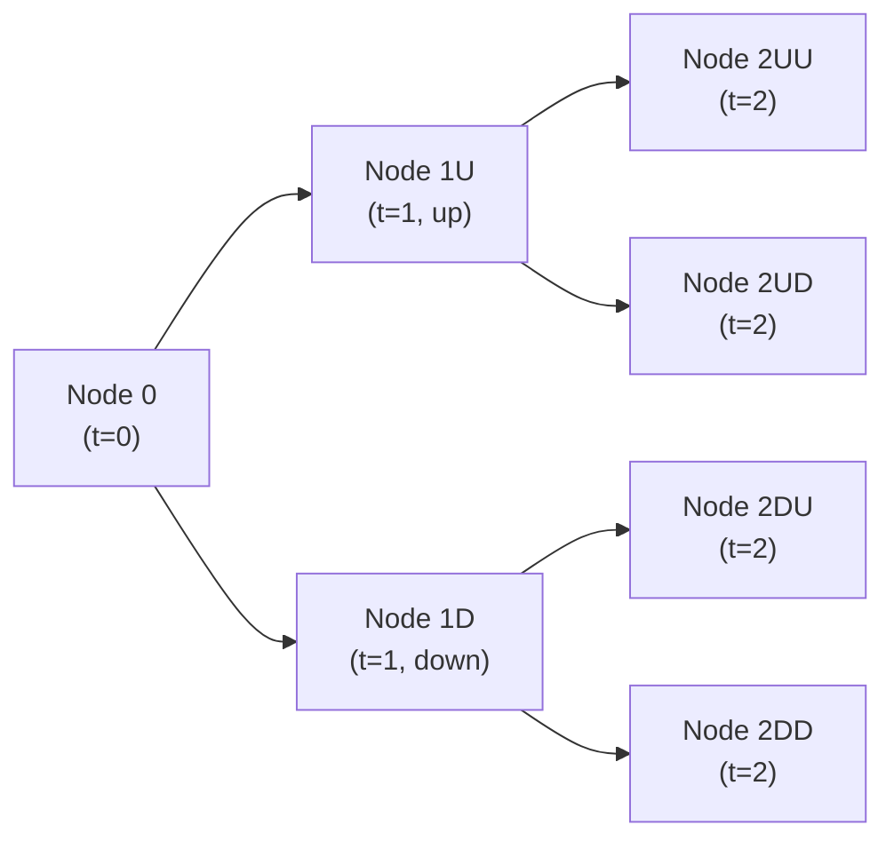

## Introduction
So, here we are—the final stretch. This is the moment you’ve spent months preparing for, diving deep into bond valuation, interest rate risk, credit spread analysis, and everything else from the earlier chapters. I clearly remember the first time I tried to link the concept of option-adjusted spreads (OAS) with structural credit models. My notes ended up looking like a crazy spiderweb of formulas and references. But after a few messy attempts, it finally clicked. And I promise, if you stick with it, it will click for you, too—probably sooner rather than later.

These comprehensive mixed-topic exercises are your chance to test how all the puzzle pieces fit together—one big final practice run before heading into the real exam scenario. The exercises here challenge you to integrate multiple elements: from plain old yield curve analysis to advanced embedded option pricing, from day count conventions to complex scenario analysis. The idea is that you’ll see how various topics you’ve studied, from Chapters 1 through 31, come together in big, integrated problem sets—exactly like the real CFA® Level II exam.

## Pulling It All Together
Throughout the previous chapters, you’ve built your expertise on:

• Bond Types and Features (Chapters 2, 10, 12)  
• Yield Measures and Bond Math (Chapters 3, 25)  
• Shape and Dynamics of the Yield Curve (Chapters 4, 5)  
• Portfolio Management Strategies (Chapters 6, 26, 27)  
• Embedded Options and Option-Adjusted Spread (Chapters 10, 11)  
• MBS, CMOs, ABS, and Other Structured Products (Chapters 13–17)  
• Credit Risk Modeling (Chapters 18–22)  
• Derivatives and Risk Management Tools (Chapters 23–24)  
• ESG and Global Investments (Chapters 29, 31)  

In these final exercises, we’ll expect you to do, well, pretty much everything. For instance, you might be asked to value a callable bond using a binomial interest rate tree, then run scenario analyses under different forward rate assumptions. Or you might need to interpret changes in credit spreads and simultaneously discuss how an OAS shifts if volatility changes. The best part: you’ll practice “sanity checks” to ensure your final answers make sense—as in, if your model spits out a negative yield, you probably want to reevaluate your steps before finalizing the response.

## Practical Approach to Vignette-Style Problems
When you see a scenario-based vignette, think in layers. Read carefully and figure out what’s being asked—even highlight or note the “question triggers.” If the item set discusses, say, the shape of the yield curve, a newly introduced credit event, and a bond’s optionality, you can expect that your final answer might require:

• Calculating the bond’s value from spot rates or forward rates.  
• Incorporating the probability of early redemption (if it’s callable).  
• Adjusting the spread for changes in credit risk or other fundamental news.  
• Potentially performing a ratio analysis to gauge relative value.  

This means scouring each detail in the vignette, verifying you know the correct inputs (coupon rates, maturities, notional amounts, day count conventions, volatility assumptions, etc.) and double-checking if you should use Monte Carlo simulations (because the bond might have path-dependent features) or a simpler approach like backward induction in a binomial tree.

Here’s a quick note: I used to forget about day count conventions all the time—like Actual/360 vs. 30/360—and that heads-up probably cost me a few points in practice exams. Don’t let that happen to you. Keep your “day count cheat sheet” close by, especially if the vignette includes instructions about accrued interest or specialized settlement.  

## Key Concepts in Mixed-Topic Exercises

### Yield Measures and Forward Rates
You’ll likely need to toggle between yield to maturity (YTM), forward yields, par yields, and even yield spreads. One tricky aspect is distinguishing what to do when a question asks for an OAS vs. a nominal spread vs. a zero-volatility spread (Z-spread). Remember:

• Nominal Spread: Spread over a benchmark yield curve for a bond’s entire maturity.  
• Z-Spread (Zero-Volatility Spread): Spread added to each spot rate on the Treasury curve to discount each cash flow to reach the market price.  
• OAS (Option-Adjusted Spread): Reflects the spread after removing the cost of embedded options (e.g., call or put provisions).

You might see vignettes that ask you to build a mini-forward curve via bootstrapping. Be prepared:


\text{Forward Rate}_{(1,1)} = \left(\frac{(1 + \text{Spot Rate}_{2})^2}{(1 + \text{Spot Rate}_{1})^1}\right)^{\frac{1}{1}} - 1


And so on. Then you could use that forward rate in your pricing or scenario analysis.

### Embedded Options and Binomial Tree Valuation
Callable bonds, putable bonds, and convertible bonds can throw a wrench into your calculations (in a good way!). Suppose you’re given up and down interest rate moves. You build a short-rate binomial tree:

Once you have the rates at each node, you use backward induction:

1. Compute the bond’s value at each final node, factoring in coupon payments and possible call (or put) decisions if the option is in the money.  
2. Discount backward to the previous node at the appropriate risk-neutral probabilities.  
3. Keep adjusting for embedded options at each step.  

If it’s a callable bond, you must compare the value if the bond is held vs. the call price if the issuer calls it at that node. The bond’s actual value at that node is the lesser of the “hold” value and the call price. Make sure you also keep an eye on how volatility assumptions can shift the node interest rates.  

### Credit Risk Integration (Structural and Reduced-Form Models)
You may get integrated questions that toss in credit risk changes. “Hmm, the yield curve is expected to flatten, but the credit rating is threatened due to earnings news.” Next, you might be asked to incorporate a structural model approach—where the issuer’s equity can be seen as a call option on the firm’s assets (the Merton model)—or a reduced-form approach that uses hazard rates or default intensities.

• Structural Model: Usually applied to estimates of default based on a firm’s asset value relative to its debt. If the assets drop below the liability threshold, default looms.  
• Reduced-Form Model: Goes more directly for the intensity approach, focusing on observed default probabilities in the market, plus recovery rates.

### Monte Carlo Simulation for Path-Dependent Products
If the problem mentions mortgage-backed securities (MBS) with tricky prepayment behaviors—like a principal curtailment at some random point because of changing interest rates—your best friend might be a Monte Carlo simulation. You’d project out hundreds or thousands of possible interest rate paths, estimate monthly or quarterly prepayment rates for each path, discount them, and then average the result.

Yes, it’s computationally heavy. But for MBS or certain structured products (CMOs with PAC or support tranches), it may be the only way to capture the path-dependent nature of prepayments or extension risk. For instance, you might see something like “In scenario #24, interest rates plummet, so prepayments surge, so the shorter tranche gets paid off early.” That’s a classic scenario to incorporate into simulated runs.

## Detailed Example: Combining Embedded Options and Yield Curve Shifts
Imagine a vignette that describes:

• A callable corporate bond, 15 years to maturity, 5% coupon, calls can occur annually starting after year 5 at par plus a small call premium.  
• The issuer is in the midst of a big strategic shift, leading to a possible rating downgrade.  
• The yield curve is flattening, and implied volatility is creeping up.  

Your tasks might include:

• Calculating the bond price using a binomial tree or Monte Carlo approach.  
• Estimating the OAS, factoring in the newly increased volatility assumption.  
• Evaluating how a ratings downgrade would affect the spread demanded by the market.  

Work in steps:

1. Build your initial no-call, risk-free tree (i.e., a treasury-based or swap-based short rate tree).  
2. Add the corporate spread to each node to reflect default risk.  
3. Adjust the rates at each node by the changing implied volatility if the problem requires it.  
4. Factor in the call decision at each call date on backward induction.  
5. Arrive at your “fair value” for the bond.  
6. Compare that fair value to the market price in the vignette—maybe you discover it’s fairly priced or detect mispricing.  
7. Then comment on how that mispricing might close if rating agencies finalize the downgrade next quarter.

## Common Pitfalls
• Mixing up day count conventions, especially for accrued interest.  
• Failing to reflect the vector of changing discount rates at each time step—particularly if spot/forward rates are given but you discount at a single YTM.  
• Not adjusting for the embedded option at each relevant time step in the tree, or ignoring the path-dependency in MBS.  
• Accidentally double-counting the cost of the option when computing OAS.  
• Dropping in the wrong default probability or the wrong discount margin for credit risk.  
• Overlooking a quick sanity check on your final yield results. If you compute a bond’s price well above par in a high-rate environment, it’s time to re-check your math.  

## Sanity Checks
When you’ve done a complex problem, step back and ask yourself:

• Is the final bond price consistent with the direction of interest rates?  
• Is the yield spread consistent with the issuer’s credit rating or framework?  
• Are negative or zero yields creeping into your solution inadvertently?  
• Did you incorporate all coupons or partial periods correctly?  

Trust me, investing five seconds in these checks can save you from dropping easy points.  

## Mock Vignette: Putting It All Together
Below is a quick mock scenario for practice. This is something you might see in an item set:

---
• Caspian Industries, rated BBB, issues a 10-year bond with a 4.5% annual coupon.  
• The bond is callable at par starting in year 5, with a 1.00% call premium.  
• The spot rate curve indicates yields of 3.0% for one year, 3.5% for two years, 3.7% for three years, 4.0% for four years, and 4.2% for five years. Forward rates beyond five years rise to 5.0% by year 10.  
• An equity analyst warns that Caspian may face a mild downgrade if next quarter’s earnings miss targets.  
• A new environment of rising volatility is forecast, potentially pushing up OAS on callable debts by 20 basis points.  

Questions might follow along these lines:

1. Calculate the bond’s fair value using a binomial interest rate model for the next 5 years (when the call first becomes active).  
2. Identify how the OAS might change if volatility rises, and interpret the effect on the bond’s price.  
3. Evaluate the expected credit spread change from BBB to BBB– or BB+ and how that might shift the bond’s overall yield.  
4. Decide whether an investor should hold or sell if they anticipate the downgrade, providing a brief rationale incorporating yield curve shifts.

Answer these step by step, always making sure to reflect the embedded call cost. If you’re short on time, you might use a simpler approach (like an approximate spread approach or a quick theoretical analysis). But the official exam answers usually want some demonstration of actual calculations.  

## Quick KaTeX Review: Bond Pricing
Remember the general bond pricing formula (without embedded options) is:

$$
P = \sum_{t=1}^{T} \frac{C_t}{(1 + r_t)^t} + \frac{M}{(1 + r_T)^T},
$$

where \\( C_t \\) is the coupon payment in period \\( t \\), \\( M \\) is the principal at maturity, and \\( r_t \\) is the appropriate discount rate for that period. With embedded options, you basically repeat this logic at each node, adjusting for calls/puts as needed.

## Wrapping Up
These mixed-topic exercises might feel a bit like climbing a mountain, but you’ve got the gear and the training now. Don’t forget—practice under timed conditions, carefully read vignettes, and methodically break down each question. After each problem set, do that reflection:

• What did I do right?  
• What was clunky?  
• Did I skip any detail?  

If you keep refining your technique, your ability to see the big picture will keep growing. Good luck with the integrated challenges, and I hope they help you walk confidently into the exam room.

## References and Further Reading
• CFA Institute Official Curriculum, Level II, Fixed Income—particularly the end-of-chapter and online practice questions.  
• Fabozzi, F. “Bond Markets, Analysis, and Strategies.”  
• Hull, J. “Options, Futures, and Other Derivatives.”  

Use these references if you want to dig deeper into any corner of the fixed income world.

---

## Test Your Mastery: Mixed-Topic Fixed Income Quiz



### Which approach is most appropriate when dealing with path-dependent assets such as mortgage-backed securities?  
- [ ] Backward induction in a binomial tree without modification  
- [x] Monte Carlo simulation  
- [ ] Single-factor duration modeling  
- [ ] A static replication portfolio  

> **Explanation:** Mortgage-backed securities often have path-dependent prepayments, making Monte Carlo simulation well-suited for capturing varying interest rate paths and prepayment behavior.

### If a callable bond’s implied volatility increases, how does that typically affect the bond’s OAS?  
- [ ] OAS decreases  
- [x] OAS increases  
- [ ] OAS remains the same  
- [ ] OAS becomes zero  

> **Explanation:** Higher implied volatility increases the value of the issuer’s call option, which leads to a higher spread to compensate the investor, thereby raising the OAS.

### In a structural credit risk model (like Merton’s), a firm’s equity can be viewed as what type of option on the firm’s assets?  
- [ ] A put option  
- [x] A call option  
- [ ] A digital option  
- [ ] A swaption  

> **Explanation:** In a Merton-style model, equity is treated as a call option on the firm’s assets, with the strike price being the face value of the debt.

### When performing a sanity check on discounted cash flow bond valuation, which of the following indicates a possible error in your calculations?  
- [ ] A yield that is lower than current market yields for similarly rated bonds.  
- [ ] A bond price that is slightly below par in a rising rate environment.  
- [x] A bond price turning negative as a result of discounting.  
- [ ] A final redemption amount that exceeds the notional.  

> **Explanation:** A negative bond price generally indicates a major calculation error. Yields and prices might differ for many reasons, but negative price clearly violates financial logic.

### Which spread measure accounts for the bond’s embedded call (or put) option?  
- [x] Option-Adjusted Spread (OAS)  
- [ ] Nominal Spread  
- [x] Zero-Volatility Spread (Z-spread)  
- [ ] G-Spread  

> **Explanation:** OAS is specifically designed to remove the cost of any embedded option from the spread, while the Z-spread and nominal spread do not inherently remove the option effect. (Note: Z-spread is sometimes used to measure polynomials of discounting but is not necessarily adjusted for the option. OAS is the correct measure for embedded option adjustments.)

### If a AAA-rated bond has a yield noticeably higher than other AAA-rated bonds, which is a plausible explanation?  
- [x] The presence of an embedded call feature driving yield higher  
- [ ] It’s an extremely rare bond with high demand  
- [ ] There might be a math error in yield calculations across the market  
- [ ] The bond must be “junk” in disguise  

> **Explanation:** A callable bond might offer a higher yield to compensate for the issuer’s right to call the bond. High demand typically drives yields down, not up, and it’s unlikely the entire market is systematically miscomputing yields.

### Consider a bond with 10 years to maturity, a 5% annual coupon, and quarterly coupon payments. Which day count convention could lead to a slight overestimation of accrued interest compared to Actual/365?  
- [x] 30/360  
- [ ] Actual/Actual  
- [x] Actual/360  
- [ ] EOM convention  

> **Explanation:** 30/360 and Actual/360 can overstate accrued interest relative to Actual/365 in some scenarios, especially if the actual number of days in the period is less than 360 or 365.

### In a binomial interest rate tree for a callable bond, the bond’s value at any node is calculated as the:  
- [ ] Maximum of call price and discounted expected value of future cash flows  
- [x] Minimum of call price and discounted expected value of future cash flows  
- [ ] Weighted average of call price and put price  
- [ ] Present value of coupon feed plus the call premium  

> **Explanation:** Because the issuer can exercise the call when it’s advantageous to do so, the node value is the minimum of the hold value and the call (redemption) price.

### A flattening yield curve in a scenario analysis might imply:  
- [x] Long-term rates decline relative to short-term rates  
- [ ] Short-term rates decline while long-term rates rise  
- [ ] A parallel shift upward of the entire yield curve  
- [ ] Bond prices must fall across all maturities  

> **Explanation:** A flattening curve describes the convergence of short and long ends, typically meaning long rates decrease more than short rates (or short rates rise more relative to the long end).

### True or False: An increase in the hazard rate in a reduced-form credit risk model directly implies a lower probability of default.  
- [ ] True  
- [x] False  

> **Explanation:** The hazard rate represents the instantaneous rate of default; an increase in the hazard rate signals an increased probability of default over time, not a decrease.


