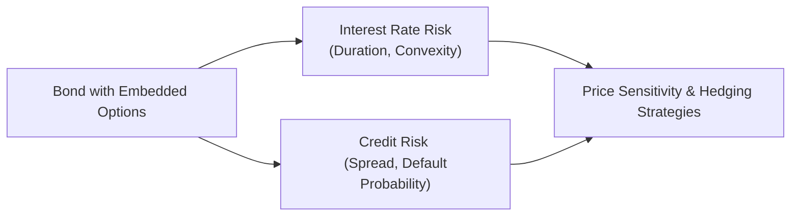

## Overview

Imagine you’ve spent weeks studying interest rate risk metrics like duration and convexity, digging into credit risk factors like spreads and default probabilities, and working through the valuation of callable and putable bonds. Then, wham! You open a Level II exam vignette, and all three of these concepts appear together, weaving themselves into a single questionset that might look a little overwhelming at first glance. That’s the scenario we’re aiming to address here. The exam loves to combine these dimensions, so let’s talk about how to keep your cool, systematically approach these integrated topics, and harness some practical strategies.

In this section, we’ll explore how duration, credit, and embedded optionality can be cross-referenced in a single item set, why that matters for real-world bond portfolio management, and how to keep track of changes in each component without losing track of the bigger picture (yes, it can be a bit tricky). We’ll also see how derivatives—interest rate swaps, futures, and options—can hedge or magnify both interest rate risk and credit exposures. Let’s jump in.

## Linking Duration, Credit, and Optionality

One moment, you might find yourself calculating the effective duration of a callable bond (which shrinks as yields go lower and the call option kicks in), and the next, you may be factoring in how that bond’s credit spread is widening due to a market shock—maybe the issuer’s rating got cut. Layer in the possibility of a flight-to-quality environment that sends benchmark Treasury rates down, and you’re in a swirl of offsetting or compounding price effects. 

It helps to start with a visual map of how these risk factors connect:



From the diagram above, you can see that a bond with embedded options triggers special considerations for both interest rate risk (changes in yield) and credit risk (which drives the spread). The net price impact is often the result of complex interactions among these factors, particularly when interest rates or credit conditions move in unexpected ways.

### Interest Rate Risk and Effective Duration

You all probably remember that duration is a measure of a bond’s price sensitivity to interest rate changes. If you prefer math:

$$
\text{Effective Duration} = \frac{P_{-} - P_{+}}{2 \times P_0 \times \Delta y}
$$

• \\( P_{-} \\) is the bond price if yields fall by \\( \Delta y \\).  
• \\( P_{+} \\) is the bond price if yields rise by \\( \Delta y \\).  
• \\( P_0 \\) is the current (or base) bond price.  
• \\( \Delta y \\) is the size of the parallel yield curve shift in decimal form.

But once you introduce an embedded call or put option, the relationship between price and yield is no longer simply convex. A callable bond exhibits negative convexity in certain yield ranges; in simple terms, its price won’t increase as much when rates fall, because the call option becomes more valuable to the issuer. So effectively, your “bang for the buck” in terms of price appreciation is dampened by the embedded option. 

### The Role of Credit Spreads

Now, let’s bring in credit spreads. A bond’s yield is the sum of a risk-free base rate (often proxied by government bond yields or a swap rate) plus any credit spread required to compensate for default risk, liquidity risk, event risk—you name it. Suppose credit spreads widen because the issuer’s rating is downgraded. Even if the benchmark yield is dropping, the net yield might remain stable—or even rise—because of the new, larger credit premium. That means the bond’s price could stay stagnant or even fall, despite the drop in the underlying Treasury rate.

The synergy gets more interesting if you’re analyzing a callable bond. If rates fall while spreads simultaneously widen, it’s possible the call option still isn’t very valuable (because the issuer’s credit is weaker, so the issuer might not be able to refinance cheaply). This interplay can significantly change the effective duration. 

### Embedded Optionality and One-Sided Duration

One-sided durations refer to separate measures of price sensitivity when rates rise versus when they fall. For callable bonds, the downward duration (i.e., what happens if rates decrease) is often smaller than the upward duration. Why? Because if yields drop, the call option is more likely to be exercised, and your bond’s price has an upper limit near the call price (negative convexity in action). On the flip side, if yields rise, the call option is worthless (or out of the money), so the bond starts acting more like a plain-vanilla bond again, with a higher “upward” duration.

Let’s do a quick numeric snippet. Suppose you have a callable bond priced at \\( \$98 \\). You do a small yield shift test:

• If yields drop by 25 bps, the price goes to \\( \$99.25 \\).  
• If yields increase by 25 bps, the price goes to \\( \$96.70 \\).  

Comparing the two moves, the bond’s price gained \\( \$1.25 \\) when yields fell but lost \\( \$1.30 \\) when yields rose. The downward price movement is (somewhat) symmetrical in this example, but you can imagine a scenario where the price might only rise by \\( \$0.70 \\) because the bond is near or at its call price ceiling. That asymmetry is what you capture with one-sided duration calculations.

## How Credit and Rates Interact

It’s one thing to say the yield is a combination of the risk-free rate and the spread. But in practice, these factors can move in opposite directions or the same direction, sometimes at different magnitudes. Let’s talk about a few “common sense” combos:

• Rates Falling, Credit Spreads Stable  
  – Bond price rally due to lower rates, but watch out for call option triggers.  

• Rates Falling, Credit Spreads Widening  
  – Offsetting effects. The net bond price movement depends on which effect dominates.  

• Rates Rising, Credit Spreads Narrowing  
  – Another offset scenario. If the improvement in credit quality is large enough, the bond price might even go up despite higher rates.  

• Rates Rising, Credit Spreads Widening  
  – Worst-case double hit: yields are up, and the bond is seen as riskier.  

These combos aren’t exhaustive, but they illustrate how credit changes can reinforce or counterbalance interest rate trends.

## Negative Convexity and Flight-to-Quality

Callable bonds typically exhibit negative convexity as yields go down. Investors want capital gains in a flight-to-quality scenario, but guess what? If your bond is callable and the issuer can refinance at a lower rate, your upside is clipped. You know that frustration: you’re thinking, “Everything else is rallying 15% in price, but my callable bond only rallies 8%.” That’s the hallmark of negative convexity. The opposite, interestingly, is positive convexity—typical of putable bonds or standard options-free bonds. 

In a flight-to-quality scenario (say, a big recession fear spooks the market and Treasuries rally), your high-grade Treasury position might surge in price, but your corporate callable bond might not enjoy the same upside. This is especially true if the bond’s call feature is near the money.

## Using Derivatives to Manage Combined Risks

Derivatives like interest rate swaps, futures, and options can hedge or enhance exposures:

1. Interest Rate Swaps:  
   – If you hold a long bond position with high duration, you can pay fixed in a swap to reduce your interest rate exposure. Meanwhile, if you’re bullish on rates and want even more duration, you could receive fixed. But be cautious: swaps won’t directly offset your credit risk unless you simultaneously manage that spread exposure somehow.

2. Bond Futures:  
   – A quick way to adjust your aggregate interest rate exposure. If you have a broad corporate bond portfolio and you think rates might rise, you can short Treasury bond futures to neutralize some (but not all, because credit spread remains) risk.

3. Options on Interest Rate Futures:  
   – Sometimes you just want optionality. Buying a put option on bond futures is akin to insuring against rising rates. Or if you think rates could plunge, a call on bond futures might deliver you leveraged upside. However, these options mostly target interest rate directional moves rather than credit spread changes.

4. Credit Default Swaps (CDS):  
   – If you want to hedge credit risk specifically, you can buy protection on the issuer. That lowers your default risk but keeps your interest rate exposure intact. Alternatively, you can sell protection if you want to take on more credit risk.

In reality, many sophisticated portfolio managers use a combination of these techniques. For instance, they might use an interest rate swap to neutralize the directional exposure of a callable bond and then buy a CDS to manage the credit risk separately. That way, they can fine-tune the net position to their market outlook.

## Practical Example: Piecing It All Together

Let’s walk through a (somewhat) simplified example, just to illustrate. Suppose a portfolio manager holds a \$10 million position in a 10-year callable corporate bond with a 5% coupon, and the bond is trading at \$102 (above par due to earlier yield drops). The option is at-the-money, meaning the issuer can call the bond at \$100, so the bond’s potential price upside is capped at around \$100 to \$105, depending on call rules.

Next scenario: The market environment changes as follows:

• The Fed signals it might cut interest rates by 50 bps.  
• The issuer’s credit rating outlook is downgraded from “stable” to “negative,” raising the possibility of a rating downgrade.  

What might happen next?

• Risk-Free Yield: Suppose the 10-year Treasury yield goes down 50 bps, which would normally push up the bond’s price.  
• Credit Spread: The bond’s credit spread might widen by 40 bps if investors fear a rating downgrade.  

Net effect:  
1. The bond’s yield might remain close to what it was, because the decline in the risk-free rate is partially offset by the higher spread.  
2. The embedded call might be less of a concern if the issuer’s credit is impaired (they might not be able to refinance cheaply, or they might not want to). So, ironically, the negative convexity effect might be reduced, effectively making the bond’s duration behave more like a plain-vanilla bond in the short run.

In practice, an exam vignette would hand you a data table: current bond price, implied volatility, a range of yields, spread changes, and maybe the manager’s derivative positions. You’d be asked to compute the bond’s new effective duration or to interpret how the bond’s price would respond to concurrent changes in both yield and credit spread. 

## Quick Python Example for Sensitivity Analysis

You might, for instance, run a small simulation script to see how your bond position changes if the yield curve shifts by ±10, ±20, ±50 bps, and the spread changes ±10 bps. Check out this pseudo-code:

```python
import numpy as np

def bond_price(yield_to_maturity, spread):
    base_price = 100 / (1 + yield_to_maturity + spread)
    return base_price

yields = [0.01, 0.012, 0.015, 0.02]
spreads = [0.002, 0.004, 0.006, 0.008]

for y in yields:
    for s in spreads:
        price = bond_price(y, s)
        print(f"Yield: {y*100:.2f}%, Spread: {s*100:.2f}%, Price: {price:.2f}")
```

Of course, real pricing is more complicated—especially for callable bonds. Yet, having a mental framework for how these sensitivities shift can really help you handle exam item sets more confidently.

## Exam Tips for Cross-Referencing These Concepts

• Read the Vignette Carefully: Highlight references to coupon reset features, call or put schedules, and changes in credit ratings or outlook.  
• Separate the Risks: Identify how the interest rate move is impacting the bond versus how credit spread changes might amplify or offset that move.  
• Use One-Sided Durations: If the bond is callable, pay attention to different durations for up and down rate moves. The exam might expect you to compute or interpret these differences.  
• Look for Hedges: Spot if the manager in the vignette is using swaps or futures. Identify exactly what risk they’re hedging (interest rate risk, credit risk, or both).  
• Calculate Net Effect: The question might ask for “which factor dominates the price movement?” or “what is the net effect on yield?” Summarize the combined influences.  
• Remember Negative Convexity: Callable bonds limit upside in a dropping rate scenario. That’s a frequent test area.  
• Keep an Eye on Options: If implied volatility changes, it affects the option’s value—meaning call or put features suddenly matter more or less.  

## Conclusion

Cross-referencing duration, credit, and optionality can feel like juggling three apples at once. But the more you practice, the more intuitive it becomes. Bonds with embedded options demand that you consider effective duration, negative convexity, one-sided durations, and how changes in credit spreads might offset or amplify the effect of interest rate moves. Toss in derivatives, and you can transform or hedge these exposures in myriad ways. 

On exam day, you’ll often see item sets that hand you a swirl of data: partial bond prices under different yield levels, credit rating changes, potential calls, or put schedules. It’s your job to parse the scenario, combine the factors carefully, and perform the relevant calculations. As you practice and take mock exams, you’ll notice the pattern: read carefully, pick out the key data, and keep track of which factor is driving the bond’s final yield or price.

Happy studying—and remember, as always, never underestimate the power of consistent practice with integrated big-picture questions.

## References

• Tuckman, B., and Serrat, A. “Fixed Income Securities: Tools for Today’s Markets.”  
• CFA Institute Research Foundation Studies on the interplay of credit risk and interest rate risk in bond portfolios.  

## Test Your Knowledge: Cross-Referencing Duration, Credit, and Optionality



### A portfolio manager is analyzing a callable corporate bond with a price of $100. Based on a rates-down scenario, the price might rise to $102, while in a rates-up scenario, the price might fall to $97. Which phenomenon she should be most concerned about?

- [ ] Positive convexity
- [ ] Extension risk
- [x] Negative convexity
- [ ] Time decay

> **Explanation:** Callable bonds often exhibit negative convexity because their price appreciation is capped when rates decline. The call option can limit the bond’s upside potential.


### In a scenario where the underlying Treasury yield decreases by 30 bps and a corporate issuer’s credit spread widens by 30 bps, what is the most likely net effect on the bond’s yield?

- [ ] The yield will drop significantly
- [x] The yield may remain roughly unchanged
- [ ] The yield will widen significantly
- [ ] The yield will approach zero

> **Explanation:** A 30 bp drop in risk-free yield and a 30 bp rise in credit spread largely offset each other, keeping the overall yield stable.


### One-sided duration for a callable bond describes:

- [x] Different price sensitivity for upward vs. downward interest rate moves
- [ ] The bond’s sensitivity to credit events only
- [ ] The difference between modified and effective duration
- [ ] How short-term rates affect a bond with a put option

> **Explanation:** One-sided (or key rate) durations measure separate sensitivities to upward versus downward shifts. This is crucial for callable bonds, which behave asymmetrically.


### Which of the following best explains why a callable bond exhibits negative convexity when interest rates fall?

- [ ] The issuer cannot improve financing terms if rates fall
- [x] The bond’s price appreciation is capped due to potential call exercise
- [ ] The put feature becomes valuable
- [ ] The bond’s coupon automatically increases in value

> **Explanation:** When rates fall, the likelihood of early redemption increases, limiting price appreciation and creating negative convexity.


### If an investor wants to keep interest rate risk but reduce credit risk for a specific corporate bond holding, which derivative strategy is typically most direct?

- [ ] Entering an interest rate swap to pay fixed
- [ ] Buying a put on Treasury bond futures
- [x] Buying credit default swap protection on the issuer
- [ ] Shorting Treasury bond futures

> **Explanation:** A CDS directly hedges credit risk. The other strategies primarily address interest rate exposures rather than credit spreads or default risk.


### A manager notices her callable bond has an effective duration of 4.2 when yields rise but only 2.5 when yields fall. Which concept is most directly illustrated?

- [ ] Positive convexity around par
- [ ] Flattening yield curve
- [x] Asymmetric interest rate sensitivity from embedded options
- [ ] Volatility skew in options markets

> **Explanation:** The bond’s duration is different for upward vs. downward yield shifts, reflecting the callable bond’s embedded option behavior.


### Which of the following best explains an environment in which both Treasury rates and credit spreads increase simultaneously?

- [x] Investors demand higher risk premiums due to market uncertainty
- [ ] The issuer’s credit profile is improving
- [ ] Negative convexity is no longer relevant
- [ ] The bond’s call option is automatically exercised

> **Explanation:** When uncertainty is high, investors may bid up safe-haven rates (leading to higher government yields if inflation or supply concerns also exist) while also demanding higher spreads for riskier credits. It’s not necessarily contradictory.


### If you expect that a company’s credit spread will tighten over the next year, which of the following combined position might you consider?

- [ ] Long put on bond futures, short CDS
- [x] Long corporate bond, short CDS protection
- [ ] Pay fixed on an interest rate swap, buy a bond put
- [ ] Sell corporate bonds, buy Treasuries

> **Explanation:** Going long the company’s corporate bond benefits from spread tightening; going short CDS protection is effectively the same stance, as you collect premium if the issuer does not default and spreads improve.


### In an item set describing a portfolio that is short bond futures but holds a long position in corporate bonds, which risk exposure is likely most reduced?

- [ ] The portfolio’s credit spread risk
- [x] The portfolio’s interest rate risk
- [ ] The portfolio’s foreign exchange risk
- [ ] The bond’s call risk

> **Explanation:** Short bond futures reduces interest rate sensitivity. It does not hedge credit risk (still exposed to credit spreads on the corporates).


### A callable bond's maximum price, assuming the call is near the money, is most likely:

- [x] Capped near its call price
- [ ] Endless in its upside potential
- [ ] Dependent only on the issuer’s credit rating
- [ ] Floating with market interest rates

> **Explanation:** Once a bond is at or near the call strike, upside price potential becomes limited because the issuer can call the bond.  




