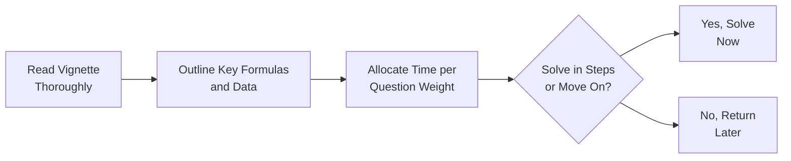

## Overview and Approach

Time management can make or break your success on the CFA® Level II Fixed Income exam. So, let’s take a deep breath and walk through some proven strategies. From personal experience (and a bit of trial and error!), I can assure you that having a structured plan for reading vignettes, organizing data, double-checking tricky math, and preserving enough time to revisit uncertain responses will go a long way toward boosting your performance—and your confidence.

Below, we’ll explore some core tactics for approaching item sets efficiently, allocating brainpower proportionate to question weight, employing quick math checks, and leveraging reverse-engineering if you’re stuck. These tips apply across the entire Level II curriculum, but we’ll also sneak in references to fixed income concepts found in other chapters (like duration in Chapter 25) to show how it all ties together when you’re under pressure.

## Reading Vignettes Thoroughly

One of the biggest timesavers—believe it or not—is to actually read the vignette carefully. It’s tempting to skim for the numbers, but that can lead to those dreaded “Oops!” moments when you realize halfway through that you missed something crucial. 

• Identify key bond or portfolio features: Check if the vignette addresses government bonds, corporate bonds, or something more complex, like mortgage-backed securities (Chapters 13–16).  
• Outline pivotal formulas: For yield calculations (Chapter 3) or OAS computations (Chapter 11), note them down, so you don’t have to rummage through your memory.  
• Verify data consistency: If the vignette says the bond matures in 5 years, but the next paragraph suggests 7 years, there’s clearly a discrepancy—figure out which detail is correct (or note it as a potential trick).

After you’ve read and extracted the main points, you’ll feel more grounded. Then you’re in a good position to handle the questions systematically.

## Outlining Key Formulas and Data

Have a quick reference. You know how we sometimes scribble formulas first thing in the margin so we don’t forget them later in the exam? It can help, especially when you’re dealing with new or advanced yield curve strategies (Chapter 4 or 6) and embedded-option calculations (Chapter 10 or 11).

• Keep it concise: Jot down only the formulas you’re certain you’ll need—like bond price approximations (Price Change ≈ –Duration × ΔYield × Price) or forward rate calculations (Chapter 4).  
• Map out key variables: Identify reference yields, spreads, durations, or volatilities. You can often spot red-flag data (like an unusually high coupon) that might be relevant to a question twist.

## Allocating Time Based on Question Weight

You generally want to spend more time on item sets with greater complexity or more subquestions. But watch out for the trap of getting lost in the weeds.

• Scan the overall test: If an item set is heavily data-driven (e.g., a multi-part question referencing complex yield curve bootstrapping from Chapter 4), you might budget an extra minute or two per question.  
• Don’t sacrifice easier points: If there’s a quick question on day count conventions (Chapter 2) or a straightforward spot rate problem, lock that in. Easy points add up!  
• Prioritize strategic “low-hanging fruit”: Knock out questions you can handle quickly and accurately. You’ll build momentum (and confidence) for the trickier parts.

## Personal Checkpoint Strategy

It’s normal to get stuck. You might come across a question requiring multiple steps to find the answer (like deriving an option-adjusted spread, which can be quite involved). Here’s a checkpoint method I’ve seen work:

• Set a time limit per question: For example, about 90 seconds to 2 minutes per multiple-choice item. If you’re well-prepared, that’s typically enough to make a reasoned attempt.  
• Move on if you’re stuck: If you can’t see a path forward, mark the question and continue. No sense sinking a ton of time you’ll wish you had later.  
• Return using leftover time: Doing so helps you come back with a fresh perspective. Sometimes, leaving a question for five minutes can magically reveal a new insight.

## Quick Math Checks for Accuracy

Let’s say you’re computing a bond price, factoring in a small yield change. You can do a quick mental or scratch-paper check:

• Approximate durations or multiplies: If duration is 5 and the yield changes by 0.10%, the approximate price move is about 0.5% (i.e., 5 × 0.10%).  
• Compare the result to typical bond price behavior: If you see a giant 5% price change in response to a 0.10% yield move, that’s suspicious.  
• Confirm direction: If it’s a long position and rates go up, your bond price should go down (basic price-yield relationship from Chapter 3).

Such checks can prevent you from letting a small slip near the start of your calculation snowball into an incorrect final answer.

## Reverse-Engineering and Elimination

Exams often toss in “reverse-engineering” type questions. Maybe they’ll give you a set of possible yield measures and ask which is correct for a convertible bond (Chapter 12). One trick is to test each potential choice against the logic or numbers you already have.

• Evaluate each choice’s plausibility: If one option states an OAS of 300 bps for a bond that obviously trades at a near-zero spread, that’s suspicious.  
• Look for internal consistency: Are the reported durations or yields consistent with the bond’s coupon and maturity structure?  
• Common sense check: If you see a 20% yield on an investment-grade bond, you know it’s probably not correct (unless the scenario says the issuer is in distress).

## Partial-Credit Considerations

In Level II’s item set format, there’s generally no partial credit. Each question is worth a single set of points, correct or incorrect. But be mindful of:

• Multi-stage calculations: If you’re using your answer from Part A to solve Part B, a mistake in Part A can carry over. Double-check your first steps carefully.  
• Watch for traps: They might ask for “closest to” or “which of the following is least accurate.” Overlooking a small detail in the question can lose you the entire point.  
• Re-examine the final answer: Quick math checks can again help you ensure your result is not obviously off.

## Maintaining Calm and Confidence

It’s easy to second-guess, especially under time pressure. I’ve personally circled back too many times on earlier questions, only to discover I was initially right. If you’re well-prepared:

• Trust your instincts: If your calculations and reasoning are consistent with known bond pricing logic, go for it.  
• Practice a few timed mocks: This is the best way to build “exam endurance” and to refine your time management technique.  
• Take mini mental breaks: A simple deep breath or a quick sip of water between item sets can do wonders for clarity. Don’t let panic creep in—once hurried mistakes start, they can multiply.

## Practice and Mock Exams

Chapter 32 wraps up everything you’ve learned, and part of that final push is mocking real exam conditions. So do at least a couple of full-length simulations:

• Stick to the actual exam timing: Resist the urge to pause the clock. The best training is realistic training.  
• Immediately debrief afterward: Figure out how long you spent per item set, where you got stuck, and whether you left any questions blank because time ran out.  
• Adjust your strategy: If you realize you’re spending too long on a particular type of question (perhaps derivatives from Chapter 24), create a plan to tackle them more efficiently next time.

## Example Diagram: Step-by-Step Exam Flow

The flow above is a good visual reminder of how your process might look for each item set. It’s not rocket science, but it’s easy to overlook in the heat of the moment.

## Summary Tips

• Go for clarity first—details second.  
• Have a personal checkpoint system—prevents time sinkholes.  
• Use quick approximation checks—catches glaring calculation errors.  
• Practice calm—keeps you from second-guessing.  
• Shut down “panic mode” by taking a momentary pause.

## References and Further Reading

• CFA Institute Official Website: “Tips for Taking the Exam”  
• Kaplan Schweser Practice Exam Volumes: Great for time-based drills and post-exam analyses  
• Chapter 25 of this volume: “Measuring Interest Rate Risk” for quick reference on duration-based calculations  
• Chapter 3: “Yield Measures and Bond Pricing Basics” for formula refreshers  

--------------------------------------------------------------------------------

## Time Management and Test-Taking Strategies: Sample Questions



### Which of the following most accurately describes the importance of outlining key formulas before solving questions?

- [ ] It guarantees a 100% correct answer on every calculation question.
- [x] It saves you time when you need to revisit formulas, reducing repeated memorization.
- [ ] It helps you guess the final correct multiple-choice option even without doing calculations.
- [ ] It prevents confusion about exam instructions and eliminates the need to read carefully.

> **Explanation:** By writing down the key formulas you’ll need, you avoid the stress of rummaging through your memory during the exam. This step doesn’t guarantee correctness for every question, but it supports more efficient problem-solving under time constraints.

### When applying a checkpoint strategy in the CFA exam, a candidate should:

- [x] Move on to the next question if they cannot make progress after a set amount of time.  
- [ ] Penalize themselves by skipping an entire item set upon getting stuck once.  
- [ ] Spend as much time as needed on a single question to ensure it’s absolutely correct.  
- [ ] Avoid marking questions to return to later, as it wastes examination time.

> **Explanation:** A checkpoint strategy involves setting a certain time limit per question. If you cannot find a path forward in that timeframe, you should note the question and come back after addressing other item sets.

### What is a primary benefit of quick math checks in the exam?

- [ ] They replace the need for full calculations entirely.  
- [x] They help spot glaring errors in your approximations or directionality of results.  
- [ ] They guarantee partial credit for partially correct answers.  
- [ ] They reduce the need to verify the question’s data consistency.

> **Explanation:** Quick math checks can detect major inconsistencies or errors in your calculations (e.g., a bond price changing too drastically for a small yield shift). They don’t replace detailed calculations, but they serve as a sanity check.

### Reverse-engineering a question on OAS would typically involve:

- [ ] Calculating the Macaulay duration from scratch using the G-spread.  
- [x] Comparing each potential spread to see if it logically fits the bond’s market price.  
- [ ] Eliminating the need to read details of the embedded option.  
- [ ] Choosing the answer that matches a different but simpler yield curve measure.

> **Explanation:** Reverse-engineering means testing potential answers and seeing which is most consistent with the data provided. When dealing with OAS, you check if each spread option is plausible given the bond’s market price and volatility assumptions.

### Concerning partial credit in CFA Level II item sets:

- [x] Each question is graded on a right-or-wrong basis, so a multi-step question has no partial marks.  
- [ ] Partial credit can be awarded for solving only the first step of a multi-stage calculation.  
- [x] A calculation error in one question may affect subsequent answers if those answers use the same figure.  
- [ ] It’s impossible to mitigate the impact of an initial calculation error.

> **Explanation:** Item sets are typically entirely right-or-wrong. If you use an incorrect figure from a previous step, the error can cascade. However, you can reduce the risk by carefully rechecking your earlier steps before using them again.

### A recommended strategy when you cannot solve a question’s calculation immediately is to:

- [x] Mark the question and move on, returning later.  
- [ ] Double your effort on that one question immediately, ignoring the time constraint.  
- [ ] Eliminate all answer choices that look complicated.  
- [ ] Write random numbers down in hopes of partial credit.

> **Explanation:** If you’re stuck, it’s more efficient to move on to other questions you can solve. Return to the tough one afterward if time permits. There is no partial credit for random guesses in multiple-choice format.

### The best time allocation approach when faced with a large, data-intensive vignette is to:

- [x] Budget slightly more time per question than usual, but ensure you don’t neglect smaller or simpler item sets.  
- [ ] Spend all remaining time on that vignette.  
- [x] Check whether the complexity can be broken down into manageable parts.  
- [ ] Allocate an identical amount of time per question, regardless of data complexity.

> **Explanation:** If a vignette presents lots of data and intricate calculations, plan for some extra time. However, do not over-allocate time to a single item set at the expense of others.

### Which of the following helps maintain composure during the exam?

- [x] Taking brief moments to breathe and reset between item sets.  
- [ ] Trying to race through the entire exam in one continuous sprint.  
- [ ] Skipping your planned lunch and staying at your desk for maximum focus.  
- [ ] Using only your memory for all formulas, ignoring any reference or outline technique.

> **Explanation:** Small mental breaks—like breathing intervals—can settle nerves. Racing without rest or skipping breaks can lead to mental fatigue.

### During your final review after completing all item sets, you should:

- [x] Prioritize revisiting only the marked questions you were unsure about.  
- [ ] Change any answer that initially felt “too easy.”  
- [ ] Automatically assume your initial instincts were wrong.  
- [ ] Attempt to recalculate every question from scratch.

> **Explanation:** Focus on questions you flagged or where you felt uncertain. Recalculating every single question might not be feasible timewise, and overthinking can lead to incorrect changes.

### True or False: Practicing with full-length timed mock exams is the single best way to reinforce your time management strategy.

- [x] True  
- [ ] False  

> **Explanation:** Mock exams replicate real testing conditions, which is essential for refining your pacing, identifying weak spots, and reinforcing confidence under the clock.


