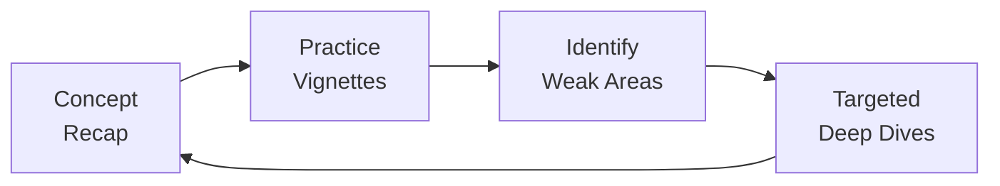

You’ve made it to the final stretch of CFA® 2025 Level II, Volume 6: Fixed Income. Feels pretty good, doesn’t it? I still remember that combo of relief and apprehension in my own final review phase—relief that I’d tackled mountains of content, and apprehension that there was still so much to keep in my head. This concluding section is designed to help you tie everything together, from the most basic coupon-versus-yield questions all the way to the complexities of arbitrage-free valuation, credit derivatives, and structured products. Let’s wrap it up neatly and get you ready to shine on exam day.

## A Quick Recap of the Journey

It’s helpful to zoom out and see how far you’ve come, especially considering how many topics you’ve covered in these 32 chapters:

• You started with the fundamentals in Chapters 1 through 3, refreshing key terms like yield to maturity (YTM), day count conventions, and the basic math behind bond pricing.  
• Term structure theories took center stage in Chapter 4, where you learned about forward rates, spot rates, and the good old bootstrapping technique.  
• You moved forward to examine interest rate benchmarks, especially the transition from LIBOR to SOFR in Chapter 5, and studied practical yield curve management strategies in Chapter 6.  
• The intricacies of bond valuation—both static and dynamic—were covered in Chapters 7 through 9, introducing pathwise valuation, binomial trees, and Monte Carlo simulation.  
• Embedded options like calls and puts in bonds (Chapters 10 and 11) reinforced how interest rate volatility affects these special features—especially negative convexity and option-adjusted spreads (OAS).  
• You explored convertible bonds and CoCos in Chapter 12, bridging the gap between equity and debt features.  
• Structured products dominated Chapters 13 through 17, covering everything from mortgage pass-throughs to collateralized mortgage obligations (CMOs), asset-backed securities (ABS), commercial mortgage-backed securities (CMBS), and different flavors of collateralized debt obligations (CDOs).  
• A deep dive into credit risk took place in Chapters 18 to 22, giving you the building blocks for analyzing default probabilities, losses given default, and how to interpret credit spreads.  
• You wrapped up with advanced derivative uses (like swaps, CDS, and bond futures) in Chapters 23 and 24, risk measurement (Chapters 25–26), portfolio construction and performance evaluation (Chapters 27–28), and specialized topics in global bonds, inflation-linked securities, and ESG (Chapters 29–31).

All in all, you have a 360-degree view of the fixed income universe. You know your yield curve strategies, your optionality complexities, your credit risk metrics, and you even have your eyes on global or specialized instruments. That’s no small accomplishment.

## Final Checklists: What to Confirm

As you stand on this last page before you head off to your final review routine, here are some checklists to keep you on track:

1. Formulas and Definitions  
   Make sure you’ve got the big formulas down cold—like the relationship between bond price and yield, the forward rate formula, OAS, effective duration, and the math behind structural and reduced-form models for credit risk. If you keep a formula sheet or something like flashcards, devote 10 to 15 minutes a day in your last two weeks to refreshing them.  

2. Key Concepts  
   • Bootstrapping a zero-coupon curve and understanding how spot rates are derived.  
   • The logic behind Merton’s model (structural credit risk) and intensity models (reduced-form).  
   • How to break down mortgage-backed and asset-backed security structures (including the role of support tranches and PAC tranches).  
   • Pitfalls of negative convexity and how one-sided durations matter for callable/putable bonds.  
   • Real-world applications of interest rate swaps, swap spreads, and the essence of hedging a fixed income portfolio.  
   • Why the LIBOR-to-SOFR transition matters for pricing and risk.  

3. Areas of Difficulty  
   Jot down any areas where you consistently make mistakes. Maybe it’s discounting cash flows in a binomial tree or properly applying effective duration formulas when there’s embedded optionality. Identify these pain points now, so you can methodically review them.

4. Practice Vignettes  
   The exam doesn’t present isolated multiple-choice questions but item sets that require you to read, interpret, calculate, and connect different concepts. Gather practice vignettes—especially those from your official CFA resources—and rehearse analyzing them thoroughly.  

## Integrated Revision Strategy

I always say: a structured review plan beats random cramming every time. Here’s a blueprint you can tweak:

• Daily “Light Reviews”: Set aside 20–30 minutes to do active recall on high-level concepts. This might mean reciting from memory the steps to building a binomial interest rate tree or quickly explaining to yourself why credit spread curves slope upward.  
• Weekly Deep Dives: Once or twice a week, dedicate a bulk session—maybe two hours—to dive into a tricky area or do a full-length practice item set.  
• Focus on Connections: The exam loves to test how well you integrate knowledge. For instance, you might see a question linking a shift in the yield curve (Chapter 4) to changes in OAS for a callable bond (Chapter 11). Strengthen those cross-chapter connections in your mind.  

### A Visual Cue

This simple feedback loop—Concept Recap → Practice → Identification of Weakness → Targeted Deep Dive—can help you systematically stay on top of your revision.

## Study Group Dynamics

Navigating this material can feel like climbing a massive mountain alone. If you can, consider joining or forming a small study group:

• Divide and Conquer: Maybe you’re great at structured products, while someone else is a whiz at interest rate models. Pool knowledge to tackle tricky spots.  
• Simplify Explanations: Teaching is often the best way to learn. If you can explain the difference between spot rates and forward rates to a peer, you’ve essentially proven your own mastery.  
• Accountability: It’s easy to lose momentum studying on your own after a long day. Scheduling group check-ins keeps everyone on track.  

## Mental Readiness and Positivity

I get it—study exhaustion is real, especially in the final weeks. Remember to maintain these key mental habits:

• Consistent Practice Over Marathon Cramming: Quality over quantity. A 20-minute targeted daily drill can sometimes be more valuable than a scattershot session of four hours.  
• Balance with Life: If you can manage it, do something non-exam-related daily. A short walk, a conversation with a friend, or even just listening to music to reset your brain can do wonders.  
• Sleep, Hydration, Movement: We all love coffee (or maybe tea) a bit too much, but genuinely, no hack can replace what solid sleep and a decent diet do for your cognitive function.  

## Recommended Final Week Plan

Often, the final week is a time of high adrenaline. Here’s a suggested daily breakdown:

• Short Mock Quizzes (15–20 minutes): Use these to keep your mind agile. Mix up question formats—understanding nuance is key at Level II.  
• Formula Flashcards (10 minutes): Quick scanning of yield formulas, OAS calculations, and credit metrics.  
• Reading Final Summaries (30–45 minutes): Go back to the chapter summaries. They’re designed to highlight the most testable points. Skim them daily.  
• Relaxation Techniques: Schedule real breaks. Even if it’s just a quiet 10 minutes listening to something calming. Overstimulation can hinder recall on exam day.

## Common Pitfalls and How to Survive Them

Do your best to avoid common exam-day errors:

• Overcomplicating a Problem: Sometimes the text of a vignette might look intimidating, but the question might just be about a straightforward yield calculation. Don’t talk yourself into hypothetical complexities that aren’t there.  
• Time Mismanagement: Read the entire vignette promptly, highlight key data, and tackle the easier sub-questions first to build momentum.  
• Misreading the Question: The exam might ask for a bond’s price, but you accidentally compute yield, or vice versa. Always re-check the question after your calculation.  

## Glossary

Make sure you can define these essential terms:

- **Zero-Coupon Bootstrapping**  
  Building the zero-coupon yield curve by solving iteratively for the yield of each successive maturity. This technique helps you derive spot rates from bond prices or par curves.  

- **Study Group Dynamics**  
  Collaborative learning via group sessions to review complex topics, clarify confusion through peer explanation, and maintain accountability.  

- **Structured Product**  
  A pre-packaged investment typically combining fixed income securities with derivatives to create specific risk-return objectives (e.g., principal protection or leveraged upside).  

## References and Further Reading

• CFA Institute Candidate Resources – Exam-day policy documents and official candidate checklists:  
  <https://www.cfainstitute.org/en/programs/cfa/candidate>  

• Allen, S. “Financial Risk Management: A Practitioner’s Guide to Managing Market and Credit Risk.”  
  This reference provides an excellent final consolidation for advanced topics.  

• CFA Institute’s “Claritas® Investment Certificate” – Though more foundational, it can be a gentle refresher for broader capital market context.  

• Major Industry Publications – Keep an eye on the Wall Street Journal and Financial Times for real-world examples of yield curve changes, credit spread movements, and structural product usage.  

## Pulling It All Together

You’ve walked through the entire fixed income spectrum—congratulations! The best advice I can give at this point is to stay calm, be consistent in your final review, and trust the knowledge you’ve painstakingly built. And hey, don’t forget to enjoy the journey just a bit—this exam process, while intense, truly shapes you into a more analytical, informed finance professional. That’s definitely worth a smile.

Remember: short sprints of focused, strategic study will likely outshine frantic, disorganized efforts. Look after your mind and body, review your notes, and do a final push with practice vignettes. When exam day arrives, you want to be the calm presence in the room, efficiently reading each scenario and setting yourself up for success.

So, here’s wishing you the best for your exam preparations and a rewarding career ahead. I have a feeling you’re going to do great. Good luck, and keep learning!

---

## Test Your Knowledge: Conclusion and Next Steps



### 1. Which approach helps you systematically identify and focus on your weak areas during final exam prep?

- [ ] Doing only extensive reading of every single chapter daily
- [ ] Focusing only on formulas without practicing test questions
- [x] Reviewing concepts briefly, then attempting practice vignettes to spot weaknesses
- [ ] Ignoring past mistakes and focusing on new areas

> **Explanation:** A targeted routine of quick concept recap plus practice questions allows you to pinpoint gaps and tailor your deep dives effectively.

### 2. What is a key advantage of forming a study group as part of your final preparation for the Fixed Income exam?

- [ ] It lets you skip your own personal study time altogether
- [x] It can help clarify complex topics through peer explanation
- [ ] It guarantees your group members will all score higher than others
- [ ] It eliminates the need for real practice exams

> **Explanation:** Teaching and discussing complex topics with peers often enhances understanding. Group study can’t replace individual practice but can complement it.

### 3. Which of the following best characterizes “Zero-Coupon Bootstrapping”?

- [ ] A method for measuring security durations under parallel yield-curve shifts
- [x] An iterative process to derive spot rates from bond prices
- [ ] A strategy to hedge currency risk for Global Bonds
- [ ] A technique to quantify recovery rates in credit risk

> **Explanation:** Zero-Coupon Bootstrapping is about deriving the yield (spot rate) for each maturity step by stripping coupons from existing bond prices, building the zero-coupon yield curve piece by piece.

### 4. Why might it be beneficial to do short mock quizzes daily in the final week before the exam?

- [x] They keep you mentally agile without overwhelming you
- [ ] They replace the need to review formulas every day
- [ ] They are less effective than a full-length exam each day
- [ ] They eliminate the need for rest or relaxation

> **Explanation:** Short quizzes deliver targeted practice, reinforcing active recall and building testing stamina while still leaving you time for rest.

### 5. Which of these is a recommended best practice during the week leading up to the exam?

- [x] Incorporating short daily formula reviews and a few full item sets
- [ ] Avoiding any further practice to “save mental energy”
- [ ] Pulling multiple all-nighters
- [ ] Only reading your old notes and never referencing mock exams again

> **Explanation:** The recommended approach is balanced—brief formula review, plus limited but intense practice, ensuring you stay sharp and rested.

### 6. In your final review, you notice you constantly struggle with negative convexity in callable bonds. What should you do?

- [ ] Skip the topic and hope it doesn’t appear on the exam
- [ ] Memorize the definition until you can recite it verbatim
- [x] Focus a deep dive on negative convexity, using example problems and peer discussions
- [ ] Only glance at practice questions and move on quickly

> **Explanation:** Identifying weak areas and then doing a targeted deep dive (including practice and discussion) is the most effective way to improve.

### 7. Which statement is true about mental readiness in the lead-up to exam day?

- [x] Adequate sleep and balanced breaks can greatly boost your performance
- [ ] Marathon study sessions of 12 hours are always most effective
- [x] Teaching peers or walking through complex scenarios can solidify your memory
- [ ] All caffeinated beverages should be replaced by energy drinks

> **Explanation:** Sleep, rest, balanced breaks, and teaching others are proven strategies to enhance recall and understanding; relentless cramming often diminishes returns.

### 8. When facing a seemingly complicated bond pricing vignette, what is a common pitfall exam candidates fall into?

- [x] Overthinking or adding imaginary complexity
- [ ] Double-checking the question’s requirement
- [ ] Simplifying data points in the vignette
- [ ] Skipping crucial but unclear data

> **Explanation:** Overthinking can lead to misdirected calculations. Always verify exactly what is asked, then tackle it methodically.

### 9. Which revision strategy typically yields better results for mastering advanced fixed income concepts?

- [ ] Ignoring interconnected topics and focusing on chapters in strict isolation
- [ ] Reviewing advanced topics without attempting calculations
- [x] Linking related concepts across chapters (e.g., from interest rate volatility to OAS)
- [ ] Only reading the official curriculum once

> **Explanation:** The CFA exam often integrates multiple topics in a single vignette. Seeing how concepts fit together makes you more adept at complex items.

### 10. True or False: Time management on exam day involves tackling the easiest sub-questions first to build momentum.

- [x] True
- [ ] False

> **Explanation:** Starting with quicker, easier questions boosts confidence and secures early points, mitigating time pressure for more challenging items later.


