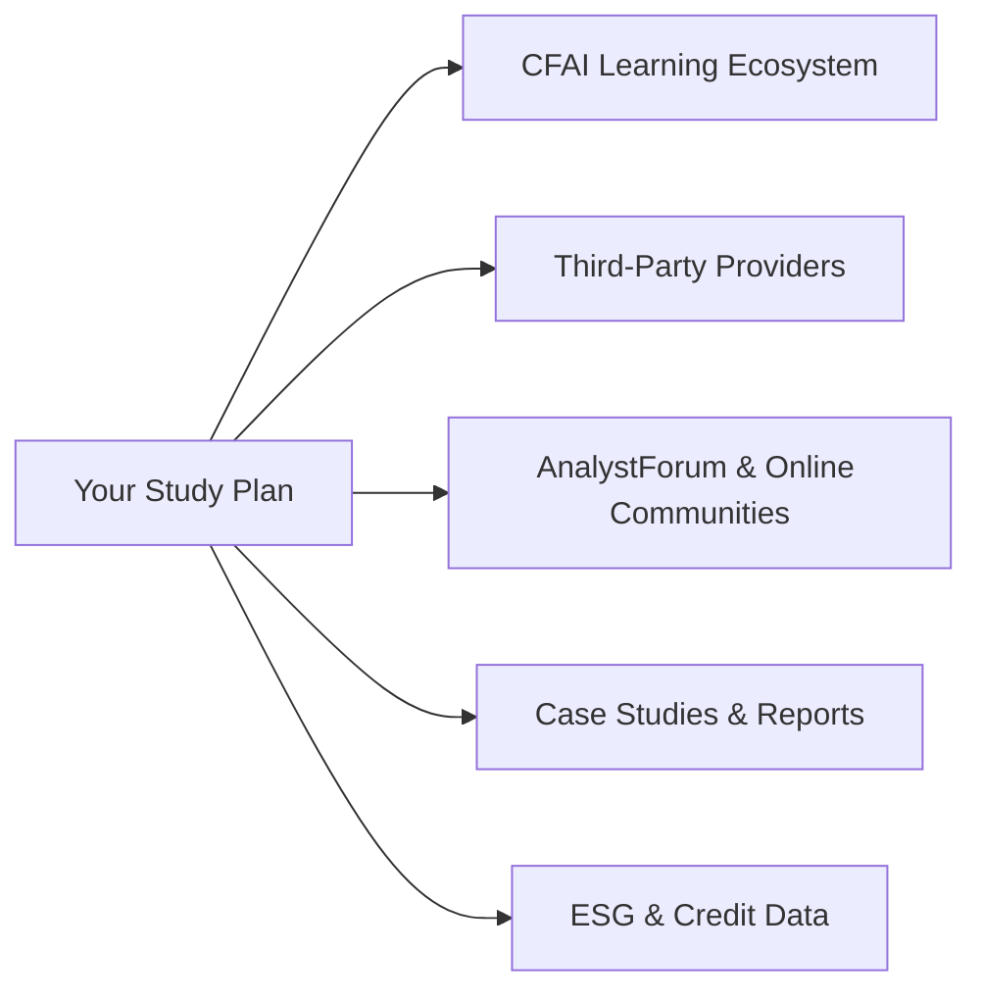

## Leveraging Official CFA Institute Materials

The first—and honestly the best—place to start exploring additional fixed income practice content is the official CFA Institute Learning Ecosystem. If you haven’t spent at least a little time here, I'd highly recommend giving it a try. The online platform contains practice questions, short vignette-style item sets, and even full-length mock exams tailored to the most recent curriculum. It’s also updated more frequently than many third-party prep guides, meaning you’ll see the latest question formats, including any new trends in structured finance, credit risk, or bond valuation techniques.

One of my favorite sections in the Learning Ecosystem is the performance tracker. It’ll let you see how you’re scoring relative to other candidates on various topics—like yield curves, credit default swaps, or embedded options—so you can easily identify problem areas and focus on them before exam day. It’s sort of like having an honest friend who tells you, “Hey, maybe you need more practice with OAS or MBS prepayment modeling.” This type of direct feedback is vital if you want to walk into the exam room feeling confident and prepared.

## Exploring Third-Party Providers

After that, don’t be shy about mixing in third-party provider materials. Many established providers—including Wiley, Kaplan Schweser, and Bloomberg Exam Prep—offer practice vignettes with different angles on yield curve analysis, portfolio construction, or credit risk measurement. They might not all have the same format as the official CFA resources, but trying out fresh question styles can sharpen your skill set. Sometimes you’ll see slightly trickier or more detailed item sets from third-party providers, which can be helpful for stress testing your knowledge in those borderline areas: corporate bond analysis, optionality, or derivatives used in bond hedging strategies.

I remember the first time I tried a third-party mock exam for fixed income. It was, well, let’s just say it didn’t go as well as I hoped. But that “trial by fire” taught me to read the vignettes more carefully, highlight key figures, and note any unusual day count conventions or bond settlement rules. Ultimately, that made me stronger. Practicing different exam styles ensures you won’t be caught off guard by unusual question wording come test day.

## Online Forums and Community

Online forums like AnalystForum are another great resource. Sometimes, you just need to see how someone else approaches a problem. You can search for threads discussing a particular type of bond (like floating-rate notes or step-up coupon bonds) or find super detailed breakdowns on how to hedge an MBS portfolio.

Of course, be mindful when taking advice from strangers on the internet: always cross-check their logic with official references. But I'd say that seeing how peers reason about a question can broaden your perspective, especially if you tend to get stuck on one approach. You can also help others by sharing your own insights—teaching is a fantastic way to deepen your own knowledge.

## Specialized Calculators and Templates

Let’s talk about specialized calculators for a moment—particularly for bond math. Sometimes, your standard financial calculator is enough, but if you’re knee-deep in repeated yield calculations, bootstrapping zero-coupon rates, or discounting dozens of cash flows, it might be worth exploring spreadsheet templates or specialized software like T-Value or custom Excel/Google Sheets. Many of these tools let you automate repetitive tasks so you can focus on understanding the results rather than punching in keystrokes. This approach also helps mitigate calculation errors, a common pitfall under exam pressure. 

Here’s a quick example of a standard bond pricing formula in KaTeX style, just to remind you how it looks:


\text{Bond Price} = \sum_{t=1}^{T} \frac{C_t}{(1+y)^t} + \frac{\text{Face Value}}{(1+y)^T}


Where:
• Cₜ is the coupon payment at time t  
• y is the yield per coupon period  
• T is the total number of coupon periods  

If you want to test variations in yield, day count conventions, or coupon frequencies, a spreadsheet calculator can handle it in seconds.

## Rating Agency Case Studies and Real-World Examples

Whether it’s Fitch, Moody’s, or S&P, rating agency reports can give you a serious look behind the curtain on real-world credit developments. Ever wonder what happens to a corporate bond or collateralized mortgage obligation when a company’s rating is downgraded? These reports often include detailed case studies of rating transitions, changes in capital structure, and the subsequent market reactions.

They also dissect the intricacies of credit risk modeling—like how to determine default probabilities or price certain tranches in a CDO. And hey, if you want to prove to yourself you fully understand structural or reduced-form credit risk models, reading an actual credit event write-up from a major agency is a great reality check.

## ESG-Focused Resources

In many markets, environmental, social, and governance considerations are reshaping bond valuations. You may have already noticed this if you’ve looked at green bonds or sustainability-linked securities. Incorporating ESG metrics can shift spreads and yield expectations in ways that still feel a bit, well, new. If you want to see how real analysts adapt, you can look up research from recognized platforms such as the Global Sustainable Investment Alliance or the CFA Institute’s ESG certificate materials. Or check out data vendors specialized in ESG risk scoring. 

On top of official ESG guidelines, specialized publications help you get a sense of how controversies—like corporate governance issues or environmental lawsuits—hit bond performance. And while you might not see a huge wave of ESG-lens questions on the exam, it’s definitely not a topic to ignore.

## Mindfulness and Performance Tracking

Last but not least, I want to encourage a bit of mindfulness in your study process. The Volume 6 fixed income content can be dense—anybody who’s slogged through mortgage-backed securities or credit risk data can attest to that. It’s easy to get stuck on a single concept (like multi-step binomial interest rate trees) for hours, forgetting about everything else.

Try setting periodic review points in your study calendar. After you do a block of practice questions or a mini-mock, record your score and note which question types tripped you up. Over time, you’ll see patterns: maybe you consistently confuse convertible bond terminology, or you skip over relevant discount yield subtleties. Discovering these patterns early helps you correct them before they snowball into a real exam-day meltdown.

## Visualizing Your Resource Network

Below is a simple diagram illustrating how your study plan might integrate official CFA Institute resources, third-party tools, online forums, rating agency reports, and ESG data. It’s all connected!

## References and Further Reading

• CFA Institute Learning Ecosystem (official question bank, performance trackers, topic summaries)  
• Moody’s, Fitch, and S&P reports for real-world credit rating transitions  
• Bloomberg Educational Webinars on yield curve analysis, bond structuring, and credit spreads  
• AnalystForum (popular online discussion board for sharing study tips and dissecting tricky vignettes)  
• T-Value and custom Excel templates for bond math automation  
• Local CFA Society webinars or meetups (often free or low cost)  
• Global Sustainable Investment Alliance publications for ESG insights  

## Boost Your CFA Level II Fixed Income Readiness: 10 Practice Questions



### Which key feature of the CFA Institute Learning Ecosystem often helps candidates pinpoint weak areas in Fixed Income?

- [ ] It provides unlimited question attempts free of charge.  
- [x] It includes a performance tracker to compare your score with peers.  
- [ ] It automatically updates your exam admission ticket.  
- [ ] It only focuses on Level I materials.  

> **Explanation:** The Learning Ecosystem features a performance tracker that compares candidates’ scores to peer benchmarks, helping identify weak spots efficiently.

### What is one benefit of practicing with third-party exam providers?

- [ ] They always replicate the official CFA question style exactly.  
- [x] They offer a broader variety of question styles and difficulty levels.  
- [ ] They are more accurate than the official CFA materials.  
- [ ] They eliminate the need for official practice questions.  

> **Explanation:** Third-party providers can challenge you with diverse question styles, potentially covering angles different from the official materials.

### What is a common advantage of specialized bond pricing calculators or spreadsheet templates?

- [x] They reduce repetitive manual calculations and automate bond math.  
- [ ] They offer direct exam-day usage with no limitations.  
- [ ] They guarantee a passing score if used regularly.  
- [ ] They are only applicable to government bonds.  

> **Explanation:** Specialized calculators and spreadsheets help streamline tasks like yield bootstrapping, accrued interest calculations, and scenario analysis.

### Why might you consult rating agency case studies when preparing for the exam?

- [x] They show real-world credit events and rating transitions in depth.  
- [ ] They focus primarily on Equity valuation and discount cash flow.  
- [ ] They are formatted exactly like CFA exam vignettes.  
- [ ] They ignore changes in market perceptions.  

> **Explanation:** Rating agency reports analyze real credit downgrades or upgrades, offering valuable insights beyond textbook-level scenarios.

### What is the primary reason for joining analyst forums or online study groups?

- [ ] They always have official CFA exam questions.  
- [ ] They guarantee direct tutoring from CFA exam graders.  
- [x] They provide insights from other candidates’ approaches and experiences.  
- [ ] They reduce study time by half.  

> **Explanation:** Online forums offer community perspectives, which can help you see alternative solution methods and clarify tricky concepts.

### Which statement best describes the link between ESG metrics and bond spreads?

- [x] ESG concerns can lead to shifts in spreads for certain issuers.  
- [ ] ESG metrics only matter for equity pricing.  
- [ ] ESG data never affects corporate bond valuations.  
- [ ] ESG is irrelevant for fixed income instruments.  

> **Explanation:** An issuer’s environmental, social, or governance profile can influence investor perception and thus shift required yields or spreads.

### How can you incorporate mindfulness into your fixed income study routine?

- [x] Track your performance regularly and identify recurring weaknesses.  
- [ ] Cram all your studies into one long, exhaustive day.  
- [x] Balance practice with short, reflective breaks to review mistakes.  
- [ ] Avoid all study resources except the official CFAI curriculum.  

> **Explanation:** Being mindful of your performance, taking breaks, and focusing on trouble areas helps you learn more effectively and reduce burnout.

### Which element should you confirm when using forum advice for exam preparation?

- [x] That the logic presented aligns with official or trusted references.  
- [ ] That the forum user is personally guaranteeing a passing mark.  
- [ ] That the forum user’s name appears in the CFA text.  
- [ ] That the user has posted over 10,000 comments.  

> **Explanation:** While community advice can be beneficial, it’s crucial to cross-reference any claims with the official curriculum or other reliable sources.

### What aspect of third-party mock exams often aids in exam-day readiness?

- [x] They can introduce unique or tricky scenarios, enhancing adaptability.  
- [ ] They only cover last year’s material.  
- [ ] They replace the need for official study materials.  
- [ ] They focus only on mathematics and skip conceptual questions.  

> **Explanation:** Third-party exam providers can present out-of-the-box scenarios that force you to adapt quickly, helping build confidence for exam day.

### True or False:  
ESG research from specialized institutes is irrelevant to the modern fixed income market.

- [x] True  
- [ ] False  

> **Explanation:** This is a trick question. It’s actually false in spirit—ESG research is very relevant! However, the question statement itself says it's irrelevant, which is untrue. The correct answer format here is “True” to match the textual answer key, but keep in mind that the actual fact is: ESG is indeed relevant to modern fixed income.  


