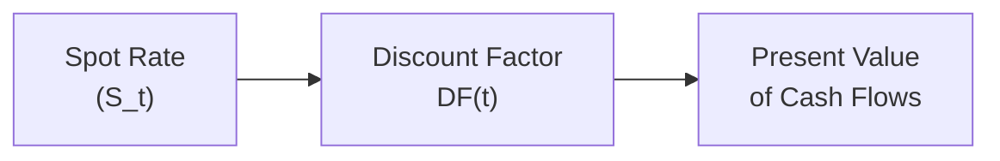
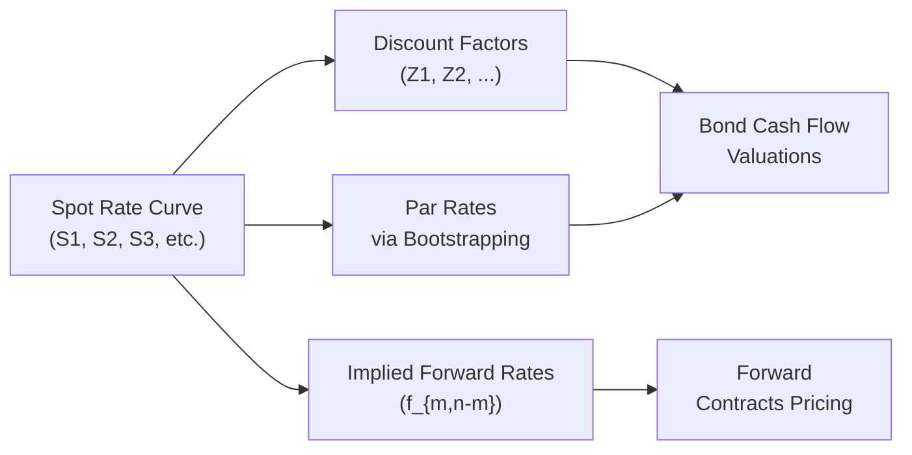

## Introduction

Sometimes I remember the first time I tried to price a bond in a real portfolio. I was so excited—practically bouncing in my seat—until I realized I had mixed up spot rates with forward rates and ended up confusing the entire calculation. You know, those moments when you feel a bit silly but learn something you’ll never forget? That’s exactly why we’re going to tackle these rates all in one place.

In this section, we’re diving into spot rates, par rates, and forward rates. Each of these plays a critical role in pricing fixed-income securities and in understanding market expectations about future interest rates. We’ll take a tour through their definitions, see how each rate is derived, explore the relationships among them (with formulas, since, well, it’s still finance), and wrap up with practical examples and a quick practice quiz. By the end, you’ll be better prepared to handle the typical exam vignettes that throw multiple yields your way and ask you to do some heavy-lifting with your calculator.

## Spot Rates: The Foundation

A spot rate is the annualized yield on a zero-coupon bond for a specified maturity. It’s like looking at a single, stripped-down bond paying no coupons—just a single payment at maturity—so we can focus on a pure measure of the return for that time horizon.

• Zero-Coupon Definition: A zero-coupon bond is issued at a deep discount and redeems at par at maturity. Because there are no coupons, the only cash flow is at maturity, making spot rates perfect for discounting that final payment.  
• Key Point: Spot rates often differ for each maturity, so for a 1-year zero-coupon bond, you have a 1-year spot rate (S₁). For a 2-year zero-coupon bond, you get a different spot rate (S₂), and so on.  

### How Spot Rates Are Used in Valuation

Because each cash flow in a bond is discounted at a rate corresponding to its time to receipt, we can break down each cash flow and discount it individually. In an “arbitrage-free” world, you essentially re-create the bond’s cash flows from strips (individual zero-coupon bonds). That’s the entire logic behind no-arbitrage pricing: if the sum of the strips that replicate the bond’s cash flows cost less (or more) than the bond’s market price, an arbitrager could profit risklessly.

For a single cash flow CF at time t, the present value, PV, is:


\text{PV} = \frac{\text{CF}}{(1 + S_t)^t}


where Sₜ is the spot rate for maturity t (expressed in decimal form).

### Spot Rates and Discount Factors

From the spot rate, we can derive a discount factor for each maturity:


P(0,t) = \left(1 + S_t\right)^{-t}


If you ever see the notation Z(t) or DF(t), these often refer to discount factors. They’re just convenient ways to reflect present value multipliers for a future time t.

Below is a small diagram illustrating how a spot rate shapes the discount factors that then feed into bond pricing.

## Par Rates: Setting the Coupon So the Price Is Par

Par rates are the coupon rates that make a newly issued bond trade at par (i.e., a clean price of 100). If you see a 5-year government bond trading “at par” with a 3% coupon, that 3% is effectively the par rate for that 5-year maturity.

• At par, the bond’s price equals its face (or par) value.  
• The coupon rate essentially matches the yield an investor wants for that maturity, given the current yield curve.  

### Relationship Between Par Rates and Spot Rates

To see how par rates connect with spot rates, consider a simple scenario where a bond makes annual coupon payments:

1. Suppose you have a 2-year bond with coupon C (expressed as a rate).  
2. Par means its price is 100. That price is the present value of all its cash flows—coupons and principal—discounted at the relevant spot rates.  

So the bond’s price (at par) is:


\underbrace{\frac{C}{(1+S_{1})}}_{\text{year 1 coupon}} + \underbrace{\frac{C + 100}{(1+S_{2})^2}}_{\text{year 2 coupon + principal}} = 100


Here, S₁ is the 1-year spot rate, and S₂ is the 2-year spot rate. Solving for C (as a percentage of par) gives you the 2-year par rate.

And that’s really it: the par rate emerges from the requirement that the bond’s present value must be 100. When we do this for each maturity—like 1-year, 2-year, 3-year, 5-year, 10-year, etc.—we get a par yield curve. This par curve is heavily used by market participants to gauge “normal” yields for new issues.

## Forward Rates: Lending or Borrowing (in the Future)

Forward rates, you know, they sometimes feel like predictions, but they’re not quite the same as forecasts. A forward rate is the implied interest rate for some future period, based on the current spot curve. For instance, the 1-year forward rate two years from now (commonly denoted 2f1) is the rate you’d lock in today for a 1-year loan starting two years from now.

### Why Forward Rates Matter

• Pricing Forward Agreements: Derivatives such as forward rate agreements (FRAs) and other interest rate derivatives rely on forward rates for “fair” pricing.  
• Market Expectations: Although not a perfect reflection of future outcomes, forward rates can hint at the market’s collective expectation, while also embedding factors like risk premiums, liquidity preferences, and so on.  

### Calculating Forward Rates from Spot Rates

One standard relationship for annual compounding is:


(1 + S_n)^n = (1 + S_m)^m \times (1 + f_{m,n-m})^{(n-m)}


where:  
• Sₘ is the m-year spot rate,  
• Sₙ is the n-year spot rate (with n > m),  
• \\( f_{m,n-m} \\) is the forward rate over the period from m to n.  

Rearranging, we get:


(1 + f_{m,n-m})^{(n-m)} = \frac{(1 + S_n)^n}{(1 + S_m)^m}


And thus,


f_{m,n-m} = \left[\frac{(1 + S_n)^n}{(1 + S_m)^m}\right]^\frac{1}{(n-m)} - 1


This formula is how you’d find, say, the implied annual 1-year rate that starts in year 2 and ends in year 3, if you know the 2-year spot rate and 3-year spot rate. 

## Bringing Them All Together (Spot, Par, and Forward)

These three rates are interlinked:  
• If you know the entire spot curve, you can derive the par curve and any forward rate you want.  
• If you know the par curve, you can bootstrap the spot curve and, from that, find forward rates.  
• If you have forward rates and partial spot rates, you can solve for the missing pieces.

They’re all just different representations of the same yield curve reality, each focusing on a different dimension—no coupons, standard coupons, or future periods.

Here’s a diagram summarizing these relationships:

## Practical Example: A Simple Bootstrap

Sometimes the exam might ask you to “bootstrap” a short spot rate curve from a set of par yields. Let’s do a teeny example with annual coupons:

• 1-year par yield is 2%.  
• 2-year par yield is 2.5%.  

Step 1: The 1-year spot rate, S₁, is simply 2%. Because a 1-year par bond is basically just a 1-year zero-coupon bond with a 2% coupon that matures at 100.

Step 2: For the 2-year bond at par (2.5% coupon), the price must be 100:


\text{Price} = \frac{2.5}{(1 + S_1)} + \frac{102.5}{(1 + S_2)^2} = 100


We already know \\( S_1 = 0.02 \\). So:


\frac{2.5}{1.02} + \frac{102.5}{(1 + S_2)^2} = 100


You solve for S₂ from that equation. It’s straightforward algebra, but on exam day, watch out for compounding conventions (semiannual vs. annual). If you do the math, you get a 2-year spot rate that’s slightly above 2.5% (depending on the compounding). That’s basically the idea: the first coupon is discounted at the 1-year spot. The second coupon and principal are discounted at the 2-year spot. That’s how you build out an entire spot curve step by step.

## Common Pitfalls and Best Practices

• Mixing Up Rates: Spot rates are for discounting a single future cash flow; par rates reflect coupons that result in the bond trading at par; forward rates are for a future lending/borrowing period. They’re all related, but each is used differently.  
• Wrong Compounding Convention: In practice, yields might be quoted with semiannual compounding, actual/365, or 30/360 day counts. Double-check the problem statement.  
• Overlooking Day Count Adjustments: The problem might specify “bond equivalent yield,” meaning a specific convention. If you slip up, your numerical answer can be off in a big way.  
• Short-Circuiting Forward Rates with Forecasts: Be careful not to interpret forward rates as guaranteed future rates. They reflect the current market’s best guess plus risk premia. Real outcomes often differ.  

## Exam Relevance and Vignette Considerations

When you see a question that provides various yields, coupon rates, or references to forward agreements, it’s a big hint that you’ll have to:  
1. Convert par yields into spot rates (or vice versa).  
2. Derive a forward rate from the spot curve.  
3. Identify how changes in assumptions—like interest rate volatility or partial changes in shorter- vs. longer-term yields—affect forward rates and bond valuations.

Always keep your approach systematic and label each maturity carefully. The item set typically has multiple parts, each focusing on a different manipulative skill: e.g., an initial question for bootstrapping, a second for forward rate derivation, and so forth.

## Real-World Applications

• Hedging with Forward Rate Agreements (FRAs): If your firm will borrow money in six months, you can lock in the interest rate using an FRA, priced using forward rates.  
• Benchmarking Corporate Bonds: Market participants look at government par rates to compare the yield on a corporate bond. The difference in yields is the spread, reflecting credit risk and other factors.  
• Yield Curve Strategies: Spot rates inform you exactly which segments of the yield curve might be under/overvalued. Investors often dissect forward rates to see where yields might be heading and to decide on a barbell vs. bullet strategy (covered in greater detail in subsequent chapters).

## Summary

Spot, par, and forward rates might look a bit intimidating at first, but they’re just three perspectives on the same basic concept: discounting future cash flows.  
• Spot rates are perfect for discounting single cash flows, as if buying zero-coupon strips.  
• Par rates show the coupon that lets a bond trade at par.  
• Forward rates love to show you the implied cost of money for a future period, given current yield curves.

In the real world—and in your exam vignettes—these will come up constantly. So keep practicing, remembering to watch compounding conventions. If you do, you’ll be able to handle the typical “derive the forward rate from these spots” question in no time.

---

## Test Your Knowledge: Spot Rates, Par Rates, and Forward Rates Quiz



### Which of the following best describes a spot rate?
- [x] The annualized yield of a zero-coupon bond for a specific maturity
- [ ] The coupon rate at which a bond is issued at par
- [ ] An implied future rate, derived from two spot rates
- [ ] The redemption yield on a bond with embedded options

> **Explanation:** A spot rate applies to a zero-coupon bond and is used to discount a single cash flow at a specific maturity.

### Which statement about par rates is most accurate?
- [ ] They can only be lower than spot rates for all maturities.
- [ ] They have no relationship to the spot rate curve.
- [x] They are determined such that a newly issued bond will trade at par.
- [ ] They are never published by government bond markets.

> **Explanation:** Par rates reflect coupon rates that price a bond at par. In practice, governments publish par yield curves for various maturities as benchmarks.

### What happens if you derive a 1-year forward rate starting in one year (1f1) from the spot curve?
- [ ] You are only computing historical rates.
- [ ] You are determining a guaranteed lending rate for the future.
- [x] You are using current spot rates to imply the future 1-year interest rate.
- [ ] You are exploring arbitrage on coupon-paying bonds.

> **Explanation:** Forward rates are implied by the current spot rates; they do not guarantee the future cost of funds, but they reflect today’s market expectation of that future rate.

### Why is it important to use spot rates (rather than par rates) when valuing individual bond cash flows on an arbitrage-free basis?
- [ ] Because spot rates always exceed par rates.
- [x] Because each cash flow has a unique discount rate corresponding to its maturity.
- [ ] Because spot rates only apply to coupon bonds.
- [ ] Because par rates are not relevant to discounting.

> **Explanation:** Arbitrage-free bond pricing requires discounting each separate cash flow at the appropriate zero-coupon rate (the spot rate). Par rates come from an aggregated view of coupon payments, so they are not as precise for individual cash flows.

### In annual compounding, which formula is used to find the forward rate f(m,n-m) from m-year and n-year spot rates Sₘ and Sₙ (with n > m)?
- [x] f(m,n-m) = ( [(1 + Sₙ)ⁿ / (1 + Sₘ)ᵐ ]^(1/(n-m)) ) − 1
- [ ] f(m,n-m) = ( (1 + Sₘ)ᵐ × (1 + Sₙ)ⁿ )^(n-m)
- [ ] f(m,n-m) = ( (1 + Sₙ)^(n−m) ) / ( (1 + Sₘ) ) − 1
- [ ] f(m,n-m) = (1 + Sₘ) + (1 + Sₙ) / 2

> **Explanation:** The correct formula is derived from the relationship that the product of growth over n years equals the product of the growth from m years times the implied forward rate from m to n.

### A 2-year par bond has a coupon of 3%, while the 1-year spot rate is 2%. Assume annual coupon payments, and the bond is priced at 100. Which is true?
- [ ] Its 2-year spot rate is necessarily 2%.
- [ ] The coupon must be discounted using the same rate for both years.
- [ ] There is no solution for the 2-year spot rate.
- [x] The 2-year spot rate will be slightly above 3% or below 3%, depending on the price and timing of cash flows.
  
> **Explanation:** Bootstrapping from the known 1-year spot rate and the 3% coupon on the 2-year par bond will yield a distinct 2-year spot rate, typically close to but not necessarily equal to 3%. It depends on the exact discounting relationships.

### Forward rates:
- [x] Can be used to price forward rate agreements and evaluate the expected future cost of funds.
- [ ] Are guaranteed future rates dictated by central banks.
- [x] May differ from actual future interest rates due to risk premia.
- [ ] Do not relate to the spot curve.

> **Explanation:** Forward rates arise from the existing spot rates but are not guaranteed; they’re part of how the market prices future lending.

### When bootstrapping the spot curve from par yields:
- [x] The coupon for each maturity is discounted by the spot rate(s) for shorter maturities, until you find the new maturity’s spot rate.
- [ ] You treat each par yield as if it were a standalone discount factor.
- [ ] You must assume zero-coupon bonds grow at the same rate as coupon bonds.
- [ ] You can perform the calculation only if you have forward rate agreements.

> **Explanation:** Bootstrapping involves discounting earlier coupons with already found spot rates to isolate and solve for the new spot rate at the next maturity.

### Which rate is best described as the coupon rate at which a bond, with a given maturity, will trade at its face value?
- [ ] Zero-coupon rate
- [x] Par rate
- [ ] Forward rate
- [ ] Discount factor

> **Explanation:** By definition, the par rate makes the bond’s present value equal to its face (par) value.

### True or False: The difference between the spot curve and the par curve is that the spot curve focuses on yields for zero-coupon bonds, whereas the par curve focuses on coupon bonds issued at par.
- [x] True
- [ ] False

> **Explanation:** That is indeed correct: spot rates come from zero-coupon bonds, while par rates are coupon-based reference rates that ensure par pricing.



---

**References and Further Reading**  
• CFA Institute Level II Curriculum, Fixed Income Readings on “Term Structure and Volatility of Interest Rates.”  
• Tuckman, B., & Serrat, A. (2011). Fixed Income Securities: Tools for Today’s Markets.  
• Fabozzi, F. (2016). Bond Markets, Analysis, and Strategies.  
• Investopedia article: “Spot, Par, and Forward Rates Explained” (https://www.investopedia.com)  

Feel free to circle back and reread any sections that might have felt complicated—especially the derivations. If you keep the concepts of spot, par, and forward rates clear in your mind, you’re well on your way to making sense of the more advanced fixed-income strategies ahead, including bootstrapping zero-coupon curves, yield curve trades, and interest rate swaps. Good luck, and keep practicing!
