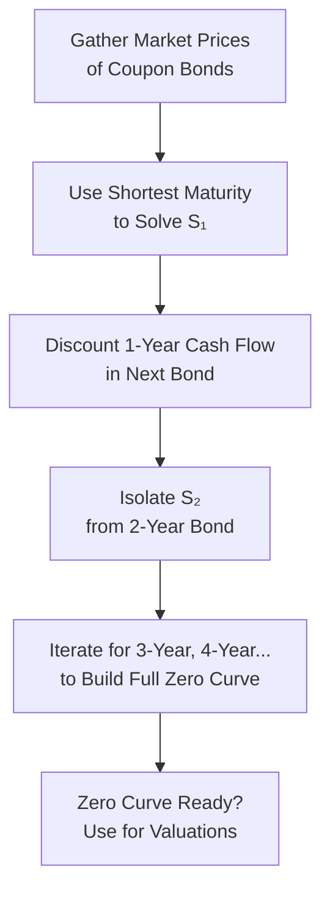

## Introduction and Conceptual Overview

Bootstrapping the zero-coupon curve might sound a bit fancy, but it’s really just a systematic way to extract individual spot rates from the prices of coupon bonds. Think of it like peeling back layers of an onion—each coupon payment you strip away reveals a new layer of the yield curve. The no-arbitrage principle underpins the entire process, ensuring that each bond’s price perfectly matches the discounted value of its cash flows when you use the appropriate zero-coupon rates.

As you might recall from earlier discussions on the term structure of interest rates (see Section 4.1), spot rates (a.k.a. zero-coupon rates) represent the yield on a bond that pays no coupons and only returns principal at maturity. Real bonds, especially government or high-quality corporate bonds, pay periodic coupons. So the challenge is: how do we isolate the yield for a single maturity from a bond that pays multiple coupons? That’s where bootstrapping comes in. By using the information embedded in bonds of progressively longer maturities, we can sequentially “back out” the zero-coupon rates for all the maturities along the yield curve.

I remember the first time I tried this in a real-world scenario: I was fresh out of school, and I had a stack of government bond prices with different maturities. I almost panicked trying to figure out how to discount everything properly. But once you get the hang of the iterative approach, it becomes second nature—like following a recipe step by step!

## Core Principles of Bootstrapping

### The No-Arbitrage Requirement
No-arbitrage states that you can’t make a riskless profit by exploiting price discrepancies in equivalent cash flows. If a 1-year spot rate has been determined from a 1-year zero-coupon bond, you must use that same rate to discount any 1-year cash flow (like the first coupon on a 2-year bond). This consistency preserves fairness across all bond prices.

### Incremental Spot Rate Estimation
You start with the shortest maturity available. Usually, that’s a 1-year coupon bond or a 1-year zero-coupon bond (if it exists). The yield or price of that bond is your window into the 1-year spot rate. Then, to find the 2-year spot rate, you discount the first coupon using the 1-year rate you just found. Subtract that discounted coupon from the total bond price, and the remainder must be discounted at the unknown 2-year rate. Solve for that 2-year rate. Keep progressing until you’ve derived the entire curve for all the maturities you need.

## Step-by-Step Approach

Let’s walk through a simple illustration. Assume you have:

• A 1-year bond with a 5% annual coupon, priced at 99.0 (clean price).  
• A 2-year bond with a 6% annual coupon, priced at 98.5 (clean price).  

We assume annual compounding for simplicity, and we ignore accrued interest issues in this example.

1. Identify the 1-year Spot Rate (S₁)  
   If the 1-year bond has a 5% annual coupon and is priced at 99.0, that means an investor pays 99.0 today and gets 5 (coupon) + 100 (principal) = 105 at the end of the year (just highlighting the total cash flow). So we solve:

   99.0 = 105 / (1 + S₁)

   Solve for S₁:

   S₁ = (105 / 99.0) – 1

2. Use S₁ to Find the 2-year Spot Rate (S₂)  
   The price of the 2-year bond (coupon 6%, price 98.5) reflects two future cash flows:
   • Year 1 coupon: 6  
   • Year 2 coupon + principal: 106  

   The present value of the first coupon is discounted at S₁, while the year-2 flows are discounted at S₂. Thus:

   98.5 = 6 / (1 + S₁) + 106 / (1 + S₂)²

   You already know S₁ from step 1, so you plug that in, then solve for S₂.

3. Extend the Method for Longer Maturities  
   If you had a 3-year bond, you would discount the first coupon with S₁, the second coupon with S₂, and the final coupon and principal with S₃. Each new bond reveals the spot rate corresponding to its final maturity, because you’ve already accounted for earlier cash flow discounting with previously derived spot rates.

### KaTeX Formula Representation

If Pₙ is the price of an n-year bond with annual coupon C and face value F, the general model is:


P_n = \frac{C}{(1 + S_1)} + \frac{C}{(1 + S_2)^2} + \ldots + \frac{C + F}{(1 + S_n)^n}


Here, Sₖ is the k-year spot rate. After determining S₁, S₂, …, S₍ₙ₋₁₎ from shorter-maturity bonds, you isolate Sₙ by substituting known rates back into the equation.

## Diagram: The Bootstrapping Flow

Below is a simple Mermaid diagram showing how you might conceptualize bootstrapping from one maturity to the next:

Each stage feeds into the next. Notice how the discounting from previously discovered spot rates is used to peel off known cash flows.

## Common Pitfalls to Avoid

1. Mixing Up Frequencies  
   If your annual coupon bond is quoted with a semiannual yield, or if market conventions use semiannual compounding, you must carefully align the cash flows to the correct discount intervals. A mismatch can lead to huge discrepancies.

2. Clean vs. Full Price  
   Sometimes, the bond price you see already includes accrued interest (dirty price). Other times, it doesn’t (clean price). Always confirm which price you’re using for discounting, because the timing of the coupon payment can significantly change your calculations.

3. Day Count Conventions  
   Markets often have different day count standards (30/360, actual/365, actual/360, etc.). An incorrect assumption about day counts affects the discount factors, particularly for short-term maturities.

4. Under/Over-Adjusting for Credit Risk  
   Ideally, you bootstrap using default-free or extremely high-quality bonds (like government issues). With corporate bonds, credit spreads can muddy the waters, making it trickier to interpret the “pure” risk-free spot rate.

5. Missing Partial Credit on Exams  
   If you’re in an exam scenario and you can’t finish all the steps, show your partial calculations. For instance, if you find S₁ but run out of time for S₂, partial credit may still be awarded if you demonstrate correct methodology.

## Advanced Considerations

• **Cross-Currency Curve Construction**  
  In multi-currency portfolios, you might need to factor in cross-currency basis swaps, forward FX rates, and distinct yield curves in each currency. The principle is similar, but the math gets more intricate.

• **Real-Time Data Updates**  
  Some institutions run an automated system that re-bootstraps spot rates in real time as bond quotes or yields change throughout the day. For a portfolio manager or trader, having an updated zero curve is essential for accurate pricing and risk management.

• **Incorporating OIS Rates**  
  With the rise of overnight indexed swap (OIS) rates, many analysts use OIS curves for discounting instead of traditional LIBOR-based curves. Bootstrapping from OIS-based instruments ensures consistency in discounting collateralized derivatives exposures.

## Practical Example

Let’s extend a more detailed illustration with hypothetical data:

• 1-year coupon bond: Price = 992.0 (full price), Annual coupon = 60 (6% of 1,000 par).  
• 2-year coupon bond: Price = 980.0, Annual coupon = 70 (7% of 1,000 par).  

Assume annual compounding again, with par = 1,000.

1) For the 1-year bond:

   992.0 = (60 + 1000) / (1 + S₁)

   Solve for S₁:

   (60 + 1000) = 1060  
   S₁ = (1060 / 992.0) – 1 = 0.0685 or 6.85%

2) For the 2-year bond:

   980.0 = 70 / (1 + 0.0685) + (70 + 1000) / (1 + S₂)²

   Discount the first coupon using 6.85%:

   PV of first coupon = 70 / 1.0685 ≈ 65.50

   Then:

   980.0 – 65.50 = 914.5  

   So:

   914.5 = 1070 / (1 + S₂)²

   (1 + S₂)² = 1070 / 914.5 ≈ 1.1704  
   1 + S₂ = (1.1704)^(1/2) ≈ 1.0822  
   S₂ = 1.0822 – 1 = 0.0822 or 8.22%

Now you have the 1-year spot (6.85%) and the 2-year spot (8.22%). You would continue for bonds with 3-year, 4-year maturities, and so on, each time peeling off the discounted value of the earlier coupons.

## Best Practices and Exam Tips

• **Always confirm compounding and day count.** This might seem trivial, but it’s often the easiest place to make a slip-up.  
• **Show your work** on exam problems. Even if you get stuck, partial credit is often awarded for correct steps.  
• **Use the no-arbitrage framework** to check if your results are consistent. If your spot rates imply a bond is over- or underpriced, you may have made a calculation error.  
• **Practice short calculations** with a financial calculator or a spreadsheet. Speed and accuracy are critical: you want to avoid letting mechanical errors burn your exam time.  
• **Keep track of accrued interest** if the question specifically references full (dirty) vs. clean prices. The difference can be crucial for correct discounting.  

## Glossary

• **Bootstrapping**: An iterative method to derive spot yields from coupon bond data.  
• **Spot Rate** (Zero-Coupon Rate): Yield on a zero-coupon security that matures at a specific time.  
• **Discounting**: Converting future cash flows to present values using an appropriate rate.  
• **Clean Price**: Bond’s price excluding accrued interest.  
• **Full (Dirty) Price**: Bond’s price including accrued interest.  
• **No-Arbitrage Principle**: Identical cash flows cannot be priced differently in efficient markets.  

## References and Further Reading

• CFA Institute Level II Curriculum, “Term Structure and Yield Curve Analysis: Bootstrapping Zero-Coupon Yields.”  
• Fabozzi, F.: “Fixed Income Mathematics: Analytical & Statistical Techniques.”  
• Bloomberg and Refinitiv Eikon terminals have built-in bootstrapping functions. Take time to explore these if you have terminal access.  

## Test Your Knowledge: Bootstrapping the Zero-Coupon Curve



### Which principle ensures that bootstrapped spot rates must consistently price bonds to avoid riskless profit?

- [x] The no-arbitrage principle
- [ ] The Fisher Effect
- [ ] The yield-to-maturity rule
- [ ] The capital market line assumption

> **Explanation:** The no-arbitrage principle states that identical cash flows cannot offer differing risk-free profits. This principle underlies the bootstrapping process.

### When deriving the second-year spot rate from a two-year bond, why do we discount the first coupon using the previously found one-year spot rate?

- [x] Because the 1-year cash flow must be discounted at the known 1-year rate to remain consistent with no-arbitrage
- [ ] To comply with IFRS reporting requirements
- [ ] Because the second-year spot rate is only used for coupon payments more than two years away
- [ ] Because the total coupon payments must be collapsed into a single payment

> **Explanation:** We use the first-year spot rate to discount the coupon paid in the first year. Only the second-year coupon plus principal is discounted at the second-year spot rate.

### Which of the following is the correct formula for the price of a 2-year annual-pay coupon bond under bootstrapping?

- [ ] Price = C / (1 + S₁) + (C + F) / (1 + S₁)  
- [x] Price = C / (1 + S₁) + (C + F) / (1 + S₂)²  
- [ ] Price = (C + F) / (1 + S₂) + C / (1 + S₁)²  
- [ ] Price = (C + F) / (1 + S₁)²

> **Explanation:** The first coupon is discounted at S₁ over 1 year, and the second coupon plus principal is discounted at S₂ over 2 years.

### If bond prices quoted are clean prices, which additional aspect might you need to consider when bootstrapping?

- [ ] They already factor in default risk
- [ ] They reflect accrued interest charges
- [x] They exclude accrued interest that should be added back for proper discounting
- [ ] They include swap spreads

> **Explanation:** Clean prices exclude accrued interest, so you might need to incorporate accrued interest to get the full (dirty) price for correct discounting.

### Which day count convention is commonly used for Treasury bonds in the U.S.?

- [ ] 30/360
- [x] Actual/365
- [ ] Actual/360
- [ ] 28/336

> **Explanation:** U.S. Treasury bonds generally use actual/365. Some money market securities, however, use actual/360.

### True or False: Bootstrapping can be performed only with government bonds.

- [ ] True
- [x] False
- [ ] Cannot be determined
- [ ] Only if day count convention matches

> **Explanation:** Although it’s most common to bootstrap with government bonds (to get a risk-free curve), in principle, you can bootstrap with any set of similar-credit-risk bonds. Corporate bond bootstrapping typically incorporates credit spread.

### In an exam setting, which approach helps secure partial credit if you can’t fully solve for the final spot rate?

- [ ] Copy formulas from memory without referencing the data
- [ ] Provide final numeric answers without detailing intermediate steps
- [ ] Compute only the yield to maturity instead
- [x] Write down the correct formulas and partially discount known cash flows

> **Explanation:** Partial credit is often granted if you demonstrate correct methodology and partial calculations, even if you cannot finish all steps.

### Suppose you are bootstrapping in a market with semiannual compounding. Which of the following must you do?

- [x] Adjust coupon payments and discount intervals to reflect two periods per year
- [ ] Use annual coupons only
- [ ] Ignore the bond’s coupon frequency entirely
- [ ] Double the final spot rate

> **Explanation:** Always match the compounding and coupon timing. If coupons are paid semiannually, each period’s discounting must be done at half-year intervals.

### Which term best describes the yield on a zero-coupon security that matures at a specific time in the future?

- [ ] Forward rate
- [x] Spot rate
- [ ] Treasury bill rate
- [ ] Credit spread

> **Explanation:** A spot rate is the yield for a particular maturity on a zero-coupon (or stripped) basis.

### True or False: In practice, bootstrapped curves are often updated in real time by financial institutions.

- [x] True
- [ ] False

> **Explanation:** Many large institutions have systems that continuously update bootstrapped curves using real-time bond price feeds.


