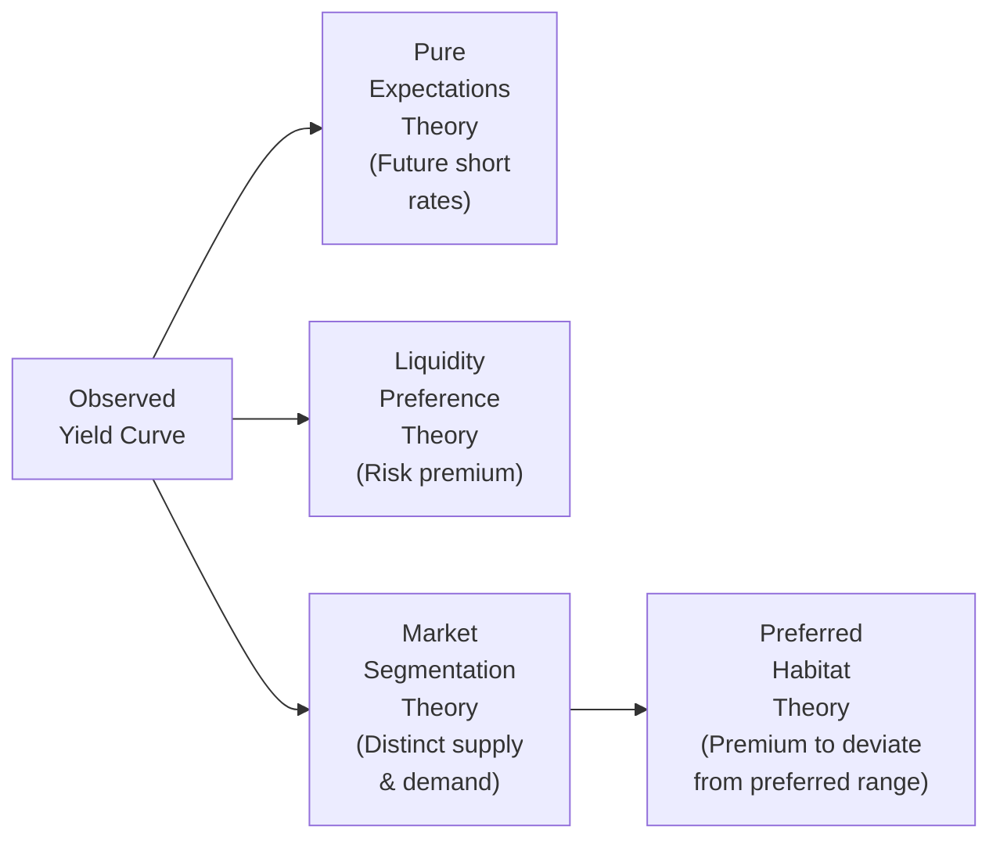

## Understanding the Core Theories

Have you ever had one of those days where you look at a bond yield curve—maybe on one of those fancy terminal screens—and just wonder, “Why does it slope up today but curve downward for longer maturities?” Well, in my early days studying fixed income, I found the yield curve both beautiful and baffling, like a puzzle that changes over time. Once I started digging into the traditional theories of the yield curve, it began to make a lot more sense. In this section, we’ll explore four big theories that have traditionally tried to explain the shape of the yield curve:

• Pure Expectations Theory  
• Liquidity Preference Theory  
• Market Segmentation Theory  
• Preferred Habitat Theory  

These theories often appear in exam vignettes or real-world discussions: a shift in long-term yields here, an unexpected flattening there. And you’ll see: each theory offers a slightly different lens on why yields differ across maturities. Let’s walk through each carefully.

## Pure Expectations Theory

Pure Expectations Theory argues that long-term bond yields simply reflect the market’s consensus for future short-term interest rates. In simpler terms, if you buy a two-year bond today, you could compare it to buying a one-year bond now and then rolling over into another one-year bond next year. If the markets are efficient, the two approaches should, on average, yield the same total return—otherwise, arbitrageurs would jump in and close the gap.

### Key Points

• Forward rates are viewed as “unbiased predictors” of future spot rates.  
• If the yield curve slopes upward under this theory, the market must be expecting higher short-term rates in the future. If it slopes downward, the market expects rates to fall.  
• This theory generally assumes no other factors complicate the picture—no preferred maturities, no incremental premiums for risk or liquidity.  

If you like a bit of math, a simplified version of the expectations relationship can be shown with a two-year bond versus two successive one-year bonds. Under Pure Expectations:


(1 + y_{2})^2 = (1 + y_{1})(1 + f_{1,1})


Where:  
• \\( y_{2} \\) is the 2-year yield (annualized).  
• \\( y_{1} \\) is the 1-year yield (annualized).  
• \\( f_{1,1} \\) is the forward rate on a 1-year instrument, 1 year from now.  

This formula basically says the total growth of $1 invested at the two-year rate should equal the growth of investing $1 at the one-year rate and then reinvesting at the forward rate. Under pure expectations, \\( f_{1,1} \\) is also the expected future one-year rate.

### Practical Example

Imagine short-term rates are at 3%. Suppose the forward market expects that next year, short-term rates will rise to 4%. According to Pure Expectations Theory, the yield on a two-year bond today should roughly reflect that average 3% + 4% path, which might place the two-year yield somewhere around 3.5% (a simplified approximation). Of course, real markets aren’t always that clean, but that’s the theoretical reasoning.

### Pitfalls and Critiques

Real-world data tells us that forward rates often don’t match actual future short-term rates. Market imperfections, risk aversion, and policy changes can introduce distortions. Also, if everyone believed in Pure Expectations and no other factors mattered, the yield curve would strictly reveal the market’s future rate forecasts—something we don’t always observe.

## Liquidity Preference Theory

Sometimes called the Liquidity Premium Theory, this approach says: “Investors demand compensation (a premium) for tying up their money in long-term bonds, which are more sensitive to interest rate risk.” Long-term rates thus comprise two components:

• The average of expected future short-term rates (from the Pure Expectations perspective).  
• Plus a “liquidity premium” that increases with maturity.

### The Role of the Liquidity Premium

Longer-term bonds generally come with greater uncertainty: corporate default risk, inflation risk, and interest rate volatility. A liquidity premium is that extra yield tacked on to longer maturities. This means that even if investors expect tomorrow’s short rate to remain the same, the yield curve might still slope upward because of the premium demanded for holding longer maturities.

### Real-World Snapshot

In many cases, yield curves have been upward sloping more often than not—particularly in stable economic environments. According to Liquidity Preference Theory, it’s not just about future rates; it’s that you need extra compensation for locking up your money for longer. Historically, you might see a typical 10-year Treasury yield about 1-2 percentage points higher than a 1-year Treasury, even if future short-rate expectations are relatively flat.

## Market Segmentation Theory

Have you ever noticed some funds—like pension funds or life insurers—often stick to a certain range of maturities to match their liabilities? That’s Market Segmentation Theory in action. It suggests the yield curve is shaped by supply and demand dynamics in different “segments” of the market. One group might favor short-term instruments, another group might favor longer-term debt, and these preferences can drive yields up or down independently of the broader market’s future rate expectations.

### Different Players with Different Goals

• Banks or corporate treasurers could prefer shorter maturities for liquidity and working capital needs.  
• Pension funds with long-dated liabilities might prefer 20-30 year bonds to match future payouts.  
• This structural “segmentation” in demand can create unique yield curve shapes in each maturity range.

### When This Matters

Sometimes the yield curve does stuff that a simple expectations-based view can’t explain—like a strangely inverted section in the mid-range. Market Segmentation Theory might say, “Oh, that’s because a wave of insurance companies are offloading a certain maturity bond, pushing that portion of the curve up.” So in a sense, each maturity basket trades with its own mini supply-demand dynamic.

## Preferred Habitat Theory

Preferred Habitat Theory is a twist on Market Segmentation. Here, investors do have a preferred segment—maybe they like the 5–7-year maturities—but they’re willing to venture outside that zone if (and only if) they’re compensated with a higher yield. So yields reflect both:

• Basic supply and demand within each maturity.  
• The “extra yield” needed to coax investors away from their usual spot.

This might help explain yield curve shapes that Market Segmentation alone can’t fully address. Investors are segmented, but they are also flexible, especially if the premium is high enough.

## Putting It All Together

In real life, you don’t pick just one theory and ignore the others. Traders, analysts, and economists often blend pieces of these theories to interpret what’s driving bond yields. You might say the fundamental shape comes from expectations, the slope is enhanced by a liquidity premium, and certain anomalies pop up because of segmented demand. Over time, you’ll develop a personal sense of which theory to emphasize in a given scenario.

| Theory                      | Key Proposition                                                                                                          | Typical Curve Implication                                   |
|-----------------------------|---------------------------------------------------------------------------------------------------------------------------|--------------------------------------------------------------|
| Pure Expectations          | Long-term rates = average of expected future short rates                                                                   | Shape driven purely by rate forecasts                        |
| Liquidity Preference       | Investors demand a premium for longer maturities; yields = future rates + liquidity premium                               | Upward slope often expected (premium grows with maturity)    |
| Market Segmentation        | Different segments have distinct supply/demand profiles, causing yield variations                                         | Parts of curve can move independently                        |
| Preferred Habitat          | Like segmentation, but investors can move outside their comfort zone if compensated sufficiently (premium)                | Intermediate shapes, partial bridging of segmented markets   |

## Exam and Real-World Relevance

The reason you’ll see yield curve theories pop up in exam vignettes is that these theories help rationalize interest rate movements and bond pricing. For instance, a typical exam question might describe a scenario where the yield curve has flattened at the long end, and they’ll ask which theory best explains it. You’d look to see if it’s because of new supply/demand forces in long maturities (Market Segmentation), or maybe a shift in rate expectations (Pure Expectations), or a change in the typical liquidity premium. It’s also possible the item set tries to blend multiple explanations, so don’t be surprised if the correct answer is “a combination of liquidity preference and segmentation.”

In the real world, phenomena like quantitative easing, pension fund regulation, or changes in bank liquidity rules can distort segments of the yield curve. Analysts might say, “We’re seeing a shortage of 10-year T-bonds from the government, so the yields have been driven down.” That’s basically Market Segmentation at work. Meanwhile, if you see a consistent upward slope over time, a liquidity premium explanation might be tossed in. And if the curve flattens or inverts, folks often revert to a Pure Expectations viewpoint: “The market must be pricing in rate cuts.”

## Best Practices, Pitfalls, and Tips

• Don’t Over-Simplify. It’s really easy to assume one theory explains everything. In practice, multiple forces operate simultaneously.  
• Keep an Eye on the Data. Observe changes in each maturity section—who’s buying, who’s selling? That can be a clue toward segmentation or preferred habitat.  
• Expectation vs. Reality. Remember that forward rates in the real market can deviate significantly from future realized spot rates.  
• Watch the Volatility. If market volatility spikes, the liquidity premium might surge, making the yield curve steeper. If volatility settles, that premium can shrink, flattening the curve.  
• Time Management on Exam Day. For item set questions, quickly identify which maturity segments or which theoretical angle the vignette highlights—pure predictions, institutional constraints, or risk premiums—and zero in on that.

## Additional Resources

• CFA Program Curriculum (Fixed Income modules) for formal definitions and hypothetical examples.  
• Mishkin, F. (2019). "The Economics of Money, Banking, and Financial Markets" – an excellent macro perspective on interest rate theories.  
• Scholarly article: “Tests of the Expectations Hypothesis and the Liquidity Preference Hypothesis” in The Journal of Finance – for deeper empirical analysis.

---

## Master Your Yield Curve Knowledge



### Which theory posits that long-term rates are simply the average of expected future short-term rates?

- [x] Pure Expectations Theory
- [ ] Liquidity Preference Theory
- [ ] Market Segmentation Theory
- [ ] Preferred Habitat Theory

> **Explanation:** Pure Expectations Theory states that longer-term yields primarily reflect the market’s forecast of short-term interest rates over the corresponding horizon.

### According to Liquidity Preference Theory, which statement best describes why longer-term bonds usually have higher yields?

- [ ] They have fewer buyers, so issuers must pay more interest.
- [x] Investors demand a premium to compensate for higher interest rate and inflation risks over longer horizons.
- [ ] The government deliberately sets higher yields on long-term securities.
- [ ] The market misprices long-term bonds frequently.

> **Explanation:** Liquidity Preference Theory holds that investors must be paid extra yield (a “liquidity premium”) to hold longer-term bonds, which carry greater uncertainty and risk.

### Market Segmentation Theory suggests the yield curve is shaped by:

- [x] Independent supply and demand conditions at different maturities.
- [ ] Expectations about future economic growth only.
- [ ] Neutral short-term bank policies.
- [ ] The central bank’s preference for stable rates across maturities.

> **Explanation:** Market Segmentation Theory emphasizes that each maturity range can have unique investor and issuer preferences, creating yield curve differences across segments.

### Which of the following is the main difference between Market Segmentation Theory and Preferred Habitat Theory?

- [ ] Preferred Habitat Theory assumes forward rates are unbiased.
- [ ] Market Segmentation Theory says investors have no specific preferences.
- [ ] Preferred Habitat Theory is unrelated to interest rate risk.
- [x] Preferred Habitat Theory allows investors to deviate from their preferred maturity if sufficiently compensated with a premium.

> **Explanation:** Preferred Habitat Theory is a refinement of Market Segmentation, where investors do have preferred maturities but will move out of them if offered adequate compensation.

### In a normal upward-sloping yield curve, Liquidity Preference Theory would most likely argue:

- [x] The yield curve is upward sloping partly because of an extra yield premium at longer maturities. 
- [ ] The yield curve is upward sloping only because of central bank interest rate cuts.
- [x] Over most time periods, investors want compensation for taking on greater duration risk.
- [ ] The yield curve slope is random and unrelated to investor preferences.

> **Explanation:** Under Liquidity Preference, investors demand additional yield to hold longer maturities, making the curve typically slope upwards. Duration risk compensation is a major factor.

### If a bond analyst observes that short-term rates are expected to remain constant, but the yield curve remains modestly upward-sloping, which theory best explains this?

- [x] Liquidity Preference Theory
- [ ] Pure Expectations Theory
- [ ] Market Segmentation Theory
- [ ] Preferred Habitat Theory

> **Explanation:** Under Liquidity Preference, yields can still slope upward even if short-term rates aren’t expected to change, due to the premium investors require for bearing longer-term uncertainty.

### Which of the following statements about Pure Expectations Theory is correct?

- [x] It implies forward rates are unbiased predictors of future spot rates if there are no risk or liquidity premiums.
- [ ] It suggests that investors must be compensated for default risk in sovereign bonds.
- [x] It proposes that short-term bonds and long-term bonds are perfect substitutes in the absence of premiums.
- [ ] It is inconsistent with the idea that market participants have rational expectations.

> **Explanation:** Pure Expectations Theory states that long-term yields are essentially the average of expected future short rates, assuming no premiums or transaction frictions. Under this framework, short- and long-term instruments are seen as interchangeable from a returns perspective, provided the expected returns are equal.

### How does Preferred Habitat Theory help explain yield curve shapes that Market Segmentation Theory alone cannot?

- [x] By recognizing that investors can shift away from their usual maturity segment if offered enough yield.
- [ ] By assuming all investors are purely rational and forward rates are unbiased.
- [ ] By eliminating liquidity premiums.
- [ ] By reducing the importance of supply and demand in each segment.

> **Explanation:** Preferred Habitat Theory augments Market Segmentation by allowing investors to deviate from their favored segment for adequate compensation, providing a more nuanced explanation for yield anomalies.

### Which of the following is a common critique of the Pure Expectations Theory?

- [x] Actual future interest rates often diverge significantly from implied forward rates.
- [ ] It places too much emphasis on liquidity premiums.
- [ ] It claims investors never care about risk.
- [ ] It undermines the concept of market equilibrium altogether.

> **Explanation:** Critics note that realized short rates can deviate substantially from forward projections due to economic uncertainty, policy changes, and risk factors, challenging the “unbiased predictor” assumption.

### Typically, if the yield curve inverts (long-term yields dip below short-term yields), Pure Expectations Theory might suggest:

- [x] The market expects short-term rates to decline in the future.
- [ ] The market values all maturities equally.
- [ ] Investors have no preference regarding maturities.
- [ ] The central bank is ensuring stable equities markets.

> **Explanation:** An inverted curve under the Pure Expectations lens usually reflects the market anticipating falling short-term rates, possibly due to a looming economic slowdown or upcoming policy easing.


