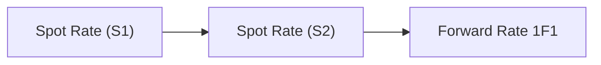

## Introduction
Sometimes, when I first heard the term “forward rate,” I felt like it was just another fancy phrase in a sea of finance jargon. But once you see how fast it pops up in the CFA exam context—especially in item sets—you realize it’s an essential concept to fully master. If a question throws you a bunch of spot rates and asks for forward rates, or vice versa, you want to be able to handle it without breaking a sweat. Forward rates basically give us a peek into the market’s implied interest rate for a future time period, and in many cases, they connect the dots among spot rates across different maturities.

In practice, an item set might read something like: “Bond ABC has a 1-year spot rate of 3.5%, a 2-year spot rate of 4.0%, etc. Based on these spot rates, determine the 1-year forward rate one year from now.” It sounds straightforward, but if you mix up compounding conventions, or forget to precisely interpret “bond-equivalent yields” vs. “effective annual yields,” you can quickly lose points. Let’s see how to handle these calculations and interpret the results in a typical exam scenario.

## Why Forward Rates Matter
Forward rates help investors and analysts understand what the market expects future interest rates to be—or at least what the shape of the yield curve implies about those expectations. They can be used for:  
• Pricing forward rate agreements (FRAs)  
• Valuing forward-starting securities, swaps, or bonds  
• Gaining insights into the shape and shifts of the yield curve  

Remember that forward rates are not guaranteed predictions of the future; they’re implied rates derived from current market prices of zero-coupon or coupon-bearing instruments.

## Approaches for Deriving Forward Rates
The classic formula for deriving forward rates from spot rates assumes some type of compounding convention. Let’s assume annual compounding for simplicity. The relationship between a 1-year spot rate (S₁), a 2-year spot rate (S₂), and the 1-year forward rate one year from now (1F1) is often given by:

(1 + S₂)² = (1 + S₁) × (1 + 1F1)

Solving for 1F1:

1F1 = ( (1 + S₂)² / (1 + S₁) ) − 1

If you’re dealing with semiannual compounding, you convert everything into a common basis first. The test might throw you off by mixing effective annual yields, bond-equivalent yields, or a mention of day count conventions, so read carefully.

Below is a simple diagram showing how we flow from spot rates to forward rates:



The same logic extends to longer periods. For example, to find a 2-year forward rate starting 1 year from now (1F2), you’d rely on 1-year, 3-year, or 2-year and 3-year spot rates, depending on how the question is structured.

Sometimes I find it easier to do actual numeric examples, so let’s try one. Suppose the 1-year spot rate, S₁, is 3%, and the 2-year spot rate, S₂, is 4%. Under annual compounding:

• 1-year spot means $1 grows to $1 × (1 + 0.03) = $1.03 in one year.  
• 2-year spot means $1 grows to $1 × (1 + 0.04)² = $1.0816 in two years.

But we know from the formula that:

(1 + 0.04)² = (1 + 0.03) × (1 + 1F1)

=> 1F1 = (1.04² / 1.03) − 1 = (1.0816 / 1.03) − 1 ≈ 0.05 or 5%

So, the implied forward rate for a 1-year loan to be made one year from now is 5%.

### A Python Code Snippet for Quick Calculation
Sometimes, especially if you’re fiddling with multiple forward rates, you can do a mini-check with Python (or any other calculator of your choice):

```python
S1 = 0.03  # 1-year spot rate
S2 = 0.04  # 2-year spot rate

forward_rate_1F1 = ( (1 + S2)**2 / (1 + S1) ) - 1
print(f"The 1-year forward rate starting 1 year from now is: {forward_rate_1F1:.4%}")
```

This snippet would print: “The 1-year forward rate starting 1 year from now is: 5.0000%.”

## Common Pitfalls in the Exam Context
• Mixing Up Conventions: You might see “bond-equivalent yields” (which are typically semiannual) vs. “effective annual yields” (annual compounding). Convert everything to a consistent basis before you do your arithmetic.  
• Day Count Conventions: If the question references actual/360 or actual/365, ensure you know how many days are in each period so you standardize the yields.  
• Not Checking for Partial Years: It’s common for an exam problem to talk about forward rates 6 months from now, or 180 days from now. Confirm the exact fraction of the year you need.  
• Overlooking the Final Step: If a question asks for an annualized forward rate and you’ve been working on a semiannual basis, you must convert it. Alternatively, if it specifically wants a 6-month yield, it may not want an annual figure at all.  
• Reading “One-Year Forward Rate Starting 18 Months from Now”: This can be tricky. If the data is in half-year increments, you might need to jump from the 2-year or 3-year spot rates. Carefully lay out your timeline.

## Real-World Considerations
Sure, forward rates are derived from current market spot rates. But do they actually predict real future interest rates? Not always. In the real world, forward rates incorporate risk premiums, liquidity preferences, and other market sentiments. Unexpected developments—like central bank announcements or geopolitical shifts—easily throw future rates off track.

Still, forward rates are insanely useful in pricing derivatives such as FRAs or interest rate swaps. If the forward curve says the 6-month LIBOR (or now SOFR) will be 3% in six months, a forward rate agreement might settle around that implied rate. But if you’re an exam candidate, the main takeaway is that the forward rate is a no-arbitrage-derived figure—i.e., it’s consistent with current spot rates so that there’s no pure arbitrage opportunity in the bond market.

## Conclusion
Deriving forward rates in an item set is all about carefully reading each piece of data, converting to a common yield basis (annual, semiannual, or monthly if necessary), and applying the no-arbitrage relationship between spot rates and forward rates. Keep an eye on day counts, the type of yield (bond-equivalent vs. effective annual), and how many compounding periods are involved. With each step, remember to interpret the values you find. If you see a forward rate higher than the spot rates, it might imply a steepening yield curve or the market’s expectation of rate hikes in the future. Step into the story behind the numbers—that’s part of the fun.

And if this feels overwhelming, trust me, I’ve been there—just keep practicing with short examples, verifying each forward rate you compute, and you’ll get the hang of it. The more comfortable you are, the faster and more confident you’ll be on exam day.

## References
• CFA Institute Mock Exams and Practice Problems in Fixed Income.  
• Tuckman, B., “Fixed Income Securities,” chapters on forward rate derivations.  
• Online learning platforms (e.g., Kaplan Schweser, Wiley) that provide practice vignettes and forward rate calculation drills.  
• CFA Institute Code and Standards, for ensuring ethical application and accurate data use in real-world scenarios.

## Test Your Knowledge: Forward Rate Calculation and Insights



### An analyst has the following annual spot rates: S1 = 2%, S2 = 4%. What is the 1-year forward rate starting one year from now (assuming annual compounding)?

- [ ] 2.50%
- [ ] 3.00%
- [x] 6.00%
- [ ] 4.00%

> **Explanation:** Using (1 + S2)² = (1 + S1) × (1 + 1F1) ⇒ (1.04)² / (1.02) − 1 = 6.0%.

### Which of the following best describes the relationship between a forward rate and the spot rates used to derive it?

- [ ] The forward rate is always greater than both spot rates.
- [x] The forward rate is implied by combining the growth factors of the spot rates.
- [ ] The forward rate is set by central banks directly.
- [ ] The forward rate is irrelevant once the yield curve is flat.

> **Explanation:** Forward rates are implied by the no-arbitrage condition relating spot rates for different maturities.

### An item set provides effective annual yields for the next two years, but the question asks for a bond-equivalent forward rate. Which step is typically required?

- [ ] Convert the bond-equivalent yield to a continuously compounded rate.
- [x] Convert the effective annual yields to bond-equivalent yields before calculating the forward rate.
- [ ] Use the forward rate directly from the effective annual yields; no conversion is needed.
- [ ] Apply a day count convention of actual/360.

> **Explanation:** When the question asks for a bond-equivalent rate, you must convert from effective annual yields (or any other basis) to bond-equivalent first.

### A candidate calculates the 2-year forward rate beginning one year from now, but they realize the question actually wanted the 1-year forward rate beginning two years from now. What should they do?

- [ ] Reverse-engineer from the 1-year sunspot rate.
- [x] Carefully re-check the timeline and adjust the formula using the 1-year and 3-year spot rates (or spot rates that bracket 2–3 years).
- [ ] Use the same rate because forward rates don’t depend on the timeline.
- [ ] Approximate halfway between the 2-year spot and the 3-year spot rate.

> **Explanation:** The question asks for a different forward period (years 2–3, not years 1–3), so you need to update your approach to use the correct spot rates.

### Which best describes a common mistake when deriving forward rates in a CFA item set?

- [ ] Forgetting to label your answer in financial calculator memory.
- [x] Mixing up semiannual and annual compounding conventions.
- [ ] Using the no-arbitrage principle.
- [ ] Compounding forward rates with the net present value approach.

> **Explanation:** A big pitfall is incorrectly handling compounding conventions, leading to wrong forward rate calculations.

### In the formula (1 + S₂)² = (1 + S₁)(1 + 1F1), which yield is typically S₂?

- [x] The 2-year spot rate.
- [ ] The 2-year forward rate.
- [ ] The 1-year spot rate in the second year.
- [ ] The risk-free rate used for discounting.

> **Explanation:** S₂ conventionally denotes the annualized spot rate for the 2-year maturity.

### If the 1-year spot rate is 4% and the normalized growth factor for 2 years is 1.10 (10% total growth), what is the implied 1-year forward rate for year 2?

- [x] 5.77%
- [ ] 6.00%
- [x] 5.78%
- [ ] 8.00%

> **Explanation:** (1.10) / (1 + 0.04) − 1 = 0.0577 or ~5.77%. (Some might approximate to 5.78%.)

### Which of the following statements about forward rates is true?

- [x] They are consistent with spot rates, such that no arbitrage opportunity exists.
- [ ] They ensure that investors always achieve the expected yield curve outcome.
- [ ] They are guaranteed predictions of future interest rates.
- [ ] They are generated solely by government policy.

> **Explanation:** Forward rates are derived from current spot rates on a no-arbitrage basis; they’re not guaranteed future rates.

### What is the main reason forward rates can diverge from actual future rates?

- [ ] Calculation errors in the no-arbitrage relationship.
- [x] Uncertainty and changes in market conditions, investor risk premiums, and central bank interventions.
- [ ] The yield curve never fully reflects current conditions.
- [ ] Forward rates must match actual realized rates.

> **Explanation:** Forward rates incorporate market expectations and risk premiums, and many future variables can shift realized rates away from these expectations.

### True or False: In a CFA item set, the best approach to find the 6-month forward rate in the second year is to solve for (1 + S2)² and then compare it with the 18-month spot rate.

- [x] True
- [ ] False

> **Explanation:** When your data includes the 2-year spot and an 18-month spot, sometimes you break down the second year into half-year increments. The approach involves carefully combining the relevant growth factors.


