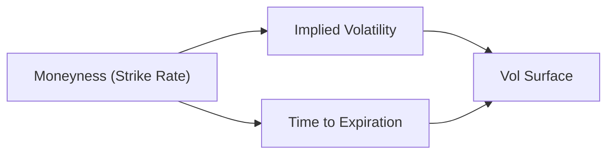

## Introduction

Have you ever noticed how some days, the short end of the yield curve seems to be bouncing around like a caffeinated squirrel, whereas those really long-dated bonds just seem to… barely budge? That’s (informally) the concept of the “maturity structure of yield volatilities,” or the idea that different maturities on the yield curve experience different levels of volatility. This difference can be driven by economic news, central bank decisions, and even how liquid those bonds (or bond futures) are. In this section, we’ll walk through the major factors that shape these volatility patterns, from short-term hustle to long-term drift, explaining why it matters for your portfolios and how you might put this knowledge to work in an exam or real-world scenario.

## Understanding the Volatility Term Structure

At its core, the volatility term structure is a curve showing how volatility changes across different maturities for a suite of similar instruments (often government bonds or interest rate swaps). In short, we’re charting how much yields can fluctuate at the overnight, 2-year, 10-year, 30-year marks, and so on.

For instance, short maturities are heavily influenced by central bank announcements or shifts in overnight rates. The longer part of the curve, on the other hand, is often more about the market’s expectations for future growth, inflation, and risk premiums over time.

### Visualizing the Volatility Term Structure

A helpful way to picture this is with a simple diagram illustrating implied or realized volatility across maturities:

Typically, we plot the actual volatility values on the y-axis and maturity on the x-axis. The shape can vary: sometimes it’s upward sloping (i.e., higher vol at longer maturities), sometimes downward sloping, or even humped in the middle. But the point is that each maturity can carry its own unique risk profile.

## Historical Volatility vs. Implied Volatility

When we talk about volatility, we often distinguish between:

• Historical Volatility: A backward-looking measure based on actual yield variability over a specific period (e.g., 30 days, 1 year).  
• Implied Volatility: A forward-looking measure derived from the prices of options (such as caps and floors on interest rates, or swaptions). It reflects the market’s consensus about how much yields are likely to move in the future.

### Why the Difference Matters

Historical volatility tells you what has already happened. Implied volatility indicates the market’s expectations of what will happen. Traders and portfolio managers who rely solely on historical volatility might be caught off-guard if the market suddenly prices in a major shift—perhaps due to an anticipated data release, new policy announcements, or broader macro concerns. In short, you should keep an eye on both measures.

## Short End vs. Long End of the Yield Curve

From personal experience, I remember a phase when I was so focused on long-duration bonds that I literally forgot to factor in how quickly short-term yields were zigzagging around Federal Reserve pronouncements. This mismatch can be painful (and I mean capital “P” Painful) if you’re not prepared. Let’s break this down:

• Short End (usually up to 2 years): Influenced heavily by monetary policy decisions, economic data releases like Nonfarm Payrolls, and liquidity conditions in the money markets (including daily or weekly funding pressures).  
• Medium to Long End (beyond 2 years, going toward 30 years): Driven more by inflation expectations, growth prospects, and risk premiums. That’s why the long end sometimes remains placid despite a flurry of short-term policy adjustments—investors might already be pricing in a “big picture” stance on where rates should settle over the horizon.

### Connections to Monetary Policy and Economic Cycles

There’s this concept of “monetary policy lag”: the idea that changes in short-term policy rates take time to percolate through the economy, ultimately affecting longer-dated yields. In expansions, yield volatilities can be modest because markets settle into a steady growth expectation, but in downturns or amid crises, short-term yields can swing dramatically amid liquidity shortages or sudden accommodation from central banks.

## Credit Risk and Liquidity Premiums

Yield volatility is not just about rates. Credit risk and liquidity premiums also play a role:

• Credit Risk: In times of market stress, spreads widen, and high-yield instruments show higher yield volatility (short or long).  
• Liquidity Premium: Less liquid segments can sometimes experience big jumps in volatility. Think of a lightly traded corporate bond vs. a highly liquid Treasury. Even in the same maturity bucket, illiquid bonds can have choppy price moves.

For example, in the corporate debt market, an issuer’s standing in the credit cycle might cause both short-term and long-term bonds to trade with elevated yield volatility compared to more “plain vanilla” Treasuries. During 2008 or the COVID-19 crisis, we saw short-term interbank lending rates go haywire. Meanwhile, longer-dated corporate bonds were also on a rollercoaster, albeit for different reasons, such as default risk or changing discount-rate assumptions.

## Modeling Approaches

### GARCH-Type Models

Generalized Autoregressive Conditional Heteroskedasticity (GARCH) models are often used to capture time-varying volatility in financial time series. In plain English, GARCH basically says, “Volatility isn’t constant; it changes over time, often clustering in pockets of high or low volatility.” This can help forecast how yields’ volatility might evolve and is popular among academic and professional quants.

### Forward Volatility from Caps, Floors, or Swaptions

We also glean forward volatility estimates from derivative instruments—like interest rate caps, floors, or swaptions. These options provide insight into how the market anticipates future yield swings at different points in time. If the market believes that rates might spike in, say, 1 to 2 years, you might see an elevated implied volatility for swaptions covering that future window.

Below is a simplified depiction of how you might see a volatility surface for an interest rate swaption:

In reality, these surfaces can get more complex, with three dimensions: strike price, maturity, and implied vol.

## Practical Applications for Portfolio Management

• Hedging: If you’ve got big exposure to short-end rate moves, you might rely on short-term interest rate futures or interest rate options that specifically focus on short maturities.  
• Speculating: Some managers take positions on the volatility itself—e.g., longing an option if they think implied vol is too cheap relative to potential upcoming macro shocks.  
• Relative Value: You might find that implied volatility on the 2-year maturity is overpriced compared to the 10-year. A relative value trader could position by selling overvalued volatility on the short-end and buying undervalued volatility on the long-end.  
• Stress Testing: Understanding maturity-specific volatility helps in scenario analysis. For instance, if short-term implied volatility jumps 20% after a hawkish central bank statement, can your portfolio stomach the drop in bond prices?

## Real-World Example

Imagine an investor holding a portfolio of 2-year investment-grade corporate bonds. After hearing rumors of a possible surprise rate hike, the investor sees that the implied volatility for short-term interest rate swaptions has surged. They decide to buy short-dated interest rate caps—basically purchasing protection against a spike in short-term rates. A few weeks later, the central bank does indeed raise rates unexpectedly, short-end yields jump, and that cap position helps offset losses in the corporate bond portfolio. Meanwhile, if the investor had stuck with only a position in, say, 30-year bond hedges, they might have discovered that the hedge didn’t move much—because the main policy shock was felt at the front end of the curve.

## Things to Watch Out For

• Overreliance on Historical Vol: Don’t get lulled into believing that future volatility will mirror the past. Markets evolve.  
• Misinterpretation of Implied Vol: Implied vol signals market sentiment, but it’s not a guarantee.  
• Shifts in Liquidity Conditions: Regulatory changes (e.g., liquidity coverage ratios) can alter short-term yield volatility significantly and quickly.  
• Macro Surprises vs. Local Events: Sometimes, a local event (e.g., a crisis in one country) can cause short-end volatility to explode there but leave longer maturities relatively untouched or even rallying as a “flight to quality.”

## Conclusion and Exam Tips

When tackling item sets or vignettes on the maturity structure of yield volatilities, watch for clues about the economic environment and central bank signals. If you see reference to anticipated short-term policy moves, expect the short end to get shaken up. If you see big inflation concerns or a major shift in fiscal policy, the longer end could be more sensitive. 

On exam day, be ready to calculate or compare volatilities and parse out the difference between historical and implied data. You might be asked to justify why short-term implied vol is spiking relative to the long end, or to compute the value of an interest rate option given a shift in the implied volatility surface. A top tip is to practice reading volatility “cheat sheets” or surfaces quickly so you can identify any arbitrage opportunities or confirm the bond hedge success.

Above all, keep in mind that yield volatility across maturities is context-dependent. Know the big macro story, stay alert to liquidity conditions, and interpret both historical and implied metrics with a forward-looking perspective. Good luck!

## References & Further Reading

• Fabozzi, Frank J. “Bond Markets, Analysis, and Strategies.”  
• Tuckman, Bruce, and Angel Serrat. “Fixed Income Securities: Tools for Today’s Markets.”  
• Bank for International Settlements (BIS) Working Papers on term structure modeling: https://www.bis.org  

---------------------------------

## Test Your Knowledge: Maturity Structure of Yield Volatilities



### A portfolio manager observes that short-term implied volatilities have recently surged, while long-term vols remain moderate. Which factor is most likely contributing to this divergence?

- [ ] Inflation expectations rising for the long term
- [x] A central bank signaling a higher policy rate in the near term
- [ ] Reduced credit risk for long-term corporate bonds
- [ ] A sudden drop in the supply of longer-dated treasury securities

> **Explanation:** When central banks signal hikes or other policy moves in the near future, short-term yields often experience a spike in volatility, while the long-end may remain less affected if longer-term inflation and growth expectations stay stable.

### Which statement best describes the difference between historical and implied volatility in the context of yield curves?

- [ ] Historical volatility measures forward-looking yield fluctuations; implied volatility measures past performance.
- [ ] Both historical volatility and implied volatility focus on future yield movements.
- [x] Historical volatility is backward-looking and derived from past data; implied volatility is derived from option prices and indicates market expectations.
- [ ] Implied volatility is always lower than historical volatility due to risk premium adjustments.

> **Explanation:** Historical volatility is calculated based on past yield movements, while implied volatility is extracted from current option (e.g., caps/floors/swaptions) prices, reflecting market participants’ expectations of future volatility.

### A trader wants to hedge against potential short-term rate spikes over the next six months. Which instrument is most aligned with this objective?

- [ ] A 10-year interest rate swap
- [ ] A 30-year callable corporate bond
- [ ] A 5-year put on a government bond future
- [x] A 6-month interest rate cap

> **Explanation:** A 6-month interest rate cap specifically protects against rising short-term interest rates over the cap’s effective period.

### Considering liquidity premiums, what impact might reduced liquidity in a specific bond segment have on that segment’s yield volatility?

- [ ] It decreases yield volatility because fewer trades occur.
- [x] It increases yield volatility because price movements can become exaggerated in a thinner market.
- [ ] It has no impact on volatility; only interest rate expectations matter.
- [ ] It only influences the short end of the yield curve.

> **Explanation:** When liquidity is low, even small trades can trigger large price changes, thereby increasing observed volatility.

### An investor compares short-term interest rate volatility during a period of economic expansion versus recession. Which pattern is generally observed?

- [x] Short-term volatility is relatively contained in expansions but can spike sharply during recessions or crises.
- [ ] Short-term volatility remains constant throughout the business cycle, while long-term volatility fluctuates.
- [ ] Long-term volatility is highest during expansions; short-term volatility surges during booms.
- [ ] Volatility does not correlate with economic cycles.

> **Explanation:** In expansions, stable macro conditions often suppress short-term volatility. During recessions, uncertainty and policy interventions can trigger sharp movements at the short end of the curve.

### A key reason why an increase in inflation expectations might affect long-term yields more than short-term yields is:

- [ ] Short-term yields are always pegged to official policy rates and never react to inflation news.
- [ ] Credit risk affects only long-term debt.
- [x] Long-term yields incorporate expectations of inflation over a longer horizon.
- [ ] Long-term yields are not sensitive to growth expectations.

> **Explanation:** Long-term yields reflect long-horizon expectations for inflation and growth, so changes in inflation outlook typically impact the long end more directly.

### Which best describes the role of GARCH-type models in analyzing yield volatility?

- [ ] They guarantee constant volatility for short maturities.
- [ ] They fix volatility estimates at historical average levels.
- [x] They allow for time-varying volatility and capture volatility clustering in yield movements.
- [ ] They are used exclusively to model credit default swaps.

> **Explanation:** GARCH models are widely used to model financial time series where volatility is not constant but changes over time in clusters of high or low turbulence.

### When preparing an arbitrage trade between the 2-year and 10-year segments of the yield curve based on implied vol, a critical piece of information is:

- [x] The relative level of implied volatilities across these maturities.
- [ ] The overnight central bank policy rate.
- [ ] The default rate on AAA-rated corporate bonds.
- [ ] Recent corporate earnings growth reports.

> **Explanation:** For volatility arbitrage, one must compare the implied vol levels across maturities (e.g., the 2-year vs. 10-year) to identify potential mispricings.

### If a trader observes a sudden flattening of the volatility term structure, with the short end rising and the long end dropping, which scenario might be consistent with this change?

- [ ] A stable short-term policy outlook and rising inflation worries
- [ ] No expected changes in monetary policy announcements
- [x] A hawkish monetary policy move expected soon, while long-term economic growth expectations remain subdued
- [ ] A large fiscal expansion projected in 30 years

> **Explanation:** A flattening of the volatility term structure where the short end spikes usually indicates an upcoming policy move, while limited changes for the long term often reflect subdued growth or stable inflation outlook.

### Term structure volatility analysis is most relevant for a portfolio manager who:

- [x] Actively manages interest rate risk across different maturities.
- [ ] Only invests in overnight commercial paper.
- [ ] Exclusively trades equity index futures.
- [ ] Avoids all bond investments.

> **Explanation:** Portfolio managers with exposure across short-term and long-term maturities must understand how volatility can differ across the curve to manage interest rate risk effectively.


