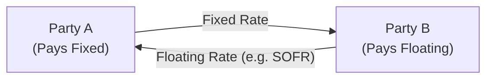

## Overview

I remember way back when someone first explained to me what an interest rate swap was, and I thought, “Um, that sounds pretty fancy.” Swaps seemed super-technical and complicated to me, but it’s actually not all that scary once you get the gist. In the simplest terms, a plain vanilla interest rate swap lets two parties exchange a fixed interest rate payment for a floating rate payment, all based on some notional principal (which doesn’t usually change hands). 

In modern bond and derivative markets, the swap curve—essentially, the plot of par swap rates over various maturities—often serves as a preferred benchmark for institutional investors, sometimes outranking even government bond curves. This preference stems from the swap curve’s relevance to the credit markets and its representation of interbank or institutional borrowing rates. A closer look at swap curves and swap spreads can really open our eyes to how big players price risk, especially when it comes to corporate bonds, derivatives, and advanced hedging strategies.

## The Plain Vanilla Swap

Before we unpack the swap curve, let’s make sure we fully understand the most common structure: the plain vanilla interest rate swap. Picture two parties:

• Party A pays a fixed rate (the swap’s fixed rate).  
• Party B pays a floating rate (often tied to SOFR or another benchmark, such as 3-month LIBOR in older swaps).  

While the notional principal itself typically does not change hands, the interest payments do. The fixed rate side tallies up payments based on a constant rate times the notional. The floating side resets periodically (say, every three months) to reflect the current floating rate. If we assume that at the swap inception date both sides have equal present value, the fixed rate is chosen such that the swap’s initial value is zero—that’s our par swap rate.

### Par Swap Rate

In a par interest rate swap, the fixed rate is selected so that the sum of the expected floating payments, discounted back to present value, exactly equals the present value of fixed payments. If we label the discount factors as P(1), P(2), …, P(n) for each time period, we can denote the par swap rate (S) using a simplified discrete formula:


S = \frac{1 - P(n)}{\sum_{t=1}^{n} P(t)}


Here, P(n) is the discount factor for the final swap payment date, and \\(\sum_{t=1}^{n} P(t)\\) is the sum of discount factors across the coupon periods. The synergy of discount factors and forward rates ensures that the initial swap value is zero.

Below is a simplified Mermaid diagram illustrating a typical plain vanilla interest rate swap cash flow structure:

This structure helps both parties achieve their desired interest rate exposure. Maybe Party A wants to lock in a fixed rate, while Party B prefers to pay fixed and receive floating. 

## Understanding the Swap Curve

When we connect those par swap rates across different maturities—2-year, 3-year, 5-year, 10-year, 30-year—we get the swap curve. Much like the yield curve for government bonds, the swap curve shows how longer maturities generally command higher rates due to increased risk and the time value of money.

But unlike government bond yields, these swap rates embed an entirely different sense of credit risk and liquidity conditions. Government debt, at least in theory, is considered default-free (or close to it, depending on the jurisdiction). The interbank market, on the other hand, assumes some measure of credit risk between commercial banks. That’s why, historically, folks looked at LIBOR-based swaps to glean a sense of bank credit risk. Now, with the shift to SOFR or other risk-free reference rates, the credit element can be more nuanced.

## What Are Swap Spreads?

A swap spread is basically the difference between:

• The fixed rate on a swap with a given maturity, and  
• The yield of a government bond of the same maturity.  

So a 5-year swap spread would be the 5-year par swap rate minus the yield on a 5-year government bond. It’s a handy measure, because the government bond is seen as lower risk. The swap can trade at a rate above or below that government bond yield, reflecting the additional risk (or certain market conditions) priced into interbank lending. 

Let’s say the 5-year government bond yield is 3.2% and the 5-year par swap rate is 3.45%. The swap spread is 25 bps (i.e., 3.45% – 3.2%). Or if at some point the par swap rate is below the comparable government yield, that can indicate an unusual market environment—perhaps heightened demand for receiving fixed in swaps, or other liquidity constraints.

## Key Influences on Swap Spreads

It’s not just about credit risk in a vacuum. Swap spreads can move around for many reasons:

• Interbank credit risk perceptions: If banks worry about others’ creditworthiness, the floating side or general risk embedded in swaps can widen spreads.  
• Liquidity in the swap versus the government bond market: If the swap market is more liquid, ironically, that can compress spreads. On the flip side, if government bonds become scarce, government yields can drop, and spreads widen.  
• Supply and demand for floating-rate liabilities: Some institutions might need to pay fixed or receive floating, and if there’s a one-sided demand, that can shift the par swap rate up or down.  
• Regulatory changes and central bank policies: Central bank signals often ripple into short-term rates, which in turn affect the floating rate used in swaps. Meanwhile, changes in bank regulations (e.g., capital requirements) can push swap spreads around.  

A wider swap spread can indicate stress in the banking sector or the broader credit market. During the 2008 financial crisis, swap spreads spiked dramatically because, well, the world was freaking out about bank solvency. A significant jump in spreads signals that the market demands a higher premium for interbank credit risk.

## The Role of OIS Discounting

After the financial crisis, the market recognized that LIBOR wasn’t truly risk-free. Central banks introduced new reference rates like SOFR in the U.S., SONIA in the U.K., €STR in the Eurozone, and so forth. These rates are generally considered nearly risk-free because they’re based on overnight transactions that carry minimal credit risk scrounged from actual market data.

So when banks and other institutions run their models to discount future swap cash flows, many do so based on the OIS (Overnight Indexed Swap) curve. Why does that matter? Because if you’re discounting future payoffs at something close to the “risk-free” rate (the OIS rate), you’re capturing a better sense of what those cash flows are truly worth in an environment with minimal credit risk. 

This leads to more accurate valuations—particularly for collateralized swaps. If you have a swap that’s fully collateralized, the collateral effectively lowers the counterparty risk, which justifies OIS as the discount rate. 

## Using Swap Spreads in Portfolio Management

Swap spreads aren’t just a theoretical concept. Managers use them in all sorts of ways:

• Hedging interest rate risk: If you hold a portfolio of corporate bonds, you might use interest rate swaps to convert part of that exposure to floating or fixed, locking in certain spreads.  
• Taking a view on credit conditions: A manager might buy (receive) fixed in a swap if they believe credit spreads will narrow, in hopes that the swap’s fixed rate will drop.  
• Relative value trades: Some strategies involve simultaneously buying a corporate bond and entering a swap position to isolate certain spread differentials.  

### Example of a 10 bp Change in Swap Spreads

Imagine you have a 5-year bond hedge in place using an interest rate swap. You’re paying fixed at 3.50% and receiving floating. Suddenly, the 5-year swap spread tightens by 10 bps, meaning the par swap rate for that maturity might drop from 3.50% to 3.40%. Depending on how your net exposures are structured, you could profit if you were on the right side of that move (e.g., if you’re receiving fixed in the swap, a drop in swap rates increases the swap’s value to you). 

In the exam setting, you might be asked to calculate the mark-to-market value of that swap given the new 10 bp difference, or to articulate how that affects your overall hedge.

## Historical Perspective

Some of the wildest swings in swap spreads occurred during crisis times. The 2008 global financial meltdown was the poster child for this phenomenon: banks refused to lend to each other without a hefty credit premium. Swap spreads ballooned, reflecting fear of default rather than the typical liquidity premium. Similarly, European sovereign debt turmoil in the early 2010s saw periods of intense variability in swap spreads, especially for euro-denominated swaps, as the markets worried about credit risk in certain EU members.

It’s worth glancing at other episodes—like the COVID-19 volatility in early 2020—where central bank actions (like massive Fed intervention) dramatically influenced short-term credit markets. These interventions often show up in OIS rates, which can then factor back into how swaps are valued and how big the swap spreads become.

## Practical Considerations and Common Pitfalls

While swap curves may be straightforward conceptually, here are a few issues that sometimes trip people up:

• Confusing par swap rates with forward rates: Always remember that your par swap rate is a single fixed rate for the entire life of the swap, set so that the swap starts with zero net present value. Forward rates are an internal building block used in the derivation.  
• Ignoring collateralization effects: If a swap is fully collateralized, the discount rate should be based on OIS to reflect minimal credit risk. Failing to do so misprices the swap.  
• Overlooking netting arrangements: Swaps are usually part of a broader set of derivatives. Netting can reduce net credit exposure, and ignoring that might lead to an exaggerated sense of your credit risk.  
• Failing to watch central bank signals: The shape of the OIS curve is heavily influenced by policy rates. If you see a big shift in monetary policy, expect it to ripple into swap rates and their spreads.  

Anyway, the moral of the story is, keep an eye on what’s backing your swap. Are you using a risk-free rate as your discount factor, or are you using some interbank-based rate like old-school LIBOR? The difference can be subtle but critical in a real-world portfolio valuation scenario.

## Conclusion

Swap curves and swap spreads may sound like advanced technicalities, but in the labyrinth of fixed income markets, they’re central to how big players price and hedge interest rate and credit exposures. Understanding the logic behind par swap rates—where they come from and how they compare to government yields—gives us a powerful perspective on market sentiment, credit risk, and liquidity dynamics. 

If we keep these fundamentals in mind (like the role of OIS discounting or how a 10 bp move in the 5-year swap spread could upset a hedge), we’ll be much better placed to answer the tough, scenario-based questions we often see in the CFA exam. It can also guide us practically when managing real portfolios, especially because the swap market remains one of the largest and most liquid arenas in global finance.

Keep exploring through practice item sets, especially paying attention to how swap valuation might shift as the floating rate references move or as credit conditions tighten (widen spreads) or loosen (tighten spreads). And remember: real-world swaps come with all sorts of bells and whistles—caps, floors, various reference rates, collateral requirements—so always read the fine print.

---

## References and Further Reading

- CFA Institute’s Official Curriculum for Level II Fixed Income (Swaps and Swap Curve Construction).  
- Hull, John. “Options, Futures, and Other Derivatives.” Chapters covering interest rate swaps and credit risk.  
- ISDA (International Swaps and Derivatives Association) resources on swaps, credit risk, and standard documentation:  
  https://www.isda.org

---

## Practice Questions: Swap Curve Insights and Applications



### In a plain vanilla interest rate swap, which of the following best describes the exchange of payments?

- [ ] Both parties pay a floating rate based on different benchmarks.  
- [ ] Both parties pay the same fixed rate to each other.  
- [x] One party pays fixed while the other pays floating on the same notional.  
- [ ] One party pays a fixed rate tied to a government bond yield, and the other pays the OIS rate.

> **Explanation:** In a standard (plain vanilla) interest rate swap, one party pays a fixed rate while receiving a floating rate, and the other party pays that floating rate while receiving the fixed.  

### If the 5-year par swap rate is 3.50% and the 5-year government bond yield is 3.20%, what is the 5-year swap spread?

- [x] 0.30%  
- [ ] 0.50%  
- [ ] 0.20%  
- [ ] 0.70%

> **Explanation:** The swap spread is the difference between the fixed swap rate and the comparable maturity government yield (3.50% − 3.20% = 0.30%).  

### Which of the following is most likely to cause swap spreads to widen significantly?

- [x] Investor concerns about bank solvency and liquidity.  
- [ ] A decline in the central bank’s policy rate by 25 basis points.  
- [ ] A temporary decrease in demand for floating-rate liabilities.  
- [ ] Consistent economic growth and stable financial conditions.

> **Explanation:** When investors and banks worry about each other’s solvency, they demand higher compensation for interbank credit risk, causing swap spreads to widen.  

### What is the primary reason many market participants switched to OIS discounting after the financial crisis?

- [ ] OIS discounting includes a large default risk premium missing in LIBOR.  
- [ ] OIS discounting better captures the bank’s operational risk.  
- [x] OIS rates are considered nearly risk-free and reflect collateralized funding costs.  
- [ ] OIS discounting prevents the need to post collateral.

> **Explanation:** OIS discounting gained popularity because OIS rates, based on overnight transactions, are very close to risk-free and reflect the actual funding costs in collateralized transactions.  

### Which statement about par swap rates is accurate?

- [ ] They are always calculated by adding a constant spread to government bond yields.  
- [x] They are fixed rates that set a swap’s initial net present value to zero.  
- [ ] They exceed floating rates because of higher default risk.  
- [ ] They cannot be used to derive zero-coupon rates.

> **Explanation:** A par swap rate is that unique fixed rate on an interest rate swap that makes the present value of fixed payments equal the present value of expected floating payments at inception (resulting in zero initial value).  

### A portfolio manager with a large holding of corporate bonds wants to hedge interest rate risk. Which swap position would most directly offset changes in interest rates?

- [x] Pay fixed, receive floating in an interest rate swap.  
- [ ] Receive fixed, pay floating in an interest rate swap.  
- [ ] Enter a credit default swap on corporate bonds.  
- [ ] Purchase an option on treasury futures.

> **Explanation:** To hedge rising interest rates for a predominantly fixed-income (corporate bond) portfolio, the manager would enter a swap as a fixed-rate payer (since the bond is effectively receiving fixed).  

### During a stress event in the market, we observe a sudden spike in swap spreads. Which of the following is a likely interpretation?

- [x] Markets are pricing in greater interbank credit risk or liquidity constraints.  
- [ ] The central bank recently lowered policy rates dramatically.  
- [x] Investors expect heavier corporate bond issuance.  
- [ ] The currency exchange rate is rising rapidly.

> **Explanation:** Swaps spreads often reflect perceived credit risk in the banking system. A spike suggests participants fear counterparty defaults or liquidity shortages, thus driving up the premium.  

### Why might government yields fall while swap rates stay relatively stable, thereby widening swap spreads?

- [x] Flight-to-safety demand for government securities.  
- [ ] Increased central bank short-term interest rates.  
- [ ] A decline in demand for fixed-rate liabilities.  
- [ ] A relaxation of capital requirements for banks.

> **Explanation:** If investors flock to government bonds during market stress, their yields drop. If swap rates don’t move as much, the resultant difference (swap spread) widens.  

### Which of the following best describes the relationship between swap curves and forward rates?

- [ ] Swap curves reflect only realized interest rates, while forward rates are purely forecast.  
- [ ] Swap curves and forward rates are unrelated.  
- [x] Swap curves can be decomposed into a series of implied forward rates.  
- [ ] Forward rates are always lower than swap rates.

> **Explanation:** The par swap rates used to construct the swap curve can be decomposed into or derived from forward rates. This is part of no-arbitrage pricing relationships in fixed income.  

### A 10 basis point tightening of the 5-year swap spread would most likely increase the market value of which position?

- [x] A position receiving fixed in a 5-year interest rate swap.  
- [ ] A position paying fixed in a 5-year interest rate swap.  
- [ ] A 5-year government bond position hedged with paying floating in a swap.  
- [ ] A short position in the 5-year corporate bond.

> **Explanation:** If the spread tightens, it means the par swap fixed rate decreased. Receiving fixed becomes more valuable if market rates for receiving fixed have dropped.  


