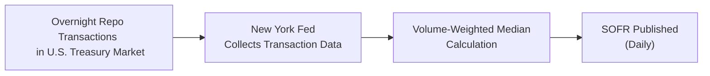

## Introduction

You might be thinking, “Wait, didn’t we only recently get comfortable with the concept of LIBOR at Level I?” Well, yes—but times, as they say, are changing. In this section of Chapter 5, we’re going to dig deep into the transition from LIBOR to SOFR. If you’ve casually followed financial headlines, you probably saw references to banks switching away from LIBOR in response to serious concerns about manipulation and decreasing liquidity in the interbank lending market. Now, SOFR (Secured Overnight Financing Rate) is the main show in town for the U.S. dollar world.

We’ll tackle the intricacies of this shift: why LIBOR needed to go, how SOFR is calculated via repo transactions, what it means for floating-rate notes, and why you should think about fallback language before you sign on any dotted line. Let’s break it all down.

## Why LIBOR Is Being Phased Out

### Historical Context
LIBOR (London Interbank Offered Rate) was once the go-to reference rate for everything from mortgages to complex interest rate swaps around the globe. It was calculated by polling major banks on their estimated borrowing costs in the interbank market. Over the years, however, two major developments eroded confidence in LIBOR:

• Manipulation Scandal: Instances of collusion and false reporting by certain banks undermined trust in LIBOR’s integrity.  
• Diminished Interbank Market: Interbank lending volumes decreased significantly, making the daily estimates less robust or “representative” of real-world transactions.

The Financial Conduct Authority (FCA) in the UK pulled the plug by announcing that banks were no longer required to submit LIBOR quotes after certain deadlines. That effectively spelled the end for LIBOR as we knew it. If you’re used to using LIBOR as your standard for short-term interest rates, you needed to find a new friend—fast.

### The Transition Tipping Point
For the U.S. dollar market, the Alternative Reference Rates Committee (ARRC) took the lead in selecting SOFR as the recommended replacement. Internationally, there are corresponding benchmarks like SONIA (Sterling Overnight Index Average) for GBP, ESTR for EUR, TONAR for JPY, and SARON for CHF, but our focus here (and often on the exam) remains firmly on the USD market, where SOFR is king.

## What Is SOFR and How Is It Calculated?

SOFR (Secured Overnight Financing Rate) is based on transactions in the U.S. Treasury repurchase (repo) market. A “repo” is essentially a short-term collateralized loan. One party sells U.S. Treasuries to another party and agrees to repurchase them the next day at a slightly higher price, effectively paying interest. These transactions are considered extremely low risk, given the high-quality collateral (U.S. Treasuries) and the overnight nature of the loan.

### The Mechanics of SOFR
The New York Fed publishes SOFR every business day. The rate is a volume-weighted median of all eligible repo transactions. So if there’s $1 trillion in overnight repo transactions, the actual market trades determine SOFR. Importantly:

• It’s a secured rate (collateralized by Treasuries).  
• It’s based on real transactions (not estimates).  
• It’s published daily and is considered more resistant to manipulation.

Below is a simplified Mermaid diagram of how SOFR is derived:



Compared to LIBOR, which was unsecured and based on banks’ best guesses, SOFR is viewed as a more robust measure of short-term borrowing costs—at least for overnight financing of U.S. Treasuries.

## Key Differences Between LIBOR and SOFR

### Credit Risk vs. Collateral
LIBOR was an unsecured benchmark: when those banks submitted their borrowing cost estimates, they were effectively pricing in their own credit risk (and the credit risk of the interbank market). SOFR is almost entirely free of bank credit risk because it’s based on loans secured by Treasuries.

This means that SOFR typically trades lower than equivalent unsecured interest rates, especially in times of financial stress when bank credit risk spikes. Under stress, we might see a more significant spread between an unsecured rate and a secured rate. Hence, if you’re analyzing yield spreads in your portfolio, or you’re hedging with interest rate derivatives, you have to account for that difference.

### Timing and Term Structure
LIBOR had multiple maturities—overnight, one week, one month, three months, and so forth—quoted each day. SOFR, in its simplest form, is only published for an overnight maturity. As a result, creating a term structure for SOFR (sometimes called Term SOFR) requires additional calculations or derived products that combine daily SOFR rates over the relevant period. Because of this, you’ll often see compounding in arrears (we’ll get to that in a minute) or daily simple interest approaches to approximate longer-term interest rates.

### Data Sourcing
LIBOR was based on a feedback loop of “expert judgments” from a panel of banks. SOFR, by contrast, is drawn from real, massive volumes of transactions in one of the most liquid markets around—the U.S. Treasury repo market—which helps reduce the risk of manipulation.

## Market Implications: Floating-Rate Notes, Loans, and Swaps

### Floating-Rate Notes (FRNs)
Historically, FRNs might say something like “Pays quarterly coupons at 3-Month LIBOR + 150 basis points.” Now, new FRNs often come out referencing SOFR. But the question arises: how exactly do we calculate a quarterly coupon if the reference is a daily, overnight rate? The solution is typically daily compounding or daily simple averaging over the coupon period, then adding the spread. The difference in calculation can produce slightly different results from what you’re used to under LIBOR.

### Syndicated Loans
Syndicated loans are typically large credit facilities shared among multiple lenders. Many of these were pegged to LIBOR. With LIBOR disappearing, parties must rely on fallback language that references a replacement rate (often SOFR) plus a spread adjustment. That spread adjustment is to account for the fact that LIBOR and SOFR currently differ because one is unsecured and the other is secured. If you had an existing LIBOR-based loan that runs past LIBOR’s cessation date, the fallback provision dictates what rate you pay—maybe a version of Term SOFR, daily SOFR, or possibly a different rate entirely.

### Interest Rate Swaps
The swap market underwent a major overhaul in benchmark references. Many existing swaps with LIBOR obviously cannot rely on that phantom rate after it’s discontinued. Parties must thus “amend or replace” the LIBOR-based rates. This process can involve bilateral negotiations, adherence to the ISDA (International Swaps and Derivatives Association) protocol, or other mechanisms. 

Furthermore, for new swaps referencing SOFR, you may need to decide on a compounding methodology. The compounding in arrears approach means the exact rate for the period isn’t known until it’s over—some folks are used to knowing their LIBOR-based payments in advance. This can pose operational challenges.

## Fallback Provisions and Contracts

Fallback provisions are the legal language in the contract describing what happens when the original benchmark is no longer available or is deemed unusable. Prior to 2014–2015, fallback language in many contracts was sparse, simply pointing to some “polling of reference banks” if LIBOR rates were unavailable. That’s not super helpful when the entire benchmark disappears.

### ARRC Recommendations
In the U.S., ARRC issued recommended fallback language for various product categories—FRNs, business loans, consumer loans, securitizations, and derivatives. Typically, the fallback lands on a SOFR-based rate plus a spread adjustment that is frozen at the date of the official benchmark cessation or a “pre-cessation trigger.” For instance, if you have a floating-rate corporate bond maturing in 2027 that references 3-Month LIBOR, your fallback might say: “Upon LIBOR cessation, the rate resets to 3-Month SOFR average + X basis points,” anchored to a certain formula recommended by ARRC.

### Basis Risk
Now, let’s say half your portfolio transitions to SOFR-based fallback on a certain date, but another chunk of your portfolio transitions to a slightly different fallback rate or timing. Guess what: you may have a mismatch known as basis risk. This is that dreaded risk that two instruments intended to offset each other’s exposures end up referencing slightly different rates or have different spread adjustments.

• The net result could be unexpected gains or losses on your hedge positions.  
• You might get paid on your liability leg at one fallback rate but pay on your asset leg at another fallback rate.  

Trying to keep everything in sync can cause major headaches for portfolio managers.

## Practical Example of Compounding SOFR

Let’s do a mini example of daily compounding. Suppose we have a notional of \$1,000,000. We track daily SOFR for each day of a 30-day period. To keep it super short, let’s assume the daily rates are constant at 2.50% for simplicity (in reality, they vary).

The daily compounding formula for interest (I) over N days can be represented as:


I = \left( \prod_{t=1}^{N} (1 + \frac{r_t \times d_t}{360}) \right) - 1 \times \text{(Notional)}


Where rₜ is the daily SOFR, and dₜ is the actual day count for day t (commonly 1 if we’re going day by day, but this depends on day-count conventions).

If rₜ = 2.50% (annualized) daily for 30 days, for simplicity, ignoring day-count fraction adjustments:


\text{Accrued Interest} \approx 1,000,000 \times \left[\left(1 + \frac{0.025 \times 1}{360}\right)^{30} - 1 \right].


A quick (though slightly approximate) Pythonic snippet might look like:

```python
import math

notional = 1_000_000
annual_rate = 0.025
days = 30

daily_factor = annual_rate / 360
interest_factor = (1 + daily_factor)**days - 1
accrued_interest = notional * interest_factor
print(accrued_interest)
```

This will yield the approximate interest, which is effectively compounding in arrears. In real contracts, the daily variation in SOFR (rₜ) plus holiday calendars and exact day count rules can complicate matters further. That’s precisely why the operational shift from LIBOR can still be messy.

## Potential Changes in Volatility Dynamics

One interesting twist is that SOFR can prove more stable under “normal” conditions because it’s anchored to the repo market. But, ironically, it might spike during times of market stress, especially at quarter-ends or year-ends when participants scramble for collateral or funding. LIBOR had its own volatility pattern tied to bank credit conditions. Now the market is learning a new pattern—linked to Treasury collateral availability.

## Regulatory Guidance and the Role of the ARRC

Regulatory bodies have come out in force to ensure a smooth transition:

• Federal Reserve: Strongly backs SOFR as the new benchmark for USD transactions.  
• ARRC: Provides recommended fallback language, timeline guidance, best practices, and frequently updated resources on its website.  
• ISDA: Offers a standardized protocol for derivatives fallback, ensuring consistent calculation of the replacement rate and spread.

If you’re a portfolio manager or a risk manager for a bank, you’re likely following their updates closely to make sure you’re not left in the dust when your legacy LIBOR-based trades come due for conversion.

## Real-World Challenges

### Mismatched Timelines
Contracts might define different trigger dates for when LIBOR-based rates switch over. Some references switch at the “cessation date” (when regulators say LIBOR is no longer representative), while others switch at a “pre-cessation trigger” (when the bank panel stops supporting LIBOR).

### Potential Litigation
Yes, legal disputes can arise. If two parties interpret fallback language differently or if one party claims it’s disadvantaged by the fallback adjustment, that can lead to heated discussions and even litigation. Documentation is everything here.

### Operational Complexity
On the exam, expect item-set questions focusing on the operational or basis risk angles. For instance, a question might describe a partial transition scenario within a portfolio. You might see a question like: “Should the manager convert the LIBOR-based swap now or wait until the fallback triggers? What is the cost of basis risk if partial conversion is done?”

## Best Practices for the Transition

1. Conduct a thorough inventory of your LIBOR-linked exposure—bonds, loans, swaps, derivatives, and so forth.  
2. Align fallback provisions to minimize basis risk. You want consistent fallback language across the portfolio if possible.  
3. Upgrade internal systems so you can handle SOFR-based calculations, especially daily compounding or simple interest approaches.  
4. Stay informed on developments from ARRC, the Fed, and relevant regulatory bodies in other jurisdictions.  
5. Work with legal counsel to address any ambiguous fallback language and to ensure your documentation is robust.

## Example Scenario: Hedging a LIBOR Liability with a SOFR-Based Swap

Consider a situation where you have a five-year liability paying LIBOR + 100 basis points. Your bank expects that liability to continue even after LIBOR is phased out (the maturity extends beyond the cessation date). Meanwhile, you enter into a swap that pays you a fixed rate and require you to pay floating SOFR. For a while, those rates might move closely, but once the liability transitions to a fallback rate (targeting SOFR plus some spread), if that spread on your liability differs from the spread in your swap, you’ll face basis risk.  

Exam questions may invite you to evaluate the financial impact. If the fallback spread for your liability is locked in at 0.28% but your swap’s fallback spread is 0.26%, you have a mismatch of two basis points (0.02%) on your notional. Might not sound huge for a day or two, but on a large notional across months or years, it can add up. Ensuring that both sides of the hedge line up is crucial.

## Conclusion and Exam Tips

On the exam, expect questions that ask for a deeper understanding of how the new reference rates are applied, how daily compounding is done, and how fallback provisions can cause basis risk. The scenario might read something like: “A portfolio manager notices that half her floating-rate note positions have fallback language referencing Term SOFR plus 19 basis points, while the other half references daily SOFR plus 16 basis points. She is deciding whether to keep these or convert early to a consistent standard.” You may need to calculate the difference in coupon payments, analyze the mismatch, or propose a hedging strategy to unify these rates.  

Also, recall from Chapter 2 (Fixed Income Instruments Overview) how different coupon structures behave. Combining that knowledge with the new rate environment gives you an edge in vignettes that blend the two topics.  

Finally, remember that sometimes, exam items will test not only your technical know-how but also your awareness of ethical standards—such as ensuring fair disclosures about the benchmark shift to clients. So watch out for that interplay between the CFA Institute Code of Ethics and the new rate environment.

## References and Further Reading

- ARRC Official Website:  
  https://www.newyorkfed.org/arrc

- FCA Announcements on LIBOR Cessation Timelines:  
  https://www.fca.org.uk/

- ISDA (International Swaps and Derivatives Association) Protocol Information:  
  https://www.isda.org/

- CME Group SOFR-Based Derivatives Volumes Reports:  
  https://www.cmegroup.com/

- For a refresher on yield measures and pricing basics, see Chapter 3 of this volume.

-----

## Quiz on LIBOR/SOFR Transition: Testing Your Knowledge



### Which factor primarily drove financial markets to replace LIBOR with SOFR?
- [ ] The prospect of higher return in repo markets
- [ ] The Federal Reserve wanting more control over rates
- [x] Ongoing manipulation scandals and reduced interbank lending activity
- [ ] A shortage of dollar-denominated securities

> **Explanation:** LIBOR’s credibility eroded due to rate manipulation scandals and shrinking interbank lending markets, prompting a switch to SOFR.

### Which best describes the difference between LIBOR and SOFR from a risk perspective?
- [ ] Both are equally exposed to bank credit risk
- [ ] LIBOR effectively has zero credit risk
- [x] SOFR is secured by U.S. Treasuries, while LIBOR is unsecured
- [ ] LIBOR’s risk profile changes daily, while SOFR’s does not

> **Explanation:** LIBOR is an unsecured rate reflecting banks’ credit risk, whereas SOFR is secured by U.S. Treasuries, leading to different risk profiles.

### If a floating-rate note transitions from LIBOR to SOFR without any spread adjustment, which outcome is most likely?
- [ ] A higher interest payment for the issuer if repo rates significantly spike
- [ ] A stabilized interest rate that never changes
- [x] Potential mismatch in credit risk adjustment, causing the note’s coupon to differ from original expectations
- [ ] No material impact on coupon payments

> **Explanation:** Because SOFR is typically lower than LIBOR (due to collateralization), ignoring a spread adjustment may misalign the FRN’s intended yield.

### In the context of fallback provisions, what is “basis risk” most commonly referring to?
- [ ] The risk of negative interest rates in the repo market
- [ ] An increase in notional principal amounts
- [x] The mismatch that arises when different contracts reference different rates or spreads
- [ ] A standard measure of market volatility in the Treasury market

> **Explanation:** Basis risk refers to the mismatch when two instruments that are supposed to hedge (or complement) one another end up using different benchmarks or spread adjustments.

### Which organization in the U.S. has provided extensive guidance on the transition to SOFR and recommended fallback language?
- [ ] Federal Housing Finance Agency (FHFA)
- [x] Alternative Reference Rates Committee (ARRC)
- [ ] Bank for International Settlements (BIS)
- [ ] US Department of the Treasury

> **Explanation:** The ARRC is the primary body guiding the U.S. transition away from LIBOR toward SOFR, issuing best practices and model fallback language.

### A market participant holds an interest rate swap paying LIBOR and receiving a fixed rate. If LIBOR is discontinued, what typically happens under the ISDA protocol?
- [x] The LIBOR leg transitions to a SOFR-based rate plus a prescribed spread adjustment
- [ ] The swap must be terminated immediately
- [ ] The swap is canceled, and a new one referencing LIBOR-later is negotiated
- [ ] The swap is forced to convert to a fixed rate at the last known LIBOR quote

> **Explanation:** ISDA protocol usually switches to a fallback benchmark—commonly a SOFR-based rate—plus a spread that approximates the historical difference.

### What is one potential drawback of compounding SOFR in arrears?
- [ ] Reduced liquidity in the Treasury market
- [x] The exact amount payable is unknown until the end of the accrual period
- [ ] The interest rate can never adjust to real-time market changes
- [ ] It requires daily reporting to the Fed

> **Explanation:** Compounding in arrears means interest is only calculated at the end of the period, adding operational complexity because payments can’t be finalized in advance.

### If a borrower has a LIBOR-based loan that matures after the LIBOR cessation date but lacks robust fallback language, what might occur?
- [ ] The borrower automatically defaults
- [ ] The lender unilaterally picks an arbitrary rate
- [x] The contract may revert to a vague or unsatisfactory rate, creating uncertainty or possible legal disputes
- [ ] The borrower is legally obligated to pay a penalty

> **Explanation:** Without solid fallback provisions, the loan’s rate mechanism becomes unclear, leading to potential conflicts or misunderstandings.

### Which of the following is a reason SOFR might still experience volatility, especially at quarter- or year-end?
- [ ] Bank credit concerns
- [x] Repo market pressures and shifts in collateral demand
- [ ] Government policy changes to LIBOR
- [ ] Manipulation by major global banks

> **Explanation:** Because SOFR is pegged to the repo market, end-of-period collateral or liquidity demands can push repo rates (and thus SOFR) higher than normal.

### The switch from LIBOR to SOFR primarily impacts which of the following instruments in the U.S. dollar market?  
- [x] Floating-rate notes, syndicated loans, and interest rate swaps referencing USD LIBOR  
- [ ] Only fixed-rate Treasury bonds  
- [ ] Primarily equity derivatives  
- [ ] Only mortgage-backed securities guaranteed by the government  

> **Explanation:** The transition especially affects products that used to rely on USD LIBOR fixings—like FRNs, loans, and swaps.


