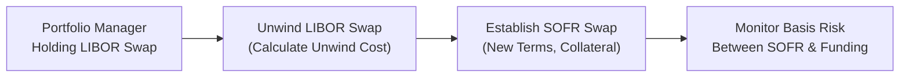

## Introduction

Imagine you’re managing a sizable fixed-income portfolio for a global investment firm. You’ve set up an interest rate hedge keyed to LIBOR, everything seemed fine... then the market announces a transition away from LIBOR toward SOFR. Suddenly, your “perfect” hedge is not so perfect, and you’re stuck with the question: “How do I handle this shift, keep my portfolio hedged, and manage new basis risks?” If you’ve ever felt a pang of confusion about these transitions—well, you’re not alone. This drill is all about facing real-world changes in benchmarks (like the LIBOR-to-SOFR transition) and making sense of the resulting interest rate volatility, swap spread fluctuations, and practical portfolio adjustments.

This section ties closely to the earlier material on interest rate volatility (see the prior discussions in Chapter 5) and builds toward an integrated understanding of how short-term rates, credit spreads, and derivatives interact in dynamic conditions. The ultimate goal is to help you (a) dissect a typical exam vignette on benchmark transitions and (b) walk away with insights on how to manage the process in actual markets.

## Understanding the Scenario: A Vignette Setup

Let’s set the stage with a slightly dramatic storyline. You’re the head portfolio manager of OceanEdge Investments, and you’re responsible for hedging the firm’s existing floating-rate liabilities. Your hedge is a payer swap that’s receiving LIBOR and paying fixed. The maturity is five years, and you entered the position when LIBOR was the principal benchmark for short-term rates.

Suddenly, you get the news that your custodian bank is moving away from LIBOR references as the official cutoff date is only a few weeks away. The bank offers new derivative instruments referencing SOFR. On top of that, short-term market volatility has been fluctuating—SOFR has shown bigger daily swings than anticipated, partly driven by repo market conditions. Meanwhile, your existing swap’s value has changed, and you can’t just let it sit there because after the LIBOR discontinuation, the swap will become less representative of your actual funding costs.

Key points you notice:  
• LIBOR-based contracts are still around, but liquidity is rapidly drying up.  
• SOFR-based swaps are increasingly liquid, but their daily volatility can be higher than old LIBOR references, especially around month-end or quarter-end.  
• You need to figure out the cost of unwinding the LIBOR swap and then establishing a new SOFR-based swap.  
• There’s a possibility of overlapping exposure during the transition period—meaning partial basis risk where part of your liabilities might still reference LIBOR while the new environment is anchored on SOFR.

Experts around your desk keep throwing around terms like “swap spread changes,” “closing out with a discount factor readjustment,” and “margin requirements are definitely going to spike under high volatility.” And your CFO is asking, “How does all this show up in our P&L?”

## Key Concepts to Recall

Benchmark shifts are more than just an academic curiosity. They connect with real-life trading mechanics and risk management. Here are a few critical ideas:

Margin Requirements  
When you enter (or exit) a swap, you typically have to post initial margin. If the reference rate changes or if volatility spikes, margin requirements may fluctuate. Under a SOFR-based regime, daily fluctuations in the repo market can affect the short-term interest rate, causing your margin calls to be more frequent or of higher magnitude.

Unwind Cost  
Terminating your existing LIBOR swap early means one of two things: you either gain or lose money based on the net present value (NPV) of the swap at that moment. If your swap is in-the-money, you might receive an unwind payment. If it’s out-of-the-money, you’ll owe. Often, partial periods—where you have only a few months left of effective LIBOR references—make the pricing more nuanced, because discount factors and forward curves might not line up neatly.

Basis Risk  
Switching from LIBOR to SOFR introduces a new basis—namely, that your floating leg might not perfectly track your actual borrowing cost or the underlying funding rate. For instance, if your liabilities are still partially priced off something that historically tracked LIBOR, a mismatch can arise when you shift to SOFR. You’ll want to evaluate whether the basis spread between LIBOR and SOFR is stable or not.

Swap Spread Adjustments  
Recall that the swap spread is the difference between the swap fixed rate and the yield on an equivalent maturity Treasury. When a new reference rate, such as SOFR, becomes the standard, the structure of swap spreads can shift due to changes in perceived credit risk, collateral requirements, and liquidity. This can lead to unexpected changes in the fairness of your swap’s fixed rate.

## Analyzing the Vignette

A typical exam question might look like this:

• You hold an existing 5-year interest rate swap, paying 2.50% fixed and receiving 3-month LIBOR. The swap has 3 years remaining.  
• The notional amount is $50 million.  
• LIBOR is being discontinued in four months, and liquidity is drying up rapidly.  
• You’re offered a new SOFR-based swap at a fixed rate of 2.35%, referencing the new 3-month SOFR average.  
• The cost to unwind your LIBOR swap is $1.0 million (the swap is out-of-the-money for you).  
• You anticipate short-term yield vol might rise around quarter-end because repo markets usually get tight, which would especially affect SOFR instruments.  
• For partial coverage, you might still face some LIBOR-based payments for the next four months before the final cutoff date.  

In that scenario, you’d be asked, for instance, to calculate the net cost—both immediate and ongoing—of shifting from LIBOR to SOFR. Perhaps you’re given discount factors or forced to compute them from spot rates. The exam might also test your understanding of how daily fluctuations in SOFR can influence your margin or your swap’s mark-to-market value.

Expect multiple item-set questions:  
1. Evaluate how the swap’s NPV changes if the newly observed forward rates for SOFR deviate from the original LIBOR-based forwards by +15 basis points.  
2. Estimate your total P&L if you decide to unwind the LIBOR swap at $1.0 million and simultaneously lock in the new SOFR swap at 2.35%. Which discount factors do you apply to partial periods (e.g., the next four months still referencing LIBOR)?  
3. Consider a scenario where the short-term repo market experiences stress, pushing 3-month SOFR up by 30 bps unexpectedly. How does this shift affect your hedge’s effectiveness?  
4. Identify best practices to minimize basis risk between your liabilities (if they still incorporate some form of LIBOR fallback) and your new hedge (SOFR-based).  

## Practical Example of Discount Factor Computation

Let’s say you have four months left, during which LIBOR is still effective, and after that, everything moves to SOFR. You’re trying to figure out the net present value of your swap to be unwound.

To discount a cash flow at time T, you’d need a discount factor d(T) based on the relevant yield curve. If r(T) is the continuously compounded yield, then:

d(T) = e^(-r(T) * T)

But you might face two different yield curves for the partial period:  
• A LIBOR curve for the first four months.  
• A SOFR-based curve for periods beyond the cutoff.

If we assume the 4-month LIBOR-based discount rate is 2.4% (annualized, continuously compounded) and the 2.5-year forward SOFR-based discount rate is 2.0%, you could approximate your discount factors like:

d(4 months) = e^(-0.024 × (4/12))  
d(2.5 years) = e^(-0.020 × 2.5)

Each future cash flow from the swap would be discounted back at the appropriate rate. The partial period LIBOR flows get discounted by the LIBOR discount factor, while the post-transition flows rely on the SOFR discount factor. Summing all these discounted cash flows yields your net present value. Then, the unwind cost or gain is basically the negative of that NPV from your vantage point (plus or minus any additional transaction fees).

## A Quick Mermaid Diagram of the Transition

Below is a flowchart illustrating how a portfolio manager transitions a LIBOR swap into a SOFR swap—pay attention to the unwind step, the new margin requirements, and monitoring basis risk afterward.

This visual might look simple, but each arrow can represent quite a bit of complexity—like computing discount factors for different periods, analyzing margin call frequency, and deciding the best moment to unwind given the swap spread environment.

## Potential Outcomes and Risks

One especially tricky element here is that if the repo market becomes stressed, SOFR can spike. This can happen due to normal quarter-end balance sheet constraints, or if there’s an abrupt liquidity shortage in the repo market. A high short-term rate can raise the floating leg of your new SOFR swap more rapidly than you’d anticipated. In some cases, the spike is temporary, but it can wreak havoc if your margin calculations reset daily—leading to significant (and inconvenient) margin calls.

Furthermore, if you unwind your LIBOR swap at a time when LIBOR is artificially inflated or deflated compared to the forward curve, you might realize a bigger loss or smaller gain than you’d like. This timing aspect can be tested in the exam by giving you different potential unwind dates, each with different forward rate assumptions.

## Best Practices and Pitfalls

• Don’t Forget Partial-Period Adjustments: In real life (and in exam questions), you might only have a few months of LIBOR left. Don’t approximate everything as if it’s all or nothing.  
• Account for Margin Requirements: A new swap might demand a higher margin deposit, especially under volatile SOFR conditions. That cost matters for your P&L.  
• Evaluate Basis Risk Thoroughly: If your liabilities shift to a fallback rate that’s not pure SOFR, you might be left with a mismatch.  
• Watch Out for Unexpected Volatility: Your stress test or scenario analysis should reflect how short-term repo rates can jump.  
• Documentation and Fallback Provisions: In reality, you might find your existing contracts have fallback references to either “SOFR plus a spread” or some alternative measure. Make sure you incorporate this into your exam-based scenario analysis if the question references a fallback protocol.

## Conclusion

This section has walked you through a typical exam-style vignette dealing with the transition from LIBOR to SOFR. The big takeaway is that interest rate benchmark transitions are not just a mechanical shift from one acronym to another—the changes can dramatically reshape your hedge’s effectiveness, cash flows, discount factors, and margin requirements. The best approach is to:

• Carefully compute partial periods for any remaining LIBOR-based flows.  
• Incorporate new credit spreads and market assumptions for SOFR.  
• Brace yourself for possible short-term yield volatility in the repo market.  
• Monitor your total portfolio basis risk and margin usage.

By dissecting this type of scenario in detail and understanding the interplay among yield curves, discount factors, and evolving benchmarks, you’ll be well-prepared for exam questions—and for real-world portfolio management challenges.

## References and Further Reading

• CFA Institute, “Transition from LIBOR to Alternative Reference Rates,” official readings and practice questions in the Level II curriculum.  
• Federal Reserve Bank of New York, “Secured Overnight Financing Rate (SOFR)” research and daily data releases.  
• Market commentary from leading investment banks, e.g., J.P. Morgan and Goldman Sachs, on transitioning from LIBOR.  
• Chapter 5.3 in this volume for a deep dive into the LIBOR/SOFR transition mechanics and market impacts.

---

## Test Your Knowledge: Interest Rate Benchmark Transition Quiz



### When transitioning from LIBOR to SOFR, which of the following is the most significant new source of risk for a portfolio manager?

- [ ] Prepayment risk
- [x] Basis risk
- [ ] Extension risk
- [ ] Default risk

> **Explanation:** Basis risk emerges due to the potential mismatch between the new SOFR references and any remaining LIBOR-based instruments. Even if the underlying exposure shifts fully to SOFR, short-term fluctuations in SOFR versus the legacy funding rate can cause basis risk.

### A portfolio manager is unwinding a LIBOR swap with six months left before the benchmark’s cutoff date. The manager is offered a new SOFR swap. Which factor should primarily drive the discount rate choice for cash flows in the next six months?

- [ ] The average of the prior six months’ LIBOR rates
- [ ] Projected LIBOR fallback rates at maturity
- [x] The LIBOR curve for the remaining life of the old contract
- [ ] The OIS rate for the entire six-month period

> **Explanation:** If the swap’s floating leg references LIBOR for the next six months, you discount cash flows at the LIBOR-based discount curve for that horizon, since that remains the relevant short-term rate.

### A manager observes a sudden spike in SOFR due to quarter-end repo market constraints. How might the margin requirements for a newly established SOFR swap be affected?

- [x] Margin requirements could increase due to higher observed volatility.
- [ ] Margin requirements would remain unchanged because quarter-end effects are temporary.
- [ ] Margin requirements would not be influenced by interest rate volatility.
- [ ] Margin requirements would drop, as liquidity is abundant at quarter-end.

> **Explanation:** An increase in short-term rates typically indicates higher volatility in the underlying market. Clearinghouses and counterparties often respond by increasing margin requirements to cover the greater risk.

### A swap spread is defined as the difference between the swap’s fixed rate and:

- [ ] The federal funds rate.
- [ ] SOFR’s trailing 7-day average.
- [x] The yield on a comparable maturity Treasury.
- [ ] The spread between two yield curves.

> **Explanation:** The classical definition of a swap spread is the difference between a standard market swap’s fixed rate and the yield on a Treasury security of the same maturity. Benchmark shifts can affect this relationship, but the fundamental definition remains tied to Treasuries.

### If a portfolio manager wants to minimize basis risk during the LIBOR-to-SOFR transition, which strategy is generally recommended?

- [x] Close out the LIBOR swap and immediately initiate a SOFR swap.
- [ ] Wait until LIBOR fully ceases publication before doing anything.
- [x] Use a transitional swap that references both LIBOR and SOFR simultaneously.
- [ ] Stop hedging altogether during the transition period.

> **Explanation:** Often the recommended approach is to close out the old LIBOR swap and initiate a new SOFR swap as soon as an attractive opportunity (with sufficient liquidity and reasonable pricing) arises. In some cases, a transitional hedging instrument might be used, but generally, you don’t sit idle until the final LIBOR publication date.

### When determining the unwind cost for an existing LIBOR swap that is out-of-the-money for you, which of the following is most likely?

- [x] You will make a payment to the counterparty equal to the NPV of the future net losses.
- [ ] You will receive a payment from the counterparty for the swap’s negative value.
- [ ] The unwind cost will be zero if you find an offsetting swap on the market.
- [ ] The cost can be deferred until the next rate reset date.

> **Explanation:** If you hold a negative-value swap (from your perspective), you pay to close it out because its fair market value is in favor of the counterparty.

### In partial-period valuation for a LIBOR-to-SOFR transition, which yield curve combination is appropriate?

- [x] Use the LIBOR curve for the portion of time where LIBOR is still effective, and then shift to the SOFR curve afterward.
- [ ] Always use the new SOFR curve for all future cash flows regardless of the partial period.
- [x] Use an average of the SOFR and LIBOR discount factors until the next reset date.
- [ ] Incorporate only the overnight fed funds rates for discounting.

> **Explanation:** During the partial period, you discount any remaining LIBOR-based cash flows with the LIBOR curve; once the swap is referencing SOFR, you shift discount factors. Some advanced strategies average or blend the curves, but a clear delineation is the standard approach.

### How could a spike in SOFR affect swap valuation if your swap receives fixed and pays floating based on SOFR?

- [x] The floating leg payments become more expensive, reducing the swap’s market value from your perspective.
- [ ] The swap’s fixed payments increase proportionally.
- [ ] The swap is unaffected because fixed and floating should offset.
- [ ] You would pay less on the floating leg, thus benefiting from the spike in rates.

> **Explanation:** Receiving fixed and paying floating typically means that when floating rates rise, you’ll owe more. Your overall swap’s value to you decreases.

### A portfolio manager faces a LIBOR swap that generates a small net profit at present. If the new SOFR swap is cheaper to enter but potentially more volatile, what is the biggest trade-off?

- [x] Potential basis risk and heightened margin calls versus short-term cost savings.
- [ ] Lower regulatory compliance risk if they remain on LIBOR.
- [ ] Guaranteed higher returns by switching to the new swap.
- [ ] Elimination of interest rate risk altogether.

> **Explanation:** While the new swap might have a lower fixed rate or cheaper initiation cost, the day-to-day volatility associated with SOFR can lead to more margin call volatility and additional basis risk. This trade-off is central to deciding whether to switch.

### True or False: The swap spread for SOFR-based swaps can remain identical to that of LIBOR-based swaps because both reflect the same counterparty credit risk.

- [x] True
- [ ] False

> **Explanation:** This is a bit of a trick question. In some contexts, people argue the difference might persist, but strictly speaking, the pure swap spread formula is related to Treasury yields, not specifically the old LIBOR credit premium. It can be the same theoretically if the overall credit, collateral, and market conditions support it. In practice, the spreads often differ due to different liquidity and credit risk perceptions.


