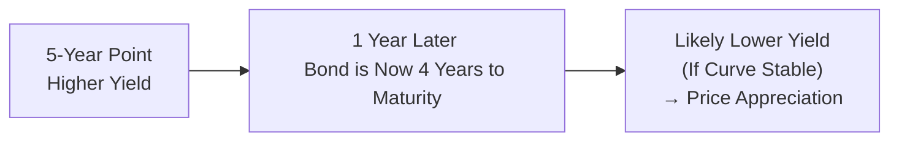

## Introduction
Sometimes in the bond universe, you hear practitioners mention this fancy idea called “rolling down the yield curve.” The name might seem a bit intimidating—like something you’d only do if you had decades of investing experience or a magician’s insight into interest rates. But in fact, it can be relatively straightforward once you break it down. The strategy is all about buying a bond on a certain part of the yield curve and then benefiting from the bond’s price increase as time passes (assuming the yield curve remains fairly stable). 

To illustrate, let’s just say you pick a bond that matures in five years, and the yield curve is upward sloping. In one year, your bond will become a four-year bond. If the yield curve and credit spreads don’t change, the four-year point on the curve might have a slightly lower yield. That decline in yield can cause your bond’s price to tick up beyond any coupon income it earned. This incremental price gain is at the heart of “rolling down the yield curve.”

Below, we’ll explore how this strategy works step by step, its key assumptions, potential pitfalls, and how to measure its expected returns. We’ll also show a short example so it’s easier to see how the math fits together. By the end, you’ll hopefully find it easier to see if, when, and how rolling down the yield curve belongs in your toolkit.

## Core Idea: Why Bond Prices May Appreciate
The concept of rolling down the yield curve typically applies when you have an upward-sloping yield curve. Now, an upward slope basically tells us that longer-term maturities have higher yields than shorter-term maturities. As a five-year bond “ages” into a four-year bond, it’s effectively “moving” to a shorter part of the yield curve, where yields might be lower.

• If the yield curve stays the same shape and level, you’d expect the yield on your bond to drift downward (i.e., from a five-year yield to a four-year yield).  
• Since bond prices move inversely to yields, a lower yield usually corresponds to a price gain.

Sure, none of us have a crystal ball that can guarantee the curve will remain stable. But when we say “rolling down the curve,” it’s short financial slang for “we’re betting that yields in one year are the same as they are today at each maturity point, so we’ll earn a price boost as the bond’s maturity shortens.”

## Calculating Expected Return
To measure how rolling down the yield curve might enhance your total return, most practitioners break down the potential return into two key components:

• Carry (the coupon income): This is essentially the income from holding the bond (the coupon rate) net of any financing or opportunity costs.  
• Roll return (price appreciation from yield drift): This is the kicker from the yield potentially declining as the maturity shortens.

### Basic Formula
We can outline the approximate expected total return over a horizon (often one year) as:


\text{Expected Return} \approx \underbrace{\text{Coupon}}_{\text{carry}} + \underbrace{\frac{P_{\text{horizon}} - P_{\text{initial}}}{P_{\text{initial}}}}_{\text{roll return}}


Here,  
• \\( P_{\text{initial}} \\) is the bond’s current price.  
• \\( P_{\text{horizon}} \\) is the bond’s price at the end of the holding period (assuming the yield curve remains the same and the bond is now one year closer to maturity).

You’ll often see a more detailed breakdown to include accrued interest or partial coupon payments in the horizon price (if it’s not the exact coupon payment date). But the basic intuition is: (1) you get your coupon; and (2) you might see a capital gain if the yield goes down from its current level at that maturity.

### Simple Example Calculation
Let’s assume you have a 5-year bond with:

• Face Value: \$1,000  
• Coupon: 4% (paid annually)  
• Current yield to maturity: 3.8%  
• Price: \$1,015 (just an example)  

If the yield curve is upward sloping and stable, in one year’s time, the bond will be a 4-year bond. Suppose the current 4-year point on the curve sits at 3.5% yield. If that 3.5% remains unchanged, your bond’s price will adjust to reflect a 4-year yield to maturity of 3.5%, which might boost the price above \$1,015. You’ll also collect your \$40 coupon (4% of \$1,000) during this period.

This “extra” price appreciation is precisely the “roll.” Over an entire portfolio, or in a more complex environment where coupons are paid semiannually and the yield curve is not perfectly smooth, you’d do a more detailed horizon pricing approach. But the main principle remains exactly the same.

## Visualizing the Roll
Using a simple diagram can clarify how a bond “travels” along the curve:

This flow basically illustrates the journey of the bond as time passes. If you’re sitting on a steep portion of the curve, the yield difference from the 5-year to the 4-year maturity might be meaningful enough to give you a solid uplift.

## Key Assumptions and Potential Pitfalls
Rolling down the yield curve might sound almost too good to be true. Naturally, it has some big assumptions baked in:

• A stable or only slightly shifting yield curve. If the entire yield curve moves up or the bond’s portion of the curve moves up in yield (perhaps because of market expectations for central bank tightening), the price gain from rolling might be offset or even fully canceled by that yield increase.  
• No change in the bond’s credit spread or perceived risk. If it’s a corporate bond and the issuer’s credit quality deteriorates, the bond’s spread might widen, hurting the price.  
• No shift in liquidity conditions. In severe market stress, you might get changes in demand for certain maturities that you can’t predict. That could distort your rolling strategy.  

### Risk Factors
1. Yield Curve Twists: Even if yields don’t move up or down uniformly, a twist (steepening in one part while flattening in another) can alter the bond’s yield differently than expected.  
2. Monetary Policy Surprises: A hawkish rate hike can push yields up across maturities, eroding your projected return.  
3. Credit Downgrades: For corporate or quasi-government bonds, even a slight hint of negative credit developments can push up yields (and knock down prices).  
4. Investor Behavior: Sometimes, as a bond ages, different classes of investors step in or step out of that maturity range, causing unexpected yield changes.

Operating a rolling strategy is typically viewed as a short- to medium-term tactic. In rapidly shifting markets, you’ll want to keep an eye on these risks with scenario analysis or stress testing.

## Scenario Analysis and Stress Testing
Scenario analysis is a popular technique to see what happens if yields shift up, down, or the curve changes shape. You can set up different “shock” scenarios, for example:

• +50 basis points parallel shift  
• –25 basis points parallel shift  
• Bull-flattening scenario (short-end yields up +20 bps, long-end yields down –10 bps)  
• Bear-steepening scenario (short-end yields up +10 bps, long-end yields up +30 bps)  

Under each scenario, recalculate the bond’s horizon price in a year. That might sound a bit tedious, but it’s essential for testing how robust your rolling strategy is when reality deviates from your base-case assumption of a stable curve. For exam purposes, you’re often asked to quickly reconsider how changes in the yield environment affect the total return. So it’s worth practicing those computations in a structured manner.

## Day Count Conventions, Forward Yields, and Maturity Drift
It’s also useful to remember the friction points—like day count conventions, forward yield estimates, and how the bond’s maturity “drifts” day by day.

• **Day Count Conventions:** Different markets use different conventions (e.g., 30/360, Actual/Actual). This affects accrued interest calculations, especially if you’re pricing a bond mid-coupon period.  
• **Forward Yield Estimates:** In practice, some models use forward rates to estimate future yields, especially if you want a more rigorous approach than simply “assuming yields remain the same.”  
• **Maturity Drift:** A bond’s maturity (and hence its yield) changes continuously, not just once a year. If you’re measuring returns on a monthly or quarterly basis, keep an eye on how each fraction of time affects price.  

In the real world, managers often integrate all these details in spreadsheet or more advanced systems. For exam item sets, you might just see a simplified version with annual or semiannual steps.

## Integrating Carry and Roll
If you hang out with fixed-income folks, you might hear them talk about “carry and roll.” This means:

1. **Carry:** The interest you earn by being in that bond. Typically, the coupon minus your financing cost (for a leveraged investor) or simply the coupon income for an unlevered portfolio.  
2. **Roll:** The price appreciation from the bond drifting to a shorter maturity and typically a lower yield.

Your total expected return is carry + roll. The nice part is that, for many bonds, you’re sort of collecting coupon plus you might get that roll. But if yields shift unexpectedly, the entire equation might turn upside down. 

In some markets—like a very flat or inverted yield curve—the concept of rolling down doesn’t really provide as much of a benefit. In a curvy, upward-sloping environment, though, the slope is your friend.

## Illustrative Example
Let’s detail a quick example of horizon pricing. Assume:

| Parameter                          | Value              |
|------------------------------------|--------------------|
| Bond Maturity (now)                | 5 years            |
| Coupon Rate (annual)               | 5%                 |
| Current Price                      | \$1,020            |
| Current Yield to Maturity (YTM)    | 4.80%              |
| Next Year's Projected 4-Year YTM   | 4.40% (stable curve)|
| Face Value                         | \$1,000            |

### Step-by-Step
1. **Current Purchase:** You buy the bond at \$1,020.  
2. **Coupon Payment:** In one year, you’re entitled to a \$50 coupon (5% on \$1,000).  
3. **New Yield for 4-Year Bond:** If the 4-year YTM remains at 4.40%, you’d calculate the new price of a 4-year 5% coupon bond discounted at 4.40%.  
4. **Horizon Price Calculation:** You find the present value of four annual \$50 payments plus the \$1,000 redemption in four years at 4.40%. Let’s do a simplified version:


\text{Horizon Price} = 50 \times \frac{1 - (1 + 0.044)^{-4}}{0.044} + 1000 \times (1 + 0.044)^{-4} 


Collect that price, say (hypothetically) \$1,030. Just for demonstration’s sake:


\text{Horizon Price} \approx \$1,030


5. **Total Return:** 
   - You got \$50 in coupon income.  
   - Bond’s price went from \$1,020 to \$1,030, so that’s a \$10 gain.  
   - Total = \$60 on an initial \$1,020 investment = slightly under 6% total return for that year.

If the yield curve had shifted or credit spreads had changed, obviously these numbers would differ. But that’s the gist of how you’d measure rolling benefits.

## Common Pitfalls
• Overlooking volatility: The yield curve rarely remains static, so be sure to do at least a basic scenario analysis.  
• Ignoring credit considerations: If it’s not a government bond, spread changes can overshadow the roll effect.  
• Overestimating horizon price: A small yield move up can offset your roll advantage entirely, especially in markets with high duration sensitivity.  

## Glossary
**Roll Down the Curve**: The price appreciation (or depreciation) a bond experiences as it “moves” to a shorter maturity along the yield curve.  
**Horizon Return**: The total estimated return from holding a bond over a specified period, accounting for coupon income and price change.  
**Carry**: Typically, the bond’s coupon income, often considered net of financing if leveraged.  
**Yield Drift**: The natural movement of a bond’s yield lower (in an upward-sloping environment) as it ages toward maturity.  
**Scenario Analysis**: Assessing possible outcomes under different assumptions about market or economic conditions.

## Exam Tips for Rolling Down the Yield Curve
• When analyzing a vignette, carefully note if the yield curve is described as upward sloping, flat, or inverted. That’s your first clue about whether rolling might help or hurt.  
• Watch for potential changes in credit spreads, especially if the security is corporate or emerging market.  
• Practice horizon pricing with small changes in yield to see the effect on total return. The exam might ask for a step-by-step calculation or an interpretation of the results.  
• Look out for trick questions about day count conventions or coupon frequency. If you’re working with non-annual coupons, ensure you adjust your annual yield or coupon calculations accordingly.  
• Time management: Don’t get bogged down in computational detail. The exam usually doesn’t require extensive multiplications if you keep track of the formula and do each step carefully.  

Below, you’ll find practice questions that could appear in a CFA-style item set. By trying these out, you’ll get a feel for how to handle rolling strategies under the stress of exam conditions.

## Test Your Knowledge: Rolling Down the Yield Curve Insights



### Regarding rolling down the yield curve, which of the following statements is most accurate?
- [ ] It only applies when the yield curve is inverted.
- [ ] It is irrelevant for an investment-grade corporate bond.
- [x] It relies on the premise that yields at shorter maturities are lower than at longer maturities.
- [ ] It eliminates reinvestment risk entirely.

> **Explanation:** Rolling down the yield curve capitalizes on the idea that when you move from a longer maturity to a shorter maturity (in an upward-sloping curve), yields decrease and prices rise.  

### A manager implements a roll-down strategy on a 10-year Treasury note. One year later, the note trades as a 9-year security. Which condition would likely produce a capital gain for investors under stable credit conditions?
- [x] The new 9-year yield is lower than the old 10-year yield.
- [ ] The coupon rate is reduced by the issuer.
- [ ] The yield curve inverts at years 8–9.
- [ ] The bond’s duration has increased dramatically.

> **Explanation:** Price appreciation occurs if the one-year shift along the curve is toward a lower yield. Changing coupon rates or inversions typically work against or invalidate the roll-down benefit.  

### Which of the following risks is most critical for an investor pursuing a roll-down strategy?
- [ ] Currency risk in foreign bond markets.
- [ ] Liquidity risk from short-dated instruments.
- [ ] Prepayment risk in high-yield corporate bonds.
- [x] A parallel upward shift in the entire yield curve.

> **Explanation:** A rise in yields across the curve can wash away the potential benefits of rolling down; the bond’s price would likely decline.  

### In calculating horizon price for a bond in a roll-down strategy, a key assumption is:
- [x] The shape of the yield curve remains constant.
- [ ] The coupon will increase over time to match inflation.
- [ ] The bond’s accrued interest is ignored until maturity.
- [ ] The issuer will refinance the bond before maturity.

> **Explanation:** Horizon pricing typically assumes that forward yields follow the current yield curve shape or remain stable. That assumption drives the “roll” effect.  

### True or False: “Carry” in a roll-down strategy refers exclusively to the price appreciation from moving to a shorter maturity.
- [ ] True
- [x] False

> **Explanation:** “Carry” usually refers to the coupon or interest income; “roll” refers to the price appreciation from yield decline as maturity shortens.  

### An investor wants to measure total expected return over one year if the yield remains constant along the curve, but her bond will mature from 6-year to 5-year. Which elements should she include?
- [ ] Only the price increase from the yield decline.
- [x] Both coupon income and change in the bond price as it becomes a 5-year note.
- [ ] Credit rating changes and LIBOR rates.
- [ ] Beta and alpha as used in equity analysis.

> **Explanation:** The standard approach includes coupon income (carry) plus the price appreciation from rolling down.  

### A bond is currently priced at \$980 with a 4% annual coupon, maturing in 3 years. After one year, interest rates remain unchanged, so it trades as a 2-year security. If its new price is \$990 and the investor received a \$40 coupon, what is the total 1-year return?
- [x] (990 – 980 + 40) / 980
- [ ] (990 – 980 – 40) / 980
- [ ] 990 / 980
- [ ] 40 / 980

> **Explanation:** Total return combines both price appreciation (990 – 980 = \$10) plus coupon (\$40), divided by the initial price (\$980).  

### In an item-set question, you are told that a bond’s price rises beyond its mere accrued coupon payment over a 12-month horizon. The likely explanation is:
- [ ] The coupon was renegotiated upward.
- [ ] The bond was called.
- [ ] The yield curve turned from flat to inverted, drastically cutting yields at long maturities.
- [x] The bond “rolled down” to a lower yield as its maturity shortened.

> **Explanation:** When the yield curve is upward sloping and stable, rolling down leads to price appreciation beyond just the coupon accrual.  

### You suspect the yield curve might shift up by 25 bps but remain upward sloping. Which is the best approach to validate the continued viability of a roll-down strategy?
- [ ] Increase leverage to offset interest rate risk.
- [x] Perform scenario analysis to see if the roll-down gains can compensate for the 25 bps rise.
- [ ] Assume you lose all coupon income.
- [ ] Switch to only zero-coupon bonds.

> **Explanation:** Scenario analysis (or stress testing) is key to determine if a moderate rate increase would wipe out the benefit or if the roll-down advantage still stands.  

### Rolling down the curve usually presupposes:
- [x] The yield curve is normal (upward sloping) and largely stable.
- [ ] The bond has a high yield due to credit default risk.
- [ ] Zero risk of an interest rate change.
- [ ] A bond with floating coupons only.

> **Explanation:** A normal and stable shape typically allows for the yield-drift-based price appreciation.  



## References and Further Reading
• Fabozzi, F. J. (ed.). “Bond Markets, Analysis and Strategies.” Pearson.  
• Tuckman, B. & Serrat, A. “Fixed Income Securities: Tools for Today’s Markets.” Wiley.  
• CFA Institute Learning Ecosystem: Topic on Yield Curve Analysis and Interest Rate Strategies.  

Rolling down the yield curve can be a valuable tool for active bond managers—when markets cooperate. Just be aware of its drawbacks and always run your scenario tests. With a solid handle on the concept and the math behind it, you can confidently address related exam questions, apply it in real-world portfolios, and impress your colleagues with your understanding of how to squeeze extra returns out of a stable yield environment. Happy studying!
