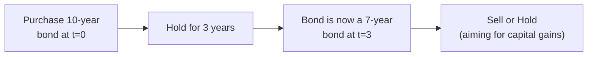

## Introduction and Core Idea

Riding the yield curve is an active strategy in which you purchase bonds with maturities longer than your intended holding period, expecting to profit from both the coupon income and potential capital gains if yields decline (or remain stable) as the bond “rolls down” to a shorter maturity. Actually, you might notice this is sometimes confused with “rolling down the curve,” which is a related concept. But “riding” typically focuses on gaining that extra price appreciation from a steeper portion of the yield curve. If everything goes according to plan, as the clock ticks forward and your bond ages, investors in the market may pay a premium for it at the new, shorter maturity—assuming the yield curve remains stable or normal in shape.

I still remember the first time I tried “riding the yield curve” for a corporate bond portfolio. We had a steep yield curve environment, and the 10-year sector was offering a decent yield advantage over the 7-year area. Our team’s hypothesis was that in three years, we’d be left with a 7-year bond that might fetch a higher price than the usual “matched maturity” approach. I’ll admit I was a little nervous: we had to hope that the yield curve wouldn’t flatten or invert in those three years. But in normal, gently downward-sloping markets, you can benefit from enhanced total returns beyond simply holding a bond that matches your horizon.

## Contrasting Riding the Yield Curve vs. Rolling Down the Curve

You might have heard “rolling down the curve” as a more standard approach—closely related, but not always identical, to riding the yield curve:

• Rolling Down the Curve: This typically means you buy a bond and let the passage of time shorten its maturity, expecting the bond’s yield to decline gradually in an upward-sloping curve. It’s a more neutral approach that doesn’t necessarily stretch beyond your target horizon.  
• Riding the Yield Curve: By contrast, this is more “aggressive.” You deliberately select bonds with longer maturities than your desired holding period. When time passes, that security’s yield (and hence price) might shift favorably because it’s now shorter on the curve. Typically, you look for the part of the curve with the steepest slope so you can grab a bigger yield differential.

Some people treat these phrases interchangeably, but it’s helpful to see the nuance: riding the yield curve usually implies intentionally positioning further out on the curve than your investment horizon would naturally suggest.

## Essential Mechanics

### The Slope’s Importance

The fundamental driver behind riding the yield curve is the slope of the yield curve. In a normal yield curve—where longer maturities yield more than shorter maturities—investors can purchase a higher-yielding longer-term bond and plan to sell it in a few years. If the curve remains steady, the yield at the bond’s new, shorter maturity will be lower, thereby increasing your bond’s market price. The steeper the curve, the bigger that “roll-down” effect might be.

### Coupon + Capital Gains

Two pieces add up to your total return:
1. Coupon Income: You still earn the bond’s coupon each period.  
2. Price Appreciation: If the yield curve doesn’t move unfavorably, you’ll see the bond’s yield gradually drop as its maturity gets closer—boosting its price.

### Example Calculation

Let’s walk through a simplified scenario. Suppose you have a three-year investment horizon and you’re considering the following two strategies:

• Strategy A: Buy a 3-year bond at par, yielding 3%.  
• Strategy B: Buy a 10-year bond at par, yielding 4%.

Imagine that after exactly three years, the yield curve has remained the same. Your 10-year bond is now a 7-year bond (cumulatively, you’ve moved forward three years on the timeline). A new 7-year bond yields, say, 3.5% in this stable scenario (sticking with our hypothetical slope). Because your bond’s coupon (4.0%) is higher than the new market yield (3.5%) for a 7-year security, you gain from price appreciation on top of having already collected a coupon that was 1% higher annually than Strategy A.

In practice, you might do a present value calculation to see how that final bond price compares to par. The difference, plus your higher coupons, yields a bigger total return if the yield curve truly remains stable. But we all know: that’s a big “if.”

A quick formula to get a rough sense of price changes (ignoring convexity) might be something like:

(1)  
V₁ = V₀ × [1 – (Duration × Δy)]

Where:  
• V₀ is the initial bond value.  
• V₁ is the approximate new value after a yield change.  
• Duration is the approximate effective duration of the bond.  
• Δy is the change in yield.  

If instead of a positive Δy, we see a negative or zero change, you get a capital gain or no capital loss, respectively.

## Risks and Challenges

### Yield Curve Shifts

If the yield curve shifts upward (or flattens significantly) during the holding period, you might underperform a more conservative matched-horizon strategy. In fact, the steeper the initial curve, the bigger your potential gain—but also the bigger your potential risk if rates don’t behave as you expect.

### Liquidity Considerations

Sometimes shorter maturities trade in more liquid markets. By venturing further out on the curve, you might encounter less liquid securities. That means higher transaction costs if you need to sell your bonds earlier than planned. It’s a real possibility that can shave off some of your expected extra returns.

### Misjudging Forward Rates

Forward rates, which reflect the market’s expectation of future yields, are a critical reference point. If your plan relies on yields dropping more than the implied forward rates suggest, but the market disagrees, you might fail to capture the predicted gains.

### Credit Risk Over Horizon

If you choose corporate or other riskier bonds to enhance your yield pickup, be mindful of credit risk and possible spread widening over time—especially during uncertain markets. The far end of the curve can be more exposed to changes in credit environment.

## Using Forward Rates to Identify Opportunities

In practice, managers often compare actual yields with the implied forward rates derived from shorter maturities. If the actual yield is significantly higher than what forward markets are predicting—even after adjusting for credit risk—this might indicate an attractive opportunity to “ride” that part of the curve. But it can be tricky: the forward yield curve is often an unbiased reflection of where the market believes interest rates will be. Be sure you have a coherent outlook on monetary policy, inflation, and economic growth before betting against the consensus.

## Diagram: Riding the Curve Over Time

Below is a simple Mermaid diagram showing the conceptual timeline of riding a 10-year bond down to 7-year maturity over three years:

## The Yield Pickup vs. Volatility Trade-Off

You might be tempted to always aim for the steepest segment of the yield curve to maximize return. But let’s be honest: the steeper the yield curve, the more uncertain the markets might be about future interest rates. That means volatility can be substantial. You want to weigh:

• Potential yield pickup against possible price swings.  
• Your tolerance for underperformance if yields rise instead of falling or staying put.  

One approach is to do a thorough scenario analysis, stress-testing your returns under a few yield curve shapes—steeper, flatter, slight shift upward, slight shift downward, etc.

## Building Riding Trades in a Larger Portfolio

### Risk Budgeting

Any yield curve play should fit within a broader risk budget. If you’re leveraging up your portfolio to buy these longer-dated bonds, be sure to measure the marginal risk. How does it correlate with other strategies and asset classes in your portfolio?

### Diversification and Hedging

Typically, you wouldn’t bet the whole farm on one section of the yield curve. You might blend a riding strategy in the belly of the curve (around 5–10 years) with shorter or longer exposures, or even overlay derivatives positions (like interest rate swaps) to fine-tune your maturity risk.

### Active Monitoring

Because riding the yield curve is predicated on an assumption about future rate movement (or stability), you must constantly monitor macro indicators (inflation, GDP growth, central bank announcements) and yield curve signals. The earlier you detect a yield curve flattening or other shift, the quicker you can adjust your strategy to minimize losses.

## Practical Example: Hypothetical Cash Flows and Price Appreciation

Let’s illustrate with rough numbers:

• You purchase a 10-year, 4% coupon bond at par (i.e., price = 100).  
• Your holding period is 3 years.  
• You project that in 3 years, new 7-year bonds with similar credit quality will yield 3.5%.  

Ignoring any interim changes, the final bond price might be computed using standard bond pricing once it becomes a 7-year bond with a 4% coupon.

Using a present value formula:

(2)  
Price in 3 years (P₃) = (C / y₇) × (1 – 1/(1 + y₇)⁷) + 100/(1 + y₇)⁷

Where:  
• C = 4 (annual coupon)  
• y₇ = 3.5% = 0.035  

If you run the math, you’ll get a price above 100 (because the bond’s coupon is above the market yield). That difference from par is your capital gain, plus you’ve made 4% per year in coupon. The total return can outpace a simpler strategy that invests in a 3-year 3% bond at par.

This, of course, relies on yields staying near 3.5%. If yields spike to 5% for 7-year maturities, you’ll deal with a capital loss.

## Best Practices and Common Pitfalls

### Best Practices

• Stress Test All Curve Scenarios: Normal, flat, inverted.  
• Incorporate Forward Rates: Don’t rely on guesswork.  
• Use Duration and Convexity: Refine your price sensitivity estimates.  
• Diversify: Don’t concentrate all capital in one maturity bucket.

### Common Pitfalls

• Overlooking Liquidity: If your chosen maturity segment becomes illiquid, you might get stuck or incur high transaction costs.  
• Neglecting Macroeconomic Triggers: Faster-than-expected rate hikes, inflation surprises, or major policy changes can nullify your strategy.  
• Ignoring Convexity: For larger yield moves, approximate linear duration-based estimates can mislead you.

## Practice with Different Yield Curve Shapes

In exam-like vignettes, you might see a table of yields for different maturities under various scenarios (e.g., normal, inverted, humped). You’ll often be asked to decide whether riding the curve is beneficial or not. The question might be: “Given the data in Exhibit 1, does it pay to purchase the 10-year bond and sell it in 3 years, or is the 3-year bond a better choice?” Typically, you’d:

1. Estimate the total return of the 10-year bond (coupon + approximate capital gain/loss).  
2. Compare it with holding a 3-year bond to maturity.  
3. Evaluate the potential risk of yield curve shifts.

When the slope is steep and stable, “riding” often wins. If the curve flattens or inverts, it can be painful.

## References and Further Reading

• CFA Institute Level II Curriculum, especially the sections covering yield curve strategies and fixed income valuation concepts.  
• The Journal of Fixed Income for real-world case studies on yield curve trading.  
• Bloomberg Terminal resources (Yield Curves function) to analyze on-the-run vs. off-the-run bonds and to compute forward implied rates.  
• Chapters 3 and 4 of this Volume for yield calculations, bond pricing, and forward rate derivations.

----------------------------------

## Test Your Knowledge: Riding the Yield Curve Strategy Quiz



### Riding Strategy Fundamentals
- [x] It involves buying bonds with maturities longer than the anticipated holding period to capture both coupon income and potential price appreciation.
- [ ] It involves matching bond maturities exactly with the investment horizon to minimize reinvestment risk.
- [ ] It always eliminates yield curve risk by focusing on short-term bonds.
- [ ] It is a completely risk-free strategy once the coupon income is locked in.

> **Explanation:** Riding the yield curve hinges on a longer maturity bond rolling down to a shorter maturity over time, aiming for higher returns. Matching maturities is a different strategy, focusing on minimal mismatch risk.

### Specific Difference from Rolling Down the Curve
- [x] Riding is more aggressive, intentionally extending beyond the typical horizon to seek capital gains.
- [ ] Rolling down the curve is more aggressive, intentionally extending beyond the typical horizon.
- [ ] Rolling down the curve and riding the curve both always refer to the exact same concept.
- [ ] Riding the yield curve is equally conservative as matching maturities.

> **Explanation:** Rolling down the curve is a concept that often gets lumped together with riding; but riding is generally the more aggressive approach, deliberately picking bonds with maturities beyond your planned holding period.

### Key Risk in Riding the Yield Curve
- [ ] The investor faces almost no risk since coupon payments are guaranteed on most bonds.
- [x] The yield curve may flatten or shift upward, reducing anticipated capital gains.
- [ ] If the yield curve remains normal, the investor will incur losses due to the time decay.
- [ ] Changes in coupon rates on existing bonds always favor the investor.

> **Explanation:** Major yield curve shifts—particularly flattening or a parallel shift upwards—can undermine the strategy’s fundamental premise of capturing price appreciation.

### Curve Slope Relevance
- [x] The steeper the curve, generally the larger the potential returns and the greater the risk.
- [ ] The flatter the curve, the more beneficial riding becomes.
- [ ] An inverted curve is usually the ideal scenario for riding the yield curve.
- [ ] Slope is irrelevant if the investor holds the bond to maturity.

> **Explanation:** A steep curve heightens the reward for riding. But obviously, higher slope can come with higher volatility and higher risk of missing the expected capital gains.

### Example Bond Choice
- [x] Buying a 10-year bond while holding for 3 years to benefit from roll-down effects.
- [ ] Buying a 2-year bond for a 2-year horizon to closely match maturities.
- [x] Buying a 15-year bond holding for 5 years, expecting yields to remain stable.
- [ ] Purchasing only short-term treasury bills and rolling them over monthly.

> **Explanation:** Riding the yield curve typically means intentionally selecting a bond with a maturity significantly longer than the actual holding period—like 10 years for 3-year horizon or 15 years for 5-year horizon.

### Forward Rates
- [x] Serve as a market-based forecast that helps compare actual yields to implied future yields.
- [ ] Exactly predict future rates with no error.
- [ ] Have no relevance to yield curve strategies.
- [ ] Are rarely used by bond portfolio managers.

> **Explanation:** Forward rates are crucial for analyzing how much of a yield advantage the bond truly offers over implied expectations.

### Liquidity Considerations
- [x] Longer-dated bonds can sometimes be less liquid than short-term instruments.
- [ ] Liquidity risk is the same across all maturities.
- [x] Smaller liquidity can lead to higher transaction costs or difficulty selling the bond quickly.
- [ ] Liquidity never matters if yields go down.

> **Explanation:** One must carefully consider the possibility of limited liquidity in certain yield curve segments. This can cut into profits and increase execution risk.

### Common Pitfall
- [x] Overlooking credit spread changes in a corporate bond while focusing on the yield curve slope.
- [ ] Over-hedging interest rate risk with derivatives for a time horizon shorter than the bond’s maturity.
- [ ] Buying only Treasury bills at par.
- [ ] Accurately budgeting risk across multiple curve strategies.

> **Explanation:** In pursuing a yield-curve strategy on corporate bonds, ignoring changes in credit spreads can be a big oversight. Spread movements can offset or exceed the benefits from riding the curve.

### Scenario Questions
- [x] In a steep yield curve environment, riding the curve often yields higher returns if rates remain stable.
- [ ] In a flat environment, riding the curve is typically the ideal way to lock in gains.
- [ ] An inverted yield curve guarantees capital gains for riding strategies.
- [ ] Riding is always more profitable than rolling down the curve, regardless of the environment.

> **Explanation:** Riding strategy is most clearly beneficial in a steep curve scenario where yields can “roll down” to where shorter maturities have lower yields, boosting bond prices.

### True or False: Using riding strategies always results in capital gains if yields do not move.
- [x] True
- [ ] False

> **Explanation:** If the yield curve stays precisely as it was, a bond bought at a higher yield for a longer maturity will roll down to a lower-yield point—creating a price appreciation, so long as no major shifts occur.


