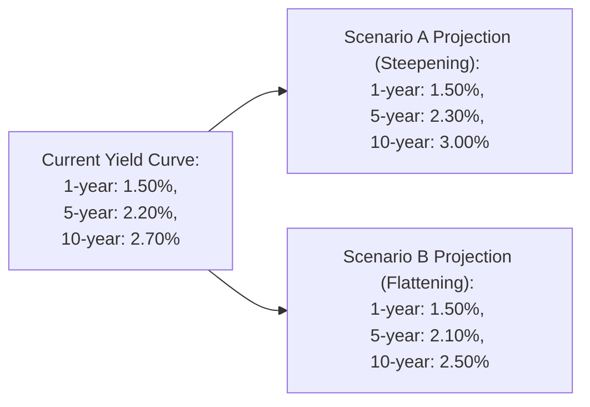

## Introduction and Context

Sometimes, when I was first studying these yield curve strategies, I found myself pulling out my hair—metaphorically, of course—wondering what exactly “rolling down the curve” or “riding the yield curve” even meant in practice. There’s just so much jargon. But once I got comfortable, I realized these strategies revolve around anticipating how the term structure of interest rates might evolve. Once you have a calm framework for that, it becomes easier to decide whether you should shift your portfolio’s duration or use derivatives to benefit from your forecast.

In this vignette, we walk through a scenario-based approach—exactly the kind of method you’ll see in a Level II item set—to illustrate how to select and evaluate appropriate yield curve trades. Each scenario will feature different macroeconomic signals and central bank guidance. We’ll embed guidance on analyzing the yield curve, calculating expected returns, and factoring in constraints. You’ll also see how knowledge from previous chapters (especially on the term structure, interest rate volatility, and bond mathematics) ties in.

Understanding yield curve trades matters because active bond portfolio managers often try to seize opportunities as interest rates shift. Whether you’re dealing with a flattening, steepening, or parallel shift, the fundamental question is the same: How do I position my portfolio to take advantage of changing interest rates or, at the very least, protect myself from them?

## Setting the Stage: A Vignette Scenario

Imagine you’re an analyst at a mid-sized asset manager. Your team has gleaned insights from central bank announcements suggesting a high probability of rate changes in the coming months. The head of Fixed Income gives you two sets of potential yield curve forecasts:

• Scenario A: The yield curve is expected to steepen because of inflation concerns. Short-term rates may remain anchored, but longer-term yields might rise significantly.  
• Scenario B: The economy shows signs of cooling, prompting a flattening curve. While the central bank might keep policy rates steady, the longer end could fall due to weaker growth forecasts.

Your supervisor wants to see a summary of strategies for each scenario, including approximate expected returns after transaction costs and how these fit with the fund's duration constraint (e.g., no more than ±1.5 years from the benchmark). The portfolio invests primarily in government bonds but can use futures or interest rate swaps to adjust exposure. You’re also free to utilize callable or putable bonds if it aligns with the forecast and the risk profile.

In the exam context, you’d typically see a structured data table in the item set with key yield levels, perhaps some economic commentary, references to credit spreads (from Chapter 5 or 22), and the question, “Which strategy is most appropriate under these forecasts?” Let’s walk through the process of answering that.

## The Yield Curve Forecasts in Detail

Below is a simplified representation of the two yield curve forecasts (Conceptual Diagram Only):

• Current 1-year yield at 1.50%, 5-year at 2.20%, and 10-year at 2.70%.  
• Under Scenario A, short rates remain roughly unchanged while the 10-year strongly increases to 3.00%.  
• Under Scenario B, likely the 5-year edges down to 2.10%, and the 10-year moves down to 2.50%, flattening the slope.

These are hypothetical. In an exam setting, you might see more precise data, like 1-year yield at 1.47%, 5-year at 2.16%, etc. However, the logic is the same.

## Potential Strategies

### Rolling Down the Curve
Rolling down the yield curve (sometimes known as a roll-down or a roll-down return) capitalizes on the idea that, as time passes, a bond “rolls” to a shorter maturity segment with typically lower yields—especially if the yield curve is upward sloping. If rates do not change, the bond’s price may increase because its yield is converging toward a typically lower yield for that new, shorter maturity.

• Best used in normal or gently upward-sloping curves.  
• Gains come from carry (coupon) plus the bond’s price drifting up the curve as it becomes a shorter tenor instrument.  
• If you expect the yield curve to remain stable or shift gradually, rolling can be a nice steady approach.

### Riding the Yield Curve
Similar to rolling, riding the curve also relies on an upward sloping yield curve to generate capital appreciation. You select bonds with maturities in the “belly” of the curve (often intermediate maturities) if you think those yields will decline over the holding period or if the bond will appreciate as it “rides down” to a shorter maturity.

• Can generate higher total returns if the yield curve remains unchanged or if it shifts in your favor.  
• Risky if interest rates in the targeted segment rise unexpectedly.

### Adjusting Portfolio Duration
You can shift overall portfolio duration up or down to reflect an expectation of rising or falling rates. This involves either:

• Extending duration (buying longer-maturity bonds, selling shorter-dated) if you expect rates to drop, leading to larger price gains on longer maturities.  
• Shortening duration (buying short, selling long) if you expect a rate increase and want to reduce price risk.

Duration targeting is also governed by portfolio constraints (like your policy not to deviate from the benchmark by more than ±1.5 years) and risk appetite.

### Using Derivatives
Swaps, futures, and options can provide a cost-effective way to tweak your portfolio’s exposure without transacting large amounts of physical bonds:

• Interest rate swaps let you quickly change duration: receiving fixed if you expect rates to fall, paying fixed if you expect rates to rise.  
• Futures on Treasury bonds or notes can quickly lengthen or shorten your position.  
• Options (caps, floors, swaptions) might help you profit from rising volatility or protect from large unfavorable rate moves.

### Incorporating Embedded Options
Chapter 10 and Chapter 11 introduced embedded options, which respond to volatility shifts. In a steepening environment, callable bond prices might suffer if rising yields reduce the likelihood of the bond being called. Conversely, putable bonds can retain value better in rising-rate scenarios. So if you anticipate a big jump in rates at the long end, a putable structure might be a defensive play. If you see stable or falling rates, a callable bond might offer extra yield if you’re comfortable with the call risk.

## Scenario A: Steepening Yield Curve

### The Forecast
• Reason: Rising inflation expectations, higher commodity prices, hawkish central bank rhetoric—but short rates anchored near policy rate targets.  
• Expected yield changes: 10-year yield moves significantly higher from 2.70% to 3.00%, while the 1-year stays around 1.50%.

### Strategy Considerations
1. **Shorter-Duration Tilt:** Because the long end is rising, you’d probably want to reduce exposure to longer maturities to avoid a price hit.  
2. **Riding the Curve?** In a steepening environment, riding the curve might not be attractive if you’re focused on the long end that’s climbing. However, if the short-to-intermediate range remains stable, you can ride in that segment.  
3. **Swap Overlay:** Potentially pay fixed in an interest rate swap at the current mid-curve rate, aiming to benefit if yields on that portion of the curve rise. Or if you hold long exposure, you might want to hedge it by paying fixed.  

### Calculating Expected Return
Let’s do a simplified version:

Say you currently hold a 10-year bond at par (100) with a 2.70% coupon. If the 10-year yield rises to 3.00% in six months, that bond’s price might drop. Approximate the price change using modified duration:

• (Modified) Duration ~ 8.5.  
• Yield change = +30 bps = 0.30%.  
• Price change ≈ –(Duration × ΔYield) = –8.5 × 0.0030 = –0.0255 (–2.55%).

Over half a year, add your coupon income (~1.35% for half year, ignoring day-count details). Net might be about –1.20%. Summarily, it’s not great if you hold that 10-year bond. That suggests you might shorten your portfolio or shift to 1-to-5-year bonds, which might see less price depreciation.

Also factor in transaction costs. If you swap out of the 10-year into a series of 2-year or 3-year notes plus maybe a few 5-year bonds for carry, you might end up with total returns slightly above break-even if short or intermediate yields remain stable. 

## Scenario B: Flattening Yield Curve

### The Forecast
• Reason: Growth is slowing, but the central bank is not drastically cutting rates yet. As a result, the short end doesn’t move much, while the long end dips from 2.70% to around 2.50%.  
• Shape: Yield curve flattens.

### Strategy Considerations
1. **Longer-Duration Tilt:** If rates at the long end are falling, you could benefit from longer exposure.  
2. **Rolling Down the Curve:** The belly of the curve (5-year area) may also see yield declines. By holding a 5-year note, you might catch a double benefit of price appreciation plus the coupon.  
3. **Use of Callables or Putables:** If you expect heightened uncertainty, a putable bond might not add much once yields are trending down (they’re more protective if yields go up), but a callable bond might gain slightly if rates drop, especially if the call option becomes more valuable to the issuer. That said, if you think rates will continue to fall, you might risk early calls.

### Calculating Expected Return
Assume you hold a 10-year bond at par with a coupon of 2.70% again. If in six months the 10-year yield declines from 2.70% to 2.50%:

• Duration ~ 8.5.  
• Yield change = –20 bps = –0.20%.  
• Price change ≈ +8.5 × 0.0020 = +1.70%.  
• Add half-year coupon ~1.35%.  
• Net total return ~ +3.05%.

Hence, going long in the 10-year segment stands to benefit if your flattening scenario materializes.  

## Considering Portfolio Constraints

In a professional environment, you don’t just implement any strategy you like. You have constraints:

• Duration Deviation: If the policy only allows ±1.5 years difference from the benchmark, you can’t fully eliminate or drastically extend your duration.  
• Liquidity: If you expect redemptions, you might favor more liquid on-the-run Treasuries or a simple futures overlay.  
• Sector Constraints: Some managers must keep certain percentages of corporate vs. government bonds. If you’re forced to hold corporates, you might place an overlay with interest rate swaps or Treasury futures to neutralize interest rate risk while still collecting credit spread.  

Always read the question carefully to see if the item set includes constraints like “the pension fund must maintain an average credit rating of A,” or “the portfolio must not exceed a maximum dollar duration,” etc. Your recommended trade can be quickly undone if it violates a critical constraint.

## Integrated Vignette Example

Let’s illustrate how an exam vignette might look (in simplified form). You get a block of text describing a global macro environment:

• “The central bank has signaled no imminent policy rate hikes. However, inflation prints have exceeded 3% year over year, spooking the bond market. An anticipated steepening of the longer end is projected over the next quarter. The fund’s current duration is 7.0 years, which is at the top of the stated limit of 7.5 years. The manager is considering adjusting the portfolio by layering on swap positions or rebalancing the physical bond portfolio…”

They might provide a table:

| Maturity       | Current Yield | Forecasted Yield |
|----------------|--------------:|-----------------:|
| 1-year         | 1.50%        | 1.50%            |
| 3-year         | 2.00%        | 2.10%            |
| 5-year         | 2.20%        | 2.35%            |
| 10-year        | 2.70%        | 3.05%            |

And next you read questions like:

• “Based on the yield curve projections, which of the following trade recommendations is most appropriate, given the fund’s constraint of ±0.50 year duration from the stated benchmark?”  
• “Calculate the expected total return from adopting your recommended position, assuming a 3-month horizon, ignoring reinvestment income.”  
• “Explain why the suggested trade is consistent with the manager’s macroeconomic forecast.”

Your approach involves:  
1. Identifying each forecast shift (steepening).  
2. Considering that your portfolio is at 7.0 years duration, with a limit of 7.5. You might reduce exposure to the 10-year (duration ~ 9) and allocate more to the 3-year or 5-year segment, or use a pay-fixed interest rate swap for partial hedging.  
3. The item set might ask for supporting calculations. A partial answer could highlight the approximate price change of a 10-year bond with a certain duration if yields rise x basis points.  

## Explaining the Rationale: The “Why”

On the exam, you don’t just provide the final trade. You must articulate why it applies to the scenario, bridging:

• The macro forecast (steepening or flattening)  
• The bond math (duration-based price changes)  
• The portfolio constraints (liquidity, duration limits, risk tolerance)

Examiners love when you show that you’ve integrated the data from the item set. For instance: “Given the forecast of a 30-bp increase in the 10-year yield and the current portfolio being near the maximum duration limit, the recommended strategy is to shift from the 10-year bucket to the 3-year bucket to avoid capital losses while maintaining enough coupon income. Alternatively, using a pay-fixed swap position achieves a similar rate hedge but with fewer transaction costs.”

## Advanced Considerations

### Changes in Volatility
From Chapter 5, interest rate volatility matters a lot if you hold embedded-option bonds or if you’re using swaptions. A steepening curve might come with heightened volatility. This raises the cost (or value) of options. If you think volatility will rise, shorting volatility through selling calls might help, but it’s super risky. Usually, you’d want to buy options if you expect a big move (though that can be expensive).

### OAS Analysis
If you hold callable or putable bonds, remember from Chapter 11 that the option-adjusted spread (OAS) helps isolate the bond’s spread relative to the “option-free” yield curve. If your model says OAS is high relative to comparable bonds, it suggests undervaluation—could be a buy opportunity. Evaluate how changes in interest rate volatility shift the embedded option’s value. For a steepening scenario, the probability of the bond getting called might drop if rates rise, so the call option is less valuable, effectively raising the bond’s OAS.

### Scenario Probability Weighting
In real money management, we rarely have one definitive scenario but multiple, each with a probability weighting. You might see 50% chance of steepening, 30% chance of parallel shift, 20% chance of flattening. The expected outcome is a probability-weighted average of each. On an exam item set, they might keep it simpler, but be prepared to see a question that asks, “If scenario A is 60% likely and scenario B is 40% likely, which trade yields the highest expected outcome net of costs?”

## Personal Anecdote: The Head-Fake Forecast

Once, I eagerly shortened duration when I was certain the Federal Reserve would hike rates aggressively. They didn’t, the curve ended up flattening more from the long end dropping, and we missed out on a nice capital gain. That’s a classic cautionary tale about overconfidence in a single scenario. This underscores the need for scenario-based analysis: always keep your eyes open for alternative outcomes.

## Putting It All Together — Key Takeaways

• Know the shape and direction of yield curve movements.  
• Factor in carry, roll-down (or riding) benefits, price appreciation or depreciation, plus transaction and hedging costs.  
• Align trades with risk constraints, including duration, liquidity, and any credit or sector limits.  
• Articulate the “why” behind your decision. On exam day, that’s how you secure points—by tying your choice to the scenario’s data.  
• Consider advanced dimensions: volatility changes, embedded options, OAS. These might appear in advanced vignettes.  

## References and Further Reading

• Official CFA Institute Mock Exams: Look for yield curve item sets that test scenario-based strategies.  
• Federal Reserve Board (or other central banks) research on yield curve dynamics, inflation, and early indicators.  
• Chapter 4 (Term Structure of Interest Rates) for an in-depth of spot rates, forward rates, and bootstrapping.  
• Chapter 5 (Interest Rate Volatility) for how changes in volatility might affect your bond strategies.  
• Investment bank research notes (JPMorgan, Goldman Sachs, etc.) for real-world interest rate outlooks.

Remember, yield curve analysis is about connecting the dots. You’re basically taking central bank forecasts, macro conditions, your portfolio’s constraints, and your own analysis of bond math. Put them all together thoughtfully, and you’ll have a strategy that can stand on its own—even if the markets don’t always cooperate.

---

## Test Your Knowledge: Yield Curve Trading Scenarios Quiz



### In a scenario where the yield curve is expected to steepen due to inflation fears primarily impacting long-term rates, which of the following strategies is typically most appropriate?

- [x] Reduce long-duration exposure and potentially pay fixed in swaps.  
- [ ] Extend duration by purchasing longer-term government bonds.  
- [ ] Shift from short-term T-bills into high-yield corporate bonds.  
- [ ] Convert portions of the portfolio into floating-rate notes.  

> **Explanation:** In a steepening environment (long-end rates rising), a natural defensive move is to reduce long-duration exposure or hedge by paying fixed in an interest rate swap. Extending duration would increase interest-rate sensitivity and likely lead to capital losses.

### Suppose you anticipate a flattening of the yield curve driven by lower long-term yields. Which action would likely maximize capital gains?

- [x] Shifting the portfolio toward longer maturities.  
- [ ] Maintaining a neutral duration.  
- [ ] Buying only short-term notes.  
- [ ] Selling bonds entirely and holding cash.  

> **Explanation:** Flattening driven by falling long-term yields suggests that longer maturities will enjoy price appreciation. Therefore, to capture these gains, increasing duration is often beneficial.

### When calculating the expected total return of a rolling-down-the-curve strategy, which of the following components are typically included?

- [x] Coupon income plus price change from yield curve “roll,” adjusted for transaction costs.  
- [ ] Only the capital gains from riding the yield curve, ignoring coupon.  
- [ ] Price change from a parallel shift with zero coupon income.  
- [ ] Inflation breakeven values only.  

> **Explanation:** A roll-down (or riding) strategy’s return primarily comprises coupon income plus any price appreciation resulting from the bond’s yield converging to a lower yield as it “rolls” to shorter maturities, minus transaction costs.

### Which of the following constraints is least likely to affect an active yield curve trading decision?

- [ ] Maximum duration deviation from benchmark.  
- [ ] Minimum liquidity requirements.  
- [x] The portfolio manager’s personal vacation schedule.  
- [ ] Regulatory capital requirements for certain bond holdings.  

> **Explanation:** Duration limits, liquidity constraints, and regulatory requirements are common institutional constraints. A manager’s vacation schedule is not typically a formal constraint on a portfolio’s structure.

### In a steepening yield curve scenario, which bond structure might see its embedded option become less valuable?

- [ ] A putable bond, as investors can sell the bond back at par.  
- [ ] A zero-coupon bond, which has no coupon.  
- [x] A callable bond, because higher rates reduce the chance the issuer will call.  
- [ ] A floating-rate note linked to short-term LIBOR.  

> **Explanation:** Higher yields in the longer segment make call options less likely to be exercised, reducing the value of the call. Consequently, the callable bond's embedded call option is less valuable.

### If you expect volatility to spike while the curve remains stable, which derivative strategy can best protect your portfolio’s total value?

- [x] Buying options (e.g., swaptions) to gain from increased volatility.  
- [ ] Selling bond futures at the short end of the curve.  
- [ ] Entering a receive-fixed interest rate swap.  
- [ ] Selling options on yields.  

> **Explanation:** If volatility is expected to rise, long option positions can benefit from increases in option premiums. Selling options would generally not be protective in a high-vol environment.

### How might you hedge a primarily long-duration portfolio in an environment of rising yields without selling your underlying bonds?

- [x] Use pay-fixed interest rate swaps to offset the duration.  
- [ ] Buy another set of longer-duration bonds.  
- [x] Go long on Treasury futures.  
- [ ] Remove all exposure to the fixed income market.  

> **Explanation:** Paying fixed in an interest rate swap is a standard way to reduce duration. (Watch out: Going long on Treasury futures actually increases duration, so that’s not a hedge if yields are rising.)

### Which best describes a “roll-down” strategy on an upward sloping yield curve?

- [x] Holding bonds so that as time passes, the yield they face declines, boosting price.  
- [ ] Purchasing a putable bond at a premium.  
- [ ] Hedging rate risk with short futures positions.  
- [ ] Completely shifting from corporate bonds to Treasuries.  

> **Explanation:** Roll-down strategies rely on the passage of time that moves bonds along the curve into a lower-yield (and higher-priced) space, assuming the curve shape doesn’t change dramatically.

### In scenario analysis with multiple yield curve forecasts, how are expected returns typically modeled?

- [x] By assigning probabilities to each scenario and calculating a probability-weighted average return.  
- [ ] By taking the single highest-return scenario and ignoring the others.  
- [ ] By applying only the option-adjusted spread (OAS) approach regardless of scenario.  
- [ ] By focusing solely on realized yield without considering price changes.  

> **Explanation:** Scenario-based analysis typically involves creating a probability distribution of several possible yield curve outcomes, then combining those outcomes’ returns on a weighted basis.

### True or False: In the CFA Level II exam’s vignette format, you’re often required to integrate multiple pieces of historically unrelated data (e.g., credit spreads, interest rate forecasts, and macroeconomic outlook) to arrive at the correct answer.

- [x] True  
- [ ] False  

> **Explanation:** Item sets in the Level II exam commonly mix different data points in one scenario. Candidates must piece them together to form a coherent analysis and recommendation.


