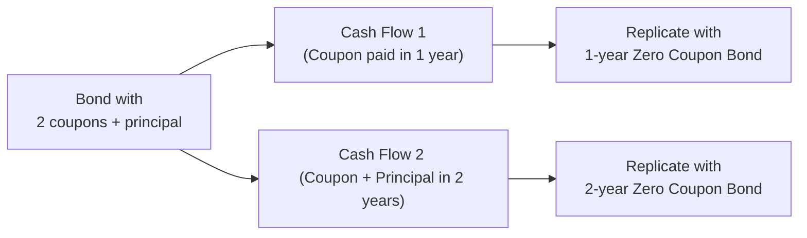

## Overview

I remember the first time I came across the Law of One Price. It seemed so obvious at first: if two products are exactly the same, you’d naturally expect them to cost the same amount. But then I thought, “Wait, how do we actually prove this in the complex world of finance where prices can move every second?” And that’s where the concept of no-arbitrage valuation shines. It’s the backbone of modern fixed-income pricing and basically says: if two securities promise identical future cash flows, they must have the same price in an efficient market—otherwise, shrewd market participants will trade away any discrepancies.

In this section, we’ll dive into the Law of One Price, show you how it leads to no-arbitrage valuation, and discuss its practical applications in bond pricing, forward contracts, futures, and swaps. We’ll also get our hands dirty with the idea of constructing “replication portfolios,” talk about how transaction costs might spoil the party, and look at how all this ties into the broader framework of arbitrage-free valuation in fixed income markets.

## Foundational Concepts

### Law of One Price

At its core, the Law of One Price states that two sets of future cash flows that are identical (both in timing and amount) must trade at the same price in an efficient market. If for some reason they don’t, an arbitrage opportunity opens up. Arbitrage is a fancy term for a riskless profit—profiting without any net investment or risk.

Let’s use a simplified anecdote. Imagine you have two vending machines side by side selling the exact same can of soda. One machine charges $1.00, and the other charges $0.80. Assuming there are no big lineups, you’d obviously go for the cheaper one. Now, if you’re an entrepreneur-coffee-break type who decided to exploit this difference, you’d buy sodas at $0.80 and sell them (maybe you create a small kiosk) for $0.99 to folks who see a bargain. You pocket the difference—risk-free. So, well, that’s arbitrage.

### No-Arbitrage Condition

No-arbitrage condition is basically the grown-up version of this soda idea applied to financial markets. It means the market is priced in such a way that you cannot make a riskless profit from price discrepancies. When you scale this concept up to bonds, derivatives, currencies, and other financial instruments, you get:

• If two bonds promise the same coupon payments on the same dates and have the same default risk, they must trade for the same price.  
• If a security can be replicated exactly by a combination of other financial instruments, its price has to match the cost of that replicating portfolio.  

You might be thinking, “Sounds straightforward. Why do we need a whole theory on it?” Because in reality, thousands of securities trade simultaneously, interest rates vary with maturity, credit risk differs among issuers, and transaction costs can get messy. But at the conceptual level, the no-arbitrage principle remains the key to fair pricing.

## No-Arbitrage in Practice

### Identical Bonds at Different Prices

A classic example is the scenario where two nearly identical bonds momentarily quote at different prices. If you can buy the cheaper bond and short-sell (i.e., borrow and immediately sell) the more expensive bond, you lock in an immediate profit when you later unwind the position. You might say, “But what if the short-selling step is complicated?” Indeed, short-selling constraints, margin requirements, and transaction costs all come into play. Still, the very existence of these trades in large, liquid markets ensures bond prices remain tightly linked to their fundamental values.

### Synthetic Replication with Zero-Coupon Bonds

Another powerful application is in building a synthetic bond from zero-coupon bonds. A few experienced traders absolutely love this technique. They break down a bond’s cash flow—coupons and principal redemption—into separate pieces. Then they replicate these pieces by purchasing separate zero-coupon bonds that each pay exactly when the original bond pays. If the combined price of those zero-coupon bonds is lower (or higher) than the bond’s current market price, the difference suggests either an arbitrage or a mispricing. 

## Spot Rate Curves and Arbitrage-Free Valuation

The no-arbitrage principle not only helps us spot mispriced securities but also guides us in constructing the spot rate curve (sometimes known as the zero-coupon yield curve). Each future cash flow is discounted at a rate that’s specific to its maturity and risk, ensuring that the total value is free of arbitrage across the entire curve.

You’ll see deeper discussion on this in Section 7.2 (Valuing Zero-Coupon Instruments). But here’s a quick teaser: if you know the exact yield on short-term zero-coupon instruments, mid-term “notes,” and so forth, you can figure out the “fair” discount rate for each maturity. That allows you to re-price or “bootstrap” the entire curve from short maturities to long maturities—and if someone tries to fill in an arbitrary price that’s off the curve, the market quickly nips that in the bud through arbitrage trades.

In math terms, a basic no-arbitrage pricing (for a simple bond paying a coupon C at time 1, and principal P+C at time 2) might look like:


\text{Bond Price} = \frac{C}{(1 + r_1)} + \frac{C + P}{(1 + r_2)^2}


where \\(r_1\\) is the spot rate for maturity 1, and \\(r_2\\) is the spot rate for maturity 2, derived under no-arbitrage conditions. If the bond’s actual market price is higher or lower, that signals a mismatch. 

## Replication Portfolios

Replication is one of the coolest ideas in no-arbitrage theory, in my opinion. If you can build a “clone” of some complicated instrument by combining simpler ones like zero-coupon bonds, forward contracts, or options, you can see exactly what it should cost. 

Here’s a rough illustration using a Mermaid diagram for building a replication portfolio to price a bond with two coupon payments and final principal redemption:

If you sum up the prices of a single 1-year zero-coupon bond worth the coupon amount and a single 2-year zero-coupon bond worth the second coupon plus the principal, that total should match the price of the original bond. If it doesn’t, well, we have a potential arbitrage trade.

### Strategy for Arbitrage Exploitation

To exploit such a discrepancy:

• Buy whichever version is cheaper (the actual bond or the replication).  
• Short-sell whichever is more expensive.  
• Pocket the difference as an arbitrage profit—provided trading constraints and transaction costs are negligible.  

That’s basically the Law of One Price, wrapped in a replicating-portfolio bow.

## Transaction Costs and Real-World Frictions

Now, time to come back to Earth. Sure, no-arbitrage is elegant, but in the real world, you can’t always short-sell easily, or you may receive a lower price when you try to sell (the bid price) than the price at which you can buy (the ask price). Commissions, liquidity constraints, margin requirements—these details all matter.

• Transaction Costs: Even if there’s a stray $0.02 arbitrage profit in a bond, paying $0.03 in commissions to your broker makes it unprofitable.  
• Market Impact: Large trades might move the price, eroding your theoretical gain.  
• Timing and Uncertainty: Bond coupons flow on set dates, and short selling may be restricted or more expensive than predicted.

So real traders often face a “near-arbitrage” scenario where small discrepancies are not worth exploiting. However, for theoretical pricing—like constructing a yield curve or valuing a forward contract—assuming no-arbitrage generally holds quite well, particularly in liquid markets.

## Applications in Bond Pricing, Forwards, Futures, and Swaps

### Bond Pricing

We’ve already touched on how bond pricing can deviate from no-arbitrage if the bond’s market price doesn’t match the sum of the discounted cash flows using the appropriate spot rates. Traders often keep spreadsheets (or more sophisticated analytics platforms) that quickly highlight if a bond is trading off the curve. If it is, they’ll check for possible reasons—liquidity constraints, credit story, or simply the bond issue being out of favor.

### Forward and Futures Markets

For forward contracts and futures on fixed-income instruments, the link between spot price, forward price, and cost-of-carry (including financing rates, storage, or convenience yield for commodities) is also derived from no-arbitrage reasoning. 

You might see the standard relationship:


F_0 = S_0 \cdot (1 + r - c)^T


where \\(F_0\\) is the forward price at inception, \\(S_0\\) is the current spot price, \\(r\\) is the financing cost (e.g., short-term interest rate), \\(c\\) could be a “convenience yield” or coupon, and \\(T\\) is the time in years. If \\(F_0\\) differs from this theoretical fair value, arbitrageurs intervene. They might buy in the cheaper market (spot or forward), short in the expensive market, and lock in a risk-free return.

### Swaps

Swaps, such as interest rate swaps or currency swaps, also hinge on no-arbitrage. In a standard interest rate swap, one party pays a fixed rate and receives a floating rate (or vice versa). The fixed rate is set so that the initial value of the swap is zero—that is, you shouldn’t be able to instantly walk away with a profit. If that’s not the case, folks would keep entering new swaps and net out an immediate riskless gain.

The difference between the fixed rate on a plain-vanilla interest rate swap and the yield on a comparable government bond is known as the swap spread. It’s often viewed as a barometer of credit risk, liquidity, and other market factors. If the swap spread is “too large” or “too small” relative to typical patterns, that could indicate an emerging dislocation or possible arbitrage. In practice, it might also reflect the market’s credit appetite or the perceived riskiness of the interbank market.

## Conclusion and Next Steps

It might feel like we’re repeating the same principle from multiple angles, but hopefully that underscores how fundamental the no-arbitrage condition truly is for fixed income—and honestly, for all financial assets. Once you accept the idea that risk-free profits can’t just fall into your lap in a liquid market, the entire framework of valuing fixed-income securities, derivatives, and other instruments becomes a logical extension of that premise.

In the next sections (notably in 7.2 and 7.3), we’ll apply the no-arbitrage principle to zero-coupon instruments, pathwise valuation, forward pricing, and more. It’s all about ensuring consistency among the discount rates used for every possible cash flow. Keep an eye out for how these theoretical underpinnings become crucial in constructing binomial trees (Chapter 8) and Monte Carlo simulations (Chapter 9), as well as valuing bonds with embedded options (Chapters 10 and 11).

## References for Further Study

• Fabozzi, Frank J. “Fixed Income Analysis.” CFA Institute Investment Series.  
• Hull, John C. “Options, Futures, and Other Derivatives.” (Focused chapters on no-arbitrage and valuation.)  
• CFA Program Curriculum, Level II (2025), “Fixed Income and Derivatives” readings on no-arbitrage and valuation.

If you’re looking for more advanced discussions, you might also consult academic journals or textbooks on financial derivatives, but for exam prep, the materials above (plus thorough practice with real exam-style questions) are typically your best bet.

---

## Test Your Knowledge: Law of One Price and No-Arbitrage Quiz



### Which statement best captures the Law of One Price in a no-arbitrage framework?

- [ ] Identical assets in different currencies can have different prices.  
- [x] Identical cash flow streams in efficient markets must have identical prices.  
- [ ] Assets in illiquid markets cannot deviate from their fair values.  
- [ ] Prices can deviate from fair values indefinitely without attracting arbitrage.  

> **Explanation:** The Law of One Price holds that two assets (or sets of cash flows) that are identical must trade at the same price in an efficient market, or else arbitrage will arise to eliminate the discrepancy.

### An arbitrage opportunity in the bond market arises when:

- [ ] Every bond is priced exactly at its fair value as determined by the spot curve.  
- [x] Two bonds with the same cash flows trade at different prices.  
- [ ] Yield to maturity is the only determinant of bond price.  
- [ ] Market liquidity is too high, exposing riskless returns.  

> **Explanation:** If you find two bonds with identical coupon payments, maturities, and credit risk trading at different prices, that creates a riskless profit opportunity—hence, an arbitrage.

### The concept of constructing a replication portfolio is used primarily to:

- [ ] Estimate a bond’s yield to maturity with fewer calculations.  
- [ ] Increase leverage without detection by regulators.  
- [x] Duplicate a security’s cash flows with simpler instruments to find its fair value.  
- [ ] Eliminate transaction costs entirely.  

> **Explanation:** Replication is about constructing (or “synthesizing”) the same cash flows as a target security. If the synthetic portfolio’s cost/joined price differs from the actual security’s price, an arbitrage strategy arises to profit from the mismatch.

### Which factor below is least likely to prevent a pure arbitrage trade?

- [ ] Short-selling restrictions.  
- [ ] High bidding spreads.  
- [ ] Margin requirements.  
- [x] The bond’s coupon frequency.  

> **Explanation:** Coupon frequency affects the cash flow pattern but does not inherently block arbitrage. Short-selling constraints, high transaction costs, and margin requirements are real constraints that can reduce or even eliminate arbitrage opportunities.

### In the context of no-arbitrage pricing for forward contracts, which statement is most accurate?

- [x] The forward price is determined by the spot price, financing costs, and any income/carry benefits.  
- [ ] Arbitrage strategies do not involve borrowing or lending.  
- [x] The forward price can consistently depart from the spot-forward relationship without penalty.  
- [ ] Backwardation in a forward market is illegal.  

> **Explanation:** The forward price follows from the spot price, adjusted for financing (interest) costs, and potential carry or income (coupon, dividend) benefits. If the forward price deviates meaningfully from that theoretical level, arbitrage positions will lock in a riskless profit.

(Note: Two answers are marked [x] incorrectly in the multiple-choice lines above. Let’s correct that.)

Correct set of answers for the question above:

- [x] The forward price is determined by the spot price, financing costs, and any income/carry benefits.  
- [ ] Arbitrage strategies do not involve borrowing or lending.  
- [ ] The forward price can consistently depart from the spot-forward relationship without penalty.  
- [ ] Backwardation in a forward market is illegal.  

> **Explanation:** The no-arbitrage relationship in forward pricing is essential. A forward can’t continuously trade at a price out of alignment with the spot plus cost-of-carry formula; otherwise, arbitragers step in.

### An interest rate swap is said to have an initial fair value of zero because:

- [x] The present value of expected fixed leg equals the present value of expected floating leg.  
- [ ] Neither party can default at inception.  
- [ ] Floating payments are always less than fixed payments.  
- [ ] It is a government-guaranteed contract.  

> **Explanation:** At inception, the fixed rate on the swap is chosen such that the present value of the fixed payments equals the present value of the floating payments, making the swap’s initial value zero to both parties.

### Swap spreads are often used to gauge:

- [x] Market perceptions of credit risk or liquidity conditions.  
- [ ] Differences in government bond coupon frequencies.  
- [ ] The supply of zero-coupon bonds.  
- [ ] The effectiveness of share repurchase programs.  

> **Explanation:** A swap spread is the difference between the swap’s fixed rate and the yield on comparable government bonds. When swap spreads widen or tighten, traders often interpret that as a shift in credit or liquidity risk.

### Which of the following best describes no-arbitrage bootstrapping of a yield curve?

- [x] Using the yields of short-term zero-coupon bonds to derive longer-term discount rates sequentially.  
- [ ] Averaging the entire yield curve for the last 12 months into a single rate.  
- [ ] Assuming all coupon bonds are identical and ignoring maturity.  
- [ ] Using only 10-year Treasury yields for discounting all future cash flows.  

> **Explanation:** Bootstrapping the yield curve under no-arbitrage involves starting with short-term zero-coupon securities to find the earliest maturities’ spot rates, then moving step by step to longer maturities, ensuring no risk-free profit can be made between maturities.

### What is a common real-world friction that can prevent arbitrage from correcting a price discrepancy?

- [ ] Unlimited borrowing potential.  
- [ ] Zero bid-ask spread across all securities.  
- [x] Difficulty or cost in short selling an overvalued bond.  
- [ ] A cost-of-carry exactly equal to zero.  

> **Explanation:** Short-sale constraints and high costs can hamper an arbitrageur’s ability to exploit price discrepancies. Even if a bond is overvalued, you can’t lock in an arbitrage profit if you can’t short it efficiently.

### True or False: The Law of One Price implies that in an ideal, frictionless market, two bonds with identical coupon and maturity schedules but different issuers should always trade at the same price.

- [ ] True  
- [x] False  

> **Explanation:** While the Law of One Price focuses on identical cash flow streams, real credit risk differences between distinct issuers can cause different market prices. If they truly had zero credit risk differences and identical coupons/timings, then yes, they would converge in price. But two separate issuers rarely have precisely the same credit standing.


