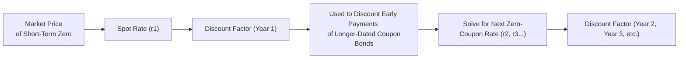

## Setting the Stage

Sometimes, you just want the simplest example of a bond—no regular coupon checks, nothing but a single payment at maturity. That, in a nutshell, is a zero-coupon bond. Many of us first encountered zeros as “strips” or maybe in the context of savings bonds, and I recall being a bit perplexed: “Wait, I pay X dollars today for something that returns a higher par amount at maturity—why no coupons?” Well, that’s precisely the point: a zero-coupon bond (often called a strip) is one of the purest ways to observe the term structure of interest rates. It offers a single, lump-sum cash flow at maturity, so we can isolate a single discount factor. That’s huge for valuation, because once we understand how to discount a single future payment, we can unravel the entire yield curve—and that’s core to the arbitrage-free valuation framework introduced back in Section 7.1.

In this section, we’ll see how to price zero-coupon instruments under a no-arbitrage framework, how zero-coupon yields form an essential building block of the spot yield curve, how forward rates tie in, and what to do when actual zeros in the market are few and far between (looking at you, illiquid bond markets). We’ll also try to keep things a bit down to earth with examples. Let’s do it.

## Zero-Coupon Bonds and the Law of One Price

### Defining Features of Zero-Coupon Bonds

A zero-coupon bond is straightforward conceptually: it has no interim coupon payments. Instead, you purchase it—often at a discount to par—hold it, and receive a single payment (the par value) at maturity. For instance, a bond with a $1,000 face value might sell at $950 if it matures in two years, or $990 if it’s only one year out—depending on market interest rates. Because the only cash flow is the redemption at maturity, the math around discounting (and therefore the price) is super direct.

From an arbitrage-free perspective, a zero-coupon bond’s price must reflect the present value (PV) of its future redemption. According to the law of one price, if there were two instruments guaranteed to generate the same single cash flow at the same point in time, they would have to be priced identically (barring minor transaction costs), or else an opportunity for riskless profit (arbitrage) would exist. This is precisely why:

(1)  
PV = FV / (1 + r)ᵗ 

where  
• FV is the face value (at maturity),  
• r is the discount rate (or yield) applicable for that maturity,  
• t is the time to maturity (in years or appropriate fraction).

### The Essence of Arbitrage-Free Pricing

If any zero-coupon bond were traded at a price higher or lower than FV / (1 + r)ᵗ for that maturity, you could construct a little buy-sell strategy—borrowing money at the mismatch rate, reinvesting at the price mismatch, and locking in profit. Because markets hate free lunches, such pricing differences should be swiftly eliminated. This ensures that the yield on a zero-coupon bond is consistent with other instruments that mature on the same date, enforcing an “arbitrage-free” relationship.

Now, you might say, “But I rarely see pure zero-coupon bonds for every maturity, so how do I figure out the discount rates?” Great question—that’s where the concept of the spot yield curve and bootstrapping comes in.

## Spot Yields and the Zero-Coupon Yield Curve

### Observing Spot Yields in Practice

The yield on a zero-coupon bond for a given maturity is called the spot yield. The entire set of yields—one for each maturity—comprises the so-called zero-coupon yield curve or spot curve. This curve forms the backbone of bond valuation because, theoretically, each future cash flow (coupon or principal redemption) from any bond can be viewed as a stream of zeros. 

If you can observe actual zero-coupon bonds in the market for each maturity, you can glean the discount factor for each time horizon directly. Imagine you know the price of a 1-year zero, a 2-year zero, a 3-year zero, etc. Each price translates to a discount factor:

(2)  
Discount Factor(t) = 1 / (1 + Spot Rateₜ)ᵗ,

and that discount factor can be used to price other bonds with cash flows at that maturity. If bond markets are efficient, all these discount factors should fit together consistently, leaving no chance for arbitrage.  

### Relationship to Other Bonds

However, zero-coupon bonds often aren’t available in a wide range of maturities. In many markets, you might find a 6-month T-bill or a 1-year T-bill. But how about a 4½-year zero? Not so common. In the U.S. Treasury market, you have the advantage of STRIPS (Separate Trading of Registered Interest and Principal of Securities). The coupons (interest payments) and principal (redemption amounts) are “stripped” apart into individual zero-coupon instruments that can be traded separately. This is a boon for those wanting to observe and trade the full set of discrete maturities, but it’s not always super liquid in every maturity. So practitioners often turn to the next best thing: bootstrapping from coupon-bearing bonds.

## Bootstrapping the Zero-Coupon Curve

Bootstrapping is a fancy term for using the prices of a set of bonds—often a combination of short-dated zeros and longer-dated coupon bonds—to systematically derive the entire zero-coupon yield curve, one maturity at a time. It’s actually kind of a puzzle.

### Step-by-Step Bootstrapping Example

1. Suppose you have a 1-year zero-coupon bond that trades at $980 for a $1,000 face value. This implies:

   (3)  
   $980 = $1,000 / (1 + r₁)¹ → r₁ = ($1,000 / $980) − 1 ≈ 2.04%  

   So your 1-year spot rate is about 2.04%.

2. Next, check out a 2-year zero (if it exists). Let’s say it’s priced at $940 for $1,000 at maturity:

   (4)  
   $940 = $1,000 / (1 + r₂)² → r₂ = ($1,000 / $940)^(1/2) − 1 ≈ 3.14%  

3. Now, let’s say we do not have a 3-year zero, but we have a 3-year 5% coupon bond priced at par ($1,000). Because it’s at par, the yield on this bond is 5%. But be careful—that 5% is the yield on a coupon bond, not the zero-coupon yield. So we solve for the 3-year spot rate r₃ by recognizing that the bond’s price is the present value of its annual coupon plus redemption. We already know the discount factors (i.e., the 1-year and 2-year spot rates) for those earlier coupon payments. This is where the puzzle aspect is really felt.

   The bond’s price (PV) is:

   (5)  
   $1,000 = $50 / (1 + r₁) + $50 / (1 + r₂)² + ($1,050) / (1 + r₃)³  

   We already have r₁ and r₂ from steps 1 and 2. So we isolate for r₃ in that equation. If the 1-year spot is 2.04% and the 2-year spot is 3.14%, we plug them in, do the algebra, and solve for r₃. That result is the 3-year zero rate consistent with an arbitrage-free environment.  

This procedure can be repeated for 4-year, 5-year, etc., coupon bonds, carefully using known discount factors for earlier cash flow dates.

### A Quick Mermaid Diagram

Here is a simple conceptual flowchart for how each observed bond price helps us back out a zero-coupon rate:

Notice how it’s a chain: each time you “unlock” one spot rate, you can then use it to discount part of the next instrument’s cash flows, and isolate the next unknown spot rate. That sequential process is bootstrapping.

## Using Forward Rates from the Zero-Coupon Curve

A big reason CFAs love zero-coupon yields is that we can derive forward rates—implied future rates for intervals that haven’t come to pass yet. For instance, if the 1-year zero is at 2.04% and the 2-year zero is at 3.14%, we can estimate the implied 1-year forward rate starting at year 1 for year 2. The fundamental relationship is:

(6)  
(1 + r₂)² = (1 + r₁) × (1 + 1f₁,1),

where 1f₁,1 is the implied forward rate for the one-year period starting one year from now. Rearrange, solve for 1f₁,1, and you get:

(7)  
1f₁,1 = ( (1 + r₂)² / (1 + r₁) ) − 1.

In an arbitrage-free market, forward rates must align with these observed spot rates. Otherwise, an astute trader could lock in a riskless spread by going long the short-dated bond, short the longer-dated bond, etc. This forward rate is critical for valuation of coupon-bearing bonds, derivatives, and more advanced structures. It’s all interlinked.

## Challenges and Practical Considerations

### Limited Availability of Zeros

While we’d love to have a complete array of zero-coupon bonds from 1 month to 30 years, the real world is rarely that neat. Some countries’ Treasury markets offer a few bills or zero-coupon notes, but not a full sequence. In the U.S., Treasury STRIPS help fill the gap, yet liquidity for certain maturities can be thin, especially away from the major nodes (like the 10-year point). In many other markets, zeros hardly trade at all.

### Bootstrapping from Coupon Issues

Because of this gap, bootstrapping from liquid coupon bonds is standard. Practitioners gather a set of liquid, on-the-run government securities across the maturity spectrum—like the 2-year note, 3-year note, 5-year note, 7-year note, 10-year note—and systematically back out the discount factors. Each coupon payment is treated as if it’s its own zero, discounted at the matching “spot rate.” After you get the discount factors for shorter maturities, you work forward in the puzzle-like approach described before.

### Market Frictions and Other Real-World Nuances

In real markets, there are bid-ask spreads, taxes, haircuts for repo transactions, and big differences in liquidity that might cause the actual yield curve to deviate somewhat from the theoretical no-arbitrage shape. Sometimes yields are also influenced by supply and demand technicals—for instance, certain bond maturities can be “on special” in the repo markets, affecting their implied financing rates. All these factors can cause minor distortions, so you rarely see a perfect, mathematically smooth yield curve. Despite that, the fundamental principle remains: the best theoretical approach to valuing bonds is by discounting each cash flow at the appropriate zero-coupon (spot) rate, which ensures there’s no free lunch.

### Identifying Arbitrage Opportunities

If you notice a situation in which the price of a zero-coupon bond is inconsistent with the curve implied by other bonds of a similar maturity, you might attempt an arbitrage strategy: buy the underpriced zero, short or sell the overpriced instruments, and lock in a sure profit. Such opportunities tend to vanish quickly. In exam item sets, you’ll often be asked to spot or calculate price discrepancies or yield differentials that signal an arbitrage.

## Practical Examples: Short- vs. Medium-Term Zero Pricing

Let’s illustrate with a hypothetical you might see in a vignette:

- A 1-year zero-coupon bond priced at $960 (par = $1,000).  
- A 2-year zero-coupon bond priced at $900 (par = $1,000).  

From the first, the 1-year spot rate is:  
(8)  
$960 = $1,000 / (1 + r₁)  
r₁ = $1,000/$960 − 1 = 4.17%  

From the second, the 2-year spot rate is:  
(9)  
$900 = $1,000 / (1 + r₂)²  
(1 + r₂)² = $1,000/$900 = 1.111...  
(1 + r₂) = (1.111...)^(1/2) = 1.054...  
r₂ ≈ 5.4%  

Now, if we see a 2-year coupon bond that seems to imply a 2-year yield higher than 5.4% (based on how the coupons discount), but the zero is pegging that rate at 5.4%, that might be fishy. This mismatch could be an arbitrage clue. On the exam, a typical question might walk you through the logic of how to lock in profit with a borrowing-lending combination.  

## Glossary

• **Zero-Coupon Bond (Strip):** A bond with no coupon payments that returns its face value at maturity.  
• **Spot Yield:** The yield (annualized) on a zero-coupon bond implied by its market price, corresponding to a specific maturity.  
• **Discount Factor:** The fraction by which a future cash flow is multiplied to arrive at its present value, based on the spot rate.  
• **Bootstrap Method:** A systematic procedure for deriving the zero-coupon yield curve from the prices of coupon-bearing securities.  
• **STRIPS:** A U.S. Treasury program, “Separate Trading of Registered Interest and Principal of Securities,” that allows each coupon and the principal to be traded as individual zero-coupon instruments.  
• **Forward Rate:** The implied interest rate for a future period, derived from the current spot yield curve.

## References and Further Reading

- Tuckman, Bruce. “Fixed Income Securities: Tools for Today’s Markets.” (Particularly chapters covering zero-coupon yield curve construction and bootstrapping.)  
- Relevant articles in the Journal of Finance on bond pricing and yield curve bootstrapping (search for “Bootstraping the Yield Curve: Theory and Implementation”).  
- CFA Program Curriculum, Level II (2025), “Fixed Income” section on zero-coupon valuation.  
- For more advanced practical detail, consider resources from the Federal Reserve Bank’s website or from practitioner guides on Bloomberg’s terminal functions for bootstrapping yield curves.  

## Closing Thoughts and Exam Tips

• Be sure to systematically discount each cash flow at the correct spot rate to ensure an arbitrage-free price.  
• Practice the bootstrapping steps; item sets commonly test your ability to solve for unknown spot rates using partial discount factors derived from earlier maturities.  
• Keep in mind the difference between yield on a coupon bond and the spot (zero) yield for the same maturity—especially when the bond is or isn’t priced at par.  
• Watch out for forward rate relationships—questions often show you a tiny puzzle of short-term and longer-term yields and ask for the implied forward rate.  

Remember: zero-coupon valuation is often the most straightforward place to anchor your perspective on bond pricing. Once you have it nailed, coupon bonds are just a sum of mini zero-coupon claims. Best of luck on applying these concepts in the exam vignettes!

---

## Valuing Zero-Coupon Instruments Practice Quiz



### 1. A basic characteristic of a zero-coupon bond is:

- [ ] It pays coupons annually, but at a decreasing rate.  
- [x] It makes no interim coupon payments and pays face value at maturity.  
- [ ] It always trades at a premium above par.  
- [ ] It guarantees a fixed reinvestment rate for coupon payments.  

> **Explanation:** Zero-coupon bonds pay no coupons and return their face value at maturity.  

### 2. Which formula correctly calculates the fair price of a zero-coupon bond in an arbitrage-free market?

- [x] Price = Face Value / (1 + r)ᵗ  
- [ ] Price = (Coupon Payment / Yield) × (1 − (1 / (1 + Yield)ᵗ))  
- [ ] Price = (Coupon Payment × r) + Face Value  
- [ ] Price = Face Value × (1 + r × t)  

> **Explanation:** The standard valuation for a single lump sum in the future is discounting by (1 + r)ᵗ.  

### 3. If the 1-year zero-coupon bond is priced at $960 for a $1,000 face value, the 1-year spot yield (r₁) is closest to:

- [ ] 2.04%  
- [x] 4.17%  
- [ ] 6.00%  
- [ ] 8.33%  

> **Explanation:** r₁ = (1000 / 960) − 1 = 4.17%.  

### 4. Which statement best describes the role of spot yields when valuing coupon bonds?

- [x] Each coupon payment can be discounted by a maturity-matched spot rate.  
- [ ] Only the final coupon payment is discounted at the spot rate.  
- [ ] Spot yields are only relevant when the coupon bond is trading above par.  
- [ ] Coupon rates are always higher than the spot rates in an arbitrage-free market.  

> **Explanation:** For an arbitrage-free price, each discrete cash flow of a coupon bond is discounted using the spot rate for its time horizon.  

### 5. Why do practitioners use “bootstrapping” for zero-coupon yield curves?

- [ ] They can’t calculate yields otherwise.  
- [x] Because many maturities of zero-coupon instruments do not trade or are illiquid, making it necessary to derive spot rates from coupon bonds.  
- [ ] Bootstrapping completely eliminates credit risk.  
- [ ] Bootstrapping is legally required by government regulations.  

> **Explanation:** In many markets, zero-coupon bonds aren’t available for every maturity, so bootstrapping extracts spot rates from coupon bond prices.  

### 6. A three-year bond has an annual coupon of 5% and a par value of $1,000. If the first-year and second-year spot rates are already known, how do we find the third-year spot rate?

- [ ] By averaging the first two spot rates.  
- [ ] By ignoring the coupon and discounting the face value only.  
- [ ] By comparing the bond’s coupon rate directly with the 1-year forward rate.  
- [x] By using the present value of the first two coupon payments discounted at their respective spot rates and solving for the yield that sets the total bond price to its observed market price.  

> **Explanation:** You discount the first two coupon payments using known discount factors, then solve for the third-year discount factor (and thus spot rate) that makes the bond’s price match its market value.  

### 7. In a market with no-arbitrage, which of the following is true about forward rates?

- [x] They are derived from the spot curve to prevent riskless profit opportunities between short and long rates.  
- [ ] They are determined solely by the demand for short-maturity Treasury bills.  
- [ ] They do not reflect expectations about future interest rates.  
- [ ] They must be strictly lower than all observed spot rates.  

> **Explanation:** Forward rates are implied by existing spot rates, ensuring consistency with no-arbitrage.  

### 8. If a 2-year zero-coupon bond yield is 5.4%, and the 1-year zero-coupon bond yield is 4.17%, the implied one-year forward rate starting at year 1 is approximately:

- [x] [(1.054)² / (1.0417)] − 1  
- [ ] [(1.054)¹ / (1.0417)] − 1  
- [ ] [(1.054) − (1.0417)] × 1  
- [ ] [(1.0417)² / (1.054)] − 1  

> **Explanation:** The forward rate f₁,1 can be found by (1+r₂)² = (1+r₁) × (1 + f₁,1).  

### 9. Which of the following is a common advantage of Treasury STRIPS in the U.S. market?

- [x] They allow investors to directly observe zero-coupon yields at various maturities.  
- [ ] They permanently fix the bond’s yield at the date of issuance.  
- [ ] They eliminate money market basis risk.  
- [ ] They are not subject to interest rate risk because they have no coupons.  

> **Explanation:** STRIPS separate each coupon and principal payment into its own zero-coupon security, providing direct insight into zero-coupon yields.  

### 10. True or False: If two zero-coupon bonds with the same maturity have different prices, it indicates a potential arbitrage situation.

- [x] True  
- [ ] False  

> **Explanation:** If they offer the same cash flow at the same time but differ in price, a riskless profit opportunity exists, violating no-arbitrage conditions.  


