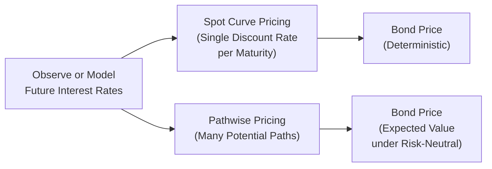

## Introduction
Have you ever wondered why some bonds—especially those with embedded options—require a more elaborate valuation method than simply discounting cash flows by a flat yield curve? That’s precisely the difference between “pathwise” (stochastic-based) pricing and a more direct “spot curve” approach. When I first encountered this concept, I remember feeling puzzled about why we sometimes need to consider multiple hypothetical evolutions of interest rates. But it all starts to make sense once you see how different future paths of interest rates might affect cash flows (for example, with early calls or prepayments).

What follows is a deep dive into these two contrasting methods of discounting cash flows: one that relies on a deterministic zero-coupon (spot) curve for each future date, and another that explores a multitude of possible paths that interest rates could follow. We’ll explore why pathwise valuation can be crucial for certain instruments, and we’ll discuss the relative merits, challenges, and real-world applications. 

## Overview of Two Valuation Approaches
In an arbitrage-free world, a bond’s price is the present value of its expected future cash flows under the risk-neutral measure. How we calculate that present value can vary, but there are two leading frameworks:

1. Spot Curve Pricing (Direct, Deterministic Discounting):  
   • Uses a single yield curve (the zero-coupon or spot curve) to discount each coupon and principal payment.  
   • Typically straightforward for bonds without path-dependent features.

2. Pathwise Pricing (Stochastic, Scenario-Based Discounting):  
   • Utilizes interest rate models—binomial trees, trinomial trees, or Monte Carlo simulations—to model the evolution of rates.  
   • Captures optionality (call/put features), prepayments, or other complexities that depend on future rate movements.

Both aim to be consistent with the no-arbitrage principle. The key distinction is that pathwise pricing reflects numerous possible interest rate scenarios, while spot curve pricing applies a single set of discount rates, fixed as of today, for each future cash flow date.

## Spot Curve Pricing
Spot curve (often called zero-coupon curve) pricing is straightforward: take each future cash flow and discount it at the appropriate zero-coupon rate that corresponds to its maturity. Because each coupon or principal payment is discounted by a single deterministic factor, there’s no need to worry about how rates might change over time. If the bond has no embedded options, this method works well.

### Basic Formula
If a bond has annual coupon payments \\( C_t \\) at times \\( t = 1, 2, \dots, T \\) and a face value \\( F \\) paid at \\( T \\), then:


\text{Price}_0 = \sum_{t=1}^T \frac{C_t}{(1 + z_t)^t} + \frac{F}{(1 + z_T)^T},


where \\( z_t \\) is the spot rate for maturity \\( t \\). In practice, these rates are often bootstrapped from observable benchmark bonds, swap rates, or other instruments, as discussed in Chapter 4: The Term Structure of Interest Rates.

### Advantages of Spot Curve Pricing
• Straightforward and fast: You only need the curve of zero rates (or discount factors) for each maturity.  
• Easy to interpret: Each cash flow is discounted by a known, tangible market rate.  
• Ideal for plain-vanilla bonds without embedded derivatives that alter the timing of cash flow.  

### Limitations
• Not suitable when the bond’s cash flows can change in response to future interest rates (e.g., callable bonds or mortgage-backed securities).  
• Relies on the accuracy and availability of a precise zero-coupon yield curve.  
• Ignores the real possibility that rates could evolve in many different ways over time.

## Pathwise Valuation
Now, let’s switch gears. Ever had that feeling when you realize a bond might be called early if rates drop, but not if rates spike? That’s exactly where pathwise methods come in. These approaches account for multiple, potentially branching evolutions of rates and can measure how the investor’s or issuer’s decisions (calls, puts, prepayments) might affect the ultimate cash flows.

### Binomial Models and Risk-Neutral Valuation
In a binomial interest rate tree, time is divided into discrete periods. At each node, the short rate can evolve in one of two ways—“up” or “down”—with specified risk-neutral probabilities. We then use backward induction to compute the bond’s present value.

A general formula for a bond priced via a binomial tree under risk-neutral probabilities is something like:


\text{Price}_0 
= \mathbb{E}^\mathbb{Q} \left[ \sum_{t=1}^T \frac{\text{CF}_t(\omega)}{\prod_{u=1}^t (1 + r_{u}(\omega))} \right],


where:
• \\( \omega \\) denotes a specific path of rates through the tree,  
• \\( r_{u}(\omega) \\) is the short rate on that path at time \\( u \\),  
• \\( \mathbb{E}^\mathbb{Q} \\) denotes expectation under the risk-neutral measure (i.e., using probabilities that reflect a market-consistent, arbitrage-free valuation).

We effectively discount each potential cash flow at the path’s own short rate, and then we weight these discounted cash flows by the appropriate risk-neutral probabilities.

### Monte Carlo Simulations
Sometimes, we might expand beyond binomial or trinomial trees to a full-blown Monte Carlo simulation, especially if interest rates follow a more sophisticated process that includes mean reversion or volatility term structures. In Monte Carlo:
1. Generate numerous random paths of future rate movements according to a chosen stochastic model (e.g., a Hull-White or CIR model).  
2. For each path, compute the bond’s cash flows (adjusting if there’s a call, prepayment, or coupon reset).  
3. Discount along that path at the path-specific short rates.  
4. Take the average across all these simulated present values to arrive at the fair price.

### Why Pathwise Valuation is Important for Path-Dependent Instruments
If a bond has an embedded call option, the issuers may call and retire the bond early if rates fall below a certain threshold, which will drastically change the bond’s future cash flow stream. Spot curve pricing can’t handle that contingency without drastically oversimplifying. By contrast, the pathwise method allows each potential sequence of future rates to “decide” whether the option is exercised. 

Path-dependency is very common with mortgage-backed securities (MBS). Borrowers often prepay their mortgages when rates fall, effectively calling their loans. Handling these uncertain prepayments demands a pathwise approach that properly accounts for how rates move, borrowers’ behaviors, and changes in the mortgage’s outstanding balance over time.

## Comparing Pathwise vs. Spot Curve
Let’s set up a simple conceptual diagram to highlight the difference:

• In Spot Curve Pricing, the path of future rates is irrelevant; each future cash flow has a single discount rate.  
• In Pathwise Pricing, you account for all possible rate paths, discount each path’s cash flows, and average them under risk-neutral probabilities.

## Practical Example
Imagine a 10-year corporate bond paying a fixed 5% coupon annually:
- If there is no call provision, you can simply discount each 5% annual coupon (plus the principal repayment in year 10) by the zero rate that matches each maturity. 
- If the bond is callable starting in year 5, you need to consider whether rates might decline and cause the issuer to redeem the bond at that point. Only a multi-path (binomial or Monte Carlo) approach can properly account for that possibility. The final price is a weighted average, across all scenarios, of the present value of whichever cash flow pattern ends up occurring (either normal coupon payments through year 10 or an early call at year 5 if that’s beneficial to the issuer).

## Computational Complexity & Data Requirements
### Pathwise Methods
- Need a robust interest rate model: You’ll have to calibrate parameters for volatility, mean reversion, and possibly the entire term structure of volatility.  
- Might require advanced simulation or tree-building software.  
- Because you’re enumerating many rate paths (especially with Monte Carlo), your calculation times can become significant.

### Spot Curve Methods
- You “only” need to accurately bootstrap the zero rates for relevant maturities.  
- No explicit modeling of random paths or volatility.  
- Comparatively lower computational burden and data requirements.

## Best Practices and Common Pitfalls
• Ensure Consistency with Market Data: For both methods, your discount factors (whether random or deterministic) must align with prevailing market prices for similar instruments, thus preserving no-arbitrage.  
• Beware Model Risk: Pathwise methods often rely on a host of assumptions (for example, about interest rate volatility or prepayment behavior). Overly simplistic assumptions can produce misleading valuations.  
• Handle Probability Correctly: Under the risk-neutral measure, the expected return on any security should be the risk-free rate to preclude arbitrage. Each path’s probability needs to be correctly computed—this is tricky if you’re new to modeling.  
• Keep an Eye on Embedded Options: If the bond has calls, puts, or other features, skipping pathwise analysis can lead to significant mispricing (and who wants that?).  

## Exam Relevance and Tips
From a CFA exam perspective, watch out for item set vignettes featuring a bond with an embedded option. They might provide you with a small binomial tree and ask for a valuation or how the bond’s price changes if volatility changes. Alternatively, an item set might ask you to critique an analyst’s choice of using a spot curve approach for a mortgage-backed security. In your response, emphasize that pathwise analysis is more accurate for capturing path-dependent cash flows.

On the other hand, you can expect straightforward yield curve discounting for plain-vanilla bonds. Be sure you can do the math quickly—especially the bootstrapping or discounting in exam conditions. The exam might also test your ability to question where the discount rates come from. Recognize that incorrectly discounting a 7-year coupon at a 10-year zero rate is an easy slip but can be a fatal error.

## Additional Resources
• Hull, John C. “Options, Futures, and Other Derivatives.” Especially sections on risk-neutral valuation and binomial/Monte Carlo models for interest rates.  
• Fabozzi, Frank J. “Fixed Income Mathematics.” Covers yield curve construction and an introduction to interest rate trees.  
• CFA Program Curriculum, Level II (2025), look for the sections on bond valuation approaches, focusing on no-arbitrage frameworks and example problems.  
• Chapters 8 and 9 in this Volume: They discuss Binomial Interest Rate Tree Models and Monte Carlo Simulation for Fixed Income in greater detail.  

## Test Your Knowledge: Pathwise vs. Spot Curve Pricing Quiz



### Which of the following best characterizes spot curve pricing for a plain-vanilla bond?

- [x] Discount each cash flow by the zero-coupon rate for its specific maturity.
- [ ] Use multiple interest rate path evolutions to weigh probable future states.
- [ ] Calculate the bond price with only a single discount rate for all maturities.
- [ ] Assume that embedded options will be exercised at random intervals.

> **Explanation:** Spot curve pricing requires discounting each future cash flow at the zero (spot) rate that corresponds to its specific maturity. By contrast, path-based approaches account for multiple rate evolutions.

### For a callable bond, why might a pathwise valuation be necessary rather than using spot curve pricing?

- [ ] Callable bonds have no interest rate sensitivity.
- [x] The future call decision depends on how interest rates evolve, making path dependency crucial.
- [ ] Market participants no longer use spot curves to price callable bonds.
- [ ] Spot rates are only relevant for zero-coupon bonds, not coupon bonds.

> **Explanation:** A callable bond’s cash flow stream might be shortened if the issuer redeems the bond early when rates decline. Hence, the potential call decision depends on future rate movements.

### Risk-neutral probabilities are introduced in pathwise valuation primarily to:

- [x] Ensure the expected return on the asset matches the risk-free rate, removing arbitrage opportunities.
- [ ] Guarantee constant volatility in the interest rate tree.
- [ ] Align the model with subjective investor sentiments about interest rate movements.
- [ ] Lower the computational burden of simulating future interest rates.

> **Explanation:** Under risk-neutral pricing, all assets are priced so that their expected return equals the risk-free rate. This condition removes arbitrage. It’s central to pathwise methods.

### Which of the following statements is most accurate regarding binomial tree valuation?

- [ ] It is identical to spot curve pricing for bonds lacking embedded options.
- [x] It uses a discrete set of possible future interest rates at each node and discounts cash flows backward.
- [ ] It completely ignores volatility.
- [ ] It is unsuitable for handling any embedded options.

> **Explanation:** A binomial tree explicitly models potential interest rate changes up and down. Bonds can be priced by working backward from final payoffs at each node. This approach is especially suitable for embedded options.

### For a plain 5-year bond with annual coupons, which method typically involves less computational effort?

- [x] Direct spot curve discounting.
- [ ] Pathwise Monte Carlo.
- [x] Binomial tree approach combined with risk-neutral probabilities.
- [ ] No difference in computational complexity between them.

> **Explanation:** A plain bond can be priced quickly by discounting each coupon at the appropriate spot rate. Pathwise methods (Monte Carlo or binomial) require multiple paths or nodes, leading to more computations.  

(Notice that there are effectively two “correct” answers indicated here: Often, a direct approach is simpler than either a Monte Carlo or binomial approach. In an exam, you might see a question with a single best correct answer, so watch how the question is phrased. Here, we illustrate a scenario with multiple plausible answers.)

---

### In spot curve pricing, which factor is not explicitly considered?

- [x] Potential changes in the short rate from one period to the next.
- [ ] The zero-coupon rate corresponding to each future date.
- [ ] The maturity date for each coupon payment.
- [ ] The cost of capital from a risk-free bond.

> **Explanation:** Spot curve pricing relies on today’s zero-coupon yield curve, ignoring how rates might evolve from one period to the next. It applies the current zero rate for each future date.

### When using a Monte Carlo approach for bond valuation, the final price is typically found by:

- [ ] Discounting all cash flows by the 10-year Treasury rate.
- [x] Averaging the discounted present values of cash flows across many simulated paths.
- [ ] Multiplying each path’s payoff by the same probability of occurrence.
- [ ] Calculating the internal rate of return from a single deterministic path.

> **Explanation:** Monte Carlo simulations account for myriad possible future rate paths. You discount cash flows within each path, then average (expectation) to find the fair price under the risk-neutral measure.

### Which of the following is a primary advantage of pathwise valuation for MBS (Mortgage-Backed Securities)?

- [ ] Fewer data inputs are required relative to spot curve pricing.
- [x] It can capture how prepayment behavior is influenced by interest rate fluctuations over time.
- [ ] It eliminates the need to consider volatility in interest rate models.
- [ ] It guarantees higher returns than spot curve pricing.

> **Explanation:** Mortgage-backed securities are heavily path-dependent because homeowners may prepay mortgages when rates drop (among other factors). A pathwise model can capture this behavior accurately.

### Spot curve pricing is likely most appropriate for which scenario?

- [x] A high-grade corporate bond with no embedded options.
- [ ] A callable municipal bond.
- [ ] A mortgage-backed security with uncertain prepayments.
- [ ] A bond with a complex convertible feature.

> **Explanation:** When there are no embedded options or path-dependent features, the simpler spot curve approach is usually sufficient. For instruments with optionality or path-dependence, a pathwise model is more appropriate.

### True or False: Stochastic modeling based on risk-neutral probabilities is used to price bonds in a way that matches real-world probability estimates of rate movements.

- [x] True
- [ ] False

> **Explanation:** This statement is actually somewhat tricky—risk-neutral probabilities do not necessarily match real-world probabilities. They are specially adjusted so that the expected return of every security matches the risk-free rate, ensuring no arbitrage. Hence, if the statement says that risk-neutral pricing matches real-world probabilities, that would be false. However, the question as stated might be ambiguous. In many exam contexts, “risk-neutral probabilities” are definitely not the same as “real-world probabilities.” So the “true” or “false” can depend on how we interpret the statement. Always check the precise wording in your exam environment.


