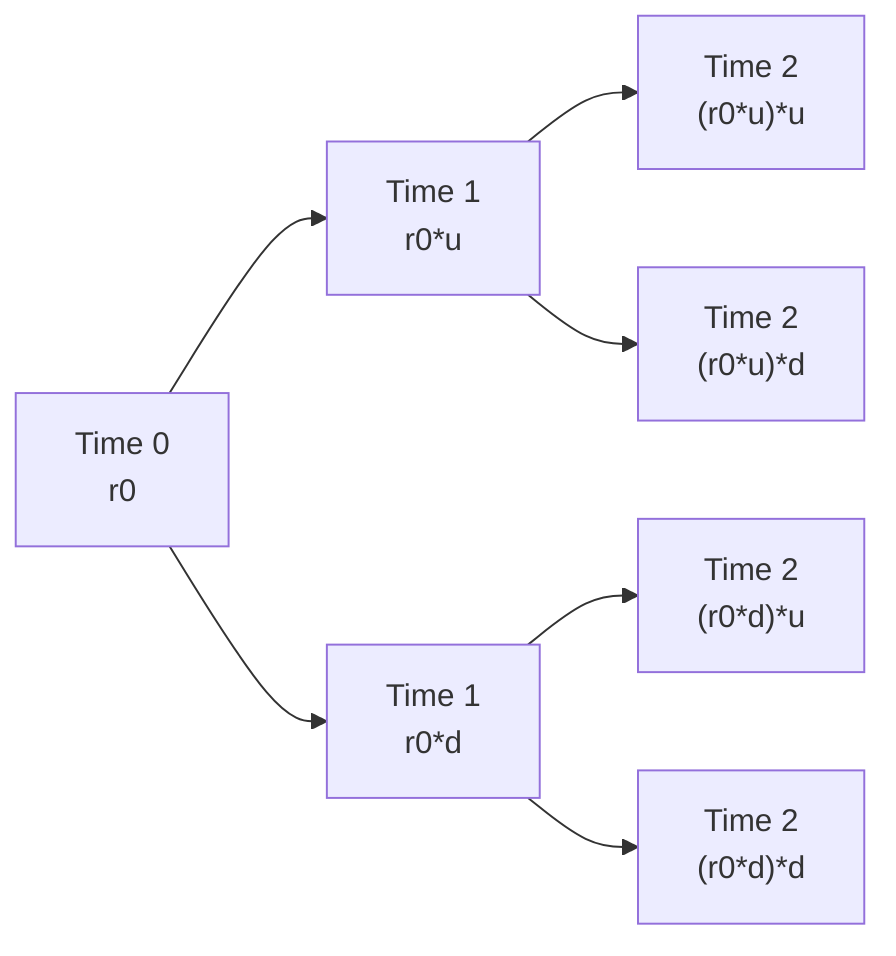

## Overview

Have you ever tried to juggle multiple interest rate forecasts and thought, “Wow, I wish I had a simple model to see it all in one place?” That’s basically what a binomial interest rate tree does—except it's more rigorous than just a guess. It’s a structured framework that helps us keep track of multiple potential interest rate paths over time and price various instruments on each of those possible paths.

For those of you who are stepping up from Level I, I recall the days (not that long ago, I promise) when I first saw a binomial model in an introductory course—my initial reaction was, “Wait, we’re just flipping coins on interest rates?” But as you keep learning, you start realizing how flexible this approach is for capturing different volatility levels and calibrating to real-world yield curves. The binomial tree is an elegant and powerful method, frequently used to value bonds, embedded options, and more sophisticated derivatives.

Below, we’ll explore its building blocks, calibration approaches, and how to adapt the basic setup for more advanced scenarios. We’ll also reference some concepts you might recognize from Chapter 4 (Term Structure of Interest Rates) and Chapter 7 (Arbitrage-Free Valuation), because you’ll want the tree you build to be consistent with these frameworks. Let’s dive in.

## Key Concepts in the Binomial Tree

### The Building Blocks: Up and Down Movements

At the core of a binomial tree, each node has two possible states in the next period: an “up” state and a “down” state. If you’ve studied stock price binomial models (perhaps in an options context), you’ll notice a striking similarity: we define an up-factor (u) and a down-factor (d) that determine how much the rate might jump or drop. Over one time step, the short rate r can evolve as:

• r × u (up scenario)  
• r × d (down scenario)

Intuitively, u > 1 if rates rise, and d < 1 if rates fall (though you might see variants where up and down factors are expressed as additive shifts rather than multipliers—just remember to be consistent within your model).

### The Risk-Neutral Probability

To ensure no-arbitrage in pricing, we use a risk-neutral probability, p, not the actual (or “real-world”) probability you might measure historically. The risk-neutral framework says that every security should grow on average at the risk-free rate, and no one should be able to make a riskless profit by exploiting mispricings. In a common binomial setup, p is computed by:


p = \frac{e^{r \Delta t} - d}{u - d},


where r is the current short rate or short-rate proxy, and \\(\Delta t\\) is the fraction of the year per step (e.g., 0.5 for semiannual steps). Notice that we often apply a continuous compounding approach with \\(e^{r \Delta t}\\). Other variations exist (for instance, discrete compounding or forward rates might be used), but the objective remains the same: to find a probability measure that eliminates arbitrage opportunities.

### Choosing Time Steps

Selecting the length of each time step is part science, part practicality. You might want to align each step with coupon payment intervals. Or you might pick a monthly step if you’re modeling mortgage-backed securities with monthly prepayments (check out Chapter 13 for more on MBS). A smaller \\(\Delta t\\) yields a more granular tree but also multiplies the computational load.

## Constructing a Simple One-Period Tree

Below is a small (two-step) diagram to illustrate the structure. At time 0, the short rate is \\(r_0\\). After one period, it can move up to \\(r_0 \times u\\) or down to \\(r_0 \times d\\). Then from each of those states, we have two possible transitions in the next period. Visually, it might look like this:



This illustration is the simplest form. But in practice, especially for more advanced fixed income instruments, you can stack many layers. Once you have the tree, you can apply backward induction (discussed more formally in Section 8.2) to price any set of cash flows or derivatives.

## Initial Calibration: Matching the Current Yield Curve

### Why Calibration Matters

Calibration ensures that the binomial model is consistent with the real-world data we observe—particularly the current short rate and the existing yield curve. If your tree doesn’t match real-world term structure data, you risk mispricing. A well-calibrated tree means you can rely on it to produce correct valuations of standard instruments, from zero-coupon bonds to coupon bonds and beyond.

### Matching the Root Rate

The first calibration checkpoint is to ensure that the root node at time 0 matches the actual short rate or the immediate forward rate implied by the yield curve. If, for example, the risk-free rate for a six-month T-bill is 3%, then your initial node for a semiannual step might be 3%. This is the easiest step but absolutely critical. It sounds simple, but I’ve seen folks who calibrate everything else and then look back and realize the model’s initial node was off by 10 basis points—definitely not good if you’re aiming for an arbitrage-free tree.

### Matching Multiple Maturities

The next step is to solve for the up-factor \\(u\\), down-factor \\(d\\), and the risk-neutral probability \\(p\\) so that the model’s bond prices (or equivalently the implied interest rates) match several observed market yields at different maturities. This generally requires iterative techniques. For instance, you might:

1. Guess the value of \\(u\\).  
2. Compute \\(d = 1 / u\\) if you assume a recombining tree with a symmetrical up and down factor.  
3. Solve for \\(p\\) using the no-arbitrage formula.  
4. Price a short bond and a longer-dated bond in the binomial tree.  
5. Compare the model’s bond price to the market price (or the implied yield).  
6. Adjust \\(u\\) or your volatility assumption until the difference between model and market prices is acceptable.

You can refine this approach by bringing in more bonds or more yields. The more points on the yield curve you try to match, the more sophisticated your calibration might become. Some advanced calibration methods even break the symmetrical assumption that \\(d = 1 / u\\), or they incorporate different up/down moves for short- vs. long-term nodes to better capture the curvature of the yield curve. We say more about these intricacies in Chapter 7 (Arbitrage-Free Valuation Framework), where the law of one price features strongly in these iterative processes.

### Practical Tip

Be prepared to do multiple passes. Sometimes you’ll set a volatility parameter, run the calibration, see that it misprices the 5-year note, tweak, and repeat. For real-world portfolios, there’s usually a tolerance window. For instance, a mismatch of a basis point or two might be tolerable if you’re modeling a hundred million dollar portfolio. But it depends on your use case and risk tolerance.

## Incorporating Volatility Assumptions

### Linking Volatility to u and d

Often, you’ll tie the up and down factors directly to a target annual volatility, \\(\sigma\\). A common approach is to set:


u = e^{\sigma \sqrt{\Delta t}}, \quad d = e^{-\sigma \sqrt{\Delta t}}.


If you do that, you basically define how wide the tree’s branches spread at each step. Alternatively, you might prefer a discrete approach, such as \\(u = 1 + \sigma \sqrt{\Delta t}\\) and \\(d = 1 - \sigma \sqrt{\Delta t}\\). The choice is somewhat stylistic, but exponential forms are more common for interest rates, especially if they can’t go negative.

### Mean Reversion or Drift

Some short-rate models incorporate drifts. For instance, the Cox-Ingersoll-Ross (CIR) and Hull-White models have specific mean reversion features. In a binomial tree setting, that could mean your tree is “tilted” so rates tend to revert toward a long-run average. In practice, this can tweak your up/down factors or even the probabilities themselves. If your viewpoint is that rates are temporarily low but likely to bounce back, you might calibrate your tree to reflect that drift. However, keep in mind that adding more parameters (mean reversion level, speed, long-run variance, etc.) introduces further calibration complexity.

## Example: Python Snippet for Calibration

Here’s a super-simple demonstration in Python that tries to compute a symmetrical up/down factor to match a 2-year par yield and a 3-year par yield. We definitely won’t solve a real calibration in just a few lines, but to spur your imagination:

```python
import math

short_rate = 0.03     # Current short rate
two_year_yield = 0.035
three_year_yield = 0.04

delta_t = 1.0  # annual

def bond_price_in_tree(u, d, r0, p, face_value=100, coupon=0.0, t=3):
    """
    Hypothetical function that returns a bond price in a binomial tree
    for a 3-year maturity, ignoring details.
    """
    # This is just a placeholder, not a full tree calculation.
    # You'd do a real backward induction if implementing.
    return 95.0  # Some dummy placeholder value

def calibrate_tree():
    # We'll just guess different volatilities and pick the best
    best_diff = float('inf')
    best_u = None
    
    for vol_guess in [0.01 * i for i in range(1, 51)]:
        u = math.exp(vol_guess * math.sqrt(delta_t))
        d = 1 / u
        # risk-neutral probability with continuous compounding
        p = (math.exp(short_rate * delta_t) - d) / (u - d)
        
        # Price the 2-year bond
        price2 = bond_price_in_tree(u, d, short_rate, p, t=2)
        # Price the 3-year bond
        price3 = bond_price_in_tree(u, d, short_rate, p, t=3)
        
        # Convert them to yields and compare
        # (Pretend we have a function that does it)
        model_y2 = 0.0  # placeholder
        model_y3 = 0.0  # placeholder
        
        diff = abs(model_y2 - two_year_yield) + abs(model_y3 - three_year_yield)
        if diff < best_diff:
            best_diff = diff
            best_u = u
            
    return best_u

best_up_factor = calibrate_tree()
print("Optimal up-factor (u):", best_up_factor)
```

In real life, you’d perform the entire tree-based bond pricing inside that `bond_price_in_tree` function. The final result would hopefully yield a decent match to your target yields. The point is that calibration typically means iterating until you zero in on the best set of parameters.

## Advanced Calibration

### Historical vs. Implied Volatility

If you want your tree to reflect market sentiment on volatility, you could base your \\(\sigma\\) on implied volatilities from interest rate options, like swaptions or caps/floors (see Chapter 24.5 for interest rate options). Alternatively, you can use historical vol to reflect how rates have fluctuated in the past. Sometimes, you’ll weigh both. Again, the bigger your portfolio and the more sophisticated the instrument, the more crucial it is to get these assumptions right.

### Non-Recombining VS. Recombining Trees

Most binomial trees for interest rates are “recombining,” meaning an up-then-down path leads to the same node as a down-then-up path. This reduces the computational burden. However, more complex short-rate models with path-dependence or advanced mean reversion might yield “non-recombining” trees, which is more computationally intense but sometimes necessary for exotic option features.

### Path Dependency (A Quick Note)

In some products like mortgage-backed securities, prepayment risk or path-dependent effects come into play. You might want to check out Chapter 9 on Monte Carlo because binomial trees—while still valuable—can become unwieldy for severely path-dependent cash flows. Nonetheless, a well-calibrated binomial model remains a great steppingstone or simpler alternative to full simulation.

## Common Pitfalls

• Not iterating enough. Calibration is rarely a “one-and-done.” You’ll need to circle back multiple times to ensure your tree lines up with key maturities on the yield curve.  
• Mismatching the root rate. If your time 0 node doesn’t match the market short rate, everything else falls apart.  
• Unrealistic volatility. Overly bloated or tiny \\(\sigma\\) can produce rates that are either too extreme or not flexible enough to catch yield curve movements.  
• Ignoring mean reversion if it’s a known characteristic of the environment. If your real-world environment has strong mean reversion and your binomial model doesn’t, you could systematically misprice longer-dated instruments.  
• Focusing on only one part of the curve. Matching a short-rate instrument might be easy, but ignoring that 10-year note might leave you with big mispricings down the line.

## Practical Steps for Building the Tree

• Gather Market Inputs: Start with the current short rate, term structure data, and volatility assumptions (either historical or implied).  
• Establish Time Steps: Make sure they align with coupon frequencies when possible.  
• Choose an Approach for u and d: Either symmetrical (using \\(\sigma\\)) or a direct iterative approach that tries to match multiple points on the curve.  
• Compute the Risk-Neutral Probability p: Use the no-arbitrage formula, matching your compounding convention.  
• Construct the Tree: Fill out each node’s rate for each time step. Recombining trees are standard unless you have special modeling needs.  
• Verify Calibration: Price standard instruments (e.g., zero-coupon bonds) and compare them to their market prices or yields. If they’re off, tweak your parameters.  
• Document Assumptions: Especially if you’re going to show compliance with broad risk-management frameworks. Remember the Code and Standards of the CFA Institute emphasize transparency and clarity in your modeling choices.

## Conclusion

A binomial interest rate tree might sound like a straightforward concept—it's just an “up” or “down” shift at each node, right? Well, yes, but building one that truly matches the real yield curve and volatility environment requires a lot of nuance and care. Once calibrated properly, though, it becomes an invaluable tool for pricing a wide range of fixed income securities and derivatives, including instruments with embedded options.

Remember: always keep your data, assumptions, and calibration methods up to date. Market conditions change, new yield curve structures emerge, and volatility regimes shift. Flexibility in your binomial models will help you adapt, but also note when it’s time to graduate to more advanced methodologies such as Monte Carlo or multi-factor models (see Chapter 9 for more on simulation-based approaches). Still, the binomial tree remains a tried-and-true staple—just calibrate it well, and you’ll have a powerful asset in your analytical toolkit.

## References and Additional Reading

• Fabozzi, F. J. (Ed.). (2021). Fixed Income Mathematics. CFA Institute Research Foundation.  
• Hull, J. (2022). Options, Futures, and Other Derivatives (10th ed.). Pearson.  
• Articles on advanced binomial tree calibration from The Journal of Fixed Income (various authors).  
• Chapter 4 (Term Structure of Interest Rates) and Chapter 7 (Arbitrage-Free Valuation) in this text for deeper insights.

## Test Your Knowledge: Binomial Tree Calibration for Rates



### Constructing a Binomial Tree for Interest Rates

- [ ] Use forward rate probabilities to avoid arbitrage in the tree.
- [x] Use risk-neutral probabilities to avoid arbitrage in the tree.
- [ ] Use historical probabilities directly from market data to avoid arbitrage.
- [ ] Use only the short rate alone to construct the entire tree.

> **Explanation:** A binomial tree for interest rates is based on the risk-neutral measure to ensure no-arbitrage pricing. Historical or real-world probabilities do not guarantee that property.

### Determining Up (u) and Down (d) Factors

- [ ] u must always be 2.0, and d must always be 0.5.
- [x] They are often derived from an assumed volatility and time step.
- [ ] They never depend on volatility; only on the yield curve shape.
- [ ] They are fixed once the short rate is set.

> **Explanation:** Generally, u and d are linked to the volatility assumption and the length of each time step. Common formulas include exponential functions of σ√Δt.

### Matching the Market Yield Curve

- [ ] We only need to match the current short rate; other maturities will work out automatically.
- [ ] We only need to match the 10-year rate, because that’s the main benchmark.
- [x] We often match multiple maturities via iterative methods to ensure an arbitrage-free setup.
- [ ] Market yields cannot be matched in a binomial tree model.

> **Explanation:** A well-calibrated binomial tree should match (or closely align with) more than one maturity point on the yield curve. Iterative numerical routines are typically necessary.

### Impact of Mean Reversion

- [x] It may tilt the tree so that rates tend to move toward a long-term average.
- [ ] It’s irrelevant in interest rate binomial models.
- [ ] It requires negative u and d factors.
- [ ] It only matters if real-world volatility is zero.

> **Explanation:** If you incorporate mean reversion (as in CIR, Vasicek, or Hull-White models), the tree can be adjusted to reflect the tendency of rates to revert to some mean. This can be done by tilting the up/down movements or adjusting the probabilities.

### Common Pitfall in Calibration

- [x] Failing to iterate enough times when matching different points on the yield curve.
- [ ] Matching all possible yield curve points at once with no iteration.
- [ ] Making sure the initial short rate is exactly zero.
- [ ] Always assuming uniform volatility across maturities.

> **Explanation:** Calibration to multiple maturities requires iterative steps. Merely matching one point (like the short rate) isn’t enough; ensuring a fit for multiple maturities can be tricky.

### Risk-Neutral Probability Formula

- [x] p = (e^(rΔt) - d) / (u - d)
- [ ] p = r / (u - d)
- [ ] p = (u + d) / 2
- [ ] p = 2r - d

> **Explanation:** The standard no-arbitrage formula under continuous compounding is p = (e^(rΔt) - d) / (u - d). Variations exist, but typically revolve around ensuring expected growth at the risk-free rate.

### Choosing Time Steps

- [ ] Must be hourly to capture daily volatility.
- [ ] Must be annual to match the yield curve tenors.
- [x] Typically align with coupon or settlement intervals, though there is flexibility.
- [ ] Chosen randomly to reflect market randomness.

> **Explanation:** In practice, you often match time steps to coupon payment dates or other practical intervals. There’s no single universal rule, but consistency with cash flow timing is common.

### Volatility Source

- [ ] Only the historical volatility can be used.
- [ ] Only the implied volatility from interest rate options can be used.
- [x] You can use either historical or implied volatility, or even blend them.
- [ ] Volatility is irrelevant to binomial trees.

> **Explanation:** If you want your tree to reflect current market expectations, implied vol may be more suitable. But sometimes historical data is all you have. A mix is also possible.

### Recombining vs. Non-Recombining

- [x] Recombining trees assume that an up-then-down path leads to the same node as a down-then-up path.
- [ ] Non-recombining trees are simpler and require fewer computations.
- [ ] Recombining trees double the number of nodes each step.
- [ ] Recombining trees are not used for interest rate models.

> **Explanation:** Recombining binomial trees help keep the node count manageable. In a recombining tree, up-then-down meets the same node as down-then-up, reducing complexity.

### Calibration to Multi-Year Bonds is Always Successful

- [x] True
- [ ] False

> **Explanation:** Strictly speaking, calibration can be done so that the tree matches multiple maturities and yields quite well. However, “always successful” might be an overstatement if you have contradictory market data or an incorrect model structure, but in theory you can always adjust parameters or accept small pricing errors to approximate the data.


