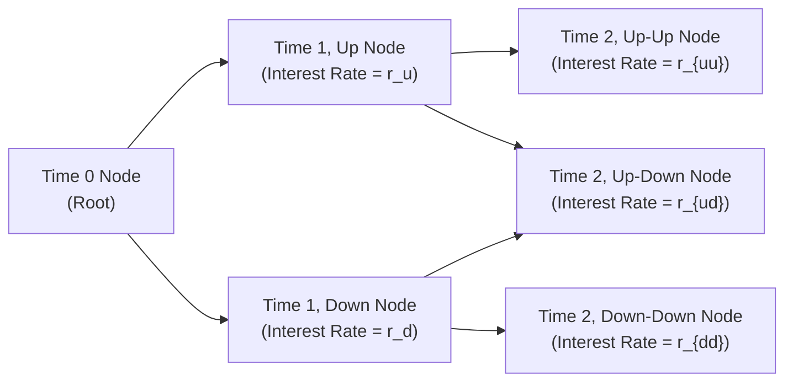
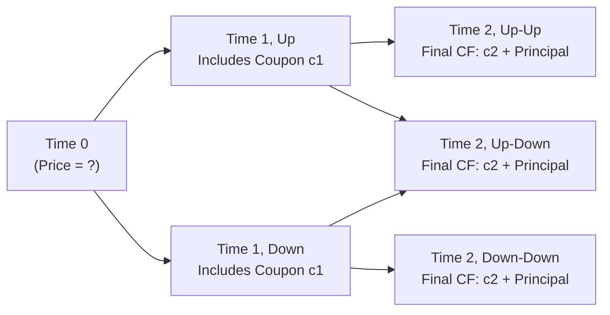

## Introduction and Overview

So, let’s imagine you’re holding this fancy multi-step binomial interest rate tree that you just built (hopefully referencing 8.1 on how to set it up and calibrate it). You’ve got different time steps, interest rates for each node, and maybe your friend, who’s just getting into finance, asks: “Okay, I see all these branches, but how do I figure out the price of a bond from this tree?” The short answer: backward induction. That’s how.

This approach might sound a bit backward (pun intended), because we usually think forward in time. But trust me—if you want to ensure an arbitrage-free valuation of bonds and other fixed income instruments, you begin at the end (the last time step) and work your way back to the present. The method is especially crucial for the CFA® Level II exam, where you’ll often see questions about pricing complex securities with optionality or credit risk. Let’s dig in and see how it works step by step, with some real-world context sprinkled in for good measure.

## Core Concepts Underpinning Backward Induction

### Risk-Neutral Valuation

Remember from your earlier studies (and maybe those endless nights with your notes) that in the binomial model, we typically use risk-neutral probabilities. In other words, we pretend that all investors are indifferent to risk and demand no extra risk premium. This assumption simplifies pricing by letting us discount expected cash flows at the risk-free rate in each branch. It might sound a little unrealistic, because in the real world we definitely do care about risk and demand compensation for it. But for theoretical pricing and exam success, it’s our go-to approach. This risk-neutral framework is the bedrock of how we discount future cash flows back to the present, ensuring no-arbitrage conditions hold.

### Step-by-Step Discounting

Backward induction effectively says: “We know how much the instrument is worth at the final time step—like at maturity or near maturity. Now, let's discount that value back to one step before, incorporating the probabilities and interest rates at each node. Then let’s keep discounting further until we get to time zero.” This step-by-step discounting is repeated at every single node in the tree, so yes, it can be a little tedious. But it’s thorough, and that’s why it’s so essential to both the exam and real-world practice.

### The Binomial Tree at a Glance

Below is a small diagram of a two-step binomial tree. Each node carries its own short rate (interest rate). The value at the final nodes is known (or can be easily found) based on the bond’s cash flows. You use those final values to compute the value of the preceding nodes, and so on, until you land at the root node at time zero.

## The Mechanics of Backward Induction

### 1. Final Time Node Valuation

At the far right of the tree—sometimes called time T—each node corresponds to a specific path of interest rate movements. For a plain-vanilla bond that matures at time T, the payoff at each final node is just the principal plus the final coupon. If you have a coupon bond that continues beyond T, it means your time horizon might differ from the maturity date, so you’d account for the bond’s price at time T. 

But let’s assume T is maturity. So you might see something like:

• Principal repayment: 100 (for a par bond)  
• Final coupon: let’s say 5  
• Total final cash flow: 105  

Well, once you have these final time step payoffs, you’re good to proceed.

### 2. One Step Back: Discounting from Final Nodes

From each node at T–1, you want to figure out the expected value (under risk-neutral probabilities) of the bond at T. Then you discount that expected value back at the short rate corresponding to the T–1 node.

Mathematically, if p is the risk-neutral probability of moving “up” in the tree, and (1 – p) is the probability of moving “down,” the value at time T–1 for a node is:


V_{T-1} = \frac{1}{1 + r_{T-1}} \Bigl( p \cdot V_{T,up} + (1 - p) \cdot V_{T,down} \Bigr)


Some folks prefer to use continuous compounding:


V_{T-1} = e^{-r_{T-1}\Delta t} \Bigl( p \cdot V_{T,up} + (1 - p) \cdot V_{T,down} \Bigr)


Either way, you’re using the node-specific rounding or discounting for that short rate, ensuring no confusion about which interest rate belongs to which node. 

### 3. Repeating the Process

After discounting from the final nodes to the T–1 nodes, the T–1 nodes become your new “final nodes” for the next iteration. So you do it again, discounting from T–1 to T–2, and so forth, until you get all the way to time zero. 
When it’s all said and done, the node at time zero is the theoretical fair value of your bond (or derivative, or structured product, or whatever you’re pricing).

### 4. Coupon Bond Twist

If your bond pays coupons at each period, you include those in the payoff immediately at that node. For example, if at T–1 you earn a coupon C, you add that coupon to your discounted expected future value. This means the node value at T–1 is:


V_{T-1} = \frac{1}{1 + r_{T-1}} \Bigl( p \cdot [V_{T,up} + C_{T,up}] + (1 - p) \cdot [V_{T,down} + C_{T,down}] \Bigr)


Though quite often, especially if the coupon is the same for the up and down states, you can factor that out, but you should be careful on the exam. Sometimes the coupon might not be the same in an up or down scenario if you have something like a floating-rate note whose coupon depends on the interest rate environment.

## Valuing Bonds with Embedded Options

So far, we’ve only considered a straight bond. But sometimes life is more complicated—like when you have a callable or putable bond. If you peek ahead to Chapter 10, you’ll see more about these embedded-option structures. In a nutshell:

• A callable bond allows the issuer to redeem the bond early (at a call price).  
• A putable bond allows the investor to sell it back to the issuer at a preset price.  

### Incorporating Exercise Decisions

In backward induction, each node at each time step must factor in the possibility of an exercise decision:

• For callable bonds: The bond’s value at any node is the minimum of (call price, the value from continuing). If it’s optimal for the issuer to call, you cap the node’s value at the call price.  
• For putable bonds: The bond’s value is the maximum of (put price, continuing value). If the investor chooses to exercise, you floor the bond’s value at the put price.  

It’s pretty straightforward logically, but easy to slip up during exam pressure if you forget to check whether that option is “in the money” or if it’s beneficial to exercise. The best approach is always to evaluate the bond’s “continuation value” (the price if neither party pulls any triggers) and then compare it with the call or put price.

### Example: Callable Bond at a Node

Let’s say you have a call price of 102. At a certain node, the bond’s computed value from continuing might be 106. But if the issuer can call at 102, they will. So the bond’s value is pinned at 102 for that node—because that’s presumably the cheaper route for the issuer. Then you take 102 and discount it back to the previous node. Re-do that for each node with the call option, and you have your complete tree-based valuation for a callable bond.

## Handling Default Probabilities or Credit Spreads

Level II might test your understanding of credit risk, though in practice you’ll see more advanced credit modeling in later chapters. But if you want to incorporate default probabilities or credit spreads:

1. Adjust the risk-neutral probabilities or discount rates to reflect default risk at each node.  
2. If there is a chance the bond pays zero (or recovers some fraction of par) in default, reflect that potential payoff in the final or intermediate node.  
3. The rest—well, it’s basically the same backward induction formula.  

You might rely on an adjusted yield (risk-free plus a credit spread) for each node, or you might explicitly incorporate a probability of default times the recovery value. Either approach can be tested on the exam, so be sure you keep your eyes on the details of the item set.

## Common Pitfalls in Backward Induction

It’s easy during an exam scenario—especially if you’re sleep-deprived or overly caffeinated—to slip up here and there. Watch out for the following:

• Mixing up the short rates: Each node can have a different short rate. Don’t discount with the wrong one.  
• Forgetting the coupon: This is where a lot of folks get partial credit taken away. If there’s a coupon at that node, you better add it.  
• Misapplying option exercise logic: For a callable bond, it’s the *minimum* of the call price or the continuation value. For a putable bond, it’s the *maximum*.  
• Confusing actual probabilities with risk-neutral probabilities: The key to the binomial model is using risk-neutral probabilities, which might differ from real-world or “physical” probabilities.

Trust me, I’ve personally messed up a few times on practice quizzes by forgetting a coupon or applying the call feature incorrectly, so double-check each step. Coming from experience, that small oversight can be the difference between an easy point and a frustrating partial credit scenario.

## Practical Example: Two-Step Binomial Tree for a Five-Percent Coupon Bond

Let’s walk through an example to make all this concrete. Suppose you have a two-year bond (annual coupons). The face value is 100, coupon is 5% (i.e., $5 per year). The short rate at the root (time 0) is 4%. There’s an up factor of 1.15 and a down factor of 0.90 for the interest rate each year. Risk-neutral probability p is 0.50 for up or down movements. Let’s keep this basic.

1. Time 0 short rate = 4%  
2. If the rate goes up in the first year, it becomes 4% × 1.15 = 4.60%. If it goes down, it becomes 4% × 0.90 = 3.60%.  
3. In year 2, from the up node, it might go up again or down—so you have an up-up and an up-down node. Similarly, from the down node, you have a down-up and down-down node, each with different short rates.  

We lay out the final payoffs:

• At time 2, the bond pays principal (100) plus the final coupon (5) = 105.  

Now do backward induction:

• Step 1: Value at each final node. That’s 105 (assuming no credit risk, no embedded options).  
• Step 2: Value at each time 1 node. Discount the final payoff by the short rate at that node, with the risk-neutral probabilities. For instance, if from the up node, the second-year short rate can be r_uu or r_ud, you do:


V_{\text{up node}}(t=1) = \frac{1}{1 + r_{\text{up node}}} \Bigl( p \cdot 105 + (1 - p) \cdot 105 \Bigr) + \text{(coupon if it’s paid at } t=1\text{)}.


Here, you also add the coupon you receive at time 1 (which is 5). That coupon is not uncertain—if you hold the bond, you get it. So your formula at time 1 is effectively:


V_{t=1,\text{ up}} = 5 + \frac{1}{1 + r_{\text{up node}}} \left( p \cdot 105 + (1 - p) \cdot 105 \right).


• Step 3: Discount from time 1 to time 0. The final step sums the expected next-step values (which we just computed) and discounts by the time 0 short rate (4%). The result is the bond’s fair price at time 0.

Yes, it might be a bit tedious to do by hand. In a real exam scenario, you have to be sure you label each node clearly, especially if you get a multi-step tree with multiple coupons. But that’s how binomial trees roll.

## Exam Tips and Tricks

• Lay out your timeline and label each coupon payment carefully. I usually write them out as t=1, t=2, etc., and specify “coupon = 5” so I don’t omit it.  
• If there's an embedded option, highlight the call or put price on your scratch paper or in the margin. Compare the node’s value to that price each time you do a discount step. This ensures you won’t forget to apply the min/max logic.  
• Double-check your discount rates. Many item sets might provide an up and down factor that apply to yields or short rates in a way that’s easy to mix up.  
• Watch the exam time. Sometimes a binomial question can be computationally heavy. Use your time wisely, and maybe do a quick check of arithmetic or a reasonableness check: is the price approximately near par if rates are near the coupon? That can catch big errors.  

## Real-World Perspectives

In practice, you might use software like Excel, Python, or specialized vendor pricing tools to implement backward induction at scale. If you’re working with large portfolios (like in a bond desk at a major bank), performing these valuations by hand is a no-go. But the conceptual understanding remains. You set up your tree, calibrate rates, incorporate credit risk or optionalities, and discount back. It’s still a robust method, and if you’re in the trenches of structured products (like mortgage-backed securities) you’ll see more elaborate trees or expansions into Monte Carlo (hint: see Chapter 9). Yet, that’s why we spend so much time nailing the fundamentals at the exam level.

## Additional Diagrams for Conceptual Clarity

It might help to see a simplified coupon-bond tree referencing the coupon additions. Here's a little schematic imagining coupon flows at each node:

The idea is: at each node, you add the coupon payment for that period (if it’s a coupon date). Then from the final period, discount everything back step-by-step. This is the essence of backward induction.

## Challenges and Best Practices

• Keep track of partial periods: If your coupon is semiannual and you’re building a binomial tree with monthly steps, it gets tricky. You might have to accumulate partial coupons or use fraction-of-year discount factors.  
• Check the model’s calibration: If the model’s up-and-down factors don’t reflect the actual yield curve environment, you might get weird valuations that contradict observable market prices. Typically, we adjust the up/down factors or the probability p to match a known yield curve (see 8.1 on building and calibrating the tree).  
• Compare with alternative methods: Sometimes you’ll see forward-rate approaches or a multi-step spot rate analysis. Understanding how backward induction lines up with them can give you a sense of consistency checks (like cross-verifying with bootstrapped zero rates from Chapter 4).

## References for Further Reading

• Tuckman, B., & Serrat, A. (2011). Fixed Income Securities: Tools for Today’s Markets (3rd ed.). Wiley.  
• CFA Institute. (n.d.). Reading on Binomial Trees in Fixed Income Valuation [Curriculum Resource].  
• Fabozzi, F. J. (2016). Bond Markets, Analysis, and Strategies (9th ed.). Pearson.  

These resources dive deeper into the math, risk-neutral derivations, and advanced embedded option modeling. They also provide a wealth of practice examples to sharpen your exam readiness.

Anyway, that’s the grand tour of backward induction. Be systematic, label everything, watch out for embedded options, and you’ll do great, not only in exam-style item sets but also in real-world valuations.  

## Test Your Knowledge: Backward Induction in Binomial Trees



### In a binomial interest rate tree, which best describes the concept of backward induction?

- [ ] Projecting cash flows forward and inserting discount factors at each node.  
- [x] Taking known future node values and discounting them back through intermediate nodes until reaching the present.  
- [ ] Averaging the node values at each period and adjusting for expected coupons.  
- [ ] Updating the tree at each node using historical yields to find the present value.  

> **Explanation:** Backward induction starts with the known or estimated values at the final nodes and discounts them step by step to arrive at the present value.

### Which of the following best reflects the node value in a binomial tree for a coupon-bearing bond?

- [x] Computed as the discounted expected future bond value plus any coupon received at that node.  
- [ ] Always equal to the face value of the bond, adjusted for accrued coupon.  
- [ ] Simply the average of the up and down values discounted at the risk-free rate.  
- [ ] Minimum of the call price and the face value.  

> **Explanation:** For a coupon-bearing bond, you add the coupon to the expected discounted future value. If there is an embedded option, the min/max logic might apply, but fundamentally, coupon + discounted expected future value is key.

### A callable bond’s value at a given node is determined by:

- [ ] Adding the coupon, if any, to the expected future value.  
- [x] Taking the minimum of the call price and the discounted expected continuation value.  
- [ ] Taking the maximum of the call price and the discounted expected continuation value.  
- [ ] Averaging the next period’s up and down continuation values.  

> **Explanation:** If a bond has a call feature, at any node its value can’t exceed the call price because the issuer would choose to call and pay the bondholder that price if the continuation value is higher.

### In the binomial model, what is the primary function of risk-neutral probabilities?

- [ ] They reflect historical averages of interest rates.  
- [ ] They represent the probability that the Fed will raise rates.  
- [x] They allow pricing by eliminating risk premiums, ensuring expected returns are the risk-free rate.  
- [ ] They reduce the complexity of the model by averaging up and down movements.  

> **Explanation:** Risk-neutral probabilities remove risk aversion from the model. Under these probabilities, all assets are expected to grow at the risk-free rate, facilitating no-arbitrage pricing.

### When discounting a future payoff at a node in a binomial tree, which interest rate should be used?

- [x] The short rate (or spot rate) specifically corresponding to that node’s state.  
- [ ] Always the average of the up and down short rates.  
- [x] A normal distribution-based interest rate if volatility is low.  
- [ ] The yield to maturity of a similar maturity Treasury.  

> **Explanation:** You must use the rate implied by that node—each node has its own short rate or discount rate to properly capture the path-dependent nature of the binomial tree. 

### For a putable bond valued via backward induction, which statement is correct?

- [x] The bond’s value at each node is the maximum of the put price or the continuation value.  
- [ ] The bond’s value at each node is the minimum of the put price or the continuation value.  
- [ ] The bond’s value at each node is always discounted at the credit spread.  
- [ ] The put cannot be exercised until maturity.  

> **Explanation:** The put feature gives the holder the right to sell the bond back. Thus, at each node, if the continuation value is lower, the holder would exercise and take the put price, so the node’s value is the maximum of those two.

### Which is a common pitfall when applying backward induction for a coupon bond?

- [x] Failing to include coupon payments at intermediate nodes.  
- [ ] Using risk-neutral probabilities for discounting.  
- [x] Accidental double-counting of the coupon in the final payoff.  
- [ ] Relying on more than two steps in the binomial tree.  

> **Explanation:** A major pitfall is forgetting to add the coupon to the bond’s value at each relevant node or incorrectly applying it. Another pitfall is double-counting, so you must be consistent and accurate with coupon inclusion.

### In a two-step binomial tree, if the short rate in the up node is higher than the down node’s rate, what happens to the bond’s discounted value in the up node?

- [x] It decreases because a higher discount rate leads to a lower present value.  
- [ ] It increases in proportion to the coupon payment.  
- [ ] It remains unchanged, as the risk-neutral probabilities adjust.  
- [ ] It can only go up if the bond is callable.  

> **Explanation:** Higher rates reduce present values, so the node value in the up node will be discounted at a higher rate, generally leading to a lower present value relative to the node that uses a lower discount rate.

### Which step is the last step in the backward induction process?

- [x] Discounting from the first step (time 1) back to time 0 to arrive at the current bond price.  
- [ ] Averaging final payoffs to derive a single present value estimate.  
- [ ] Setting risk-neutral probabilities as 0.5 each.  
- [ ] Adjusting default probabilities in each node.  

> **Explanation:** The final discounting step is always from the first node(s) back to the root node at time 0, which yields the fair price of the bond or derivative today.

### True or False: In backward induction, once you reach the root node at time zero, you have the fair value of the security.

- [x] True  
- [ ] False  

> **Explanation:** By definition, backward induction starts with all future payoffs and discounts them back. Once you reach the beginning of the tree (the root node), that’s the current fair value.



 

**Final Advice:**  
Keep practicing these step-by-step processes until they become second nature. As you head into the CFA exam, you might find a question set that has you piece together binomial up and down movements, discount the resulting payoffs, and factor in a call or put. Don’t be intimidated; just start at the final nodes, methodically discount back, carefully add coupons, and keep track of embedded option triggers. And yes, double-check your arithmetic!

If you’d like more detail or want to see advanced multi-step examples, head to the references listed above or see Chapter 8.3 for more on forward probabilities, as well as Chapter 10 for an even deeper exploration of embedded options in fixed income. Good luck, and remember, clarity and caution in your calculations go a long way in securing a solid result on exam day!
