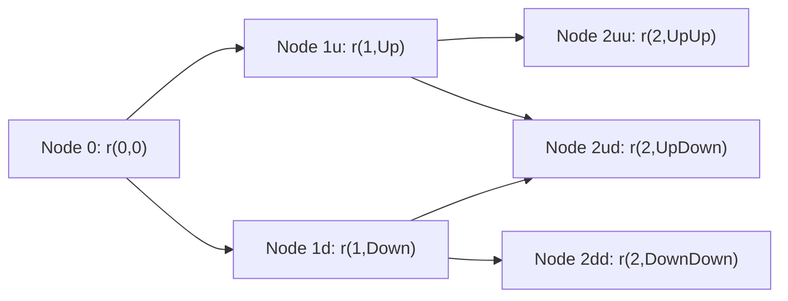

Whenever we dive into binomial models for interest rate dynamics—particularly in a CFA Level II context—we quickly bump into a concept called “risk-neutral” probabilities. I remember my first encounter with these probabilities quite vividly: I was chatting with a colleague who insisted that the probability of an up or down move in the tree should match real market data. But then a more experienced friend tapped my shoulder and said, “Well, not exactly. For valuation, you only need the risk-neutral measure. The real-world numbers may mean something in forecasting, but if you want consistent pricing, risk neutrality is your friend.” And, yep, that was a lightbulb moment that changed how I viewed binomial trees forever.

Risk-neutral probabilities underlie the logic that all assets, on average, are assumed to grow at the risk-free rate in a world free of arbitrage. You might hear the phrase “investors are indifferent to risk” in this context. But that’s just a fancy way of saying we’re using a special probability measure that makes discounting at the risk-free rate valid. This principle is huge in price modeling for options, interest rate products, and basically everything else in many corners of financial mathematics.

Understanding risk-neutral probabilities is especially crucial in binomial interest rate tree models, where each node represents a possible future short rate. In each step, we typically assume the rate can move either “up” or “down.” Then, after calibrating the up factor (u), down factor (d), short rate (r), and the time step (Δt), we apply the well-known formula:


p \;=\; \frac{e^{r \,\Delta t} - d}{u - d}.


It’s one of those essential formulas that you just kind of memorize early on, but it pays to understand why it works—and why it’s not necessarily the same as the probability you’d get from actual historical data. Let’s break down that logic and then tie it to forward interest rates and calibrations to the current yield curve.

Key Themes in the Risk-Neutral Approach
---------------------------------------

• The goal of risk-neutral pricing is to eliminate any possibility of arbitrage. In other words, we assume a world where there’s no systematic way to earn a riskless profit greater than the risk-free rate.  
• Under the risk-neutral measure, the expected return of any asset must be the risk-free rate (when we discount future cash flows at that same risk-free rate).  
• Real-world probabilities (sometimes called “physical” or “objective” probabilities) capture how often events actually happen. In contrast, risk-neutral probabilities are purely a device for valuation. They’re the engine of discounting in a binomial tree.  
• The binomial tree is constructed by specifying up and down factors for short rates, and we then use p (the risk-neutral probability) to compute expected cash flows at each node. Then we discount those expected cash flows back at the short rate in each node, iterating backward through the tree.

Why Real-World Probabilities Are Not the Same
---------------------------------------------

Let’s say that historically, interest rates “go up” more often than “go down.” You might think, “Ah, so p must be something like 0.7 or 0.8.” But in the risk-neutral framework, it could turn out that p is 0.5 once you calibrate the model to eliminate arbitrage. If your real-world data says one thing but the no-arbitrage condition says another, guess which measure we use for pricing? Always the no-arbitrage measure. Real-world frequencies shape expectations and scenario analyses, but not the discounting engine.  

What’s fascinating is that in a no-arbitrage environment, you can twist the probabilities in such a way that every asset’s expected growth is the risk-free rate, and that’s done precisely via this “risk-neutral probability.” The tie to reality is that market prices of securities embed all sorts of risk premiums that effectively shift these probabilities in the pricing context.  

The Formula for p
-----------------

Our star formula is:


p = \frac{e^{r \Delta t} - d}{u - d},


where:
- \\(r\\) is the continuously compounded risk-free rate applicable over the time step \\(\Delta t\\).  
- \\(u\\) is the up factor, describing how much the short rate can jump upward.  
- \\(d\\) is the down factor.  
- \\(\Delta t\\) is the length of each step in the binomial tree (for instance, 0.5 years or 1 year).  

Geometrically (or in a more intuitive sense), the expression \\( e^{r \Delta t} \\) is the growth factor for one period at the continuous risk-free rate. Notice that if the up move is smaller than \\( e^{r \Delta t} \\), that might produce a p bigger than 1, which is obviously invalid. So you do want to check that your up/down factors are consistent with the model.  

Here’s the short story: p is the “probability” of an up move you use for pricing; (1 – p) is the probability of a down move. Both must lie strictly between 0 and 1, which is one key sanity check in building your binomial tree.  

Diagramming a Simple Two-Period Tree
------------------------------------

To see how risk-neutral probabilities fit in, let’s sketch a simple binomial interest rate tree (with generic placeholders for the short rates):



At each node, you’d calculate the short rate. The up move from A to B uses factor u; the down move from A to C uses factor d; and so on. We assign probability p to going “up” and 1–p to going “down.” These probabilities are the risk-neutral ones.  

When we want to value a bond, for instance, at the final nodes (D, E, F), we know the bond’s payoff (e.g., par plus coupon). Then we discount that payoff back to Node 1. But the discounting rate at Node 1 is r(1,Up) if we’re in the up node, or r(1,Down) if we’re in the down node. The expected payoff under risk-neutral probabilities at Node 1 is:


\text{Value}(1) = e^{-r(1)\,\Delta t} \Big( p\,\text{Value}_{\text{up}}(2) + (1-p)\,\text{Value}_{\text{down}}(2) \Big).


We then discount again from Node 1 back to Node 0, repeatedly applying the appropriate short rates. The outcome, if everything is consistent, will reflect the arbitrage-free price.

Forward Rates: Calibrating the Tree to Market Data
--------------------------------------------------

Now, you might be wondering how we pick u, d, or even r in the first place. The binomial model is typically calibrated to match the observable yield curve. By matching the spot rates (or forward rates) in the initial “layer” of the tree, we ensure that the theoretical bond prices the model generates line up with actual bond prices in the market.  

Forward rates are basically the market’s implied interest rates for future periods, derived from the current zero-coupon curve or par-coupon curve. For instance, if the yield curve tells us that the implied 1-year forward rate two years from now is 3%, we want our binomial tree to produce an average short rate at that time that lines up with 3%. And we accomplish that by carefully choosing the up and down moves, as well as ensuring the risk-neutral probabilities are plugged in.  

Practitioners often do iterative procedures (sometimes called “bootstrapping the binomial tree”) to ensure the model exactly (or very closely) replicates the market yield curve. If you get a mismatch, you tweak your up/down factors or your short rates until the model is properly calibrated.  

On top of that, you can do advanced calibrations that incorporate certain volatilities. For instance, you might want the tree’s short-rate volatility to match a certain observed volatility in the short end of the curve. That can refine your model as well, though you need to be mindful that the more constraints you impose, the trickier it can be to solve for the tree parameters.  

Practical Tip: Watch Out for p < 0 or p > 1
------------------------------------------

Oh, yes, we’ve all been there. There’s this moment you compute p with the formula and you get something weird like 1.2 or –0.15. Oops. That means your chosen up/down factors, time step, or interest rate might not be consistent with an arbitrage-free framework. It could be you set u too low or d too high (or some mismatch in how you incorporate the risk-free rate).  

So always do that quick glance—and if you see p not in (0,1), it’s a strong red flag. Market data can sometimes be contradictory or feed into your calibration in ways that produce nonsense. That’s a sign you need to refine your approach.  

Real-World vs. Risk-Neutral: A Common Pitfall
---------------------------------------------

It’s so tempting to interpret the binomial tree probabilities as “This means there’s a 60% chance rates go up next year.” But from an actual forecasting perspective, that might not be accurate. The 60% we’re referring to is the probability that equates the present discounted value of the up and down outcomes to the asset’s current price (in a frictionless, no-arbitrage world).  

In reality, the chance of a rate hike might be 80%, or 30%, or some other figure. But for pricing a bond or interest rate derivative, your job is to use the risk-neutral measure. The rest is an aside or potentially relevant to risk management or scenario planning—but not the discounting at the risk-free rate.  

Advanced Considerations and Adjusted Measures
--------------------------------------------

In more intricate models—including those that incorporate credit risk, currency risk, or equity risk—practitioners extend the risk-neutral approach across different asset classes. That’s done by choosing a “numeraire” (like a bank account growing at some rate, or a zero-coupon bond with a particular maturity) and ensuring all discounted asset prices remain martingales (i.e., they don’t drift relative to that numeraire).  

Some folks adjust the measure slightly for, say, collateral costs, central clearing fees, or credit spreads, leading to “adjusted” risk-neutral measures. The key idea remains the same: build a measure under which no arbitrage is possible, and you can discount at an appropriate “risk-free–like” rate (which might be the rate net of certain adjustments).  

A Quick Numerical Example
-------------------------

Suppose we have a one-period binomial model:

- Current short rate, r(0) = 2% annualized, continuous compounding.  
- Time step, Δt = 1 year.  
- u = 1.10 (i.e., rates can go up by 10%).  
- d = 0.90 (i.e., rates can go down by 10%).  

We want to find p, the probability of the up move under the risk-neutral measure. Then we’re going to price a 1-year zero-coupon bond that’s paying 100 at maturity from the perspective of one more year out.  

First, compute:  

e^{r(0) \Delta t} = e^{0.02 \times 1} = e^{0.02} \approx 1.0202.


Then,  


p = \frac{1.0202 - 0.90}{1.10 - 0.90} = \frac{0.1202}{0.20} = 0.601.


So the risk-neutral probability for an up move is roughly 0.601.  

Now, if the short rate goes up, the rate for that next year might be r_up. If the short rate goes down, it might be r_down. You get these from your binomial tree assumptions about how the short rate evolves. The bond price at maturity is 100 either way, so let’s keep it super simple and discount that 100 at e^{-r(t+1)}.  

This example might be more relevant if we had two periods, but the gist stands: you use p = 0.601 to weigh the two possible payoffs under an arbitrage-free lens.

A Python Snippet
----------------

Here’s a small code snippet that calculates p given u, d, r, and Δt:

```python
import math

r = 0.02      # 2% continuously compounded
u = 1.10
d = 0.90
dt = 1.0

growth_factor = math.exp(r * dt)  # e^(r * dt)
p = (growth_factor - d) / (u - d)

print(f"Risk-neutral probability p = {p:.4f}")
```

If you run this code, you should see p around 0.601 as in our manual calculation.

Multi-Period Extension (Conceptual)
-----------------------------------

For multi-period trees, you repeat this process at each node, but you might incorporate different short rates along the way. Each node can have its own local short rate r(i), and that local r might differ from the initial r(0). Then, at each node, the up or down factor might remain the same or could vary if you’re calibrating a more sophisticated model.  

Once you have these local short rates, you can again compute p at each node. In some simpler binomial frameworks, we assume a constant p throughout the tree for simplicity, but in reality, p might vary depending on time or the level of interest rates.

Applications in Other Asset Classes
-----------------------------------

The idea of risk-neutral valuation extends easily to equity, FX, and commodity markets. You just shift your perspective: for options on stocks, you might discount at the risk-free rate if there are no dividends or other frictions. For currency, you might use cost-of-carry relationships. The principle stands: define a measure so that discounted asset prices form a martingale.  

Common Pitfalls
---------------

• Mixing real-world probabilities with risk-neutral probabilities. This is extremely common, and it can lead to incorrect discounting if you inadvertently use real-world probabilities in your binomial model.  
• Letting p slip outside the (0,1) range. That’s often an indicator that your up/down factors or interest rate assumptions are not consistent with no-arbitrage.  
• Forgetting to calibrate the model to the observed yield curve. If you don’t calibrate, your binomial tree is just a random theoretical construct that might not reflect market realities.  
• Misinterpreting forward rates. Some folks think forward rates are an exact forecast of future rates. They’re not predictions per se; they’re implied rates that make today’s bond prices consistent with no-arbitrage.  

Exam Tips
---------

• Show your steps in computing p. It’s easy to lose partial credit if you skip the detail.  
• Watch the difference between continuously compounded vs. simple annualized rates. The formula for p is typically shown with continuous rates, but you can adapt it.  
• In item-set or vignette-style questions, they might give you partial info: say the yield curve or the forward rates, plus a bond price or an option price. You have to use that data to back into the up/down moves and p.  
• Double-check if r is a short rate that changes each period. If so, you might need to recalculate p node by node.  
• They love to test whether you know that risk-neutral probabilities differ from actual probabilities. You might see answer choices that talk about “market-likelihood of up moves.” Resist that trap.  

Concluding Thoughts
-------------------

From personal experience, once you grasp risk-neutral probabilities, you’ll find binomial tree valuation far more intuitive: you’ll see it as a mechanical process of applying p in an arbitrage-free world. It might feel a bit counterintuitive that we’re ignoring “real” probabilities, but for pricing, that’s how you ensure consistency with modern financial theory.  

And, well, that’s the big takeaway. If you see a binomial model question on the exam (which is highly likely in any advanced fixed-income or derivatives context!), remember:  
1) Identify the short rate or discount factors for each node.  
2) Compute the risk-neutral probability using the correct formula and ensure it’s valid.  
3) Use those probabilities to find the expected payoff in the next step, discount at the node’s appropriate short rate, and iterate backward until you arrive at the present value.  

Best of luck on your exam prep—risk neutrality is your friend!

References and Further Reading
------------------------------

• Cox, J. C., Ross, S. A., & Rubinstein, M. (1979). “Option Pricing: A Simplified Approach.” Journal of Financial Economics.  
• CFA Institute Learning Ecosystem – Full coverage of binomial tree construction, risk-neutral probabilities, and forward rate calibration.  
• Hull, J. (2022). Options, Futures, and Other Derivatives. (For broader coverage on risk-neutral pricing across derivatives markets.)

Test Your Knowledge: Risk-Neutral Probabilities and Forward Rates
-----------------------------------------------------------------



### Which statement best describes the role of risk-neutral probabilities in a binomial interest rate tree?

- [ ] They represent the real-world frequency of up and down moves.
- [x] They allow cash flows to be discounted at the risk-free rate, ensuring no arbitrage.
- [ ] They ensure bond prices incorporate historical data.
- [ ] They are directly observed in market data.

> **Explanation:** Under the risk-neutral measure, we assume that all assets grow at the risk-free rate. These probabilities are not the real-world frequencies but are used in pricing to guarantee no-arbitrage valuations.


### You compute p using (e^(rΔt) – d) / (u – d) and get 1.05. Which of the following is the most likely conclusion?

- [ ] p simply needs rounding to be between 0 and 1.
- [ ] The real-world probability is different from the risk-neutral probability.
- [ ] The binomial model must have incorrectly accounted for bond coupons.
- [x] The chosen up/down factors or interest rate assumptions are leading to an arbitrage inconsistency.

> **Explanation:** If p is outside the interval (0,1), the model is not arbitrage-free. You must revisit your up/down factors or your rate assumptions.


### What does it mean to calibrate a binomial interest rate tree?

- [ ] Match the tree’s outcome probabilities to historical rate movements.  
- [ ] Ignore the current yield curve to focus on long-term norms.  
- [x] Adjust the up/down factors (and possibly the short rate) so that model prices align with observed market bond prices.  
- [ ] Switch from continuous compounding to simple compounding.  

> **Explanation:** Calibrating ensures that the binomial model produces bond (or derivative) prices consistent with those trading in the market, reflecting the current yield curve and no-arbitrage conditions.


### All else equal, if u increases (holding d constant), how does it typically affect the risk-neutral probability p?

- [x] p tends to decrease.  
- [ ] p tends to increase.  
- [ ] p stays the same.  
- [ ] p becomes indefinite since the formula doesn’t work.  

> **Explanation:** Since p = (e^(rΔt) – d) / (u – d), raising u (with d fixed) increases the denominator, causing p to decrease.


### Which of the following best reflects the relationship between forward rates and the binomial tree?

- [x] We set the binomial tree parameters so that modeled short rates match implied forward rates from the yield curve.  
- [ ] Forward rates are used solely to predict central bank policies.  
- [ ] The binomial tree is only concerned with historical spot rates.  
- [ ] The binomial tree is incompatible with forward rate analysis.  

> **Explanation:** Forward rates implied by the current yield curve guide how we calibrate the up/down rates in each period of the binomial tree. This ensures the model is consistent with observed market data.


### In risk-neutral pricing, which of the following statements is correct?

- [x] The expected return on all securities equals the risk-free rate.  
- [ ] The expected return on each security equals the security’s beta times the equity premium.  
- [ ] Investors are assumed to prefer high-beta assets.  
- [ ] Historical data determines the discount rate on each node.  

> **Explanation:** Under the risk-neutral measure, every asset’s expected return is the risk-free rate when discounted under that same measure, guaranteeing no-arbitrage.


### Suppose we have a two-period binomial model. Which step is part of the standard procedure for pricing a bond in this tree?

- [x] Compute the bond’s final payoffs in each terminal node, discount them back by the short rates in the preceding nodes, and continue until reaching the initial node.  
- [ ] Estimate the real probability of each node, then multiply by the short rate.  
- [ ] Only consider the final node’s rates and ignore intermediate nodes.  
- [ ] Assume the bond’s coupon is fully reinvested at the risk-free rate outside the tree structure.  

> **Explanation:** Standard binomial bond pricing uses backward induction: at each node, we take the expected payoff (under risk-neutral probabilities) discounted at the local short rate, then roll back until we reach time zero.


### If a binomial tree is not properly calibrated to market data, the likely outcome is:

- [x] Model-implied bond or derivative prices that deviate significantly from actual market prices.  
- [ ] The same results as a well-calibrated tree, just with different short rates.  
- [ ] A definitive blueprint for real-world interest rate forecasts.  
- [ ] Eternal probabilities always equaling 0.5.  

> **Explanation:** Without calibration, the model’s implied prices won’t match those observed in the market, undermining its valuation usefulness.


### When applying the risk-neutral approach in a multi-currency model, one must:

- [ ] Use the same discount rate for all currencies.  
- [x] Extend the risk-neutral measure to each currency pair, acknowledging each currency’s risk-free rate.  
- [ ] Discard interest rate parity relationships.  
- [ ] Apply only the domestic risk-free rate and ignore foreign yields.  

> **Explanation:** In multi-currency contexts, each currency has its own risk-free rate, and part of the approach includes ensuring no arbitrage across currency pairs and forward exchange rates.


### The statement “Under risk-neutral valuation, the expected present value of a derivative’s payoffs is equal to its market price” is:

- [x] True  
- [ ] False  

> **Explanation:** This is precisely the cornerstone of risk-neutral pricing in a no-arbitrage framework: the derivative’s current price is the discounted expected payoff under the risk-neutral measure.


