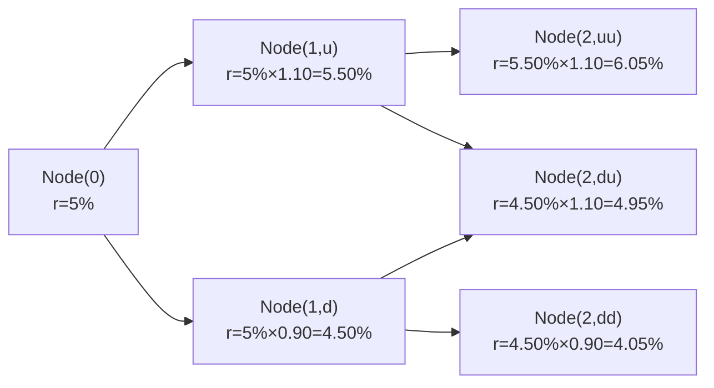

## Introduction and Context

Sometimes, reading about theoretical models can feel a bit abstract, right? You learn about binomial trees, risk-neutral probabilities, up-factors, down-factors, and then… what do you actually do with them? In this section, we focus on how the CFA® Level II exam might present a mini scenario (often called a vignette) on pricing coupon bonds with a binomial interest rate tree. You’ll see how the exam could give you partial data—like a partially constructed interest rate tree—and then ask you to find the bond’s price today, the price at each node, and maybe even the option value if it’s a callable or putable bond. We’ll untangle the process in plain language, so you can confidently maneuver through the item set under time pressure.

We’ve all had that moment when you’re halfway through a big binomial problem, glance at your watch, and realize how quickly time is ticking. So let’s unpack the steps carefully. You’ll see we’ll circle back to these same steps at the end with a simpler example and a short quiz so you can test your readiness. 

## Why Binomial Trees for Coupon Bonds?

A binomial interest rate tree helps you analyze potential shifts in interest rates over discrete time steps—like one-year intervals. At each node, the short-term (or spot) interest rate can “move up” or “move down” over the next period. The bond’s cash flows are then valued under each possible interest rate path, and you apply risk-neutral probabilities to derive the expected present value (PV). Because we’re dealing with coupon bonds, we’ll have periodic coupon payments plus principal redemption at maturity.

A quick personal note: the first time I tried building a binomial model during a practice exam, I forgot to incorporate the coupon at each node. I was just swinging for the final payoff and ended up with an incorrect answer. So, yeah, don’t forget to add your coupon flows at every step—those can be easy to miss under exam pressure.

## Basic Ingredients in a Vignette

Exam vignettes on this topic typically include several data points:

- The current short-term interest rate, r(0).  
- The up-factor (u) and down-factor (d), which show how interest rates evolve from one period to the next.  
- The risk-neutral probability, p, which we’ll use for expected cash flow calculations.  
- A partial binomial tree that lays out interest rates at each future node. Sometimes you have to fill in the missing up or down nodes.  
- The bond’s details: face (par) value, coupon rate, maturity, and any embedded options (callable or putable).  
- Possibly an assumption about the reinvestment of coupons if the question requires it.

Often, you’ll see something like:

• Time horizon: 2 or 3 years.  
• Coupon: a fixed percentage of par, paid annually (or semiannually, if so stated).  
• Stated maturity date.  
• Possibly a call or put price on a certain date.  

And then the question might read: “Compute the fair price of the bond today. Compute the value of the embedded call option. Show how an increase in volatility (changing u and d) would alter the bond’s fair value.”  

## Fundamental Steps in the Pricing Process

While we’re not numbering headings, we can certainly number process steps in the body. Here’s how you might approach the item set:

1) Identify each node’s interest rate.  
2) Calculate the bond’s cash flow at each terminal node. If the bond matures in two years, you’ll include the coupon plus the par value at that date. If it doesn’t mature, you’ll factor in only the coupon.  
3) Work backward one step using the risk-neutral probabilities to get the expected bond value, discounting at the relevant one-period rate in that node.  
4) Repeat backward until you get to time zero.  
5) If the bond has an embedded call or put, apply the call/put decision at each node—that is, the issuer (call) or the holder (put) may exercise if it is optimal.  
6) The price at time zero after all backward calculations is the fair price (or arbitrage-free value).  

This approach is sometimes called backward induction. You sweep from the final nodes (where you know precisely how much the bond will pay) backward to the present, removing any guesswork since you incorporate the possible up or down rates and their respective probabilities.

## Quick Refresher: Risk-Neutral Probability

In the risk-neutral world used for pricing, probabilities are not necessarily the “real” probabilities that reflect actual market-likelihood events. Instead, they’re adjusted so that all assets grow at the risk-free rate in expectation. The formula for the one-period framework often goes like this:


p = \frac{(1 + r_{\text{f}}) - d}{u - d},


where:  
- \\( r_{\text{f}} \\) is the risk-free rate (or short rate).  
- \\( u \\) is the up-factor (e.g., 1.10 if rates move up 10%).  
- \\( d \\) is the down-factor (e.g., 0.90 if rates move down 10%).  

The expected value of the bond’s payoff is then multiplied by \\( p \\) for the up-state and \\( (1 - p) \\) for the down-state. Each node’s value is discounted at the local interest rate for that node.

## Visualizing a Two-Step Tree

Let’s picture a small 2-step binomial interest rate tree:

• Current short rate = 5%  
• Up-factor, \\(u\\) = 1.10  
• Down-factor, \\(d\\) = 0.90  
• Risk-neutral probability, \\(p = \frac{(1+0.05) - 0.90}{1.10 - 0.90} = \frac{1.05-0.90}{0.20} = \frac{0.15}{0.20} = 0.75.\\)  
• Bond: 2-year maturity, pays a 5% annual coupon and then returns par value (assume \$100) at the end of Year 2.

We can depict the rates with a simple Mermaid diagram:

Note that Node(2,ud) and Node(2,du) recombine, resulting in a single rate of 4.95%. That’s why binomial trees in this setup are often called “recombining trees.”

### Calculating the Bond’s Payoffs at Final Nodes

- At Year 2, the bond matures. So bond payoff = Coupon + Par = \$5 + \$100 = \$105.  
- We have 3 possible Year 2 rates: 6.05%, 4.95%, 4.05%. But no matter what, the bond pays \$105 at maturity in each scenario (assuming no default risk).  

### Discounting Back to Year 1

We’ll do this for each Node(1). The discount factor for a node is \\( \frac{1}{1 + \text{(rate at that node)}} \\). 

Let’s compute the expected value at Node(1,u):

1. The possible Year 2 values that Node(1,u) leads to are Node(2,uu) and Node(2,ud).  
2. The bond’s payoff in either scenario is \$105.  
3. Risk-neutral probability from Node(1,u) to Node(2,uu) or Node(2,ud) is still \\(p=0.75\\) for the up move (relative to that node) and \\(1-p=0.25\\) for down.  
   
   So expected payoff from Node(1,u) =  
   
   0.75 \times 105 + 0.25 \times 105 = 105.
     
   (Yes, interestingly it’s the same because the bond’s final payoff is \$105 in either up or down move at Year 2, ignoring interest rate risk for default-free bond redemption.)  
4. We discount this at 5.50% (the rate at Node(1,u)).  

   Present Value at Node(1,u) =  
   
   \frac{105}{1 + 0.055} = 99.53 \quad (\text{approx.})
   

Next, do the same for Node(1,d). The final payoffs are still \$105 in each case:

- Probability of going up (du) from Node(1,d) is 0.75.  
- Probability of going down (dd) from Node(1,d) is 0.25.  
- Expected final payoff = 0.75 × 105 + 0.25 × 105 = 105.  
- Discount at 4.50%:

  Present Value at Node(1,d) =  
  
  \frac{105}{1 + 0.045} = 100.48 \quad (\text{approx.})
  

### Adding the Coupon at Year 1

We must not forget that the bond pays a 5% coupon at the end of Year 1. That means at Node(1,u), the bondholder effectively has:

- A coupon of \$5 that arrives at that time, plus  
- The bond “continuation value,” which is what we just discounted.

Even though you’re conceptually discounting the final payoff of \$105 back to Node(1,u), at the end of Year 1, you physically receive a \$5 coupon. Then you keep holding the bond for its final payoff at Year 2. So the total “bond value” at Node(1,u) the moment after collecting the coupon is coupon + discounted future payoff.

But in many item sets, we effectively incorporate that coupon automatically if we are discounting from the final maturity all the way back to the present, step by step. Let’s show the explicit approach:

- Value at Node(1,u) right at the start of Year 1 (before coupon is paid) = discounted value of future payoff. Then, you add the coupon you receive at the end of Year 1.  

In practice, you might see it either included in the step’s discounting or as an add-on. Some exam solutions just incorporate the coupon as a cash flow. Let’s keep it simple and put the coupon in at the final step from Node(0) to Node(1):

### Discounting Back to Time 0

Now, we know the bond’s value at Node(1,u) = \$99.53 (before the Year 1 coupon is recognized as a separate infusion) and Node(1,d) = \$100.48. Let’s call these V(u) and V(d) for short. The bond also pays a coupon of \$5 at the end of the first year in all scenarios. So from today’s perspective, the expected value of the bond’s end-of-Year 1 scenario is:


\text{Expected bond value at Year 1} = p \times [V(u) + \text{Coupon}] + (1 - p) \times [V(d) + \text{Coupon}].


Since p = 0.75:


\text{Expected bond value at Year 1} = 
0.75 \times [99.53 + 5] + 
0.25 \times [100.48 + 5].


Calculate:

- V(u) + coupon = 99.53 + 5 = 104.53  
- V(d) + coupon = 100.48 + 5 = 105.48  

So:


\text{Expected bond value at Year 1} = 0.75 \times 104.53 + 0.25 \times 105.48 = 78.3975 + 26.37 = 104.7675.


Finally, discount that back at the current short rate of 5%:


V(0) = \frac{104.7675}{1 + 0.05} \approx 99.78.


Hence, the fair price today of this 2-year coupon bond is around \$99.78. You might see small differences in rounding depending on how many decimal places you keep along the way.

## Exam-Style Twist: Embedded Options

If this bond had an embedded call, say the issuer can call the bond at \$102 at the end of Year 1, the procedure changes at Node(1,u) or Node(1,d). The issuer might redeem the bond if it’s optimal (i.e., if the market price is above \$102). So the bond’s value at that node would be the minimum of “continuation value” or “call price”—since the issuer can choose to call and repay you \$102 in total. On a putable bond, you do the opposite: at each node, the bondholder can force redemption at the put price if that’s better than continuing. The tree approach still works; you just incorporate the optional redemption logic at each node in your backward induction. 

## Impact of Changing Volatility

One potential question is: “What if interest rate volatility increases, leading to a bigger ‘u’ and a smaller ‘d’?” Typically, more volatility increases the value of embedded put options (since the possibility of very high or very low rates can make the put more valuable) and decreases the value of embedded call options (since the issuer is more likely to call when rates drop). For a plain-vanilla coupon bond with no embedded options, changing volatility doesn’t affect the final payoff directly, but it changes the shape of the tree and thus the discount rates. If rates become more volatile and your risk-neutral p changes, the bond’s present value can shift accordingly.

## Common Pitfalls

- Forgetting to include coupon payments during each step.  
- Mixing up the discount rate: always use the rate at the node you’re discounting from.  
- Overlooking the concept of a recombining tree (the “ud” and “du” nodes converge to the same interest rate).  
- Failing to apply the embedded option at each node if the bond is callable or putable.  
- Not carefully labeling each node’s time step. (I once saw a candidate who discounted from Year 2 directly back to 0 using the short rate at Node(0), ignoring that the intermediate node might have a different rate. Big mistake.)

## Best Practices for Item Sets

- Organize your table of calculations. Typically, you might set up columns for Node(2,uu), Node(2,ud), Node(2,dd), then compute a column for Node(1,u) and Node(1,d), and finally one for Node(0).  
- Double-check that your risk-neutral probability uses the node’s local rate if needed. Usually, you’re given a single short rate to define p, so it’s simpler. But multiple-step trees can get tricky if they keep specifying changes in the short rate.  
- If the problem states “coupons are reinvested at the node’s rate,” you might need to add an extra step in your cash flow calculations.  
- Rehearse a quick “snapshot approach” for how you represent the final payoffs, discount them up the tree, and incorporate coupon flows.  

## Real-World Relevance

Outside the exam, binomial models are often used for simpler option-embedded bond valuations, especially if you don’t want the complexity of a big Monte Carlo approach (or a full-blown PDE approach). Chapter 9 will dig deeper into how Monte Carlo can address path-dependent features, but the binomial model approach is like the fundamental building block. If you can handle a binomial tree, you’re in good shape to extend that knowledge.

## References and Further Reading

- CFA Institute (n.d.). Practice Problems on Tree-Based Bond Pricing [Curriculum Questions].  
- Sundaresan, S. (2009). Fixed Income Markets and Their Derivatives (3rd ed.). Academic Press.  
- Chapter 8.1–8.3 in this book for building and calibrating binomial trees, as well as the risk-neutral concept.  
- Chapter 10 and 11 for bonds with embedded options, including callables and putables.

## Conclusion and Exam Tips

• Keep your calculations neat and well-labeled.  
• Watch out for question intricacies: does the problem mention interim coupons and how they’re treated?  
• Expect a question on how volatility changes the bond value and the embedded option.  
• Don’t let the time pressure rush you into forgetting fundamental steps—like discounting from the correct node’s rate or forgetting that coupon at Year 1.  
• Practice a few times with “dummy trees” to nail down the mechanics, so you don’t freeze on exam day.

And that’s it. You have all the building blocks to handle a binomial tree item set for coupon bonds in the CFA Level II exam. Practice is key. Let’s move on to a set of sample questions so you can test your mastery and get a bit more exam-like experience.

---

## Test Your Knowledge: Tree-Based Bond Pricing Mastery



### In a two-step binomial model, which of the following steps is performed immediately after calculating the bond’s payoff at the final nodes?

- [ ] Summing the probabilities of up and down moves at each node
- [ ] Estimating the real-world probability for each node
- [x] Discounting back to the preceding node using risk-neutral probabilities
- [ ] Applying the bond’s call feature at time 0

> **Explanation:** Once you have the final payoff at each terminal node, the next key step is to discount it back to the previous node using the risk-neutral probabilities. Summing probabilities or using real-world probabilities would be out of place in risk-neutral valuation.  

### When using a binomial model to price a coupon bond, which cash flow is most commonly overlooked by candidates?

- [ ] Principal repayment at final maturity
- [x] The coupon payment at interim nodes (e.g., Year 1 coupon)
- [ ] The possible call payoff
- [ ] Reinvestment of the terminal payment

> **Explanation:** A common pitfall is forgetting the periodic coupon payments. Candidates often focus solely on the final redemption, missing the fact that a coupon is paid at the intermediate step(s).

### Which of the following best describes the risk-neutral probability in a binomial interest rate model?

- [x] The probability used to ensure the expected return of the asset is the risk-free rate
- [ ] The actual probability of an up-move or down-move in the real market
- [ ] The discount rate applicable to each node
- [ ] The ratio of up-factor to down-factor

> **Explanation:** In risk-neutral valuation, the probability is constructed such that all securities, on average, grow at the risk-free rate. It is not necessarily the real-world probability.

### Suppose you have a coupon bond in a two-step binomial model with a final maturity at Year 2. How many coupon payments should you include in the valuation if coupons are annual?

- [x] Two coupon payments
- [ ] Only one coupon payment at maturity
- [ ] Three coupon payments
- [ ] One coupon payment if the bond is called

> **Explanation:** For an annual coupon bond maturing in two years, you have coupons at the end of Year 1 and Year 2, plus principal repayment at the end of Year 2.  

### In a binomial model, a node’s discount rate is taken from:

- [x] The current short rate (or forward short rate) at that node
- [ ] The average of the up-rate and down-rate
- [ ] The risk-free rate at time 0 only
- [ ] The highest rate in the tree

> **Explanation:** Each node has its own short interest rate (or discount rate). You use that rate to value cash flows at that node.

### A bond is callable at \$102 at the end of Year 1. At Node(1,u), the bond’s continuation value is \$104. Which best describes the value at Node(1,u) when you compute backward induction?

- [ ] \$104
- [ ] \$0
- [ ] \$2
- [x] \$102

> **Explanation:** Because the issuer can call the bond at \$102, if the continuation value is \$104, the issuer would exercise the call. Hence, at Node(1,u), the bond’s value to investors is \$102.

### If interest rate volatility increases, which of the following statements about a non-callable, non-putable coupon bond is most accurate?

- [x] The bond price can change because the up-factor and down-factor in the tree shift
- [ ] The bond price remains completely unaffected
- [ ] Only putable bonds are impacted
- [ ] Only call feature values are impacted

> **Explanation:** Even for a plain vanilla bond, changing volatility alters the binomial tree’s up-factor and down-factor (which changes the shape of discount rates). This can affect the final present value, though the direction depends on the specifics of the new rates.

### In a recombining binomial model, Nodes(2,ud) and (2,du) typically merge because:

- [ ] They share the exact same discount factor
- [x] They result in the same interest rate level
- [ ] The up and down factors at each node must be identical
- [ ] Their risk-free rate is zero

> **Explanation:** A recombining tree ensures that an up-then-down move leads to the same rate as a down-then-up move, so those two nodes converge into the same state.

### At an intermediate node, which bond value do you use if there is a callable feature?

- [x] The lesser of the continuation value or the call price
- [ ] The greater of the continuation value or the call price
- [ ] Always the continuation value
- [ ] Always the call price

> **Explanation:** For a callable bond, the issuer will call if the continuation value exceeds the call price. So the bond’s theoretical value at that node is the minimum of the continuation value and the call price.

### True or False: Including the coupon in each step of your binomial pricing model is unnecessary since you only need to consider the final redemption amount.

- [ ] True
- [x] False

> **Explanation:** You must incorporate coupon payments and principal redemption at the correct payment dates and discount them appropriately. Omitting coupons will definitely lead to an incorrect bond valuation.


